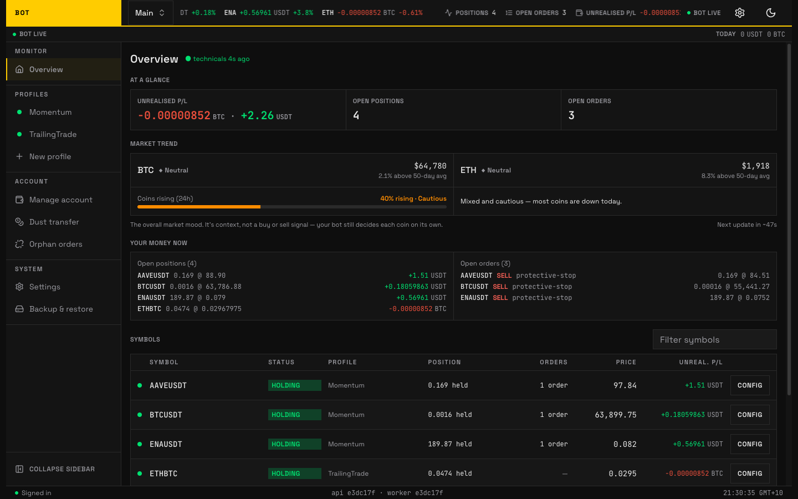
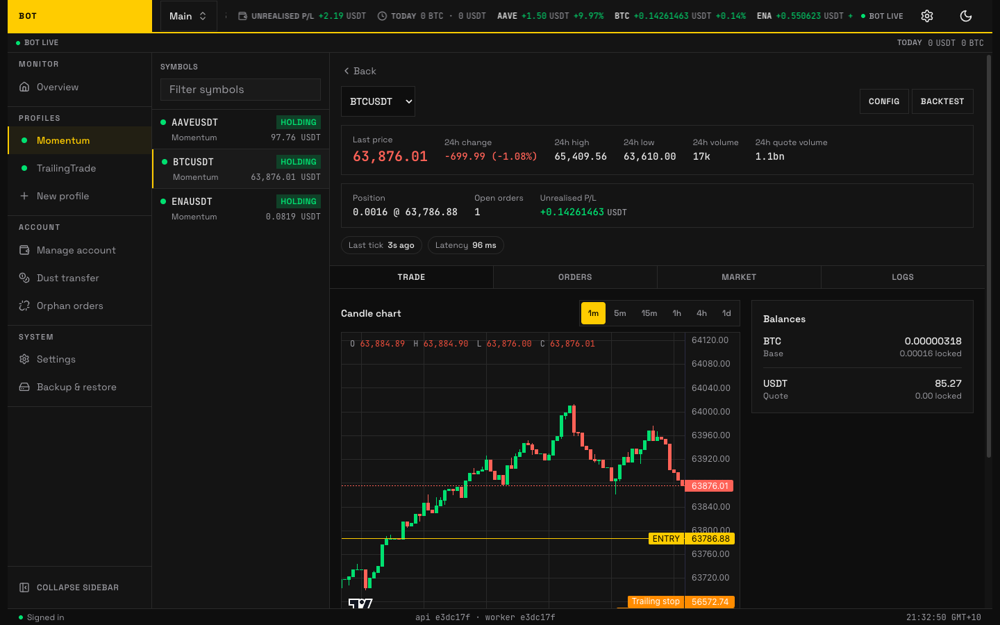
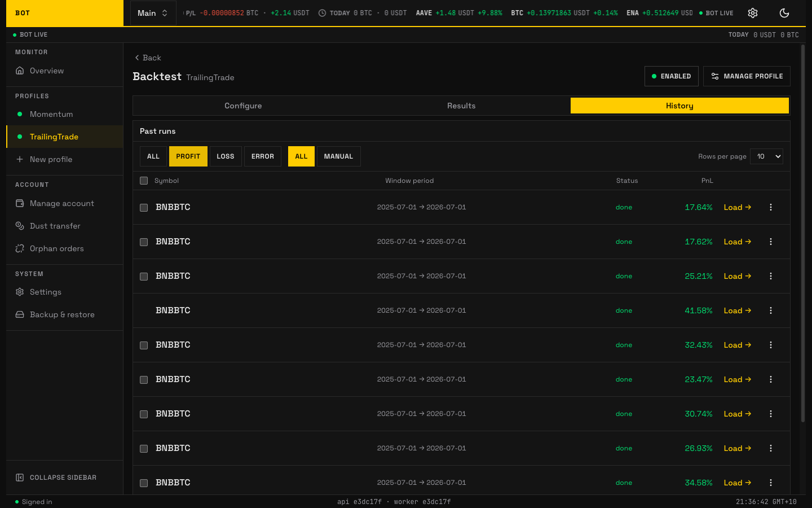

<div align="center">

# Binance Trading Bot

**Automated Binance trading bot with pluggable strategies, historical backtesting, and a live dashboard.**<br/> Self-hosted. Multiple strategy profiles: grid, momentum, or rebalancing.

[Documentation](https://chrisleekr.github.io/binance-trading-bot) · [Quick start](#quick-start-development) · [Deploy](deploy/README.md) · [Strategies](https://chrisleekr.github.io/binance-trading-bot/concepts/strategies/)

[](https://github.com/chrisleekr/binance-trading-bot/actions/workflows/ci.yml) [](https://chrisleekr.github.io/binance-trading-bot) [](https://github.com/chrisleekr/binance-trading-bot/releases) [](LICENSE)

[](https://hub.docker.com/r/chrisleekr/binance-trading-bot) [](https://github.com/chrisleekr/binance-trading-bot/stargazers) [](https://github.com/chrisleekr/binance-trading-bot/graphs/contributors)



</div>

<!-- prettier-ignore -->
> [!WARNING]
> **I cannot guarantee whether you can make money or not. Use it at your own risk.** I have no responsibility for any loss or hardship incurred directly or indirectly by using this code. Read the [disclaimer](#disclaimer) before using it.
>
> Under active development and not recommended for real funds.

## How it works

You run the app on your own server, connect it to your Binance account with an API key, and it watches the market and places buy and sell orders on your behalf. Once running, it repeats a short loop for every coin you told it to watch: read the market, run your strategy's rules, decide buy / sell / wait, and act.

- **Strategy-pluggable.** A _strategy_ is the rulebook the bot trades by. Three ship today: **trailing-trade**, **momentum**, and **rebalance**, and you pick one per profile. Each lives in its own package behind a shared contract, so adding a fourth is mostly a new package plus a registry entry, not a rewrite of the trading loop.
- **Account-scoped profiles.** One operator login owns one or more Binance _accounts_. Each account is one API key pair, one environment (testnet or live), and one wallet. Each account runs N independent _profiles_, each with its own coins, budget, and strategy, all sharing that account's wallet.
- **Reliability-first.** Crash-only worker, idempotent jobs, and a version-aware per-symbol state commit mean a restart resumes cleanly and never double-places an order.

Persistence is Postgres + TimescaleDB; cache and queues are Redis + BullMQ. Schema lives in [`packages/db`](packages/db).

### Act on a symbol

Every monitored symbol gets a workspace: live market data, the strategy's current signal, open orders, and manual overrides in one place.



### Tune a strategy, then backtest it

Configure a strategy per profile, then replay it against historical candles before risking anything. Every run is kept, so you can compare windows and symbols side by side.



More screens are covered in the [user guide](https://chrisleekr.github.io/binance-trading-bot/user-guide/).

## Configuration

Per-profile configuration (grid, indicators, notifier providers, Technicals gates) lives in the database and is editable through the SPA after first run. See [configure a profile](https://chrisleekr.github.io/binance-trading-bot/get-started/configure/).

Process-level environment variables (`DATABASE_URL`, `REDIS_URL`, `WEB_ORIGIN`, `AUTH_SECRET`, etc.) are listed in [`.env.example`](.env.example) and described in the [environment variable reference](https://chrisleekr.github.io/binance-trading-bot/operations/env-vars/).

## Quick start (development)

Prerequisites: [Bun](https://bun.sh) 1.4+ (pinned to `1.4.0` in `.tool-versions`; `bun.lock` is a `lockfileVersion: 2` file that Bun 1.3.x cannot parse) and Docker (with the `compose` plugin) for the local Postgres + Redis stack.

Run all commands from the repo root.

```bash
# 1. Install deps, write .env from .env.example, bring up Postgres + Redis
#    with host ports exposed (via the local compose override), and run
#    migrations.
bun install
bun run setup

# 2. Start api + web + worker + technicals via turbo
bun run dev
```

Open the SPA at `http://localhost:5173`.

To run the whole stack in containers instead, use `bun run docker:dev`. One `app` service (ROLE=all) serves the SPA + `/api` on `http://localhost:53000`.

## Quick start (deploy to a VM)

The 9-step operator runbook lives at [`deploy/README.md`](deploy/README.md). It covers `.env`, `AUTH_SECRET`, image pull, `docker compose up`, migrations, onboarding, IP-allowlisting the Binance key, smoke tests, and three TLS options.

Images are published to Docker Hub as `chrisleekr/binance-trading-bot:vX.Y.Z`. Pin a version with `IMAGE_TAG` rather than tracking `:latest`.

## Documentation

The full guide is at **<https://chrisleekr.github.io/binance-trading-bot>**, split by audience:

| Audience | What's there |
| --- | --- |
| [**Get started**](https://chrisleekr.github.io/binance-trading-bot/get-started/) | Install, configure a profile, go live |
| [**User guide**](https://chrisleekr.github.io/binance-trading-bot/user-guide/) | Dashboard, symbol workspace, profile and account settings |
| [**Concepts**](https://chrisleekr.github.io/binance-trading-bot/concepts/) | Strategies, discovery, technicals, backtesting, notifiers, written for non-experts |
| [**Operations**](https://chrisleekr.github.io/binance-trading-bot/operations/) | Deploy, kill switch, environment variables, troubleshooting |
| [**Contributing**](https://chrisleekr.github.io/binance-trading-bot/contributing/) | Architecture, plugin contracts, CI gates, coding rules, testing |

Build the site locally:

```bash
bun run docs:install
bun run docs:serve   # http://127.0.0.1:8000
```

## Contributing

Issues and pull requests are welcome at [github.com/chrisleekr/binance-trading-bot](https://github.com/chrisleekr/binance-trading-bot).

1. Read [`CONTRIBUTING.md`](CONTRIBUTING.md) for the workflow.
2. Read [`AGENTS.md`](AGENTS.md) for the engineering charter and the invariants (`CLAUDE.md` is a symlink alias for Claude Code).
3. `bun run lint` and `bun run typecheck` must be clean before opening a pull request.

Security issues: please follow [`SECURITY.md`](SECURITY.md) rather than opening a public issue.

## License

[Apache-2.0](LICENSE). Third-party attributions are in [`NOTICE`](NOTICE).

## Disclaimer

I give no warranty and accept no responsibility or liability for the accuracy or the completeness of the information and materials contained in this project. Under no circumstances will I be held responsible or liable in any way for any claims, damages, losses, expenses, costs or liabilities whatsoever (including, without limitation, any direct or indirect damages for loss of profits, business interruption or loss of information) resulting from or arising directly or indirectly from your use of or inability to use this code or any code linked to it, or from your reliance on the information and material on this code, even if I have been advised of the possibility of such damages in advance.

**So use it at your own risk!**
