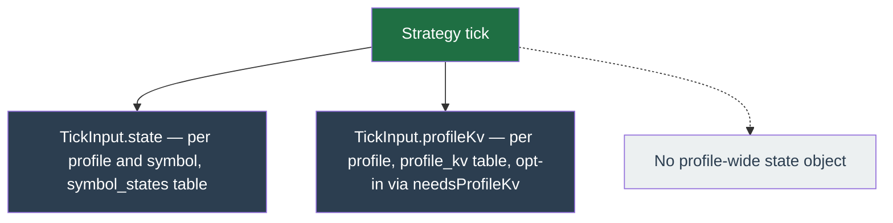

# Extensibility

The platform runs one strategy per profile, and a strategy is a plugin. The `@app/strategy-core` package (`packages/strategy/core/`) is the canonical **type** home of the plugin contract; this page is its prose companion. Every type named here links to its definition in that package, and when the two disagree the code wins and this page is the bug.

Trailing Trade is the first packaged strategy, momentum the second. Adding a third is a new package plus one registry entry, never an edit to `apps/api` or `apps/worker` (core invariant 1).

Canonical references:

- `packages/strategy/core/src/contract.ts` — `Strategy`, `Capabilities`, `TickInput`, `TickOutput`, the state-adapter seams.
- `packages/strategy/core/src/decision.ts` — the `Decision` union, `OrderIntent`, `OrderParams`.
- `packages/strategy/core/src/registry.ts` — `createRegistry`, `StrategyRegistry`, `AnyStrategy`.
- `packages/contracts/src/operator-actions.ts` — the `OPERATOR_ACTIONS` closed set behind `capabilities.operatorActions`.

## The Strategy interface

A plugin is one object satisfying `Strategy<Config, State, Bundle, Events>` (`contract.ts`). Its members:

| Member | Purpose |
| --- | --- |
| `name`, `version`, `displayName`, `description` | Identity. `name` keys the registry; `version` drives state migration. |
| `capabilities` | What infrastructure the worker must feed the strategy and which operator actions it honors. See [Capabilities](#capabilities). |
| `configSchema`, `overrideConfigSchema` | Zod object schemas for the profile config and the per-symbol partial override. The api serialises both to JSON Schema for the SPA form. |
| `stateSchema`, `bundleSchema` | Zod schemas for the per-(profile, symbol) state slice and the per-tick bundle. |
| `events` | The strategy's domain-event vocabulary, an event-type to zod-payload map. The `emit-event` decision is generic over it. |
| `defaultConfig` | A schema-valid config the create-profile wizard seeds its editor with. |
| `position?` | Optional state-adapter seam. See [State-adapter seams](#state-adapter-seams). |
| `initialState`, `migrateState?`, `validateInvariants?` | Lifecycle hooks: build the first state, migrate an older-version body, assert invariants against the market. |
| `mergeConcurrent?` | Optional pure reconcile for a tick commit that lost a cross-pod CAS race: graft only the non-re-derivable **latch** fields the tick stamped at its exit transition (loss-cooldown anchor, force-sell re-entry deadline, scheduled re-arm) from `latchSource` onto the authoritative re-read `base`, preferring the more-recent value so a cooldown is never moved earlier. MUST NOT copy position or order state — `base` owns those. **Never reached at single replica** (`chainByKey` serialises tick-vs-fill, so a tick commit never CAS-misses); absent on strategies with no latch field that outlives the position it was stamped in. |
| `requiredWindow?` | Optional pure maximum candle lookback (in candles, on the strategy's candle interval) this config needs — the longest moving average, window-low scan, or z-score lookback the config enables. The worker sizes the `tick()` candle window from it in **both** live and backtest, so a lookback larger than the default window is honoured everywhere rather than silently starved live yet active in backtest. Reads the config **defensively** (the live worker may pass it unparsed) and never throws. The caller floors the result at the default window, so a smaller value never shrinks it. Absent on strategies whose lookback never exceeds the default. |
| `attributeOrder?` | **Authoritative** attribution for an orphan order (an order open on Binance that no local row tracks). Given `(clientOrderId, profileId, symbol, config)`, recompute the deterministic ids the strategy would emit and test membership; return `{ intent }` — the strategy's OWN slot name for that order, the same `intent.reason` its `place-order` decision carries — or `null`. It **gates** adoption: it is not a hint and there is no operator picker. Exactly one claiming profile ⇒ the order is adopted into it; zero or more than one ⇒ the adopt route **409s** and the operator is told to cancel-or-leave. Adopting an order back to the profile that placed it is safe by construction (that strategy recognises its own id and resumes managing it); handing it to any other profile wedges both — the foreign strategy cannot reprice or cancel it, the base asset stays locked, and the true owner's own order is refused for want of free balance. Return `null` for ids the strategy DID emit but cannot re-derive because they fold unbounded runtime data (a candle close time, a UUID): **under-claiming is safe** (the operator is told the order is not adoptable), over-claiming is not — and the stakes are no longer only adoption. **Profile disposal is the second consumer, and a claim there is destructive:** the delete enumerates the whole account's open orders and CANCELS every one this hook claims for the profile being deleted (abandoning an order the profile provably placed is how a deleted profile's stop went on holding a position's coins). So a false claim now cancels a live order rather than mis-routing an adoption. The converse is fail-closed: a strategy with no `attributeOrder`, or one whose stored config no longer parses, proves nothing — the disposal cancels nothing and only announces the leftovers to the operator. **Omitting the method makes every orphan this strategy places permanently un-adoptable** — so omit it only on a strategy that places no resting order at all (rebalance is MARKET-only), and say so in the strategy's own JSDoc. |
| `extractAudit?` | Optional pure narrowing of this strategy's own `TickOutput.events` union into the block the worker merges into a tick's audit-log payload. The worker never inspects `events`: it merges the returned object's top-level keys, refusing any that would clobber its own audit fields (`enqueuedAtMs`, `eventPayload`, `results`). Return keys namespaced to the strategy's vocabulary, e.g. trailing-trade's `{ technicals: { forceSell: ... } }`. Return `undefined` on a tick with nothing worth auditing (the common case) so the payload stays small. Absent on strategies that emit no audit events. |
| `lintConfig?` | Optional pure, advisory config lint: returns `ConfigDiagnostic[]` (`level: 'warn' \| 'info'`) flagging settings that are silently inert or conflicting given the rest of the config (e.g. entry sizing under a grid ladder). Distinct from `configSchema` (which hard-rejects); the lint surfaces the "this won't do what you think" cases the schema can't reject. Exposed profile-independently via `POST /strategies/:name/lint-config`; the profile config form calls `POST /profiles/:id/lint-config`, which runs this lint plus the per-symbol `checkOrderFeasibility` check (below) and renders the diagnostics before a save. Each rule must mirror a real `tick` branch. |
| `checkOrderFeasibility?` | Optional pure per-symbol feasibility check: given the config, one symbol's `SymbolFilters`, a reference price, and optionally an available quote balance, returns `ConfigDiagnostic[]` with `level: 'block'` when an order would size below the exchange's `minQty` / `minNotional`, or when the full grid cannot be funded by the balance — a backtest's clean starting quote, or on a live save the symbol's account value of free+locked quote plus the deployed cost basis of any position already held (cost basis, not the live mark, so a config edit is not blocked while the grid is underwater in a drawdown). Needs runtime facts the symbol-agnostic `configSchema` cannot see, so it lives beside `lintConfig` rather than in the schema. A `block` is enforced at the mutation boundary — profile config save, add-symbol, and manual backtest create reject it as a real `422`. The host does not invoke the hook for a symbol whose cached filters or price snapshot is missing or unparseable — it has nothing to size against — and emits a `warn` of its own in its place (`filters-unavailable` / `price-unavailable`), so a market-data gap can no longer read as a clean pass. The host adds a third of its own, `config-unverified`, when the config to check cannot be resolved or parsed at all and there is nothing to size. The settings-lint surface shows every finding, host-minted and plugin-supplied alike. A successful mutation carries back only **host-minted** findings, in an optional `diagnostics` field that is omitted entirely when there are none. The filter is provenance, not the code string: a plugin's `code` and `message` reach the wire verbatim and the host hands plugins a wallet figure to size against, so matching on a code a plugin can spell would let plugin copy onto an anonymously reachable response body. `price-unavailable` is carried only by the add-symbol bind. The ticker cache is symbol-global and kept only while some profile streams that symbol, so a pair nothing trades yet usually has no price and its sizing check is skipped: that is the common outcome on a bind, and the bind is the one route where silence would claim a check that did not run. On a config save the same finding would fire once per bound symbol with nothing the operator can do, and a backtest replays historical candles where a live price is irrelevant. The wording differs by route, selected from the same opt-in flag. A strategy's hook needs no awareness of any of that; it only ever sees a symbol whose snapshots parsed. Absent on strategies that place no exchange orders. |
| `protectiveStopBandSettings?` | Optional pure, symbol-independent projection of what this config asks of a symbol's `PERCENT_PRICE_BY_SIDE` band: the stop distance, the limit offset, the `onBandBlock` fallback, and the config path the finding points at. Lets a caller holding the symbol's filters warn the operator **before** the position exists that the configured stop is deeper than the exchange will hold — without it, the first news of an unplaceable stop arrives from the tick that could not arm one, after real money is committed. **Numbers only**: the host derives the achievable maximum and writes the copy, so the finding is host-minted and safe to ride back on a mutation response (the same provenance rule `checkOrderFeasibility` findings do not satisfy). Returns `null` when the profile rests no exchange-side stop, which imposes nothing. Absent on strategies that rest no protective stop. |
| `reasonAttribution?` | Optional static map from a decision reason/metric code to ALL its operator-facing copy: `gloss` (the plain-language line shown for the blocker), `kind` (the tint category: `market` read, `config` lever, `sizing`, or `data` warm-up), `setting`/`paths` (the config lever that armed it, both optional), and `note` (context for a code with no editable lever). The SPA renders the whole backtest diagnosis funnel off this one declaration (invariant 1) instead of hardcoded web copy, and the api passes it through verbatim on the public descriptor. A pure `gloss`/`kind` entry (no `setting`) is a legible blocker with nothing to tune. Absent on strategies with no attributed reason codes; those fall back to the raw code and the neutral `data` tint. |
| `previewLevels` | Required pure projection of where the config would act, returning a `PreviewModel` (titled `PreviewSection`s of `PreviewRow`s) for the operator's pre-trade "what will this do" view AND the drift gate (below). Each row carries a `tone` (`PreviewTone`: `entry`/`buy`/`sell`/`trail`/`stop`/`neutral`), an optional decimal-string `price` (absent for a price-less action like a rebalance basket target, which instead carries `symbol`/`weight`/`drift`), an optional `quantity` / `skip` (from the real sizing epilogue), and — when the row is actionable in the given `state` — `trigger: true` plus a `triggerWhen` (`above`/`below`, the side `currentPrice` must be on for that action to fire). STATE-AWARE: mark `trigger` only on rows the current posture can act on (entry rows when flat; exit rows when held). Reads the config DEFENSIVELY (the live worker may pass it unparsed). Its `code` MUST equal the `intent.reason` a matching decision emits, so the gate can cross-check them. |
| `previewDataNeeds?` | Optional pure declaration of extra candle history the preview needs BEYOND the tick window, as `{ interval, frames }[]` — e.g. a daily-regime line needs N daily candles the per-tick window does not carry. Empty / absent when the preview reads only the tick's own window. Reads the config defensively. |
| `tick` | The pure decision function, `TickInput -> TickOutput`. |

`previewLevels` is guarded by a **drift gate** wired into golden-fixture replay (`assertPreviewTickAgreement` in `@app/strategy-core`, called from `replayFixture` and trailing-trade's own replay loop). For every decision a tick emits carrying a reason `R`, the gate gathers the preview's trigger rows with `code === R` and a `price`; if there are any, at least one must have `currentPrice` on its `triggerWhen` side. This is the weak `emitted ⟹ consistent` implication only — a reason with no price-bearing trigger row is exempt, and the converse (`crossed ⟹ emitted`) is never asserted, so a decision gated on a non-price condition (an EMA cross, a technicals signal) never false-fails the replay. A disagreement means the operator's pre-trade view lied about where an order acts.

### Rendering the preview (apps/web)

The SPA renders a strategy's `PreviewModel` with **one generic component**, so a new strategy needs zero web code beyond registering it. Each strategy exposes its pure `previewLevels` + `previewDataNeeds` on a `./preview` subpath export (`packages/strategy/*/package.json`), and the web lazy-imports it through a single map (`apps/web/src/features/symbol/preview/preview-modules.ts`, keyed by strategy `name`). Because the import is dynamic, each strategy's `decimal.js` math stays in a code-split chunk — the SPA itself is `decimal.js`-barred and only formats the decimal-string fields the model returns.

- `usePreviewModel` loads the module, fetches the candle windows the config declares (its `candleInterval` decision window plus any `previewDataNeeds` extras), and runs the pure `previewLevels`. It is form-independent, so both the config-page aside (fed a react-hook-form `useWatch` draft) and the live symbol workspace (fed the persisted config) share it.
- `StrategyPreviewPanel` renders the model as titled `Panel`s of level rows — price/quantity/skip/symbol/weight/drift cells — replacing the former per-strategy `ConfigPreview`. Mounted at the profile-config, symbol-config, and backtest-configure editors.
- `deriveChartLines` turns the model's `chartLine` priced rows into the candle chart's horizontal lines, replacing the former per-strategy `chartLines`. The `PreviewTone → token`/`ChartLineTone` maps live in one place (`preview/tone.ts`), so the panel and the chart agree on colour (notably the trailing line).
- A strategy that sizes off free cash (momentum's percent-of-account entry) reads balances from `PreviewInput.account`, which is an `AccountSnapshotWire` (decimal-**string** balances the SPA can build); the strategy revives them to `Decimal` at its own boundary.

`scripts/ci/no-missing-preview-export.sh` fails CI unless every registered strategy has both the `./preview` export and an entry in the web import map.

`tick()` is pure: no I/O, no wall clock, no randomness beyond the injected `Clock` and `RNG` on `TickInput`. It receives one per-(profile, symbol) state slice and returns the next slice plus a list of `Decision`s. The worker, not the strategy, performs every side effect those decisions describe.

## Capabilities

`Capabilities` (`contract.ts`) is what the worker reads to wire a profile. It declares infrastructure feeds, not an operator-facing descriptor:

| Field | Meaning |
| --- | --- |
| `candleIntervals` | The kline intervals the worker must fetch and feed. |
| `needsUserDataStream` | Subscribe the account / order user stream. |
| `needsMiniTicker` | Subscribe the symbol mini-ticker price feed. |
| `needsProfileKv?` | `readonly needsProfileKv?: boolean`. Opt into the per-profile KV store: when `true` the worker loads it into `TickInput.profileKv` for cross-symbol reads. Optional, defaults off — the worker skips the load unless set. |
| `bundleProviders` | Named per-tick bundle inputs the worker assembles before calling `tick()` (for example `override`, `technicals`). |
| `operatorActions` | The subset of the contracts `OPERATOR_ACTIONS` closed set this strategy honors. An empty array means no operator surface. |

`operatorActions` tokens are validated against `OPERATOR_ACTIONS` (`packages/contracts/src/operator-actions.ts`) at the api wire boundary (the `OperatorAction` `z.enum`) and by the registry consistency test. An action a strategy does not declare is gated `422` at the api, dropped by the worker, and omitted from the web UI, so an action that would be silently dropped never renders. `operatorActions` and `bundleProviders` are both `readonly string[]` to keep this package free of a `@app/contracts` dependency; the closed set is enforced at the boundary, not by the type.

## TickOutput

`tick()` returns `{ nextState, decisions, logs, metrics, events?, overrideDeferred?, overrideDeclineReason? }`. `nextState` is the per-(profile, symbol) state slice the worker persists; `decisions` drive the executor; `logs` / `metrics` / `events` are the operator, counter, and typed audit channels.

`overrideDeferred` is the strategy's answer to a question only it can answer: **did I act on the operator override you handed me?** The worker removes the override from Redis _before_ calling `tick()` (at-most-once), so a strategy that quietly ignores one would have the operator's "flatten now" reported as executed while nothing sold. Set `overrideDeferred: true` and the worker instead re-arms the override key — `SET <key> <payload> PX <remaining-ttl> NX`, restoring the operator's original expiry window, yielding (`NX`) to any newer override pushed in the gap — and leaves the `override_actions` row un-consumed, so the SPA keeps showing it as pending, which is the truth. Absent or `false` consumes the override, the normal outcome.

Only set it for a **transient** blocker: momentum defers a force-sell while `heldQuantity` is still null (the boot-time held-qty reconciler pins it within a tick or two), and during candle warm-up. A **permanent** refusal must NOT defer — an exchange filter rejecting a dust position would re-arm the same doomed override every tick until the TTL expired.

`overrideDeclineReason` is the strategy's short reason for emitting no order for the override — a symbol filter it could not satisfy, a cooldown, a warm-up. The worker stores it verbatim on the override row so the operator reads the real reason rather than a generic "the strategy declined". Set it on any tick that declines an override, deferred or not.

### Order provenance

A strategy that emits an order **because of** an override stamps that override's id on the order: `intent.overrideActionId`. This is the ONLY thing that lets the worker tie an order's real outcome back to the override the operator is watching. Without it the worker can settle the override only on the strategy's INTENT to act, so an order that was throttled, rejected by Binance, or dropped by the daily-loss breaker still reads as "done". Attribution is by id equality and never by a heuristic — "a BUY got dropped, it was probably the override's" settles the wrong row the moment a tick emits an unrelated order, which is every grid tick.

### Outcome, not intent

The worker settles an override on what happened to that order, and records the outcome on the row (`applied` / `rejected` / `unknown` / `superseded` / `expired`), which the SPA shows. Whether the order may be re-issued is decided by two INDEPENDENT facts on the failed `DecisionResult`:

- `phase` — is a retry SAFE? `pre-call` (never sent) and `rejected` (Binance parsed it and refused) both prove nothing executed. `ambiguous` (transport error, HTTP 5xx, an error body with no parsable code) means the order MAY be live, and `accepted` means it IS.
- `retryable` — is a retry WORTH IT? A weight throttle or a `-1003` clears; a `-2010` insufficient-balance does not.

`DecisionFailurePhase` is an executor-contract concept (the backtest executor reports it too), so it lives here in `strategy-core`. Deciding WHICH phase a live Binance failure is in does not: only the REST client can see whether Binance's error body actually parsed, so `@app/binance` computes `BinanceApiError.phase` at throw time, alongside the precomputed `retryable`, and the worker's error taxonomy reads it. A downstream re-derivation from status/error-code heuristics would silently flip `ambiguous → rejected` the day that detail changed — and that flip re-arms an order that may be live on the exchange.

The override is re-armed **iff `(phase === 'pre-call' || phase === 'rejected') && retryable`**. An `ambiguous` failure is never re-armed, whatever `retryable` says: a retry could place a second live market order. It settles as `unknown` and notifies the operator, because that is the one outcome only a human can resolve, at the exchange.

The worker refuses to re-arm, and settles the row with the outcome the operator actually sees, when:

- the override's action is not in `capabilities.operatorActions` — it could never be honoured, so a re-arm would loop to the TTL. Settles `rejected` ("this strategy does not support this action");
- the remaining window is gone. The TTL is read before `tick()` and this tick's own latency is charged against it, so a re-arm restores the operator's original deadline rather than extending it on every defer; with nothing left to restore, the row settles `rejected` with the strategy's own decline reason;
- the tick ALSO placed an order under this override's id — a defer means "I could not act", and re-arming would hand the same override to the next tick, which would place a second order under a different `clientOrderId` (Binance dedups a `clientOrderId` only while the first order is still open). One accepted order settles the row `applied` whatever its siblings did; the worker logs an error and does not trust the flag over the evidence;
- the `SET … NX` lost its race, i.e. the operator pushed a NEWER override into the key between the consuming `DEL` and the re-arm. The fresher intent wins, so the stale row settles `superseded` rather than being left pending forever behind a key it can never own.

If a re-armed override's window lapses while the strategy is still unable to act, the Redis key expires and the row is left pending — nothing executed, so marking it done would be a lie. The `dust-snapshot` sweep settles such a stranded row as `expired` once it is older than the outcome window, so the operator is never left watching an override that can never run.

## The Decision union

`tick()` returns `Decision`s (`decision.ts`). The union exposes exactly these variants today:

| Variant | Shape | Effect |
| --- | --- | --- |
| `noop` | (no payload) | Do nothing this tick. |
| `place-order` | `{ intent: OrderIntent, params: OrderParams }` | Place an order. `intent.reason` and `intent.meta` are strategy-owned; the core schema names no strategy concept. |
| `cancel-order` | `{ orderId: number, reason: string, symbol?: string }` | Cancel a live order by its Binance numeric id. The optional `symbol` lets the executor cancel on the exchange when no local orders row exists yet; omit it and the executor falls back to resolving the symbol from the local row. |
| `emit-event` | `{ eventType, payload }` | Publish a typed domain event. Generic over the strategy's `events` map, so a mistyped `eventType` or `payload` is a compile error at the call site. |
| `set-kv` | `{ key: string, value: unknown }` | Write a cross-symbol fact into the per-profile KV store under a strategy-owned namespaced key. The value is JSON-opaque to the executor. |
| `delete-kv` | `{ key: string }` | Remove a KV entry (idempotent). |

`set-kv` / `delete-kv` are the cross-symbol seam: a strategy trading several symbols on one profile gets one `tick()` slice per symbol, so it cannot read a sibling's state directly. It publishes facts via these decisions and reads the merged store back on later ticks through `TickInput.profileKv` — present only when the strategy opts in via `capabilities.needsProfileKv`. Writes are last-writer-wins per key across concurrent sibling ticks (eventual, like the rest of the contract); a strategy republishes its slice each tick. The store is per-PROFILE, not per-symbol. The union still stays generic: strategy-specific side effects ride on the variants above with namespaced strings, never a new union variant (the CLAUDE.md anti-pattern).

## State scope

The `State` generic on `Strategy<Config, State, Bundle, Events>` is the **per-(profile, symbol) slice** the worker loads, passes to `tick()`, and persists after each tick. A strategy trading multiple symbols on one profile receives one slice per symbol per tick; there is no profile-wide state object.

| Concern | Where it lives |
| --- | --- |
| Per-symbol slice (`State`) | `symbol_states` row keyed by `(profile_id, symbol)`, loaded into `TickInput.state`. |
| Cross-symbol state (profile-scoped counters etc) | `profile_kv` row keyed by `(profile_id, key)`, written via `set-kv` / `delete-kv` decisions and read back through `TickInput.profileKv`. Opt in with `capabilities.needsProfileKv`. |
| Wire-format on a snapshot | Decimal-strings per the money-math invariant, revived via `Decimal` at the strategy boundary. |

### Swapping a profile's strategy

`symbol_states` stamps `strategy_version` but never the strategy **name**, so a slice left behind by the outgoing strategy is indistinguishable from one the incoming strategy wrote — the worker's reconcile spine would hand the old body to the new strategy and ask it to migrate from a version it has never shipped. `repo.profiles.switchStrategy` therefore deletes every `symbol_states` row for the profile in the same transaction as the profile update. The next tick per symbol re-seeds from `strategy.initialState(config)`; the reconcile spine clears the matching Redis key on that read, so no stale cache survives either.

### Concurrency

Ticks for different symbols of the same profile may run in parallel. The executor's `chainByKey` serialises calls per `(profileId, symbol)` **within one process**. The durable cross-pod guard is a `symbol_states.version` optimistic CAS: every state write is `WHERE version = expected` and bumps it, so a stale writer (a fill racing a tick across pods) matches zero rows — the fill path re-reads and retries, the tick commit skips without clobbering. Order placement is idempotent via deterministic `clientOrderId`. `chainByKey` remains the intra-pod serialiser and a fast path; it is not the cross-pod mechanism. Boot reconcilers rely on pre-queue temporal exclusivity at startup, not the lock.

### Anti-patterns

- Reading `state.avgEntryPrice` for symbol X from inside the tick of symbol Y. There is no shared state object; the tick of Y sees Y's slice only.
- Adding a new `Decision` variant for "strategy-specific KV". Cross-symbol KV rides on `set-kv` / `delete-kv` under namespaced keys; never add a per-strategy union variant. The union stays generic per the CLAUDE.md note.

## State-adapter seams

One optional capability lets the worker converge per-symbol state without importing a plugin's concrete schema (core invariant 1). A strategy that omits the adapter is simply skipped by the matching worker path.

- `position?: PositionStateAdapter<State>` (`contract.ts`). Present when the strategy manages a single long position per (profile, symbol). The worker's boot reconcilers and fill-adopter read `readPosition` (projecting the generic `PositionView`) and merge an `AdoptedFill` through `applyFill`, so they make `Decimal` decisions without naming a state-body field. The same adapter clears the position via `clearPosition(state, opts?)`: a phantom-ledger prune calls it with no options; the operator `reset-grid` action (the worker pipeline handler is historically named `reset-grid-trade`) cancels the live grid orders (generic order-domain work) and calls `clearPosition(state, { resetGridIndex: true })` to also abandon the current grid cycle, again without the worker naming a field. A strategy with no grid index treats `resetGridIndex` as a no-op. The `reset-grid` clear is gated on the strategy declaring `reset-grid` in `capabilities.operatorActions` (the same gate the API enforces), not on a dedicated adapter slot. Each method returns the next body or `null` for "no change / not my schema".

## Adding a strategy

The empirical path momentum took:

1. **New package.** `packages/strategy/<name>` with npm name `@app/strategy-<name>`, exporting one object that satisfies `Strategy`.
2. **Declare capabilities.** The `candleIntervals` and feeds the worker must provide, the `bundleProviders` the strategy reads, and the `operatorActions` it honors (a subset of `OPERATOR_ACTIONS`).
3. **Register it.** Add one `registry.register(<strategy>)` line to `buildStrategyRegistry` in `@app/strategy-registry` (`packages/strategy/registry/src/index.ts`). This is the only place an app names a concrete strategy (core invariant 1); `apps/api` and `apps/worker` consume the built registry, never a `strategy-*` package directly.
4. **Add a golden-replay fixture and test.** Capture a `.jsonl` fixture of real ticks and assert `replayFixture(<strategy>, fixture)` returns diff = 0, as momentum does with `fixtures/replay/cross-cycle.jsonl`. The replay gate diffs each tick's `decisions` and `nextState` against the fixture, a required quality gate that catches behavioural drift on every tick. It deliberately ignores `logs` and `metrics` — a strategy may add or reword either without re-capturing a fixture. That exemption is about the replay gate only; `metrics` still has to clear step 5.
5. **Declare any new metric names.** Every `MetricEntry` a tick returns is drained onto the catalogued `strategy_metric_total` series with its name as a label, so an undeclared name would export under a label nobody is watching. `packages/strategy/registry/__tests__/strategy-metric-names.test.ts` walks the `metric(` call sites across `packages/strategy/*/src/**` and asserts the **exact set** of names, so a new one fails the build until it is listed and a removed one fails just as loudly. Promote a free-form tag onto the series only through `apps/worker/src/metrics/catalog.ts` — anything not in `labelNames` is dropped by the sink, silently and by design.
