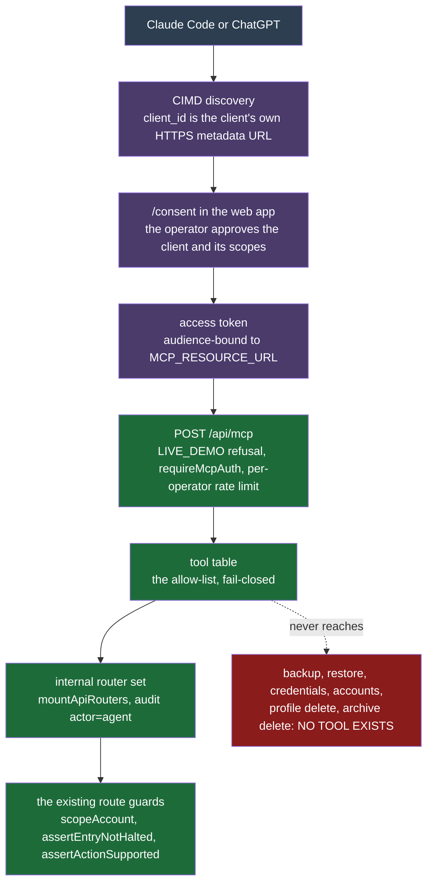

# MCP control plane

The bot can expose itself to an AI agent — Claude Code, ChatGPT — over the Model Context Protocol, so the agent can read the whole trading surface and, with a second scope, trade it.

This is off by default. Turning it on publishes a trading control plane on the public internet, so read this page before setting `MCP_ENABLED=1`.

## What an agent can and cannot do

Every mounted `/api` route lands in exactly one of three buckets, and a test asserts that partition with exact equality in both directions. A route added later belongs to none of them, so the test fails and the route gets **no tool by default**.

| Bucket | Meaning |
| --- | --- |
| `MCP_TOOLS` | 34 read tools on `mcp:read`, 34 write tools on `mcp:trade`. |
| `NO_TOOL_DENIED` | A tool here is a bug. Backup, backup config and restore, retention changes, account mutation, credential writes, the AI-provider test call, profile delete, trade-archive delete, notifier writes and every auth route. |
| `NO_TOOL_NOT_SURFACED` | Safe but not worth the model's context. Exports, pin and unpin, operator-console reads. Promoting one is a one-line move. |

`GET /api/backup` streams a full `pg_dump`, and this deployment stores Binance keys and notifier secrets in plaintext by design (see [Auth](auth.md) "Threat model"). One such call would put the operator's key pair into a chat transcript, which is why backup and restore are denied rather than merely un-surfaced.

The scopes split read from write, so an agent that only reports on the account never holds the scope that can place an order. That matters more than it sounds: a model reading market commentary is reading untrusted text, and a read-only token cannot be talked into trading.

## Authorization

**Client ID Metadata Documents, not dynamic registration.** A client identifies itself by an HTTPS URL that serves its own metadata; the server fetches that document and registers the client from it. `POST /api/auth/oauth2/register` refuses every caller: `allowDynamicClientRegistration` and `allowUnauthenticatedClientRegistration` are both false (`apps/api/src/auth.ts`).

Fetching an attacker-supplied URL from inside that trust boundary is the obvious hazard, so the transport in `apps/api/src/lib/cimd-transport.ts` refuses anything but `https`, resolves the hostname exactly once, refuses every RFC 6890 special-use address, pins the approved address while leaving TLS identity bound to the hostname, allows only GET and HEAD, and refuses redirects. It replaces `@better-auth/cimd`'s Node-only transport, which Bun cannot use.

**The token never touches the REST API.** It is verified once, at `/api/mcp`, and the identity it resolves to is injected into a second in-process mount of the same routers. `sessionResolver` reads only the Better Auth session cookie, so a stolen access token replayed against `GET /api/backup` is simply unauthenticated.

**Signing in to approve an agent is ordinary sign-in.** `/oauth2/authorize` sends the browser to `/login` with a signed query; after a password or single sign-on login the web app replays that query to `/oauth2/authorize` and lands on `/consent`. Single sign-on proves who the operator is and nothing more: Better Auth stays the only authorization server agents talk to, and every sign-in limit and security event applies unchanged. The authorize, consent, token and revoke endpoints sit behind the auth gateway's allow-list and its own rate limits ([Auth](auth.md)).

**Revocation has to beat a token nobody stores.** Access tokens are JWTs the resource server verifies by signature alone, so deleting grant rows would leave an issued token working until it expires (an hour by default). `repo.authIdentity.revokeAgentAccess` therefore also stamps `auth_security_settings.agent_access_not_before`, and `/api/mcp` refuses any token issued at or before it. The route reads that cutoff from the row on every verified call rather than from the 30-second settings cache, because the reset command revokes from another process and a scaled deployment runs several api replicas. Revoke agent access, password change, the reset command, sign-out-everywhere and restore all go through that function.

**Discovery documents live at the origin root.** RFC 9728 and RFC 8414 locate them at `/.well-known/<name>` on the origin, optionally followed by the resource path. `apps/api/src/routes/well-known.ts` forwards `oauth-protected-resource` to Better Auth unchanged and rewrites `oauth-authorization-server` and `openid-configuration` to `/api/auth/.well-known/<name>`.

## Dispatch

Tools do not re-implement anything. Each one resolves to an HTTP call and dispatches into a second mount of `mountApiRouters`, so an agent's order passes the identical `scopeAccount` ownership proof, the identical entry-halt and operator-action guards, and the identical strategy-schema validation. There is no second code path to keep honest.

What differs from a browser request:

- **Audit.** The inner app writes `actor='agent'`. Both paths are otherwise indistinguishable in the database, so this is the only record that an order came from a model. A row appears only where the handler declares an `auditEvent`, so every non-GET route a tool dispatches to must declare one, enforced over the tool table by `apps/api/__tests__/mcp/tool-audit-coverage.test.ts`. The two exceptions are the config preview and lint endpoints, which are POSTs that persist nothing and carry read scope.
- **Caller identity on the row.** Only `X-Forwarded-For`, `X-Real-IP` and `User-Agent` are copied, unparsed, from the MCP request to the inner request, so the audit row records the agent's address and client. No other header is forwarded, so the bearer token never reaches the REST routers.
- **Refusals leave a trace.** A refused call writes no audit row (the audit middleware skips a 4xx). It is logged at warn as `mcp_tool_refused` with the tool, operator, account and status.
- **Mode echo.** Every account-scoped result carries the resolved `binanceMode`. Testnet and live accounts share the same tables and the same tools, so without it a wrong-`accountId` call is silent.
- **Symbols must be bound.** The order routes answer 404 for a symbol not bound to the profile (`assertSymbolBound` in `apps/api/src/lib/manual-orders.ts`), because binding is where the tradability and shared-wallet checks run. The browser only offers bound symbols; an agent can pass any string, so this check is what stops it.
- **Notification.** Every completed `mcp:trade` call enqueues a `notify-agent-action` pipeline job. The api cannot send a notification itself; the worker's `dispatchNotify` is the only production chokepoint and also carries the live-demo kill switch. Mute the `agent-action` category in ops-notify settings to silence it — the action still runs.

### A tool argument is only real if its route takes it

A tool's argument list and its route's request schema live in different files and meet only at runtime. A mismatch either fails the call or drops the argument silently while the answer still looks correct.

`apps/api/__tests__/mcp/tool-route-contract.test.ts` compares the two over every tool, against the OpenAPI document the routes already publish. An argument must be accepted somewhere by the tool's routes, as a path parameter, a query parameter or a body property; and where a route restricts an argument to a fixed set, the tool must restrict it to a subset of that set. A consolidated read may declare an argument only one of its kinds takes, so one accepting route is enough.

Two rules in the tool table follow from this. A tool whose route takes a stored-config object as its body declares that object's fields directly, derived from the route's own schema, instead of wrapping them in a `config` key the route never reads. And it declares them without their defaults, because `PATCH …/risk-config` and `PATCH …/discovery-config` write the parsed body to the column whole rather than merging into it: a default the tool filled in on the caller's behalf would replace a setting the caller never named, and a breaker reset to its default can be wider than the one it replaced. Both descriptions say the call replaces rather than patches.

### The config preview needs an anchor to project from

`preview_config` runs the strategy's own `previewLevels`, which projects every level relative to an entry price. A flat symbol has no entry, so the projection would come back empty exactly when a caller is deciding whether to enter one. Both operator views anchor on the live price instead, as the entry a first buy would fill at, and this route answers the same way. It returns `anchorBasis` alongside, so a projection off a hypothetical entry is never read as one off a held position.

### Reads are bounded at the tool

`get_exchange_info` requires the pairs it should return. Binance lists thousands, each with its filters and permission tags, and the full listing runs to megabytes — one call would spend an agent's whole context before it could size an order. `get_market_data` passes `limit` through to the exchange call for the depth and trades views, so a request for five levels returns five.

### Idempotency is mandatory for order placement

Placing an order through this API is **not** idempotent across an HTTP retry. Each POST mints a fresh `override_actions` UUID, that UUID is folded into the Binance `clientOrderId`, and Binance accepts the two resulting orders as two different orders. The worker-side deduplication keys on `clientOrderId`, so it never fires for them.

An agent that retries a timed-out call is behaving correctly, so the order-placing tools require an `idempotencyKey` and refuse the call without one. The key claims a Redis record with `SET NX PX`; a second call inside the window replays the first outcome instead of dispatching. It is a dedup record, not a lock: no owner, nothing handed to a waiter, no refund, and it expires on its own.

The claim is written before dispatch and settled on every failing path by status alone (`settlementForStatus` in `apps/api/src/mcp/dispatch.ts`). A 4xx means a guard refused before any write, so the key is freed and a corrected retry can reuse it. A 5xx may have left an override live, so the key is kept and marked, and a retry is told to read the order state instead of waiting.

That split holds only while no order route answers 4xx after taking effect. The repo already names that case, `alreadyApplied` on the audit event, and no order route sets it; `apps/api/__tests__/mcp/idempotency-settlement.test.ts` fails if one ever does.

## Operating it

| Variable | Effect |
| --- | --- |
| `MCP_ENABLED` | Off, `/api/mcp` is **not mounted at all** and no metadata is published. There is no surface to secure rather than a guarded one to trust. |
| `MCP_RESOURCE_URL` | The canonical identifier tokens are audience-bound to. It must be the URL an agent actually reaches; an internal address produces a 401 that explains nothing. Required when the flag is on. Boot refuses anything but `https` except on a loopback host, and refuses a query string, fragment or embedded credentials. This URL's origin also becomes Better Auth's `baseURL`, so it is the authorization server's origin. |

`LIVE_DEMO` and `MCP_ENABLED` are mutually exclusive at boot: `apps/api/src/env.ts` refuses to start with both set. A demo box treats every anonymous caller as the operator, so an MCP endpoint there would be an anonymous trading control plane. The route also answers 403 under `LIVE_DEMO`.

Before enabling it on an instance holding live keys, run it against a testnet account first. The write tools carry `destructiveHint` and `anthropic/requiresUserInteraction`, which forces a full permission prompt rather than a one-tap approval, but the prompts only help while they are still read.

## Where the parts live

- `apps/api/src/mcp/tools.ts` — the tool table and the three buckets.
- `apps/api/src/mcp/dispatch.ts` — scope check, idempotency, dispatch, notification.
- `apps/api/src/mcp/inner-app.ts` — the second mount of the real routers.
- `apps/api/src/mcp/idempotency.ts` — the dedup record.
- `apps/api/src/mcp/resources.ts` — the documentation resources an agent can read.
- `apps/api/src/lib/cimd-transport.ts` — the SSRF boundary.
- `apps/api/src/routes/mcp.ts` — the route, the auth guard and the rate limit.
- `apps/api/src/routes/well-known.ts` — root-mounted discovery documents.
- `apps/web/src/features/auth/routes/consent.tsx` — the approval screen.
- `packages/db/migrations/0095_oauth_provider_tables.sql` — the OAuth authorization-server tables.
