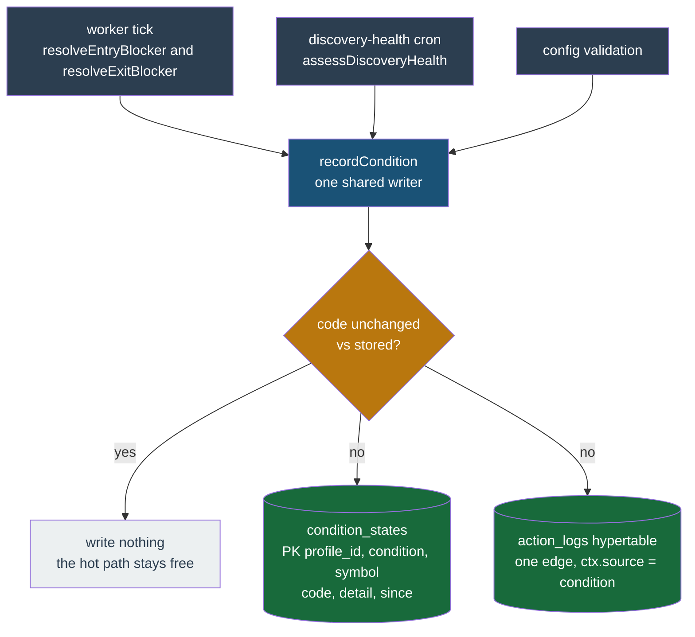

# Conditions and the diagnosis

How the bot answers "why isn't this profile trading?" — the storage model behind it, the funnel counts it reads, and why the action log can be pruned aggressively without losing the answer.

## Levels and edges

Every subsystem here already works out why something is not happening. On every tick `resolveEntryBlocker` walks a priority ladder for a flat symbol and `resolveExitBlocker` walks one for a held symbol. Discovery records the stage each candidate died at on every scan. The discovery-health cron decides staleness and breadth on every run. Each of those is a **level** — something that is true right now — and each was being written, at best, as a bespoke `action_logs` row, which is an **edge**: a record that something changed.

The two are not interchangeable, and the gap between them is the defect this model exists to close.

Writing only on change is correct and stays. A reason that holds for 4,000 ticks is fully described by its transition in and its transition out; per-tick rows would be redundant by construction, and they are what produced the 86k rows a day that was deliberately removed. The problem is not the number of rows, it is what happens to that single row later:

> A symbol stuck on one reason for three weeks has exactly **one** transition row, written three weeks ago. Past the retention horizon it is gone, the query returns nothing, and the log viewer is **emptiest for the most-stuck symbol** — the worst possible failure mode for a diagnostic.

So the level is stored as a level.

A **condition** is a named thing currently true of a subject, with a start time:

| Field | Meaning |
| --- | --- |
| `condition` | the named condition (`entry-blocked`, `exit-blocked`, `discovery-stale`, `discovery-breadth-blocked`, `config-invalid`) |
| `symbol` | the subject within the profile; empty string means the profile itself |
| `code` | the specific reason inside that condition, e.g. `knife-guard` |
| `detail` | whatever structured payload the producer already carries, verbatim |
| `since` | when this `(condition, code)` started |

`CONDITIONS` in `packages/contracts/src/condition.ts` is a closed set, and deliberately so: each entry has a producer that writes it and a reader that ranks it. The condition names the _category_, never the reason — per-strategy reason codes come from each strategy's own `reasonAttribution`, so listing them here would make the diagnosis strategy-aware, which is what the plugin contract exists to prevent.

Severity is `blocking` or `degraded`, never "error". A blocked entry is usually the strategy working correctly; colouring it as a fault trains the operator to ignore it.

## Why `condition_states` is not more `action_logs` rows

Three reasons, and the third is a hard blocker rather than a preference.

**Opposite lifetimes.** History is meant to be prunable; current state must never be. One table would mean one retention policy serving two contradictory requirements. Escaping that inside `action_logs` means exempting the newest row per `(profile, symbol, condition)` from the sweep — a correlated delete on a hypertable, and a second implicit owner of the retention horizon, which is the exact hazard [migration 0076](database.md) was written to remove.

**The read is unindexable in practice.** "Current condition per subject" over the log is `DISTINCT ON (profile_id, symbol, ctx->>'condition') … ORDER BY time DESC` — a jsonb expression key that none of the three `action_logs` indexes can serve, on an append-heavy hypertable with 1-hour chunks. `condition_states` answers it with a primary-key lookup over a few hundred rows.

**The upsert is structurally impossible.** `action_logs` is a TimescaleDB hypertable partitioned on `time`, and a unique index on a hypertable must contain every partitioning column. A key of `(profile_id, condition, symbol)` cannot exist there; adding `time` makes every write a new row rather than a replaced one, which defeats the purpose. `ON CONFLICT DO UPDATE` on the state key is simply not available. The rule is visible elsewhere in the schema: `candles` and `ath_candles` both carry `primary key (…, time)`, and `action_logs` has no primary key at all.

So the log stays an append-only edge stream and the state is a mutable keyed row. They are different data structures.

`condition_states` is bounded by open conditions × symbols, not by time: a row exists only while the condition is open, and resolving deletes it and records the resolution as an edge.

A row is closed by its own producer, and for a symbol row that producer is the symbol's tick. Unbinding the symbol therefore ends the row's only writer, so the unbind deletes it: `profileSymbols.remove` / `removeAutoIfFlat` tear down every per-symbol surface in the transaction that drops the binding. Without that the row is unclosable, and the diagnosis reads it back as a live blocker on a coin the profile does not hold. Rows under the profile-level subject (`symbol = ''`) belong to the profile, not a binding, and are untouched — the diagnosis keeps them whatever the bound set is.

### What the uniform edge buys

Every condition edge writes the same `action_logs.ctx` shape — `{ source: 'condition', condition, code, previousCode, sinceMs, detail? }`. One filter (`ctx->>'source' = 'condition'`) therefore yields every state change in the system, from any producer, in one shape. That is what makes a single cross-subsystem timeline possible instead of a per-feature log grammar.

The timeline renders spans from those edges plus each open condition's `since`. Where `since` is older than the oldest surviving edge, the span is drawn **clipped** at the retention horizon rather than shortened — the duration stays exact, and the missing left edge is shown as missing.

## Retention: one owner, two rules

The action log defaults to **1 day** and a **per-profile cap of 200,000 rows**. Both are columns on the `retention_config` singleton and both are re-read on every cron run, so a Settings edit applies without a worker restart.

Both rules live in the same `action-log-prune` cron. Not a TimescaleDB policy, not a second job: 0076 removed the Timescale policy precisely because two owners of one horizon swept the table at 7 days while the dashboard reported 30. Adding a second _rule_ to the one owner is safe; adding a second _owner_ is not, and `packages/db/__tests__/isolation/action-log-row-cap.test.ts` asserts that no `policy_retention` job exists on `action_logs` after the migrations run.

The cap is per profile rather than table-wide because a shared ceiling lets one noisy profile evict a quiet profile's entire history. Deletion walks the existing `action_logs_by_profile_time_id` index and compares the row tuple `(time, id)`, not `time` alone: the audit drainer bulk-inserts whole batches sharing one microsecond, so a comparison on `time` would either spare the entire tie group (the cap never binds) or delete it (a profile loses everything it logged that instant).

Each rule reports its own count. The receipt carries `byRule: { age, ageChunks, rowCap }` alongside the combined `deleted`, because one number cannot distinguish a quiet night from an age horizon deleting nothing while a mis-set cap deletes a profile's whole history.

**The age rule deletes in two units, and reports both.** `action_logs` is a hypertable chunked at one hour, so a horizon measured in days always splits into whole chunks entirely past it plus exactly one chunk straddling it. The whole chunks are unlinked with `drop_chunks`, which is catalogue work whose cost does not grow with the backlog; only the straddling chunk is swept row by row, in bounded batches keyed on `(time, id)`. A row-by-row `DELETE` over the same range scaled with the number of expired rows and is what put this cron in the DLQ as "job stalled more than allowable limit" — and it left the emptied chunks attached to be re-scanned every night after. Neither statement uses `RETURNING`: the counts come from the command tag, so a sweep of a few million rows does not materialise a few million result rows for a number nobody reads per row. A dropped chunk's rows are never counted, because counting them means reading them, which is the scan `drop_chunks` exists to avoid — hence `ageChunks` beside `age`, and a legitimate "4 rows + 31 chunks" for the largest sweep of the month.

**A failed sweep writes a receipt too**, with `ok: false` and a reason, then rethrows so BullMQ still retries the tick. Both operator-facing prune crons do this — `action-log-prune` and `audit-prune` — because the throw alone reaches only the dead-letter queue, which no operator surface reads; without the receipt the last success stays on the audit panel reporting a horizon that has silently stopped being applied. The footer renders that state in the danger colour and replaces the counts with the failure reason.

That reason is a **classification**, not the driver's own message: `GET /api/retention-status` is behind `requireUser()` only, and under `LIVE_DEMO` the sole operator id is injected for every visitor, so an anonymous reader sees whatever the receipt carries. A Postgres exception names internal hosts, ports and relations, so the cron maps it to one of a closed set ("the sweep timed out", "the database was unreachable", "the sweep failed") and the full exception goes to the server log. `RetentionReceiptSchema.error` is length-bounded so that stays a property of the contract rather than a habit of one writer.

**The ordering is load-bearing.** A 1-day horizon is only safe because current state left the log stream first. Shipping the shorter horizon without `condition_states` would delete the data the diagnosis reads.

## The two funnel ladders

Discovery computes stage counts on every scan and persists them to `discovery_universe_snapshots.snapshot.funnel`. They form **two ladders with two different denominators**, and merging them into one graphic would be a lie.

| Ladder | Stages | Counted over |
| --- | --- | --- |
| Ticker | `universe → quote → blacklist → liquidity → activity → spread → changeBand` | every quote-matched symbol in the 24h ticker set |
| Candidate | `probed → age → trend → eligible` | only the shortlist that klines were fetched for |

`probed` is far below `changeBand` by design — the second ladder starts from a smaller set, it does not represent a collapse. So each ladder is drawn against **its own head**, each is captioned with what it counted over, and the choke stage is searched within each ladder separately.

Each ladder leads with its own denominator, and that is why `probed` exists. `largestDrop` scores a stage against the one above it, so a ladder's first entry can only ever be a denominator. With `age` in that position a funnel that collapsed **at** the age filter scored nothing, the search fell back to the ticker ladder, and the report blamed whichever ticker filter happened to cut the most — a filter working exactly as configured. `probed` is the count of candidates whose price history was fetched, so the age cut is now scoreable like any other. A scan that recorded no `probed` (the field is newer than the funnel) drops that rung rather than drawing a zero, which would read as "nothing was checked".

Both the chart and the report's finding call `funnelStageLabel` and `largestDrop` from `@app/contracts`, so the highlighted rung and the sentence naming it cannot disagree.

A snapshot with no `funnel` renders as **unknown, never zero**. The field is optional — rows predate it — and "not recorded" and "nothing survived" are opposite claims.

## The investigation

`POST /api/accounts/{accountId}/profiles/{profileId}/diagnosis/runs` enqueues a background run; the client polls `GET …/diagnosis/runs` and watches the newest row until it reaches a terminal status. `GET …/diagnosis/runs/{runId}` serves one run directly, for inspecting an older investigation by id. A separate `GET …/discovery/funnel` feeds the always-visible funnel panel: the funnel is a view, the investigation is an action.

The ladder is both the ranking and the progress display. The first rung to find something owns the headline — a dead worker makes every later answer moot — but every finding is listed.

| #   | Step                | Decided by                                                 |
| --- | ------------------- | ---------------------------------------------------------- |
| 1   | `worker-alive`      | presence of the self-expiring `worker:status` key          |
| 2   | `profile-active`    | `profiles.enabled`, plus the daily-loss halt flag in Redis |
| 3   | `config-valid`      | the same zod schema the form uses                          |
| 4   | `discovery-running` | `assessDiscoveryHealth`                                    |
| 5   | `market-breadth`    | the same function's full-window rule                       |
| 6   | `candidate-funnel`  | largest proportional drop within each ladder               |
| 7   | `symbol-slots`      | auto-symbol count vs `maxAutoSymbols`                      |
| 8   | `entry-blockers`    | open `entry-blocked` rows and their `since`                |
| 9   | `exit-blockers`     | open `exit-blocked` rows, grouped by reason code           |
| 10  | `exit-protection`   | `detail.hasDownsideExit` on those same rows                |
| 11  | `config-levers`     | `reasonAttribution` lookup, reason code → config path      |

A finding carries a **lever**: the settings field that armed it, its current value, and which page owns it, so the drawer can link straight to the field. Two maps answer that lookup. The strategy's own `reasonAttribution` covers its blockers. Discovery's codes — the breadth guard, the symbol cap, every funnel stage — are answered by a platform-owned table in `@app/contracts`, because discovery is not a strategy: it has its own config column and its own settings page, and no strategy's map names a funnel stage. Without that table every discovery finding rendered with no link at all, which is the one thing those findings exist to offer. Discovery lever paths are relative to the discovery config, matching the element ids its form renders, and the surface is fixed to `discovery` rather than inferred from a path prefix. `universe`, `probed`, `quote`, and `eligible` deliberately have no lever: the first two are denominators, `quote` follows the profile's quote asset, and `eligible` is the outcome of every filter above it. A discovery config that did not parse keeps the link and drops the value, since rendering an unread setting as "off" would state a choice the operator never made.

Rung 1 has no staleness threshold, deliberately. The heartbeat key carries no last-beat timestamp; it is written with a TTL and refreshed on an interval, so expiry _is_ the threshold and absence is the only down signal. A rung that compared ages would need a timestamp nothing writes.

The two exit rungs split one question in half. `exit-blockers` reports what every held coin is waiting on, with the rung's own threshold read straight off the producer's `detail`, but only raises a finding for a reason that is a fault (`sell-disabled`, `exit-unsellable`, `exit-config-invalid`) — a coin waiting for its sell trigger is a held position doing its job, and raising a finding for it would hand every healthy profile a headline about selling. `exit-protection` then asks the separate question of whether each held coin has any exit _below_ its entry price, which it reads from `detail.hasDownsideExit` rather than re-deriving, so the report and the bot cannot disagree about it.

Each rung resolves to `ok`, `finding`, `skipped`, or `unknown`. `skipped` and `unknown` are kept apart deliberately: collapsing "not applicable" into "no problem found" is how a diagnostic ends up reporting health it never established. The three discovery rungs are where that distinction earns its keep: they answer `skipped` when auto-discovery is switched off, but `unknown` when the stored discovery config did not parse — calling an unreadable setting a deliberate switch-off states as chosen something the operator never chose.

The live re-probe is held to the same rule. It re-fetches the candle window for each shortlisted symbol and tolerates losing some of them, because a partial candidate ladder still beats none. Losing _every_ window is different: the age filter answers "too new" for a symbol with no window, so the whole shortlist would score as failing that cut, and a ladder of zeroes would be presented as a live reading blaming a filter that never ran. The probe returns null there and the rung falls back to the stored scan, saying so.

A run that never reaches a terminal status is swept. The queue runs with `attempts: 1`, so a process killed mid-ladder — or a job BullMQ moves straight to `failed` as stalled, without re-entering the handler — leaves a `queued` or `running` row that nothing will ever finish. The client would poll it forever, and the drawer hides "Check again" while a run is live, so one stranded row locks the operator out of investigating that profile at all. `runStaleDiagnosisSweep` marks non-terminal rows older than ten minutes as errored, at study-worker boot and on a five-minute interval thereafter (crons run in the live role, so the interval is what reclaims a row stranded between boots). This mirrors the advisor sweep, which exists for the same reason under the same role. And "nothing is blocking it, your settings are just strict" is a valid verdict — when nothing is provable, the report says so rather than inventing a cause.

### Nothing here calls a model

Every rung is a threshold comparison, a timestamp subtraction, or a set difference over rows that already exist. The queued-job-with-polled-progress shape resembles the backtest advisor, but that resemblance is code organisation only ("pure builder, caller does all I/O").

A model would make the verdict non-reproducible, untestable, and capable of confidently naming a cause that is not there. `buildProfileDiagnosis` on a frozen input set produces a byte-identical report on every run, and that is the property worth having.

### Why a background run, then

Because one rung is genuinely slow. Steps 1–5 and 7–11 are local reads finishing well under a second. Step 6 optionally re-derives the funnel against the **live** Binance REST API — exchangeInfo, 24h tickers, and klines per candidate — which takes seconds to tens of seconds and spends per-account request weight. It queues behind live trading on the shared weight governor.

That probe is what turns "the bot says so" into "verified": independently re-deriving the counts and getting the same answer is what proves the funnel code correct. The rung is published as _running_ before the weight is spent, so the operator sees where the seconds go. A probe that fails leaves the run on the stored scan **and says it is a stored scan** — silently presenting an old funnel as a live measurement is the one outcome to avoid.

Progress is always the worker's real position: each rung's outcome is persisted as it lands, and there is no client-side timer advancing anything.
