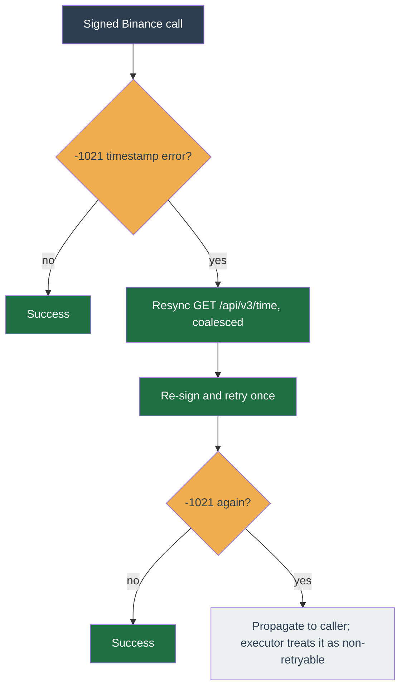

# Reliability

The worker is crash-only: idempotent jobs, a version-aware per-symbol `symbol_states` CAS, and idempotent `clientOrderId` mean a restart resumes cleanly and never double-places an order. The [worker pipeline](worker-pipeline.md) covers the tick lifecycle and commit path; this page collects narrower self-healing mechanisms.

**See also** — the worker pipeline owns the other self-healing mechanisms:

- [Market-data liveness](worker-pipeline.md#market-data-liveness) — REST gap-fill on a closed socket, force-reconnect on a silently stalled one.
- [Held-quantity reconciliation](worker-pipeline.md#converging-on-exchange-truth) — four paths converge the strategy's `heldQuantity` claim onto wallet truth.
- [Account-event idle clock](worker-pipeline.md#the-account-event-idle-clock) — a second liveness clock that reconnects and resyncs a stream that pongs but delivers no events.
- [Delisted-symbol self-heal](#delisted-symbol-self-heal) — a symbol Binance no longer lists reaps its own flat auto-discovered binding at the tick boundary instead of dead-lettering.

## Binance clock-drift self-heal

Signed Binance calls carry a server-time offset added to every timestamp. When a call returns `-1021` (timestamp outside `recvWindow`), the client issues one `GET /api/v3/time` resync, coalesced so a burst of concurrent callers triggers a single round-trip, then retries the call once. A second `-1021` propagates to the caller so a persistent host-clock skew cannot loop (the operator fixes the clock). The retry is safe: Binance rejects at its timing gate before executing, so nothing was placed, and order placement is idempotent via `clientOrderId`. The executor treats any `-1021` that surfaces past this as non-retryable, so the client owns the recovery and the two paths never stack.

## Delisted-symbol self-heal

Self-heal here means the tick fixes the condition itself and carries on, rather than failing the job into the dead-letter queue for a human.

A tick reads its symbol's filters from Binance `exchangeInfo`. When a symbol is missing, the tick first refreshes `exchangeInfo` inline (a brand-new worker may simply not have primed it yet). If that refresh **resolves and the symbol is still absent**, Binance no longer lists it on this account's mode (a delisting, or a symbol admitted to the wrong mode) — a `SymbolDelistedError`. This is distinct from a transient read failure (the refresh threw, a Redis error): those stay a bare `Error` and still dead-letter, because they may clear on their own.

For a **held or operator-pinned** delisted symbol — left in place (below) and so raising `SymbolDelistedError` on every tick — the inline `exchangeInfo` re-fetch is bounded to once per negative-TTL window (`SYMBOL_INFO_NEGATIVE_TTL_MS`, equal to the positive cache TTL): within the window the tick throws from memory without re-running the ungoverned full `exchangeInfo` fetch, keeping it off the hot path. The typed error still raises each tick, so the reap and action-log behaviour below is unchanged; after the window the next miss re-fetches, so a re-listed symbol still recovers.

On a `SymbolDelistedError` the tick self-heals instead of dead-lettering the same symbol every tick forever:

- It reaps the binding **only when it is flat and auto-discovered** (`source=auto`, no held quantity, no open order) via the shared `reapAutoBinding` — the same reap the [discovery](../concepts/discovery.md) cron uses, so the two paths cannot leave divergent discovery state. A held or operator-pinned symbol is left in place.
- It writes one operator `action_log`: `info` when the binding was removed; a `warn` when it was held or pinned (the operator must flatten or unpin it), throttled to one per hour per profile+symbol so a stuck symbol cannot flood the log.
- On a removal it enqueues one `reconfigure-profile` resync — the same job the [discovery](../concepts/discovery.md) cron and the api symbol routes use — so the WS subscriber drops the now-unbound symbol promptly instead of feeding it until the next discovery pass. The payload carries `accountId` (a resync missing it fails the job as an invalid payload and dead-letters on that failure, rather than completing silently). The enqueue is a queue add, not a re-entrant tick, so it cannot deadlock the per-(profile, symbol) chain.
- It returns a graceful skip (no decisions, no dead-letter); the next market event re-ticks.

The action_log and the reconfigure enqueue are best-effort — a transient fault is logged and swallowed, never allowed to re-fail the tick the self-heal exists to rescue.
