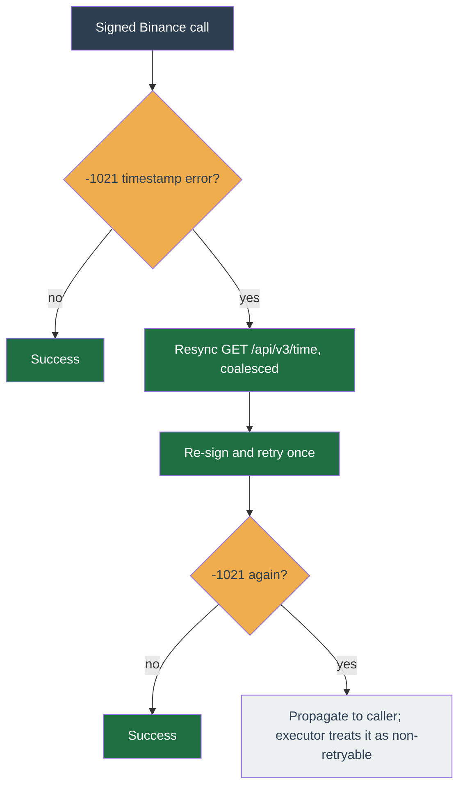

# Reliability

The worker is crash-only: idempotent jobs, a version-aware per-symbol `symbol_states` CAS, and idempotent `clientOrderId` mean a restart resumes cleanly and never double-places an order. The [worker pipeline](worker-pipeline.md) covers the tick lifecycle and commit path; this page collects narrower self-healing mechanisms.

**See also** — the worker pipeline owns the other self-healing mechanisms:

- [Market-data liveness](worker-pipeline.md#market-data-liveness) — REST gap-fill on a closed socket, force-reconnect on a silently stalled one.
- [Held-quantity reconciliation](worker-pipeline.md#converging-on-exchange-truth) — four paths converge the strategy's `heldQuantity` claim onto wallet truth.
- [Account-event idle clock](worker-pipeline.md#the-account-event-idle-clock) — a second liveness clock that reconnects and resyncs a stream that pongs but delivers no events.
- [Delisted-symbol self-heal](#delisted-symbol-self-heal) — a symbol Binance no longer lists reaps its own flat auto-discovered binding at the tick boundary instead of dead-lettering.
- [Unpermitted-symbol self-heal](#unpermitted-symbol-self-heal) — a symbol the account has no Binance permission to trade retires the same flat auto-discovered binding, before the tick assembler and at no request weight of its own.

## Binance clock-drift self-heal

Signed Binance calls carry a server-time offset added to every timestamp. When a call returns `-1021` (timestamp outside `recvWindow`), the client issues one `GET /api/v3/time` resync, coalesced so a burst of concurrent callers triggers a single round-trip, then retries the call once. A second `-1021` propagates to the caller so a persistent host-clock skew cannot loop (the operator fixes the clock). The retry is safe: Binance rejects at its timing gate before executing, so nothing was placed, and order placement is idempotent via `clientOrderId`. The executor treats any `-1021` that surfaces past this as non-retryable, so the client owns the recovery and the two paths never stack.

## Delisted-symbol self-heal

Self-heal here means the tick fixes the condition itself and carries on, rather than failing the job into the dead-letter queue for a human.

A tick reads its symbol's filters from Binance `exchangeInfo`. When a symbol is missing, the tick first refreshes `exchangeInfo` inline (a brand-new worker may simply not have primed it yet). If that refresh **resolves and the symbol is still absent**, Binance no longer lists it on this account's mode (a delisting, or a symbol admitted to the wrong mode) — a `SymbolDelistedError`. This is distinct from a transient read failure (the refresh threw, a Redis error): those stay a bare `Error` and still dead-letter, because they may clear on their own.

For a **held or operator-pinned** delisted symbol — left in place (below) and so raising `SymbolDelistedError` on every tick — the inline `exchangeInfo` re-fetch is bounded to once per negative-TTL window (`SYMBOL_INFO_NEGATIVE_TTL_MS`, equal to the positive cache TTL): within the window the tick throws from memory without re-running the ungoverned full `exchangeInfo` fetch, keeping it off the hot path. The typed error still raises each tick, so the reap and action-log behaviour below is unchanged; after the window the next miss re-fetches, so a re-listed symbol still recovers.

On a `SymbolDelistedError` the tick self-heals instead of dead-lettering the same symbol every tick forever:

- It reaps the binding **only when it is flat and unpinned** (`pinned = false`, no held quantity, no open order) via the shared `reapUnpinnedBinding` — the same reap the [discovery](../concepts/discovery.md) cron uses, so the two paths cannot leave divergent discovery state. The guard is the pin, never `source`: a binding the system re-created to recover an untracked position carries `source='unknown'` and rotates like any other. The unbind itself deletes the symbol's `condition_states`, `symbol_states`, `avg_entry_prices` and pending `override_actions` in the same transaction, so a delisted coin leaves no state a tick could never come back to close. A held or pinned symbol is left in place.
- It writes one operator `action_log`: `info` when the binding was removed; a `warn` when it was held or pinned (the operator must flatten or unpin it), throttled to one per hour per profile+symbol so a stuck symbol cannot flood the log.
- On a removal it enqueues one `reconfigure-profile` resync — the same job the [discovery](../concepts/discovery.md) cron and the api symbol routes use — so the WS subscriber drops the now-unbound symbol promptly instead of feeding it until the next discovery pass. The payload carries `accountId` (a resync missing it fails the job as an invalid payload and dead-letters on that failure, rather than completing silently). The enqueue is a queue add, not a re-entrant tick, so it cannot deadlock the per-(profile, symbol) chain.
- It returns a graceful skip (no decisions, no dead-letter); the next market event re-ticks.

The action_log and the reconfigure enqueue are best-effort — a transient fault is logged and swallowed, never allowed to re-fail the tick the self-heal exists to rescue.

## Unpermitted-symbol self-heal

Binance gates each symbol on permission tags: a symbol publishes `permissionSets`, and the account may trade it only when it holds at least one tag from **every** published set. A bound symbol the account cannot satisfy is refused `-2010 This symbol is not permitted for this account` on every order it will ever send, and no amount of waiting changes that. So the tick retires the binding on the same terms as a delisting.

The check is **data-driven**, not error-driven — nothing throws — so it runs before the tick assembler rather than in its catch, and it spends **no Binance request weight of its own**: the symbol's sets come from the same symbol-info cache the assembler reads on the very next line, and the account's tags from the Redis key every signed `/account` response already writes. It is gated on the kill switch and the per-symbol pause, the two halts the assembler checks before its own symbol-info read, so running ahead of the assembler cannot retire a binding on a profile the operator has explicitly stopped.

It **fails open** in every ambiguity — the symbol publishes no sets, its published shape drifted, or the account's cached tags are absent, empty or unparseable — and the tick proceeds normally. The asymmetry is deliberate: a wrong "not permitted" silently retires a binding the account can trade, while a wrong "permitted" costs one Binance rejection, which is what happens today anyway.

When the symbol is confirmed unreachable, the tick takes the same self-heal the delisted path takes, sharing one implementation so the two cannot drift:

- Reap **only when flat and unpinned**, through the shared `reapUnpinnedBinding`. The unbind deletes the symbol's `condition_states`, `symbol_states`, `avg_entry_prices` and pending `override_actions` in one Postgres transaction; the discovery Redis hashes are cleared straight after, and only on a confirmed removal. Held or pinned bindings are left in place — retirement is never allowed to abandon a position or override the operator.
- One operator `action_log`: `info` on removal; a `warn` when it was held or pinned, naming the sell-down or unpin the operator has to perform. The warn is throttled to one per hour per profile+symbol on **its own Redis key namespace** — not the delist throttle's, and not the placement refusal's. All three are keyed `(profile, symbol)`, so a shared prefix is a shared key, and the placement refusal always fires first.
- Only the sets the account satisfies nothing from are recorded, plus counts. Binance controls `permissionSets` and caps neither level, so a tokenised-equity symbol publishes hundreds of tags that no operator can act on and that the log viewer would then serve on every page.
- On a removal, one `reconfigure-profile` resync so the WS subscriber drops the now-unbound symbol, then a graceful skip: no decisions, no dead-letter.
- A binding that **survives** (held or pinned) keeps ticking. Only a retired symbol has nothing left to tick; one still bound must close its own blocker rows and stay able to cancel its resting orders.

Two boundaries are load-bearing. A `SymbolDelistedError` raised while reading the symbol row propagates to the delisted branch instead of being swallowed here, so a symbol Binance no longer lists at all is described accurately. And the order-placement pre-call refusal stays exactly as it is: retirement fails open in every ambiguity above and deliberately declines `manual` and held bindings, so that refusal is precisely where those still land, at zero request weight.
