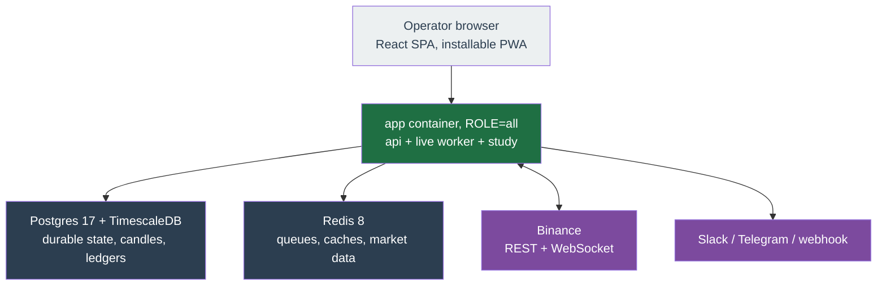

# Tech stack & deployable components

What this repo is built from and what actually runs on a server. Versions are pinned in `package.json` and the lockfile — that is the source of truth; the ranges below are the declared ones at the time of writing and may have moved.

## What runs on a server

Three long-lived processes and two data stores. In the default deployment the three processes are **one container**.



| Component | Image or artefact | Role |
| --- | --- | --- |
| **app** | one multi-stage image, `apps/server/Dockerfile` | The whole application. `ROLE` selects behaviour: `all` (default), `api`, `worker`, or `study`. |
| **postgres** | `timescale/timescaledb:latest-pg17` | Durable state: profiles, orders, trade archive, audit and action logs, candles. |
| **redis** | `redis:8-alpine` | BullMQ job queues, market-data cache, worker heartbeats, rate-limit accounting. |

The web app is **build-only** — there is no web container. The api serves the built SPA same-origin, so the browser talks to one host.

### The three roles

| `ROLE` | Runs | Notes |
| --- | --- | --- |
| `all` | api + live worker + study, in one process and one event loop | The default. Fewest moving parts; the worker-tuning defaults are conservative because everything shares a loop. |
| `api` | HTTP api + SPA + database migrations | Only this role migrates; the others set `SKIP_MIGRATIONS=1` so runners never race. |
| `worker` | The live trading loop only | **Single replica today.** Multi-replica scale-out is merged but dormant. |
| `study` | The backtest replay consumer only | Split it out to keep a long backtest off the trading loop. |

Splitting them is `deploy/compose/docker-compose.scale.yml`, which parks `app` and starts `api`, `worker`, and `study` from the **same image**.

### Ports

| Port   | Served by | What                                                                   |
| ------ | --------- | ---------------------------------------------------------------------- |
| `3000` | api       | The public ingress: `/api` plus the SPA. Host port is `APP_HTTP_PORT`. |
| `9100` | api       | Admin: `/healthz`, `/readyz`, `/metrics`. Binds loopback by default.   |
| `9101` | worker    | The worker's own admin endpoints.                                      |

The stack serves plain HTTP and **does not bundle a reverse proxy** — put TLS in front of it. See [Production deploy](../operations/deploy.md).

## The stack, by layer

### Runtime and tooling

| Tool | Version | Why it is here |
| --- | --- | --- |
| **Bun** | 1.3.x | Runtime, package manager, and test-adjacent tooling. One binary, no Node install. |
| **TypeScript** | 6.x | Strict end to end. `bun run typecheck` builds every package with project references. |
| **Turborepo** | 2.x | Monorepo task graph and caching across `apps/*` and `packages/*`. |
| **oxlint** | 1.73 | The single lint path. One whole-repo pass so cycle detection sees the full graph. |
| **Vitest** | 4.x | Unit tests, with per-package coverage thresholds. |
| **Playwright** | — | End-to-end tests and the docs screenshot capture. |

### Backend

| Library | Version | Why it is here |
| --- | --- | --- |
| **Hono** | 4.12.x | HTTP framework for the api. |
| **`@hono/zod-openapi`** | 1.3.x | Routes declare Zod schemas; the OpenAPI spec and Swagger UI at `/docs` are generated from them. |
| **Drizzle ORM** | 0.45.x | Typed queries. Migrations are **hand-authored SQL**, applied by a checksum-tracked runner. |
| **pg** | 8.13.x | Postgres driver. |
| **ioredis** | 5.11.x | Redis client, configured with `maxRetriesPerRequest: null` for BullMQ. |
| **BullMQ** | 5.58.6, pinned exactly | Job queues: ticks, crons, backtest replays. Not a range: 5.58.7 rejects `:` in a custom job id, which is what the coalescing keys are built from. See [Worker pipeline](worker-pipeline.md). |
| **Better Auth** | 1.6.x | Session auth. No email, no SMTP, no 2FA — one master account. |
| **decimal.js** | 10.6.x | **All money math.** Every price, quantity, balance, and P/L is a `Decimal` end to end; `number` is only for counters and timestamps. |
| **Zod** | 4.4.x | The contract layer: config schemas, API payloads, and the generated config docs all come from these. |
| **pino** | 9.5.x | Structured logging. |
| **ws** | 8.21.x | Binance WebSocket streams. |

### Frontend

| Library                | Version | Why it is here                                               |
| ---------------------- | ------- | ------------------------------------------------------------ |
| **React**              | 19.x    | UI.                                                          |
| **Vite**               | 7.x     | Build and dev server. Optionally emits a PWA (`VITE_PWA=1`). |
| **TanStack Router**    | 1.92.x  | Type-safe routing; every surface is a real route.            |
| **TanStack Query**     | 5.62.x  | Server-state cache and polling.                              |
| **Tailwind CSS**       | 4.x     | Styling, via semantic colour tokens rather than raw colours. |
| **shadcn/ui**          | —       | Component primitives, vendored into the repo.                |
| **lightweight-charts** | 5.x     | Financial charts (candles).                                  |
| **Recharts**           | 3.8.x   | Non-financial charts (equity curves, distributions).         |

The web app carries **no `decimal.js`**. Money arrives from the api as pre-formatted strings, so summation always happens server-side.

### Observability

| Library | Version | Why it is here |
| --- | --- | --- |
| **prom-client** | 15.1.x | Prometheus metrics on the admin port. |
| **OpenTelemetry** | 2.10.x SDK / 0.221.x exporters | Optional OTLP trace export. Off unless `OTEL_EXPORTER_OTLP_ENDPOINT` is set. |

## Repository layout

```text
apps/
  api/       HTTP api + OpenAPI + SPA serving
  web/       React SPA (build-only, served by api)
  worker/    live trading loop, crons, backtest consumer
  server/    ROLE-selectable entrypoint + the one Dockerfile
packages/
  strategy/core/          the plugin contract + Executor
  strategy/trailing-trade/  strategy plugins, one package each
  strategy/momentum/
  strategy/rebalance/
  indicators/             pure Decimal-typed candle and window math
  notify/                 notifier contract, registry, providers/{slack,telegram,webhook}
  binance/                Binance REST + WebSocket client
  db/                     schema, repos, hand-authored SQL migrations
  contracts/              Zod schemas shared by api, web, and worker
  config/                 shared build/test config
  core/                   shared runtime utilities, exposed as subpaths
deploy/compose/           the compose files
scripts/ci/               invariant gates CI runs
```

Directory grouping under `packages/strategy/*` is filesystem-only — package names stay flat (`@app/strategy-trailing-trade`).

## The two extension points

Both are plugins behind a contract, so adding one is a new package plus a registry entry, never an edit to `apps/api` or `apps/worker`.

- **Strategies** — see [Strategy plugin contract](extensibility.md).
- **Notifiers** — see [Notifiers](../concepts/notifiers.md).

## Deliberate omissions

- **No encryption at rest.** Binance keys and notifier secrets are stored as plain text. The mitigation is a single-tenant deployment plus an operator-side Binance IP allow-list. See [Auth & threat model](auth.md).
- **No distributed locks.** Single-execution comes from BullMQ job-id coalescing, in-process key ordering, idempotent client order ids, and version-checked state writes. See [Reliability](reliability.md).
- **No row-level security in the database.** Account isolation is enforced by a branded two-tier scope in TypeScript plus a lint gate. See [Account isolation](account-isolation.md).
