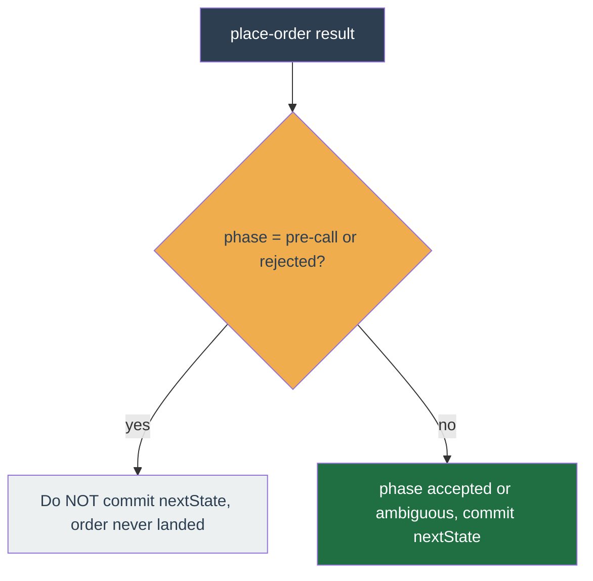

# Worker pipeline

Canonical references for the worker tick pipeline — the in-repo files are the source of truth, this page summarises the constraints those files encode.

- `apps/worker/src/` — BullMQ-driven tick handlers; per-profile work runs serially via the in-process `chainByKey` Promise chain.
- `packages/strategy/core/` — the `Strategy` contract and `Executor` that drives `tick()` and consumes the `Decision` union.
- `packages/strategy/trailing-trade/` — the first packaged strategy, a trailing-trade strategy.

## Single-replica policy

The worker runs a **single replica** today on purpose: no Redis-backed distributed lock, no intent set, no soft balance reservation. Single-execution per profile is enforced by three composing primitives:

1. **BullMQ `jobId` coalescing** — the queue rejects duplicate tick jobs for the same profile while one is in-flight.
2. **In-process `chainByKey`** — successive ticks for the same profile serialise on a Promise chain so one replica never runs two ticks concurrently.
3. **Idempotent `clientOrderId`** — Binance dedupes order placements if the worker crashes between submit and Redis-side acknowledgement.

**BullMQ is pinned to `5.58.6` exactly, not to a range.** Every coalescing key above is colon-delimited (`tick:<profileId>:<symbol>`, `reconcile-symbol:<pid>:<sym>`, `archive-grid:<pid>:<sym>:<ms>`), and 5.58.7 added validation that rejects a custom job id containing `:` — BullMQ builds its own Redis keys around that separator, so an id carrying one corrupts the key it is spliced into. Redis itself treats a key as an opaque string. Upgrading past 5.58.6 therefore breaks primitive 1 outright, and with no distributed lock there is nothing to fall back on: the redesign of the key scheme has to land first. `renovate.json` holds the ceiling as an `allowedVersions` rule so the bot cannot propose the bump; a hand-edit is not gated, which is why it is written down here.

Multi-replica is not yet enabled; the elastic worker pool is built ahead of it: tick/cron jobs distribute via BullMQ competing consumers, and each account's user-data stream is owned by exactly one pod, elected by rendezvous (HRW) hashing over the Redis membership registry (ownership is a pure function of the live member set — no lock, no held key). The propagation seams land ahead of the flag but stay dormant at single replica: the fleet-global membership reconcile (above) and the strategy's optional `mergeConcurrent` latch-merge on a cross-pod tick-commit CAS miss (see the strategy contract). Reintroducing `redlock` / `Redlock` / `intents:` Redis sets / soft balance reservation fails CI (`scripts/ci/no-locks.sh`).

## Cron health observability

The single replica runs about 20 crons, most **self-rescheduling** (the next run is enqueued only on the current run's terminal state). A self-rescheduling cron that stalls or dies stops re-arming, and nothing surfaced that until a downstream screen went empty.

Every cron handler is wrapped by `withCronStatus` (`apps/worker/src/crons/cron-status.ts`) at registration, so each run records its terminal outcome — `{ lastRunAtMs, status: 'ok' | 'error', durationMs, error? }` — into the `worker:cron-status` Redis hash (field = cron name). The wrapper is transparent: a status-write failure is swallowed, and a handler error is recorded then **re-thrown unchanged**, so BullMQ retry and the self-reschedule loop see the real result.

A self-rescheduling cron that runs LONGER than its period is a separate failure from one that stops re-arming, and it used to be invisible. `registerSelfReschedulingCron` computes the next delay as `periodMs - elapsedMs` floored at zero, so an overrun of any size collapses to a back-to-back re-arm that looks exactly like a healthy fast loop from outside: the same queue depth, the same completed jobs, the same `worker:cron-status` row. One 15-minute sweep ran for 8h07m on that path and emitted nothing. The re-arm still collapses (overlapping runs would be worse), but the run now warns with `{cron, periodMs, elapsedMs}` and increments `cron_overrun_total{cron}` as well. Both fire from `reschedule`, which only the `completed` and terminal-`failed` listeners reach, so this is a **completion-time** signal: it tells you a run WAS late, once that run ends. For the 8h07m case it would have arrived at 8h07m, not at minute 16. The in-flight indicator is the one already there, the `worker:cron-status` timestamp going stale on the System health panel, since a run still executing has not written its terminal outcome. The two are complementary and neither replaces the other. The diagnostics are emitted AFTER the re-arm and inside a `try`/`catch`: `reschedule` is the only place a self-rescheduling cron enqueues its successor, so an observability write that threw ahead of it would stop that cron until the next restart.

`GET /worker/crons` reads the hash and the Account page's "System health" panel renders each cron's last-run age + ok/error. A stale timestamp on a frequent cron is the "this cron has stalled" signal; an `error` row carries the failure message. This pairs with the worker heartbeat (`worker:status`, surfaced as "Bot live/down" in the account-health bar) and the DLQ `job-failed` alert: heartbeat answers "is the worker up", cron-health answers "is each job running", and the alert answers "did a job die".

## In-process snapshots

Two reads are shared process-wide rather than performed per consumer, both built once in `buildBootContext` and handed to every caller as a closure: `getAssetPolicy` (Binance's stablecoin/fiat classification, one HTTP fetch behind a five-minute snapshot) and `getSymbolAdmission` (the mode-keyed exchangeInfo admission map, one paged SCAN + MGET walk over the whole `binance:symbol-info*` keyspace behind a two-minute snapshot). The consumers are the `discovery-run` cron and the diagnosis re-probe, which re-derives the same candidate funnel live so the operator can see exactly where a symbol was cut.

Sharing buys two things. The first is agreement: two independently built maps can classify one asset, or admit one symbol, two ways at the same instant, and a probe that disagrees with the cron describes a funnel the cron never ran. The second is cost. The admission sweep pages roughly 1.4k keys, and the probe was firing its own sweep moments after the cron had finished one.

The probe therefore moved from always-fresh to **bounded-stale**, and that is the trade being made. `ADMISSION_SNAPSHOT_MAX_AGE_MS` is 120s: above the 60s discovery wake, though that lower bound buys less than it looks like — each profile runs on its own refresh period (15 minutes by default) and a wake with no profile due never builds the map, so most wakes prime nothing and a probe arriving at an arbitrary moment still sweeps for itself. What reliably holds is a probe landing within 120s of a cycle that actually built the map, which reuses that build, and repeated probes, which collapse onto one sweep. The upper bound is the firm one: below the 5-minute `exchange-info-refresh` cadence that writes those keys, so one snapshot spans at most one write and a delisting cannot stay invisible across two consecutive refreshes. The window must equal neither bound; a unit test pins it between them.

An **empty** map is not a snapshot. `fetchSymbolAdmission` returns one both for a Redis fault and for a keyspace that was never primed, so it is a sentinel meaning "unreadable or unprimed", never "this mode lists no symbols" — and the discovery handler treats it as a reason to skip the profile. Retaining it for the full 120s would keep aborting cycles long after a one-second blip healed, so an empty result is memoized for `EMPTY_MEMO_MS` (30s) instead. What that window guarantees is its own length, not that a wake boundary clears it: the memo is stamped when the sweep resolves, the cron self-reschedules at `max(0, period - runtime)`, and the probe stamps it from outside any wake, so the honest statement is that a sentinel is served for at most 30s and at most one subsequent wake can reuse it. The window's beneficiary is the on-demand probe rather than the cron, which already coalesces to one admission read per mode per wake in its handler; the cost is that a probe inside the window answers from the stored sweep even if Redis has recovered. A later successful sweep replaces the sentinel outright.

An empty map is also no longer merely "skip this profile this wake": the discovery handler counts an `empty-admission-map` abort and parks it where the operator's diagnosis page reads it. A memo can therefore extend a **real** refusal by at most one wake — the sentinel is only ever served after a sweep actually returned one, so nothing is invented from a healthy Redis — and the parked abort is cleared on the next successful cycle, by which time the memo has expired anyway.

Snapshots are per mode and never substituted for one another: a live map served to a testnet profile binds symbols testnet does not list, and every tick for them then DLQs. The two modes are disjoint by key glob (`binance:symbol-info:*` vs `binance:symbol-info-test:*`), so one sweep cannot see the other's universe. Concurrent readers collapse onto one in-flight sweep per mode, which is the case the sharing exists for: the cron's profile loop is sequential, but the diagnosis queue worker runs concurrently in the same process.

The wake-scoped `admissionByMode` memo inside the discovery handler stays as it is. It guarantees that every profile in **one wake** sees the identical map, which a time-bounded snapshot does not: a wake that straddles the TTL would otherwise hand its later profiles a newer map than its earlier ones.

One log-attribution detail changed with the sharing. `fetchSymbolAdmission` takes a caller tag for its two warn lines (unreadable keyspace, empty map), which used to read `cron discovery` or `diagnosis`. A memoized sweep has no single caller — the warn belongs to whichever consumer happened to miss the snapshot — so the tag is now the construction-time `symbol-admission` for both. Read it as a process-level fact about the keyspace rather than as an attribution: the line names no consumer, the logger carries no run or cron id, and the cron and the probe run concurrently here, so a neighbouring line does not identify one either.

## Market-data subscriptions

For each trading symbol the worker opens the **union** of its profiles' feed intervals — each profile's trading interval plus `1m` (bounds `currentPrice` staleness to ≤1 minute so a stop-loss fires within the minute, not a full trading-candle late) and `1d` (daily regime / all-time-high refresh) — plus one mini-ticker. Each WS kline stream is refcounted by the number of profile claims (`apps/worker/src/market-data/subscriptions-manager.ts`): a stream opens on the first claim and closes only when its last claimant leaves, and the mini-ticker lives as long as any kline interval does. So two profiles trading the same symbol on different intervals each get their own interval subscribed, while a shared interval (`1m`/`1d`, or two profiles on the same trading interval) is opened once and refcounted.

The subscription set equals the per-tick candle-load set: both come from one `feedIntervals` helper (`apps/worker/src/market-data/feed-intervals.ts`), so the streams a symbol subscribes and the candle windows a tick reads never drift. An unsubscribed interval would otherwise trigger a per-tick cold-load REST fallback.

`ProfileManager` (`apps/worker/src/profile-manager/profile-manager.ts`) forwards each profile's full symbol delta with its interval to the subscriptions-manager and keeps the per-symbol `inverse` index only for the `profilesUsing` event fan-out; the WS-stream refcounting lives entirely in the subscriptions-manager.

### WS connection pool (sharding)

A single Binance combined-stream socket caps at **1024 streams**. The kline-fetcher (`packages/binance/src/market-data/kline-fetcher.ts`) therefore holds a **pool of connection members**, not one socket. Each member owns its own socket, RPC buffers, reconnect-backoff cursor, `lastFrameMs`, and the set of streams it carries.

- **Assignment is greedy.** A new stream goes to the first member with spare capacity (`streams.size < 1024`), else a new member is allocated. The 1024 cap is enforced at assignment time, before any SUBSCRIBE is sent, so a member's stream set can never exceed it; `connect`'s `ensureLimit` is unreachable defense-in-depth.
- **Hard ceiling.** The pool tops out at `BINANCE_MAX_POOL_MEMBERS = 16` (16 × 1024 = 16384 streams ≈ 4096 symbols at 4 streams/symbol). The next stream past the ceiling throws loudly rather than silently dropping a subscription — a symbol set this large needs the deferred consistent-hash sharding, not a wider single-process fan-out. 16 combined-stream connections sits well within Binance spot's per-IP connection limit (300 new connections per 5 minutes per IP per the spot WebSocket docs), so the ceiling bounds stream count without risking a connection-limit breach.
- **Per-member lifecycle.** Reconnect (exponential backoff, reset only on a real delivered frame), resubscribe-on-reconnect (rebuilt from that member's own streams), and the `onReconnect` fire-once-per-member are all scoped to one member. A close or stall on one member reconnects and resubscribes **only its own** streams — a sibling member is never touched, and adding a shard never fires a spurious whole-feed resync.
- **Member pruning.** When a member's last stream unsubscribes, its socket closes and the member is dropped from the pool. Members are addressed by stable `id`, not array index, so pruning never reroutes another member's keys.

The pool is invisible to callers: the `KlineFetcher` interface is unchanged, and its **aggregate public methods** collapse the pool to the single observable contract the subscriptions-manager and liveness watchdog already consume:

- `subscriberCount` / `activeKeyCount` — sum across members (same totals as the single-socket era).
- `isConnected()` — **all-open**: true iff every non-empty member is OPEN. A partially-stalled pool (one member down while others serve) reads as not-whole so the watchdog recovers the whole feed rather than treating it as healthy. Empty pool → false.
- `msSinceLastFrame()` — **worst case**: `max` over members of `now - member.lastFrameMs`, so a single stalled member is enough to trip the watchdog's stale threshold.
- `forceReconnect()` — force-reconnects **every** open member, recovering the whole feed in one watchdog pass; a member that is mid-connect or already closed is left to its own onClose-armed reconnect.

For the overwhelmingly common case (≤256 symbols → one member) the pool is a single member created first, so behaviour is byte-for-byte identical to the prior single-socket adapter.

### Market-data liveness

Tick cadence is 100% WS-frame-driven, so if the market-data feed stops, every in-process stop / trailing / time-stop / entry freezes for that symbol. Two layers keep the feed alive (`apps/worker/src/market-data/market-liveness-watchdog.ts`):

- **Disconnect (socket closed).** While `klineFetcher.isConnected()` is false, the watchdog REST-polls each subscribed symbol's freshest closed-1m price and feeds it back as a synthetic mini-ticker through the same `onMarketEvent` path a real frame uses, so the strategy keeps evaluating a fresh price during the reconnect-backoff window. Idempotent (same coalesced tick job, deterministic clientOrderIds) and inert while healthy.
- **Silent stall (socket open, no frames).** A half-dead socket leaves `isConnected()` true, so the disconnect layer alone would never fire. The kline-fetcher tracks `msSinceLastFrame()` (bumped on every frame; the always-on mini-ticker pushes about one frame per second, so it is the natural heartbeat); when it exceeds `staleThresholdMs` (default 20s, floored 10s) with active subscriptions, the watchdog calls `forceReconnect()`, which closes every open pool member so the normal per-member reconnect+resubscribe path rebuilds the whole feed. `msSinceLastFrame()` is the worst case across members, so a single stalled member trips the threshold; the close flips the all-open `isConnected()` false synchronously, so the same watchdog pass falls through to the REST gap-fill. The reconnect backoff resets only on a real delivered frame (not merely on open), so a persistently open-but-silent upstream backs off toward the cap instead of looping at the initial delay. This mirrors the user-data stream's heartbeat + idle-watchdog.

## Subscription lifecycle

`subscribe-profile`, `unsubscribe-profile`, `reconfigure-profile`, and `dispose-profile` all dispatch under `chain.run(profileId)` (`apps/worker/src/queues/pipeline-worker.ts`), so under pipeline concurrency they cannot interleave on the same profile. Job arrival order does not decide the outcome; the operator's last committed DB action does.

### `dispose-profile` — deleting a profile without abandoning its exposure

The api guards and enqueues (`202`); this job owns the teardown, because only the worker has a Binance client and a profile with resting orders cannot simply be dropped from the DB — the orders survive on the exchange, holding the operator's coins, with nothing left pointing at them. Crash-only: every step re-derives from DB truth, so a kill mid-teardown resumes on the retry. The order is load-bearing:

1. `setEnabled(false)` + unsubscribe **first** — a live tick would otherwise re-place what we are about to cancel.
2. Cancel each live order on Binance (there is no cancel-all endpoint, so it is a loop). An already-gone order is tolerated.
3. `handoff` only: re-point the **position** (`avg_entry_prices` + the `profile_symbols` binding) to the target profile, never the orders, then `reconfigure` the target so it ticks the symbol and seeds its strategy state from the moved cost basis. Two properties make this safe, and both were bugs first:
   - **It is ONE transaction.** The source must be unbound before the target is bound (`profileSymbols.upsert` enforces base-asset exclusivity per account), and that unbind destroys the row the retry rebuilds its plan from — so a crash in between would leave the retry with nothing to hand off, the profile deleted, and the cost basis cascaded away: coins in the wallet owned by nobody. `withTx` re-brands both already-proven scopes onto one transaction handle, so a crash rolls back to a fully intact source or commits a fully seeded target.
   - **The plan is the UNION of the symbol bindings and the cost-basis ledger.** Either half can exist without the other, and both mean "this profile owns these coins": a ledger row with no binding (a symbol un-bound while a position was open), and a binding with no ledger row (a HELD BUT UNPRICED position, e.g. cost-basis reconstruction that never succeeded because `getMyTrades` kept failing). Dropping either from the plan hands those coins to nobody and lets the delete cascade the last row pointing at them away. The binding's `source`, `pinned` and `pinned_at` all travel with it: re-stamping the provenance would credit the operator with a coin discovery chose, and dropping the pin would let discovery reap a ringfenced coin the moment it lands. When the position's binding is already gone (the ledger-row-without-binding half of the union), the target is seeded `source = 'unknown'` and unpinned — the honest provenance and the safe rotation state, rather than inheriting a protection nobody granted.
   - **The seeding is VERIFIED, not assumed.** `reconfigure`'s reconcile is fail-soft by design (a missing symbolInfo key, a `getAccount` blip, or a strategy without a position adapter must never crash a live profile's reconfigure), so it can seed nothing and still return. Every other step of the disposal is held to "throw until provably clean", and this is the one whose failure is UNRECOVERABLE — delete the source and the target holds the coins while reading FLAT, with no row left for a retry to re-derive. So before the delete, every cost-basis row the TARGET holds must read back as a priced position through that strategy's own `position.readPosition` adapter; anything else throws and BullMQ retries (the retry re-runs `reconfigure` and re-verifies — the check is driven by the target's ledger, never by this run's plan, which is empty by then).
   - **State seeding does not depend on ProfileManager membership.** The natural handoff target is a fresh or stopped profile, which is absent from ProfileManager's in-memory map. `reconfigure` therefore runs the wallet reconcile BEFORE its membership gate, and `ensureCostBasisFromTrades` seeds the state body straight from the cost-basis ledger when the target has never ticked the symbol (the reviver restores a price _onto_ a body and has none to work with). Otherwise the target reads FLAT while holding the coins: no protective stop, and a fresh entry BUY on top of the position it already owns.
   - **A shared-wallet collision on the target is a CLEAN BLOCK, not a retry.** The bind is `profileSymbols.upsert`, which throws `SymbolOwnershipConflictError` (the target already trades that base asset) or `SiblingQuoteConflictError` (a target sibling settles in it) — the same account-isolation guards `docs/architecture/account-isolation.md` describes. These are TERMINAL: no retry clears a wallet line another profile owns, so rethrowing would dead-letter the job and retry the whole 10-minute envelope to no effect while the source profile could never be deleted. The handler catches BOTH classes around the handoff transaction (which has already rolled back, so the source keeps every position and its row) and **acks**. Because the finders exclude the target, the profile that actually owns the asset is a third sibling carried on the error, so the notice names that owner — not the target — and states plainly that the source was already disabled and its orders cancelled, leaving its position unprotected: the operator re-starts it to restore protection, then picks another target or frees the asset and retries. Only these two classes ack; every other throw from the handoff still propagates and retries.
4. Re-read **DB and Binance** and confirm the exchange is clear. The Binance read is **one account-wide `getOpenOrders()`** — no symbol argument (weight 80, against 6 per symbol). Asking per symbol could only ever ask about symbols the DB still knows, and the order that most needs finding is precisely the one our books never recorded: the bookkeeping-failure path leaves a live order with no row, and a later unbind takes away the last symbol that would have made a per-symbol probe ask. The whole book is then split three ways:
   - **Still resting** (an order we just cancelled, matched by `symbol` + `orderId` — a Binance order id is unique per _symbol_, not per account): the cancel never landed. Throw, and BullMQ retries; the profile outlives it.
   - **Untracked but provably ours**: **cancel it.** Ownership rests on two independent proofs, and either suffices. (a) `attributeOrder` (the same proof the adopt page uses, run against the symbol's _merged_ config, since a per-symbol override widens the id space the strategy enumerates) re-derives the `clientOrderId`. (b) A row **this profile recorded**, matched on `symbol` + `binanceOrderId` with no `closed_at` filter, is proof of ownership a re-derivable id cannot give: `upsertLive`'s `closePrevious` stamps the prior slot row CLOSED the moment the next candle's order takes it, while the superseded order may still rest, and a strategy whose id folds unbounded runtime data (momentum's `candleCloseMs`) cannot re-derive it at all. Leaving either is exactly how a deleted profile's stop went on holding the operator's coins for days with nothing left in the system pointing at it.
   - **Unattributable** (an operator's hand-placed order, a sibling profile's, or one whose id folds unbounded runtime data _and_ has no recorded DB row): **announced to the operator, never cancelled, and it never blocks the delete.** We do not cancel an order we cannot prove is ours. The announcement is scoped to the symbols this profile kept — a sibling's resting order is not this profile's leftover, and neither is the stop the handoff target armed seconds ago — and it names whether the order holds coins (a SELL) or cash (a BUY). It runs _before_ the cancels, so a transient cancel failure cannot swallow the alert.

   An unresolvable Binance client is a failure, not a pass — "I could not ask" is not "it is clear".

5. Only then wipe Redis and delete the row — in that order, so a crash between them leaves a live profile that the retry re-derives, not a live profile with no cached state.

Every failure above **throws** — except a shared-wallet collision on a handoff target (step 3), which is terminal and acks cleanly after notifying the operator — so BullMQ retries (`DISPOSE_JOB_OPTS`, defined in `apps/api/src/route-helpers.ts` because the api enqueues this job even though the worker owns the teardown: 8 attempts, exponential backoff from 5s ≈ a 10-minute envelope, sized against a real Binance outage rather than a blip — and a BullMQ job runs exactly once unless `attempts` says otherwise) and DLQs only after the retries are spent. It carries **no fixed `jobId`** (the pipeline queue retains completed jobs, so a fixed id would let only the first disposal per profile ever run). The per-profile chain key does **not** serialise it against the tick (which chains on `${profileId}:${symbol}`); step 4 is what closes that race — a tick that slipped an order in after the cancels is found by the DB+exchange re-read, throws, and the retry cancels it.

`handleUnsubscribe` re-reads the DB and tears down only when the profile is **missing** (deleted) or **`enabled=false`**; otherwise it skips. A `/stop`'s unsubscribe can land after a later `/start` has already re-enabled the profile, and tearing down then would strand the symbol (DB enabled, streams gone) until restart. The ownership read throws `ProfileNotOwnedError` when the row is gone, which the handler maps to the deleted-profile teardown path rather than DLQ-ing.

`enable()` on an already-active profile **converges** instead of no-opping: it applies the current symbol set and interval via `setSymbols` and refreshes the technicals intervals. It does **not** touch the account user-data stream — `ProfileManager` owns only market subscriptions and the membership set (`listActive`). Opening and closing the user-data stream is `subscription-ownership`'s sole responsibility, elected by HRW over `listActive()`.

### Sole stream driver + fleet-global membership

`subscription-ownership` is the **only** thing that opens or closes an account's user-data stream. At single replica the sole ready member owns every account, so its first reconcile opens all streams at boot; on unsubscribe it closes the departed profile's stream (tracked in a `streamedByUs` map, since a profile that left `listActive` is no longer visited by the open/close election loop).

Because HRW ownership elects over `listActive()`, every pod's membership must reflect the fleet-global enabled set. `subscribe/unsubscribe/reconfigure` arrive as single-consumer pipeline jobs, so after boot only the consuming pod knows a change. The `EnabledSetReconciler` (`apps/worker/src/profile-manager/enabled-set-reconciler.ts`) closes that gap: on an interval it re-reads `repo.profiles.listAllEnabled` and converges each pod's `ProfileManager` via the diff-based `reconcile(rows)` (enable added, disable removed, converge the rest), then re-elects ownership. The subscribe/unsubscribe handlers additionally kick `reconcileOwnership()` for prompt convergence (best-effort; the periodic reconcile is the guarantee). The reconciler and ownership both **run** at single replica (started for the worker role — `ROLE=worker` or `ROLE=all`), where the pipeline job has already applied the change on the sole pod, so each pass is no-op churn; the election only **redistributes** streams across pods once `replicas > 1` is enabled. This is the multi-replica propagation prerequisite.

## Converging on exchange truth

The strategy's `heldQuantity` is a claim; the wallet is the fact. When they disagree — a fill the user stream never delivered, an order the operator cancelled on Binance by hand — every SELL the strategy sizes off the stale claim is refused `-2010` (insufficient balance), forever, because nothing in the tick path ever revisits the claim. Four paths converge it, in ascending order of latency and descending order of precision.

| Path | Cadence | Converges |
| --- | --- | --- |
| boot + reconfigure | once, at start / on adopt | every active `(profile, symbol)` |
| `symbol-reconcile` queue | on discovery, ≤1 per 60s per cause | the one `(profile, symbol)` that just proved itself wrong |
| `held-quantity-reconcile` | every 15 min | every active `(profile, symbol)` — the backstop for drift nothing detected |
| `stale-order-reap` | every 15 min | local `orders` rows whose order has left Binance's book |

All four run the same `runHeldQuantityReconciliation` / reaper code under the same `profileId:symbol` chain key, so none of them can interleave a state write with a live tick on that symbol.

### The periodic backstops

Both crons use `selfReschedulePeriodMs`, **not** a cron `pattern`: each fans out a `getAccount` per profile plus trade-history reads per symbol, so a slow run must **delay** the next one, never overlap it. Two reconciles racing the same symbol would contend on the shared chain key and burn Binance request weight re-deriving the same answer.

They are also kept **separate** rather than folded into one "converge to exchange truth" cron: they converge different things against different Binance endpoints, and a reaper fault (a `getOrder` 5xx storm) must not delay the position convergence, which is the money-critical half.

Neither can be boot-only. A healthy worker does not restart, so "reconcile at boot" means "reconcile never" — which is exactly how a stale `heldQuantity` or an `orders` row left at `status='NEW'` survives indefinitely. A stale order row is not merely cosmetic: it is shown as open in the UI, counted toward the account's open exposure (which gates account deletion), and treated as tracked-live by the orphan detector, which is what keeps the real order from ever being surfaced.

### The `symbol-reconcile` queue

The fast path. Three causes enqueue it, each a moment where the bot has just PROVEN its own state wrong:

1. a cancel whose `-2011` probe comes back `FILLED` — the order filled during a stream gap;
2. a SELL Binance refuses `-2010` — the wallet does not hold what the state claims. `-2010` is `NEW_ORDER_REJECTED`, an umbrella code, so this is narrowed by the rejection's message: the `symbol is not permitted for this account` flavour enqueues **nothing**. That refusal says nothing about the wallet, so reconciling would find no drift to fix, and it never clears on its own, so every tick would re-enqueue the same futile pass forever. The tradability pre-flight and its once-per-hour-per-symbol alert own the moment; the binding itself is retired at the next tick boundary, or left in place with its own hourly warn when it is held or operator-pinned — see [Unpermitted-symbol self-heal](reliability.md#unpermitted-symbol-self-heal);
3. the account-event idle watchdog firing (below), which fans out one enqueue per symbol on the profile with cause `stream-silent`.

It is a **queue, not an inline adopt**, because the discovering code runs inside the tick's `chainByKey(`profileId:symbol`)` critical section and the fill-adopter takes that same key. `chainByKey` is not reentrant, so adopting inline would self-await and hang that symbol's tick forever. The work is deferred out of the lock and done here.

Enqueues are coalesced two ways. BullMQ's `jobId` (`reconcile-symbol:<pid>:<sym>`) collapses a burst into one run while a job is waiting or active — paired with `removeOnComplete: true` / `removeOnFail: true`, without which the retained terminal job would keep occupying the id and the slot would never reopen. Beyond that, a 60s `SET NX PX` window per `(profile, symbol, cause)` bounds the treadmill: the discovering conditions fire EVERY TICK for as long as they hold, and some hold for days, so an unthrottled enqueue would spend `getAccount` + `getMyTrades` weight once a second on a symbol that is stuck. Dropping a reconcile inside the window is safe — the pass is an idempotent converge-to-truth, and the 15-minute cron is the backstop it relies on. The cron path is deliberately not throttled.

### The account-event idle clock

The user-stream pool runs a **second** liveness clock, independent of the heartbeat one. Binance's pongs prove the socket is up; they prove nothing about whether events are still being **delivered** on it. A silently half-dead stream answers every ping and delivers no `executionReport`, and the bot happily trades on a position it no longer holds.

So the pool also tracks time since the last **account event** per profile. Past `accountEventIdleMs` (default 45 min, floor 60s) it reconnects, resyncs, and raises `onStreamSilent` — which writes a durable operator-visible `action_logs` row (throttled per `(profile, topic)`) and enqueues a `symbol-reconcile` for every symbol on the profile.

Silence here is **not** a fault: Binance emits an account event only when a balance changes, so a profile holding through a quiet market is legitimately idle for hours. The operator-facing copy says what actually happened — quiet stream, reconnected to check — rather than "the stream is broken", which would train the operator to ignore the one row that, on the day it matters, is the only warning a fill went missing.

### Boot & reconfigure

On boot (`runHeldQuantityReconciliation`, `apps/worker/src/boot/reconcile-held-quantity.ts`) and on a mid-run reconfigure after an operator adopts an orphan (`reconcileSymbolsAfterReconfigure` in `apps/worker/src/queues/pipeline-worker.ts`), the worker reconciles each `(profile, symbol)` under the `profileId:symbol` chain key so a boot-window fill cannot interleave. `ensureCostBasisFromTrades` runs first: for a held-but-unpriced position — the wallet holds the coin but both the strategy state and the `avg_entry_prices` ledger are empty — it reconstructs the average entry price from Binance `myTrades` (`limit: 1000`, average-cost method), upserts the ledger, and applies a synthetic buy onto strategy state so the entry gate does not re-buy a position it already holds. Then `reconcileSymbol` pins `heldQuantity` to wallet truth and revives `avgEntryPrice` from the ledger. On a reconfigure this runs **before** `setSymbols`, so the newly-subscribed symbol is not yet tickable and there is no tick-vs-reconcile race. Both steps are best-effort: a `getMyTrades` / `getAccount` failure logs at warn and continues.

#### What counts as a position, and what is only residue

`LOT_SIZE.stepSize` is the smallest tradeable **increment**; `NOTIONAL.minNotional` is the smallest tradeable **value**. A balance can clear the first and fail the second by orders of magnitude: a crumb one step wide can be worth a fraction of a cent, and no sell will ever dispose of it. Seeding a position asks both halves; the flatten that removes one asks value alone, because an increment test cannot see a position whose wallet has decayed to residue.

Two bars, split by whether the decision creates a position or destroys one:

| Decision point | Bar |
| --- | --- |
| Seed an untracked wallet balance (`reconcileHeldQuantity`, `heldQuantity === null`) | full `minNotional` |
| Reconstruct a cost basis from `myTrades` (`ensureCostBasisFromTrades`) | full `minNotional` |
| Seed a body from an existing `avg_entry_prices` row | residue (1% of `minNotional`) |
| Flatten a converged position (`reconcileHeldQuantity`) | residue |
| Phantom prune (`isPhantomLedgerRow`) | residue |

Declining to **create** costs only a blind spot on a balance nothing could trade anyway. Destroying a cost basis, or abandoning a position a ledger row already records, destroys something real, so the destructive paths take the stricter bar. Seeding from an existing row counts as destructive: that branch runs only when no state body exists, and a decline deletes the row.

Three rules bind any change here:

- **The flatten tests the claim, not just the wallet.** `getAccount` is read once per profile outside the per-symbol loop, while `heldQuantity` is read inside the per-symbol lock, so a BUY filling mid-sweep presents as a dust wallet under a fresh claim and must keep its cost basis. An unparseable claim counts as valueless; a claim of exactly zero is not a claim at all and falls through to the no-op band, since every idle symbol carries one.
- **The flatten sits ahead of the `|held − wallet| ≤ stepSize` no-op band.** That band is where a stranded position ends up: pinning `heldQuantity` to the wallet makes the two agree exactly, so every later pass short-circuits on a difference of zero before reaching any dust test.
- **A missing input disarms the bound rather than guessing.** These bounds only ever remove a position, so absence must mean "do not act", whether the symbol is unpriceable or `minNotional` is missing.

Value and increment bounds both read the same `free + locked` total. A balance leg that will not parse never reaches either: the reconciler's own parse guard returns `no-op` for the whole symbol first, writing nothing. That skip is as silent as a disarmed bound, so `valueBoundDisarmReason` reports it as `no-wallet-total` alongside the two inputs that can genuinely go missing on their own.

A flatten clears strategy state first (`applyFill({kind: 'empty'})`), then deletes the `avg_entry_prices` row. The writes are not atomic and the order is deliberate: a lost delete is repaired by the next prune, but a lost clear leaves a claim nothing can heal. No `archive-grid-trade` is enqueued, matching the phantom prune: a flatten asserts the position never existed, so there is no exit fill and no realised P/L.

Prices resolve cache-first (`readTickerPrice`), then one batched `getPriceTickers` call per profile for whatever the cache missed. The REST half is not redundant: the miniTicker cache is written only by the market stream and its keys expire in 60s, so at cold boot, exactly when this sweep runs, it is empty for every symbol.

Both outcomes are observable. `reconcile_value_bound_disarmed_total` separates "checked, the holding is real" from "could not check", which previously both tallied as `no-op`; `reconcile_position_removed_total` records the two destructive paths. Three doors emit the disarm counter — boot, the reconfigure reconcile, and `apply-avg-entry-price` below — under the same `profileId`/`symbol`/`reason` labels.

The apply door has a third outcome the other two do not: the gate can fail to resolve one of its inputs at all, and then it degrades to the operator's recorded quantity rather than refusing. `pipeline_apply_seed_gate_stood_down_total` records that, labelled `profileId`/`symbol`/`reason` over a closed set of `no-client`, `no-symbol-info`, `bad-symbol-info` and `getaccount-failed` — four different remedies, from an expired or IP-rejected key to a stale exchange-info refresh. Unlike the disarm counter beside it, every reason is seeded at zero on **both** arms: this one increments on the stand-down arm, so a profile whose gate always resolves cleanly would otherwise have no children at all. What that buys is bounded and worth stating exactly — any apply job for a `(profileId, symbol)` arms all four children, so once a profile has run one, a later stand-down on those labels is an observable rise. It does not help when the very first job for those labels is itself the stand-down: seed and increment share one synchronous block, so no scrape lands between them and that series is born holding 1. A rule over this counter needs the offset-subtraction form `ReconcileValueBoundDisarmed` uses, not `increase()`.

The operator sets the average entry price via the API, which enqueues a pipeline job to update the strategy's position state. See the "Tell the bot the entry price" section in the troubleshooting guide.

That job is the third door onto the seed rule above, and it runs the same `reconcileHeldQuantity` the boot sweep and the reconfigure reconcile run, over the same cached symbol filters and the same `resolveSweepPrices` valuation. It used to size the position straight off `free + locked`, which rebuilt exactly the positions the other two doors had just written off.

It asks two questions, because sizing a position and deciding one may exist at all carry different bars. EXISTENCE is settled by `isPhantomLedgerRow`, the predicate the boot prune uses to decide whether to delete this very row, and it is the only thing that may refuse. SIZE comes from `reconcileHeldQuantity`, asked under the operator's recorded quantity as the claim — but that verdict may name no quantity at all, because its `adopt-wallet-smaller` arm judges the wallet as a SHARE of the claim, which the prune does not. Where it names none and the prune keeps the row, the wallet total the prune just vouched for is written; only where the wallet itself could not be totalled does the recorded quantity stand. A recorded quantity that is absent, zero, or negative states no position and is normalised to no claim. The applied log line carries `sizedFrom` naming which of the three produced the number, because the reconciler's action reads identically whether it sized the position or declined to.

Matching the prune's bar exactly is what makes the refusal durable, and both directions of missing it are strands. Refuse MORE than the prune deletes — the full `NOTIONAL` floor, say — and the write is rejected while the ledger row survives every later pass, so the next boot revives the cost basis onto a position with no quantity, which is worse than the strand this door was fixed to prevent. Refuse LESS and this door writes a position the next boot deletes the basis out from under. The prune is asked about the quantity this door is about to WRITE rather than the one it read, because its value arm needs the claim to be valueless too: asked under a larger recorded quantity it disarms for a wallet the very next reconcile pass flattens, and a flatten deletes the cost-basis row and raises a latching critical alert, both caused by this door's own write.

A refusal is the prune's verdict alone, and it writes no position — no state, and the `avg_entry_prices` row stays as the operator submitted it, under `pipeline_apply_avg_entry_price_no_sellable_position` carrying the sizing verdict, the prune verdict, and the operator's recorded quantity. It does record one thing: a `position-seed-refused` row in `condition_states`, coded `no-sellable-position`. The log line alone left the refusal invisible — the api accepted the write seconds earlier and every read surface still projects the row, so the symbol page rendered it as a held position and signed an unrealised P/L against it. The condition travels with the row into `GET /symbols/:symbol/state` as `positionSeedRefusal`, where the symbol page's position strip names it in the Position cell and drops that P/L to an em dash. The strip is the only surface reading it today; the dashboard's symbol table still prices the row. `condition_states` and not `action_logs`, because the refusal has to outlive a one-day log retention, and not a strategy-state blocker, because this job runs outside `tick()` and the strategy owns that body.

The condition closes in two shapes, because there are two ways a refusal stops being true. **The row goes away** — the operator's DELETE, the boot sweep's phantom prune or sub-notional flatten, a full-exit fill, a grid reset, an unbind — and the clear rides inside `avgEntryPrices.remove` itself rather than at each of those six callers: once the row is gone nothing re-examines the symbol, so a caller that forgot would leave a warning nobody could clear, and a seventh caller would have no checklist to read. **A real position appears under the row that stands** — the operator tops the coin up, or the strategy buys in — and there is no delete to hang the clear on. The recurring position-reconcile pass clears it, but only on POSITIVE proof: it re-asks the phantom prune's own predicate and clears when the answer is "this wallet backs the claim". It deliberately does not infer from the prune having stayed silent. Silence covers two opposite readings — the prune ran and kept the row, and the reviver returned before reaching the prune because there was no `symbol_states` body to read — and the second is exactly the shape a refusal leaves behind, since a dust wallet never gets a state body written. The prune is also fail-closed on a missing input (it only ever deletes, so it declines when it cannot judge), which makes its `false` mean "did not decide"; a cold ticker cache, an absent `minNotional`, or an unparseable `stepSize` therefore blocks the clear rather than licensing it. The fill adopter also clears on a buy fill, unconditionally, because an exchange-confirmed fill is a direct report of a position rather than a snapshot judged against a cached price. That second shape is the one worth stating plainly: without it the refusal outlives its own reason and labels a genuine holding "not held", withholding a real P/L to avoid having fabricated one. Deleting the profile cascades both tables away. Leaving the row is safe precisely because the bar is the prune's own: the row this door declines is the row that pass removes. When the rule's own inputs cannot be resolved the gate stands down and the recorded quantity is applied as before, under `pipeline_apply_avg_entry_price_gate_unavailable` with the missing input named (`no-client`, `no-symbol-info`, `bad-symbol-info`, `getaccount-failed`) and its cause attached. A bound that stood down on a resolvable-but-missing input reports rather than refuses, under `pipeline_apply_avg_entry_price_value_bound_disarmed` and the disarm counter above; refusing there would reject an operator's write every time the ticker cache is cold.

## Auto-archiving a closed cycle

When a SELL fill empties a held position, the buy/sell cycle is over and its realised P/L should land in `trade_archive` without the operator clicking anything. Two files cooperate:

- `apps/worker/src/executor/fill-adopter.ts` — after the emptying SELL commits, it enqueues an `archive-grid-trade` pipeline job (`enqueueArchive`). This is best-effort: a queue failure is logged at warn and swallowed, because the fill is already durable and must not be undone by an archive hiccup. The `jobId` carries a per-fill timestamp so two separate exits on the same symbol each archive rather than coalescing into one.
- `apps/worker/src/queues/pipeline-handlers/archive-grid-trade.ts` — the handler. Because the same job can be delivered twice (BullMQ retry, or a manual operator click racing the auto-enqueue), it reads `latestArchivedAt` for the symbol and only archives orders that closed after that cutoff. A duplicate delivery finds nothing new and short-circuits with a `nothing_to_archive` log, so it is idempotent.

### Netting the BUY commission out of the tracked quantity

The archive only fires when the SELL resolves the position to `clear`, so anything that leaves a permanent residual silently suppresses the whole cycle's history. A base-asset commission does exactly that.

Binance charges a spot BUY's commission **in the base asset** (unless a discount asset such as BNB covers it), and the `executionReport`'s `z` (`executedQty`) is the **gross** filled quantity, before that deduction. Folding `z` therefore tracks more coin than the wallet ever received. The exit is sized from the real wallet balance, so it can never bring the tracked number to zero: the SELL resolves `sell-reduce`, `enqueueArchive` never fires, and a completed, profitable trade never reaches Trade History. Live case: a BUY of 1682.30 TST paid 1.6823 TST in commission and credited 1680.6177; the protective stop sold 1680.60 (the wallet balance floored to the LOT_SIZE step), leaving 1.70 tracked — far above the 0.1 step, so the sub-step flatten never fired.

The netting happens in the **adapter**, before `resolveFill` is called, so the shared fold (and with it the backtest and the golden fixtures) is untouched:

- `packages/binance/src/user-stream-frame.ts` parses `n` / `N` (commission and its asset). Both are **per trade** while `z` / `Z` are cumulative, so a consumer needing the order's total must accumulate the partials itself.
- `apps/worker/src/executor/order-commission-accumulator.ts` does that accumulation per commission asset, keyed by `(accountId, symbol, orderId)` — Binance order ids are unique per symbol, not per account. Replay protection records every trade id and its fee rather than using a high-water mark: the user-stream pool dispatches handlers without awaiting, so a later trade can be folded before an earlier one. An identical reconnect replay is a no-op; a conflicting replay or malformed fee latches the order as unknown so a partial subtotal is never presented as complete.
- `apps/worker/src/executor/fill-adopter.ts` resolves the symbol's base asset and folds `executedQty − commissions[baseAsset]`. Other subtotals, such as BNB, stay in the record but do not reduce the credited base quantity. No base subtotal, an unresolvable base asset, an invalid record, or a net quantity ≤ 0 falls back to the gross quantity: absent means unknown, never a silent zero-fee assumption. The position's average entry price divides `cummulativeQuoteQty` by the **net** quantity, because that is what the operator paid for what they actually received.
- `apps/worker/src/executor/fill-backfiller.ts` builds the same per-asset totals from `myTrades`, so reconnect recovery and the live stream use the same fee contract and fail-closed behavior. Before aggregating, it validates the requested symbol, numeric trade/order identities, side, and non-negative decimal quantities, then deduplicates identical trade-id replays. An invalid row or conflicting payload for one trade id rejects the whole response before any order is adopted.

With the BUY folding 1680.6177, the live case's residual becomes 0.0177 — below the 0.1 step — and the existing sub-step flatten resolves it to `clear` on its own. When the LOT_SIZE lookup itself fails the residual cannot be checked at all; rather than stranding it silently, the adopter logs an error and appends a plain-language action log so the operator sees the unverified position.

### Two filters make a residual unsellable, not one

The same split applies to a sell's leftover: netting shrinks the residual but does not guarantee it lands under one step, and a crumb above the step can still be worth far less than one minimum order. `resolveFill` therefore takes `minNotional` alongside `stepSize` and flattens on either, valuing the residual at the exiting sell's own VWAP (`cumQuoteQty / cumQty`), the best evidence of what it is worth at the moment it would strand. A non-positive price skips the check, so a caller that does not price its sells cannot empty a live position through a zero. Both parameters are optional and the backtest passes neither, so the shared fold and the golden fixtures replay byte-identical.

The value bound additionally requires the leftover to be under **1%** of the pre-sell position, and that qualifier is load-bearing: `rebalance` trims a holding to a target weight on purpose, and a small target weight is legitimately worth less than the floor, so flattening on value alone would delete a real cost basis and archive a phantom cycle. The increment bound needs no such qualifier, because an increment is price-invariant.

Flattening the fill is only half of it: `reconcileHeldQuantity` would read the same untradeable balance off the wallet on its next pass and re-create the position the fold just cleared, so both apply the same predicates. See [What counts as a position, and what is only residue](#what-counts-as-a-position-and-what-is-only-residue).

### Cost-basis accounting

Realised P/L is **cost-basis-matched at fill time, not a window cashflow difference.** On every SELL fill the fill-adopter computes `realizedPnl = matchedProceeds − costBasisQuote` against the position's avg entry price (`realizedPnlOnSell` in `@app/strategy-core`, the accounting counterpart to the `resolveFill` fold) and stamps `realized_pnl` / `cost_basis_quote` onto the `orders` row before enqueuing the archive. The archive aggregator (`summarizeArchiveSince`) then sums those columns: `profit = Σ realized_pnl`, `total_buy_quote = Σ cost_basis_quote`.

This is the fix for the phantom-profit class. The earlier aggregator differenced `Σ sell − Σ buy` over the orders closed since the last archive, which has no concept of cost basis: selling an **adopted** position (held base the bot never bought through an order row) booked the full proceeds as profit, and a hold spanning an archive boundary split wrong on both sides. Two properties make it fail-safe now:

- **Overshoot is capped.** Matched quantity is clamped to the held quantity, so selling more base than the bot tracks realises only the tracked portion (proceeds taken pro-rata); the un-costed surplus contributes nothing.
- **Unknown cost basis never fabricates.** A SELL with no ledger cost basis carries a NULL `realized_pnl`, excluded from the sum — a conservative under-count, surfaced via a `pipeline_archive_grid_trade_missing_cost_basis` warn, never a proceeds-minus-zero gain. The count is also **persisted** onto the row (`trade_archive.missing_cost_basis`, migration `0080`) and carried on the API projection, because an under-count of zero is indistinguishable from a genuine break-even once written: without the flag the archive page renders a real trade as a confident `+0.00`. A row with a positive count shows an `n/a` marker described as **P/L unavailable**, and an em-dash percent, instead. The money columns are **not** a safe fallback either: `total_buy_quote` is `Σ cost_basis_quote` so an un-costed SELL adds nothing, and `total_sell_quote` is derived as `total_buy_quote + profit`, so a fully un-costed cycle renders `0`/`0` and the period rollups count it as zero. The page does not say so: the marker states only that the P/L is unavailable, and the paragraph that used to explain it was deleted because it cost more of a phone screen than the rows it described. The fact survives in the user guide, not in the UI. A MARKET sell (the dominant exit) is inserted already-FILLED by `place-order`, so its stamp comes from `stampRealizedPnl` (status-independent), not the `markFilled` status flip; a boot-reclaimed sell the user-stream missed carries no stamp and is recovered by the backfill.

The per-`intent:side` `breakdown` jsonb is intentionally NOT cost-basis-matched — it remains a raw filled-quote (`cummulativeQuoteQty`) sum for the UI decomposition, so the breakdown totals are not expected to reconcile against `profit`.

### Fee fetch

The archive aggregates Binance-reported commissions by asset in the raw `fees` map. Binance's [Account trade list](https://github.com/binance/binance-spot-api-docs/blob/master/rest-api.md#account-trade-list-user_data) supplies each fill's amount and asset, but not one universal quote-valued fee.

`fees_quote` is only the adjustment not already present in cost-basis `profit`:

- Quote-asset commission contributes 1:1.
- Base-asset SELL commission is valued at that fill's price.
- Base-asset BUY commission contributes zero only when its total exactly matches the amount the fill-adopter netted from cost-basis quantity. Without that proof it remains incomplete. This follows Binance's [commission calculation](https://github.com/binance/binance-spot-api-docs/blob/master/faqs/commission_faq.md#how-is-the-commission-calculated), where a BUY's received amount is base quantity.
- Another commission asset — BNB on a discounted account — is valued by **reconstructing the rate Binance charged**, not from the fill. `myTrades` carries the commission amount and its asset but no rate, so `GET /api/v3/account/commission` supplies the account's per-symbol maker/taker and buyer/seller legs plus its discount multiplier, and the charge is `quoteQty x rate`. The rates are fetched lazily — only once a pass has found a fee it could not otherwise value — and memoised per symbol for the life of the job, so an ordinary cycle spends no extra request weight. A current ticker is never substituted: it would price a months-old fill at this moment's market. When the lookup fails, its payload does not validate in full, or the reconstructed rate is zero while a commission was really charged, the commission stays raw and the row stays incomplete.

`fee_basis` is `exact` only when the returned fills add up to every archived order's executed quantity, every commission has a known treatment, and nothing had to be reconstructed. A commission valued from the account's rate table is `estimated` unless the fills it covers are recent enough for that table to date to them, and `unknown` covers a missing or unpriceable charge. The raw map and known subtotal still persist at every tier, but zero is never used as an evidence signal.

### Fee reconciliation (backfilling incomplete evidence)

Forward archive, historical backfill, and operator-triggered reconciliation use the same rule and write `fees`, `fees_quote`, and `fee_basis` together. `resolveFeesFromTradesWithRates` runs a rate-free pass first and returns it untouched when nothing was left unpriced, so a total every commission evidenced itself is `exact`. Reaching for the rate table at all is what makes the total a reconstruction, and that earns `estimated` on every caller alike — forward, backfill and reconcile. No property of the archive window can promote it: the window bounds each order's LAST fill, because `listClosedSince` filters `closed_at`, while `getMyTrades` hands back every tranche of a matched order. A resting limit order that first filled days before it completed therefore sits inside an arbitrarily narrow window. Reconciliation selects rows at `unknown` only — a `not exact` predicate would hand back every row it had just marked `estimated` on the next pass, forever. Missing or partial fill evidence leaves the stored row unchanged; a fully covered third-asset fee is valued from the reconstructed commission rate and completes the row, and falls back to raw-and-incomplete only when those rates are unavailable or unusable.

At `unknown`, History keeps Recorded P/L and raw fees visible but withholds Net P/L and Net-derived statistics; Discovery and equity snapshots abstain rather than consume a partial Net value. At `estimated` the figure is shown and marked as such in the text beside it, on the equity curve and in the edge-decay verdict as everywhere else: those two withhold on `unknown` alone. The verdict is one bar at two sites — the Slack alert here and the on-screen badge from `useEdgeVerdict` — so the screen never shows a decay warning the alert channel would not have sent.

## Backfilling historic round-trips

The auto-archive above only records cycles going forward and reads the local `orders` table. Round-trips that completed before it existed — or whose BUY rows are ghost-missing — leave `trade_archive` empty, so the discovery scoreboard and trade-archive page under-report realised P/L. A one-off, operator-triggered backfill recovers them from Binance trade history:

- `POST /profiles/{profileId}/symbols/{symbol}/trade-archive-backfill` (`apps/api/src/routes/archive.ts`) — acknowledges with 202 and enqueues a `backfill-trade-archive` pipeline job. An optional `{ from, to }` ISO window bounds which round-trips are kept by their closing-fill time. **Profile** attribution is the operator's explicit `(profile, symbol)` choice: every fill on that symbol/account is credited to the chosen profile, so no `clientOrderId` inference is needed (`myTrades` does not carry it).
- `apps/worker/src/queues/pipeline-handlers/backfill-trade-archive.ts` — the handler. It paginates `getMyTrades` from `fromId: 0` through the full history, then `reconstructRoundTrips` (a pure, I/O-free function in the sibling `reconstruct-round-trips.ts`) walks the fills oldest-first tracking fee-net base quantity: a BUY adds what the wallet received, a SELL subtracts, and a round-trip closes when the position returns to zero or step-size dust. Only exact closure proves that a BUY base fee is already in Recorded P/L. Each round-trip's Recorded P/L, raw per-asset fees, completeness state, and synthetic order summaries become a row pinned to the closing-fill time, whose `source` is read from the symbol's current `profile_symbols` binding (`'unknown'` when the binding is already gone, as after an unsubscribe) rather than asserted — the handler did not observe these cycles, and stamping `'auto'` credited discovery with every coin the operator picked by hand. It is a present-tense reading applied to past cycles: a symbol later switched from auto to manual backfills entirely as manual, which is the closest honest answer available since nothing durable records what the binding was at the time. Synthetic order intents default to `backfill`. **Exit-reason** attribution is stricter and unrelated to the profile choice above: it first requires exactly one local row under the same account, profile, symbol, and Binance order id; that sole row must then be a closed `FILLED` SELL with a nonblank intent and a positive Decimal-equal executed quantity stored as a JSON string. Missing, malformed, or ambiguous proof stays `backfill`, which the UI honestly renders as unknown. Anything that cannot be priced honestly is dropped rather than emitted as bogus profit: an orphan sell (no matching prior BUY in the returned history), an overshoot cycle (sold more base than it bought, the surplus from a pre-history position), and a trailing open position. The first two are surfaced via a `pipeline_backfill_trade_archive_uncosted_base` warn with their counts.
- **Idempotency** is by closing-trade id **and** closing Binance order id: backfilled rows stamp their fills' `tradeIds` into the `orders` jsonb, and every archived row carries each order's `binanceOrderId`. A re-run skips any round-trip whose closing fill matches either marker, so re-running is a no-op. The order id is what catches overlap with forward-archived rows, which carry no trade ids because the forward archive summarises the local `orders` table. Both markers match the **closing** order only: a BUY whose partial fills straddle a flat-out legitimately appears in two cycles, and matching any shared order would discard the second real one. The `{ from, to }` window bounds which round-trips are kept, not overlap.

### Incomplete-history nudge

The dev seed (`scripts/seed-dev-data.ts`) used to fabricate `trade_archive` rows with an empty `orders` array. A real archived round-trip always records its orders, so those seed rows misrepresented realised P/L on the archive page. Migration `0034_purge_fabricated_trade_archive_seeds.sql` deletes them (`source = 'manual'` with an empty `orders` array). The seed writes archive rows again, but each one carries the two orders that produced it, so it can never match that predicate.

To surface genuinely-missing history, `GET /profiles/{id}/trade-archive` returns two lists, split by whether a backfill has been **attempted**. Both are **omitted**, never sent empty, on a `?view=rollup` request — the dashboard's edge verdict and its live-vs-backtest card want only the by-source rollup, and running two whole-archive coverage scans to answer them was the bulk of a request they poll every 60s. An empty list is a claim that every coin is accounted for, which is what ends a running recovery, so a response that never computed the set has to say so by absence rather than assert it. A coin with fills but no archive is "missing history", but only running the backfill reveals whether that history is recoverable. The split avoids a dead-end nudge on coins that can never be rebuilt:

- `recoverableSymbols` — coins with **a closed cycle** (fills including at least one SELL) that **no archive row accounts for**, and **no still-valid backfill attempt** (per the `backfill_attempts` marker table, migration `0035`). The actionable set: the archive page names each as a chip under a "Trade history incomplete" warning with a one-click **Recover all**. Coverage is tested per fill against the exchange **order id**, the one key both row shapes carry (forward rows summarise the local `orders` table, backfilled rows carry the ids reconstructed from `myTrades`). The cheaper "is this fill newer than the newest archived row" test is a per-symbol high-watermark and only ever finds a gap at the tail: let one cycle's archive job dead-letter and a later cycle archive after it, and the older gap sits below the watermark forever — invisible to the very sweep meant to repair it. Three further predicates keep the set honest. The SELL requirement excludes an **open position** — a coin the bot currently holds has fills and no archive row by definition, and nagging to "recover" a cycle that has not closed yet would name every held coin. And a marker only speaks for the fills that existed when it was written: a fill applied **after** `attempted_at` is history the attempt never saw, so the marker goes **stale** and the coin becomes actionable again. Without that check the live BTCUSDT timeline (BUY 2026-07-07, attempt 2026-07-11, SELL 2026-08-01) was invisible to both lists forever. `attempted_at` is the database clock read **before** the `myTrades` walk, not the write time at the end of it: a fill adopted during a multi-page walk is absent from that pass, and a write-time stamp would sort ahead of it and claim history the pass never saw. And the closing SELL must have **settled** (3 minutes): between its `applied_fills` commit and the forward archive's insert the cycle legitimately looks unarchived, and a sweep that enqueued a backfill in that window would race the forward path into a second P/L row for one cycle — the two paths derive `cycle_end` from different clocks (the execution report's event time vs the `myTrades` row time), so the partial unique index cannot collapse them. The grace applies only to this actionable list; `unreconstructableSymbols` enqueues nothing, so it has no race to lose and stays ungraced.
- `unreconstructableSymbols` — coins a backfill already tried and could **not** rebuild (no complete buy→sell cycle), each with a `reason` and a `dismissed` flag. Three reasons are derived from the reconstruct drop counts (`overshoot` / `orphan-sells` / `open-or-pre-history`, in that priority); the fourth, `symbol-unavailable` (`backfill_attempts.symbol_unavailable`, migration `0081`), is not — the handler stamps it when the symbol is absent from a primed exchange-info cache, i.e. Binance no longer lists the coin, and it **outranks** the count-derived reasons because nothing could be read for that symbol at all, so "no closed cycle" would misdescribe why. A stale marker is excluded here too, so the two lists stay disjoint: a coin is never simultaneously "recover this" and "nothing to recover". Rendered as a quiet, non-actionable note (no recover button) so the coin explains itself instead of nagging. The operator can hide a coin from the note (`POST /profiles/{id}/symbols/{symbol}/unreconstructable-dismiss` with `{ dismissed }`, persisted server-side as `backfill_attempts.dismissed_at`, migration `0036`) and reveal it again via "Show hidden"; a re-attempt clears the flag.

**Recover all** fans out the per-symbol backfill (`POST .../symbols/{symbol}/trade-archive-backfill`) over `recoverableSymbols` and polls until that set drains: each coin either gains archive rows (recovered) or, via the marker the handler writes on every completion path, moves to `unreconstructableSymbols`. A coin that later trades a complete cycle is auto-archived forward, so it leaves both lists without re-attempt. The free-text "Recover a specific coin" fallback handles a coin traded entirely outside the bot (no `applied_fills` row).

### The periodic sweep

`listRecoverableSymbols` was originally read only by the archive **screen**, so a gap was repaired only if the operator happened to open the page and press the button — the same boot-only failure mode as the held-quantity backstop, and equally silent: nothing tells you that a trade is missing from your own history.

The `archive-recovery-sweep` cron (`apps/worker/src/crons/archive-recovery-sweep.cron.ts`) closes that loop. It runs the same profile-scoped query on a timer and enqueues the same `backfill-trade-archive` job the button does, so a cycle that closed without the forward archive firing heals on its own. `selfReschedulePeriodMs: 900_000`, not a `pattern`: the pass fans out one scoped query per active profile and each job it enqueues paginates `myTrades`, so a slow run must delay the next rather than overlap it and re-enqueue against the same account's Binance weight budget. Enqueues are capped at five symbols per profile per run, drawn from a window that **rotates** by five on every run. A fixed head would starve the tail: the query returns a stable alphabetical order and not every handler exit lands the attempt marker that drops a symbol out of the set (an unresolvable Binance client and a cold symbol-info cache both leave it recoverable), so five stuck symbols at the head would monopolise the budget forever. The rotation counter is in-process — the worker is single-replica, and a restart losing the count only re-picks the head. A per-profile failure is caught and retried next run, so one profile's fault cannot block every other profile's repair. Each enqueue carries a run-stamped `jobId`, never a static one: the pipeline queue retains terminal jobs, so a static id would be occupied forever after the first completion and every later repair silently dropped.

The loop is serial, so an unbounded await on one profile leaves every profile behind it unswept for as long as that query runs, and the tail log's `{enqueued, deferred}` could not tell a partially-reached list from a run that found nothing to repair. Each profile's query is therefore issued inside a transaction carrying a 30s `statement_timeout` (`withStatementTimeout`, `packages/db/src/statement-timeout.ts`), and every profile is counted by outcome into `archive_recovery_sweep_profiles_total{outcome}` (`swept` / `failed` / `timeout`) with the tail log widened to `{active, swept, failed, timedOut, enqueued, deferred}`. The bound is server-side on purpose: racing a timer against the promise would abandon the query, and `pg` returns a pooled connection only when its query settles, so an abandoned stall per 15-minute run would exhaust the 25-connection worker pool in about six hours and take ticks down with it. `set_config('statement_timeout', …, true)` is transaction-local, so it reverts at COMMIT or ROLLBACK and never caps the next borrower of that connection. The budget bounds a stall rather than policing a slow query: the healthy query returns in roughly a tenth of a second. Be careful what you credit it with, though. It is **not** what repaired the eight-hour run, and it is **not** what holds the cadence. The eight-hour run was a coverage subquery re-executing per candidate fill, and that was fixed in the query itself by binding every outer reference to its immediate parent so the planner flattens it into an anti-join, asserted by a plan-shape test; flattening is a rewrite-stage decision, so statistics drift cannot undo it. What the statement cap buys is structural: the loop is serial, so a statement that never returns parks the loop inside its `await` and no per-pass deadline can even be evaluated while that holds. A server-side cancel is the only mechanism that returns control **without** stranding the connection, which is what makes the pass budget below reachable at all.

The cadence is held by a second, separate bound: **`PASS_BUDGET_MS`, two thirds of the period**, checked before each profile is started. `statement_timeout` caps each STATEMENT and one profile issues two that can stall (the ownership join `scopeProfile` mints, then `listRecoverableSymbols`), so the per-statement cap alone would let a pass run for `2 x budget x active profiles` with nothing bounding the profile count. When the pass budget is exhausted the run stops, counts the profiles it never reached into `archive_recovery_sweep_profiles_total{outcome="unswept"}`, and warns with `{active, reached, unswept, budgetMs, elapsedMs}`. Because the check happens between profiles rather than during one, a pass can overshoot by one profile's worst case of ~60s: 600s of budget plus 60s of overshoot stays inside the 900s period, so an exhausted pass still re-arms with a positive delay instead of back to back.

Stopping early would be a worse fault than the one it fixes if the pass always stopped in the same place, because `listActive` order is stable and the tail would then never be swept at all. So the handler keeps a **resume cursor** over the active-profile list, advanced by however many profiles a run reached, and the next run starts on the first profile the previous one did not — the starvation `rotatedBatch` prevents among one profile's symbols, one level up. Neither bound covers pool checkout — that is a third, separate bound: every pool is created with a 5s `connectionTimeoutMillis`, so a checkout against a saturated pool now fails instead of queueing forever (see [Database → Pool checkout deadlines](database.md#pool-checkout-deadlines)). For this cron that turns a saturated worker pool into a counted `failed` profile rather than a pass that never returns.

The manual **Recover all** remains, for when the operator wants the repair now rather than within the window.

## Decision chain: failure semantics

A tick's decisions are ORDERED on purpose — a cancel that clears the old resting order comes before the place that replaces it — so how the chain fails is what keeps Binance and the `orders` table agreeing. `LiveExecutor.applyAll`:

- **Breaks on ANY failed order decision** (`place-order` or `cancel-order`). After a failed cancel the old order is STILL RESTING on the exchange, so running the place behind it would leave two live orders while the local slot records one. After a failed place, the KV/event decisions behind it would run against a state that assumed the order landed.
- **Still REPORTS every decision behind the break**, stamped `SKIPPED` (`phase: 'pre-call'`, `retryable: true`). Dropping them would read as "the strategy never emitted that order" — the exact wrong conclusion for the audit payload and for the override attribution. `retryable: true` because NOTHING WAS TRANSMITTED: re-issuing a skipped decision is provably safe, and that is what keeps both the strategy's own retry and an operator override alive when the SELL behind a transiently-failed cancel never got attempted.
- **Assumes at most ONE `place-order` per tick.** The retry is the un-advanced state (below), so the next tick re-emits the WHOLE array — two placements where only the second failed would re-place the first. Every strategy satisfies this; the executor logs an error if one ever does not.

### The commit gate: the PLACEMENT's `phase` alone

Whether the tick COMMITS `nextState` turns on **the placement**, and on its **`phase`**, never on `retryable`.

**The placement, not the first failed order.** The chain breaks on the first failed ORDER decision, which may be the CANCEL — and a cancel that dies on a transport error is `ambiguous`. Reading that would say "may be live ⇒ commit", while the SELL behind it was stamped SKIPPED and never transmitted at all. `nextState` hangs on whether the order it ASSUMED WAS PLACED was placed, so the gate reads the `place-order` decision's own result (`applyAll` enforces at most one per tick). The first failure survives only as the audit/alert attribution.

`phase` and `retryable` answer different questions and are orthogonal:

- `phase` — did the order execute? `pre-call` (refused before any HTTP call) and `rejected` (Binance parsed it and refused) are conclusive: it did NOT.
- `retryable` — would a retry ever succeed? A weight throttle drains; a `-2010` insufficient balance does not.

So:

| phase | commit `nextState`? | why |
| --- | --- | --- |
| `pre-call` / `rejected` | **NO** | The order provably never executed, so a state computed on the assumption it landed is a LIE — retryable or not. Momentum's exit emits [cancel(stop), MARKET SELL] and a FLAT state; committing after a refused SELL would leave the bot believing it holds nothing while it holds the coin AND its stop is cancelled. |
| `accepted` / `ambiguous` | **YES** | The order may be LIVE. Re-issuing from an un-advanced state would DOUBLE it. |

Committing after a maybe-landed order (`accepted` / `ambiguous`) is what prevents a duplicate on retry: the next tick recomputes from an advanced state and does not re-emit the order that may already be live.

`retryable` survives only as the audit flag and the alert wording (`willRetry`). Note what it does NOT mean: `willRetry: false` says "the cause will not clear by itself", not "the bot has given up". The strategy still re-derives the order from its un-advanced state on every tick. The refusal circuit below decides how often that re-derived order is actually sent to Binance.

### Repeated Binance refusals: three attempts, then one probe per minute

A structural refusal is a parsed `BinanceApiError` with `phase: 'rejected'` and `retryable: false`. Three consecutive structural refusals trip a per-(account, profile, symbol) circuit only when both identities are byte-for-byte unchanged:

- request: `clientOrderId`, symbol, side, type, quantity, price, stop price, and time in force;
- rejection: Binance's numeric code and raw message.

Strategy metadata such as reason, override attribution, and whether an order is deferrable is deliberately excluded. Those fields do not change the request Binance judged. Conversely, the raw rejection message is retained because codes such as `-2010` cover several distinct refusals.

Once tripped, the strategy still evaluates every market event and the audit still records its ordered decisions, but `applyAll` withholds the complete suffix from the first order onward until 60 seconds have elapsed. That includes a cancel before the placement; only a non-order prefix still runs. The existing multi-placement check runs first and still rejects the whole batch before any side effect. At the probe boundary, one real placement is allowed. The same refusal schedules the next probe for another 60 seconds; success, a transient or ambiguous failure, a changed request, or a changed rejection clears or restarts the sequence as appropriate.

The state is a 15-minute self-expiring Redis value under the profile and symbol namespace. Reads are part of the opening snapshot pipeline. A failed read fails open and skips circuit mutation for that tick; a failed write skips the matching condition update, so the durable diagnosis never claims a state Redis did not confirm. The tick's existing per-(profile, symbol) in-process chain serialises reads and writes, so this needs no Lua script and no distributed lock.

Tripping opens the degraded `order-refusal-loop` condition with the exact request and rejection in `detail`. Every known-state tick synchronises that condition, including suppressed ticks and the tick that clears it. The first two refusals use the normal `order-failed` notification. The trip and each refused probe use a separate alert path, throttled to one message per exact request-and-rejection identity per hour. Suppressed ticks do not alert or log; trips and actual probes do.

**The retry IS the un-advanced state.** There is no replay queue and there must not be one: a replayed order is a stale-priced order. Leaving the state un-advanced makes the next tick recompute from fresh market data and re-emit. The same predicate — `(phase === 'pre-call' || phase === 'rejected') && retryable` — is what the operator-override settle reads to decide whether to RE-ARM the override; the commit decision uses the `phase` half of it alone, because "safe to leave un-advanced" and "worth retrying" are not the same question.

**A lost placement response** (a transport throw: socket reset, timeout) is neither of the four phases until it is resolved. `place-order` probes Binance by its own `clientOrderId`, and the probe is only believed under two conditions: a "no such order" (-2013) is conclusive ONLY after Binance's `recvWindow` (plus a clock-skew margin) has elapsed since the request was SIGNED — until then the request can still be admitted — and a FOUND order counts as ours only if its `time` is at/after the send instant, since clientOrderIds are unique only among OPEN orders and strategies reuse a stable one per (profile, symbol).

Both anchors come from the client, not from the caller's wall clock, and that is load-bearing. The shared weight governor can hold a call for seconds before it signs (and a -1021 self-heal re-signs it after a `/time` round trip), so a deadline anchored to the pre-call reading expires while the request is still admissible. And `order.time` is stamped on BINANCE's clock, so the identity test compares against the send instant expressed in that clock (`signedAtLocalMs + timeOffsetMs`) — a raw local comparison accepts a namesake created in the skew window just before we sent. `readSignedCallTiming(err)` (`@app/binance`) carries both off the thrown transport error. Anything else stays `ambiguous`, which nothing ever retries. A false `ambiguous` costs one retry; a false `accepted` silently drops a protective stop; a false `rejected` duplicates a live order — so `ambiguous` is the only safe direction to err in.

### The Binance ORDERS budget: block an exit, shed a reprice

Binance meters order **placement** against an **ORDERS** budget that is separate from **REQUEST_WEIGHT** and scoped differently: weight is per-**IP**, ORDERS is per-**account (UID)**. The budget is an _unfilled_ order count — a placement adds one, a first fill subtracts one, and a cancel or an expiry changes nothing — so only placements are charged, and nothing is ever credited back. So the weight governor is shared process-wide while the order governor (`packages/binance/src/rate-limit/order-governor.ts`) is instantiated **per (account, mode)** — one bucket across N accounts would throttle each to 1/N of its real allowance.

**Limits are read, never invented.** They come from the `rateLimitType: 'ORDERS'` rows of `exchangeInfo`, which differ by environment (live spot publishes 100/10s and 200000/1d; the testnet 50/10s and 160000/1d), and ORDERS is enforced over **all** of those windows at once, so a reservation must fit in every one of them. `parseOrderRateLimits` skips any row whose interval it cannot map, and a governor built with **no** windows is **inert — it admits everything**. That is the deliberate posture when the limits cannot be read: no accounting is safer than accounting against numbers we made up. Each window's admission ceiling is `floor(limit × targetUtilisation)` (default 0.8, clamped to at least 1), the same haircut the weight governor already applies.

**One charge point, one reconciliation point.** `binance-rest.ts` already funnels every REST call through a single admission gate, so the ORDERS charge is one `reserve(1)` there and needs no per-callsite audit. It is gated on its own `chargesOrderBudget` argument rather than on the existing `priority` flag: `priority` covers cancels too, because a cancel-before-sell must not stall behind a bulk read cron, but a cancel spends no ORDERS budget. On the response, the governor reconciles itself against Binance's own `x-mbx-order-count-<interval>` headers. The header-name → window map is carried **on the governor**, produced by the same `parseOrderRateLimits` call that built its windows, so the two cannot desync. `observe` only ever tops **up**. A lower reported number has innocent causes — our own reservation is accounted before the request lands, Binance counts unfilled orders so a fill decrements theirs and not ours, and Binance's windows are fixed intervals that reset on a boundary while ours roll — but trusting any of them would let a burst double-spend our window. The rolling model is the conservative side of that trade: it admits at most the ceiling in **any** window-length span, where a fixed window admits up to twice that across a boundary.

Our tally is simultaneously an _upper_ bound and a _lower_ bound, which sounds contradictory until you name the frame. Against the flow this process placed itself it sits **above** Binance, because we never credit a fill back. Against Binance's true total it sits **below**, because orders placed in the Binance UI and a retried call that landed unseen are invisible to us. The first bias errs toward throttling early rather than toward a `-1015`; the second is exactly what `observe` exists to correct.

**The block/shed split is the operator-visible part.** `reserve()` blocks until there is headroom, which is right for an exit — getting out late beats not getting out — and wrong for re-pricing a resting protective stop, where the old order is still resting and still protective. So a placement can be marked `deferrable` on its intent, and `applyAll` **peeks** (`hasHeadroom`, which accounts nothing) before applying a batch that contains one. With no headroom, every ORDER decision in that batch is stamped `DEFERRED` (`phase: 'pre-call'`, `retryable: true` — nothing was transmitted), the batch's KV and event decisions still run, and the tick records the `order_budget_deferred` metric plus one warn log naming the profile and symbol. `DEFERRED` also carries `deferred: true`, which is what keeps the operator's order-failed notification silent: a shed is a policy decision, not an outage, and alerting on the feature's designed steady state would teach the operator to ignore the channel that carries real failures. The decisions still appear in the tick's audit row, so the record is complete. The next tick re-derives the reprice from fresh prices, which is a better order than the one just skipped.

Three details make that safe:

- **Peek, not reserve.** Every order is accounted exactly once, at the REST admission point. The peek is therefore advisory: a concurrent reservation can consume the headroom between the peek and the call, which downgrades a shed into a short block — or, if what was lost was the last slot of a window too long to wait out, into the pre-call refusal below. Never into an over-admission, the only direction that would cost a `-1015`.
- **Shedding the whole batch is safe because of the one-placement rule** enforced immediately above it: a batch can never mix a deferrable reprice with an exit, so the only placement that can be shed is the deferrable one itself.
- **Cancels shed with it, and must.** The shed covers every `place-order` _and_ `cancel-order` in the batch, even though a cancel spends no ORDERS budget. A re-price is the pair `[cancel the resting stop, place the new one]`; letting the cancel through while dropping the placement would retire a live protective order and leave the position naked until the next tick. Shedding both is what makes the re-price atomic — either it happens or nothing does.
- **`deferrable` is generic.** The executor keys on that boolean, never on a strategy's `reason` vocabulary, so the shed behaviour stays behind the plugin contract.

**The wait is bounded.** A non-deferrable placement blocks until there is headroom, and the wait is "until the blocking window's oldest record ages out" — for the 10s row at most ten seconds, but for the **1d** row up to a whole day. Sleeping that out would be the worst available outcome: `reserve` runs inside the tick's per-(profile, symbol) chain, which is non-reentrant, so a parked reservation stalls every later tick for that symbol behind it — no reconcile, no stop re-price, no exit — with nothing surfaced to the operator.

So a **cumulative** wait longer than `MAX_RESERVE_WAIT_MS` (60s), measured across every re-check inside one `reserve` call, throws `OrderBudgetUnavailableError` instead. Cumulative rather than per-wait because the short rows would otherwise escape the bound entirely: a 10s window can never produce a single wait over 60s, so a per-wait check would leave it looping while an operator placing orders by hand on the same UID keeps it saturated — and with no queue and no fairness, a waiter that keeps losing the re-check to a sibling profile has nothing to break it.

That error has its own type for one reason: `place-order` classifies it **ahead of** the transport-error branch, as `phase: 'pre-call', retryable: true`. The distinction is load-bearing — the refusal happens before the request is signed, so the order provably never reached Binance, and probing for an order that was never sent could only ever resolve as `ambiguous`, which is unretryable and would strand the placement over a rate limit that clears by itself. The tick ends, the failure is visible on the normal alerting path, and the next tick re-derives the order against a window that has since decayed.

**Saying plainly what saturation costs.** Once a window is that saturated, `reserve` refuses **every** placement it gates, exits included — it takes no `deferrable` argument, and the throw precedes any notion of priority. That is deliberate, not an oversight: admitting past our own ceiling would make the governor decorative and walk into the `-1015` it exists to avoid. Three things bound the damage. The refusal is retryable and alarmed, so it is a delayed exit, not a lost one. A position with `protectiveStop` enabled still has its `STOP_LOSS_LIMIT` resting **at Binance**, which needs no budget to trigger. And reaching the daily ceiling at all should take roughly 128 000 placements (testnet's 160 000 row after the 0.8 haircut) — far above any rate the strategies sustain, since each bounds its own demand. The 10s row is the one that can realistically bind, and it clears in ten seconds. The bound is there for the case where that estimate is wrong.

Waiting instead of shedding would hold the (profile, symbol) chain lock and delay the _next_ tick's exit check — strictly worse than a late reprice. The residual risk this absorbs is a burst rather than a sustained rate: minute boundaries are globally synchronised, so held symbols re-arm in the same second. A strategy bounds its own sustained demand (momentum's `profitTrail.ratchetMinutes` and `protectiveStop.minRearmDriftPct`); the governor is what turns the burst into "a reprice arrived a tick late" instead of a `-1015` on the call that mattered most.

### Duplicate-MARKET guard: durable placement dedup

A MARKET order fills and closes instantly, freeing its deterministic `clientOrderId` — Binance dedupes only OPEN orders — so a re-emitted identical MARKET order is accepted and fills AGAIN. The state-layer read-your-writes CAS is the primary guard; `executor/placement-dedup` backstops it. `record`-on-accept remembers the placed `clientOrderId` and `seenRecently` suppresses a same-id MARKET placement within a 60s window; a SELL calls `forgetSymbol` so a legitimate re-entry (same stable entry id) is never suppressed.

The dedup has a durable per-symbol Redis SET mirror (`placement-dedup:<symbolKey>`) behind the in-process Map. It is a self-expiring idempotency mirror, NOT a lock (no owner, no release; the SADD+PEXPIRE is one atomic MULTI/EXEC so the SET can never exist without a TTL, and always self-heals). It exists for the killed-pod case below: a BullMQ retry on a fresh pod has an empty Map but still reads the prior MARKET placement from Redis. The read fails open (a stalled or failed lookup allows the placement through, leaving the Map + state-layer CAS as primary), and the SET enforces a COARSER, key-level window than the Map — every `record` re-stamps the whole key's TTL, and SISMEMBER ignores a member's own age — so an old id can read as "seen" past its own window; that is the safe direction (over-suppress never double-fills).

### SIGTERM: teardown gated on a clean drain

SIGTERM starts a bounded drain (stop the lifecycle components and the BullMQ queueSet, capped at a deadline). Destructive teardown is now GATED on that drain completing cleanly. A drain that times out OR whose `queueSet.closeAll()` rejects skips `pool.end()` / `redis.quit()` and exits non-zero, so the orchestrator SIGKILLs the process against a HEALTHY pool. Closing the pool out from under an in-flight tick would flip it to `ending` and poison that tick's state commit into a BullMQ retry — and that retry, re-deriving a MARKET entry on a fresh pod, is exactly what the durable placement-dedup mirror above guards against double-filling.

`closeAll()` settles every pending connection init before it closes anything. BullMQ's `RedisConnection.close()` awaits its own pending init ONLY when that connection already reached `ready`; one still mid-handshake is disconnected outright, and ioredis's close handler then flushes the commands the handshake had in flight (the version `INFO`, the per-queue meta `HMSET`) by rejecting them with `Connection is closed.`. Those rejections carry no `.command`, so they surface with no frame naming their writer and nothing left to await them. Boot opens one connection per queue plus one per registered worker and awaits none of them, so a SIGTERM close to boot cuts a variable handful mid-flight. `waitUntilReady()` is therefore settled across every worker and queue first — settled rather than awaited for success, because a connection whose init genuinely failed must close like any other instead of turning shutdown into a throw. The wait is BOUNDED at 2s, because the two shutdowns it has to serve pull in opposite directions. A long-running worker's connections settled long ago, so the wait costs nothing and closes the race above. A worker that took SIGTERM during a Redis outage shortly after boot has connections that never reached `ready`, and ioredis retries a failed handshake indefinitely: letting the drain's deadline do the bounding there burns the whole 10s budget and converts an exit that used to be fast and clean into a timed-out one that deliberately skips destructive teardown. Past the bound the closes proceed with handshakes still in flight — the original race, reinstated, and accepted only in a case that was already degraded. Do not remove the bound on the argument that the drain deadline covers it; that argument is what the bound exists to refuse.

## Reconciling orders whose profile is gone

Deleting a profile DETACHES its orders (`profile_id` → NULL) rather than deleting them: a resting order is real money on Binance and its ledger row must outlive the strategy. Two paths close such a row once the exchange says the order has left the book:

- **The user-data stream** — the event-router routes a detached order's terminal `executionReport` to `fillAdopter.reconcileDetachedFill` (ledger-only: no cost basis, no strategy state, no re-subscription — there is no profile left to adopt into). It passes the exchange's own `eventTimeMs`, so `closed_at` is the same whichever path settles the row.
- **The `detached-orders-reconcile` cron** (every 10 min, offset from `orphan-orders-detect` so the two sweeps do not contend for the same account's Binance weight) — driven off the ORDERS TABLE, not the active-profile set. It exists for the case that CREATES detached orders in the first place: deleting an account's LAST profile detaches its orders AND tears down the only stream the account had, so no report will ever arrive again and every profile-driven sweep is structurally blind to it. The account's key pair outlives its profiles, which is enough to ask Binance for each order's true status. A -2013 (the exchange never knew the id) closes the row CANCELED; any other failure leaves it LIVE for the next tick — never a guessed terminal status for an order that may be resting.

Without either, the row stays `closed_at NULL` forever: permanent phantom exposure that counts toward `countAccountOpenExposure` and so blocks the very account delete that created it.

## Operator overrides: settling on the outcome

An override (force-buy, force-sell, manual order) is written to a Redis key with a 300 s TTL and an `override_actions` row. The tick's bundle-builder reads the key with a non-destructive `GET` and then `DEL`s it **before** `tick()` runs, so the override is at-most-once by construction and the worker owes the operator an honest answer about what became of it. The read and the delete are two commands on purpose: `pipeline()` is not transactional, so an in-pipeline `GETDEL` would consume the override even when a sibling slot errored, and a server-side delete cannot be undone.

**Arming replaces the override before it.** There is one Redis key per (profile, symbol) and arming `SET`s it blindly, so a second force-sell on a symbol overwrites the first before any tick can read it: only the NEWEST override can ever run. `record` therefore settles the row it replaces `superseded` in the SAME transaction as the insert. Left unconsumed, that predecessor is hidden behind the newer row while it lasts — `GET /override` serves only the newest row in the window — but it outlives it. Cancel the replacement and the ghost becomes the newest row: an override that reads as still pending though its key was overwritten and no tick can ever run it, until the stranded-row sweep relabels it. One transaction because the two halves are only true together: settled without the insert loses the operator's override entirely.

This is best-effort against a _concurrent_ arm rather than an enforced invariant. The transaction runs at READ COMMITTED, so neither arm can see the other's uncommitted insert: whichever predecessor already existed is settled at most once, and both NEW rows survive — degrading to the ghost above, not to a lost override. Serialising them would need an advisory lock for a race only a double-tapping operator can reach; the sweep already cleans up after it.

Bounded to rows that are still PENDING and carry a symbol. A row with `processing_at` or `picked_up_at` set is left alone, for the reasons in the two sections below; an account-wide dust conversion (`symbol is null`) has no Redis key to overwrite, so two queued conversions are two real pieces of work rather than a replacement. If the enqueue after the insert fails, `writeOverrideAndEnqueue` compare-and-deletes the Redis key it wrote and `runOverrideOrRollbackDb` settles the NEW row `rejected`. If that Redis delete itself fails it raises `OverrideRollbackError` and the new row is left PENDING on purpose, because the override may still be live. Either way the predecessor stays `superseded` rather than being restored: once the arming `SET` lands its key is gone and it is unexecutable from that moment. In the narrower window where the `SET` itself fails, the predecessor's key survives its TTL, but the settled row makes the claim fail, so the tick stands down and nothing is dispatched.

That answer is derived from the ORDER, never from the strategy's intent to act:

1. The strategy stamps `intent.overrideActionId` on any order it emits for the override. The worker correlates by id equality only — it holds no strategy vocabulary, so this stays generic (invariant 1).
2. The daily-loss breaker filter (`applyDailyHalt`) returns what it SUPPRESSED as well as what it kept. A suppressed order never reaches the executor, so without that set a breaker-killed override would look like a strategy that simply chose not to act.
3. `settleOverride` then either re-arms the Redis key or settles the row with a typed outcome on `override_actions.outcome` (`applied` / `rejected` / `unknown` / `superseded` / `expired`), which `GET /override` serves and the SPA polls after its 202. Re-arm iff `(phase === 'pre-call' || phase === 'rejected') && retryable` — see `docs/architecture/extensibility.md` for the phase/retryable split. An `ambiguous` failure (5xx, transport error, unparsable error body) is NEVER re-armed and notifies the operator: the order may already be live, and only a human can check. `phase` is decided inside `@app/binance` at throw time (`BinanceApiError.phase`), by the only code that can see whether Binance's error body actually parsed; the worker reads it, never re-derives it.

   The settle is deadline-bounded and the `unknown` notification is fire-and-forget: the tick runs inside the per-(profile, symbol) chain lock, so an unbounded await there delays the NEXT tick for that symbol. The settled row is the durable record.

   A tick that placed ANY order never re-arms, even if the strategy also signalled a defer. That coarse guard is a deliberate fail-safe on top of the exact `overrideActionId` attribution, not a duplicate of it: a plugin that places the override's order but forgets to stamp the id would otherwise look like a tick that emitted nothing, and the re-arm would produce a SECOND live market order.

4. Every one of those answers assumes the tick got far enough to give one. It may not: it can throw (a schema-invalid bundle, a strategy fault, an executor fault) or it can RETURN early on a self-healing skip (the weight governor's bulk-read backpressure, raised by the candle load downstream of the bundle read). Either way the key is already gone and nothing is left to retry it. So the tick carries an **override ticket**: the assembler arms it the instant the builder hands over a consumed override, the settle disarms it, and a `finally` — which covers both exits — compensates whatever is left. That runs INSIDE the chain lock: released first, the next tick could consume a newer override and this one's re-arm would write the stale intent back over an empty key.

   The compensation goes through the same `settleOverride`, with an `aborted` fate, and re-arms only when a retry is neither dangerous nor futile:
   - **dispatched an order** → never re-armed; settles `unknown` and notifies, because the order may have reached Binance and only a human can resolve that.
   - **the tick died at the strategy boundary** (a throw from `bundleSchema.parse` or `strategy.tick`) → never re-armed; settles `rejected`. The cause may be the operator's payload or assembler drift in any other bundle slot, and the worker cannot tell which — but it does not need to, because `tick()` is pure and the next tick would die at the same line either way. Re-arming would loop it to the TTL while the symbol commits no state at all, leaving a live position with no trailing sell and no protective stop. This is the abort fate's futility test, the counterpart of `supported` for a defer and `retryable` for a failed order.
   - **the operator cancelled it meanwhile** → never re-armed. The claim below covers the dispatch window only, and a re-arm releases it, so the row is deletable again either side of that: the operator can still revoke in the gap between the consuming `DEL` and the compensation. Before re-arming, the ticket re-reads the live row and stands down unless it is still the same `overrideActionId` — including when that read cannot be confirmed. Losing an override is recoverable (the operator re-presses); executing a revoked force-sell is not. One Postgres read, only on an abort that consumed an override, so the warm path is untouched.
   - **no window left to restore** (elapsed, or the builder surfaced no TTL) → settles `expired`.
   - otherwise → re-armed for the next tick, the I/O faults that are genuinely transient.

   It never throws, so the error that failed the tick is still the one that reaches the DLQ.

**Claiming the row: the cancel race.** That `GET`-then-`DEL` makes the override at-most-once, but it says nothing about the operator changing their mind. `DELETE /override` deletes an UNCLAIMED row (`deletePendingForSymbol` carries `processing_at is null`), and that guard is the only thing standing between a cancel and a dispatch already in flight. So the tick claims the row, and the claim is the arbiter both ways:

- **When.** `overrideTicket.arm()` fires `claimAction` the instant the builder hands over a consumed override — the earliest the race can be closed — so the round-trip overlaps `strategy.tick()` instead of sitting in front of the order.
- **The gate.** The tick awaits the claim immediately before it marks itself about to dispatch, and a claim it did not win stands the WHOLE tick down as a graceful skip: no order, no state commit, no audit. The next tick re-derives its decisions from fresh state. Aborting everything rather than just the override's own orders is both simpler and safer — those decisions were computed from a bundle carrying an override that turned out not to be ours.
- **The deadline runs from the gate, not from the claim.** The round-trip is started at `arm` but left unbounded there, and the persist budget is applied where the dispatch actually blocks on the answer. Bounded at `arm` instead, that budget would be spent on the tick body in between (candle windows, which can fall back to a weight-governed REST call, plus `tick()` itself), so any tick slower than about 100 ms would discard a claim it already held and stand down for nothing. Total tick time stays bounded at tick body plus one budget, so the chain lock is still never held open indefinitely.
- **Fail closed, in two distinguishable ways.** A CAS that returns false is `lost`: the operator's cancel demonstrably won. A claim that throws or misses its deadline is `unresolved`: nobody can say. Both bar the dispatch, because while the row is unclaimed the cancel route will delete it, and dispatching under an unconfirmed claim can put an order on the exchange for an action the operator was told was cancelled.
- **Standing down is not losing the intent** — unless nobody can tell who owns the row. The gate returns before `markOrderAttempted()`, so compensation still sees `orderAttempted === false` and takes its usual route: re-arm for the REMAINING window when the operator's intent is still there, or stand down without an outcome when the row is gone (they already have their answer). An `unresolved` claim is the exception and settles `rejected` instead: a database that cannot answer this claim inside the budget will not answer the retry's either, so re-arming would consume-and-re-arm every tick until the window drained, and the symbol would commit no state and place no orders the whole time — no trailing sell, no protective stop, on a live position. The same futility test `markDeterministicAbort` applies to a poison payload.
- **Release before re-arm, and FENCED.** `settleOverride` releases the claim before restoring the Redis key, and outside the `try` around that `SET`: a claimed row is neither cancellable by the operator nor claimable by the tick that picks the key back up, and a release fault must cost at most a stuck claim (the stale-claim reaper clears it) rather than the operator's intent. The release is not gated on believing the claim is held — a lost acknowledgement is exactly when that belief is wrong, and exactly what would livelock the retry — and what makes that safe is the fence: the tick supplies the `processing_at` stamp to `claimAction` and passes the same value to `releaseClaim`, which matches on equality. `raceDeadline` abandons a write rather than cancelling it, so an unfenced release could land minutes later and strip a LIVE claim off a different tick's dispatch, taking the cancel guard off with it.
- **A claimed row is exempt from the supersede above**, and that exemption is what keeps this 409 reachable. Settling a claimed row hides it from `findActiveForSymbol`, which is the read the cancel route uses to decide between 204 and 409 — so arming a second override while the first was mid-dispatch would make the route answer "cancelled" about an order on the wire, the exact failure this 409 exists to prevent. Claimed-A plus pending-B therefore remains a legitimate pair: two rows for one symbol are both "active", and cancelling B while A runs is the half-measure the 409's wording already owns.
- **The operator's side.** A cancel that meets a claimed row gets `409 CONFLICT` naming the action as in flight, and the Redis key is NOT evicted (the tick is still reading it). A pending row still cancels: row deleted, key evicted, `204`. So does a symbol with no active row at all — key evicted, `204` — which is also the orphan-key cleanup. The bulk symbol wipe is unchanged at `204`: it is a wholesale teardown, not a request about that one action, and the claimed row it cannot delete is left to the worker's settle and the sweeps.
- **A worker that dies holding a claim** self-heals: `reapStaleProcessing` (dust cron, every 5 min, claims older than 10 min) nulls `processing_at`, and `reapExpiredForAccount` settles the row terminally once it is older than the outcome window (10 min), on the next 5-minute cron pass. `settle` carries no `processing_at` predicate, so a claimed row settles like any other and the claim can never block the operator's answer. That reaper runs ABOVE both of the cron's gates, credential resolution and the live-only check: it is pure Postgres and needs no REST client, while overrides are armed on testnet exactly as on live, so behind either gate an abandoned claim would never be cleared by anything. The cancel route also refuses to be held hostage by one — past `OVERRIDE_CLAIM_STALE_MS` (10 min), the same horizon the reaper uses, so the API can never call a claim dead before the reaper has had its chance, it evicts the orphaned key and answers 204 rather than 409 forever, while leaving the row to the reaper instead of clearing another consumer's claim from the API.

**The breaker wins.** A BUY-side override submitted while the daily-loss halt is armed is refused at the API with 409 before any row or Redis key is written — the halt runs to the next UTC day and the override lives five minutes, so accepting it would only produce a delayed rejection. That 409 is a fast-fail UX shortcut, not the enforcement point: the API keys off the REQUEST's side, the WORKER off the side of the decision the strategy actually emits, so the worker is the backstop. Both state the refusal with the same `DAILY_ENTRY_HALT_REASON` constant from `@app/contracts`, so the api's 409 body and the worker's recorded rejection reason cannot drift. If the breaker arms in the gap between the 202 and the tick, the tick settles the row `rejected` with the breaker's reason and does not re-arm it (re-arming is provably futile). Exits (`trigger-sell`, `force-eject`, `cancel-order`, a SELL-side manual order) are never gated: the breaker pauses new risk, it never traps the operator in a position.

**Stranded rows.** An override whose re-arm failed, or whose worker was killed outright mid-tick, would sit pending forever — the ticket above handles a tick that throws or skips, but not one that never gets to run its `finally`. The `dust-snapshot` sweep (below) settles any symbol-scoped row older than the outcome window, and it runs before that cron's demo / testnet skips, because overrides are armed in those modes too.

Those two ways of stranding need opposite advice, so the tick leaves a **pick-up breadcrumb**: `override_actions.picked_up_at` (migration `0075`). It is stamped once, at the moment the tick marks itself as about to put an order on the wire — the same `place-order` gate that bars a re-arm from then on — and **awaited before `applyAll` dispatches anything**. Not at consume time: a tick that consumes an override and then emits no order (the strategy declined, the operator cancelled inside the window, a re-arm whose window later lapsed) has provably dispatched nothing, and stamping it would alarm the operator about a live order that never existed while destroying the true "nothing ran, press it again" reading of that row. A `cancel-order`-only override does not stamp either, matching the re-arm gate's own scoping: nothing can be left resting. The sweep is therefore two statements per account, and the branch that reads the breadcrumb runs FIRST:

| Row | Outcome | Reason recorded on the row | Reaches the operator |
| --- | --- | --- | --- |
| `picked_up_at is null` | `expired` | `no tick ran inside the override window` | nothing — and nothing needs to |
| `picked_up_at` set | `unknown` | `a tick consumed this override and no outcome was recorded` | one `override-unresolved` notification |

A breadcrumbed row is also exempt from the supersede that arming performs, and for the same reason the sweep splits these two branches at all: `unknown` is the only outcome that raises the `override-unresolved` notification, a settled row is immutable, so an early `superseded` would suppress the one alert that sends a human to the exchange — and it would say "replaced before it ran" about an order that may be resting there.

**The notification is the only operator-visible surface for a swept row**, which is why it exists rather than being a nicety. The sweep's staleness bound is `now - OVERRIDE_OUTCOME_WINDOW_MS` on `created_at <`, and `GET /override` reads `created_at >=` that same constant: same 600 000 ms, opposite comparisons, so the two sets are disjoint. A row this sweep settles can never be served to the SPA, and the `expired … Try again` copy in the web outcome hook is unreachable for it (that copy renders only for in-tick expiry, where trying again IS the right advice). The row itself remains the audit record.

The `expired` branch stays deliberately silent: nothing was placed, so there is nothing to check. The `unknown` branch raises one notification per row, naming the symbol — the same category the tick raises for an ambiguous outcome of its own, because from the operator's side it is one problem. Breadcrumb-set rows are settled first so that a stamp landing between the two statements is simply missed by this sweep and labelled `unknown` by the next one; NULL-first would already have recorded `expired` — "nothing ran" — terminally, about an order that may be resting on the exchange, and with no notification to correct it.

The breadcrumb is deliberately **not** `processing_at`: a claim is a lease that `releaseClaim` and the stale-claim reaper both null, so it cannot hold a fact that has to survive the very crash that summons those reapers — see [`database.md`](database.md#picked_up_at-a-write-once-record-not-a-lease). It would also break cancellation, since a cancel skips a claimed row.

**Two gaps, and only one of them is harmless.**

_A crash before the stamp._ The `DEL` is not transactional with Postgres, so a worker can die between consuming the key and stamping. That row is swept `expired`, which is the truth: the stamp is triggered by the same marker that says "about to dispatch" and is awaited before `applyAll`, so nothing can have been dispatched inside this window.

_A stamp that fails or misses its deadline._ Different, and a real hole. `raceDeadline` resolves rather than rejects, so a failed or timed-out stamp still lets the dispatch proceed; if the worker then dies, a live order gets an un-breadcrumbed row and the sweep calls it `expired` — "no tick ran", with no notification. That is the **optimistic** direction, not a conservative one. It is the deliberate price of never failing an operator's force-sell on a diagnostic write, and it is not silent: both modes warn with the row's attribution, which is the only trace of it.

## Dust conversion to BNB

"Dust" is a leftover balance too small to trade — a few cents of a base asset stranded after a sell or shaved off by fees. Binance's "Convert Small Balance to BNB" SAPI (`POST /sapi/v1/asset/dust-btc` to list, `POST /sapi/v1/asset/dust` to convert) sweeps it into BNB once per 6-hour window, live accounts only. Conversion is **operator-initiated only** — the bot never moves funds automatically. The earlier auto-convert policy cron was removed (its safety filter excluded only base-asset prefixes, never quote/funding suffixes like USDT, so it could sweep the operator's funding balance); the whole feature — cron, `dust_auto_convert_config` table, and its API toggle — is gone.

- **`dust-snapshot.cron.ts` (every 5 min).** Per active live profile, refreshes the cached dust-eligible set (`dustEligible` Redis key the `GET /profiles/{id}/dust-transfer` route serves) and **executes** any pending `dust-transfer` `override_actions` via `convertDust` under a claim → convert → finalise lifecycle (stale-claim reaper, partial-conversion warn, retry-next-tick). This is the **only** caller of `convertDust`. On finalisation it stores Binance's convert response on the action row (`override_actions.result`) as durable history and fires the account-scoped `dust-transfer` notification (a money-path alert), so a conversion is never silent.
- **Operator surface.** The manual `/accounts/{accountId}/dust-transfer` screen lists the eligible set and enqueues a `dust-transfer` override action (`POST /profiles/{id}/dust-transfer`, `triggeredBy='user'`); a slow Binance call runs off the request thread. The screen also shows recent conversions via `GET /profiles/{id}/dust-transfer/history`, reading each action's requested assets and stored `result` (converted assets + BNB received). BNB (the destination) and BTC (the valuation quote) are excluded as non-source assets on the screen.

## Frame-trace record/replay correctness gate

The strategy golden-fixture replay (quality gate 5) replays a hand-built candle series through `strategy.tick`. The **worker frame-trace gate** complements it from the other end: it replays a recorded _worker frame_ — the verbatim Redis blobs, the live-price override, the trigger, and the resolved profile slice that drove one real tick — through the REAL `buildTickInput` + the REAL `strategy.tick`. It proves two distinct things:

- **The assembly path** stays correct across refactors: snapshot-loader key ordering, account/open-order parsing, indicator revival, and the `livePrice → currentPrice` override. The override is asserted **directly at the assembler boundary** (`built.input.market.currentPrice === tuple.livePrice` on a live-price frame), not inferred from decisions — see the caveat below.
- **Strategy decision-drift = 0** for the assembled-input → `tick` path: the strategy's emitted decisions deep-equal the recorded decisions.

Two scope limits to read honestly, so the gate is not overclaimed:

- The **momentum** tuples derive decisions only from `candlesByInterval` (closed-candle EMA cross) and never read `market.currentPrice`, so by themselves they cannot prove the live-price override is decision-stable — a regression that broke the override would leave momentum's decisions identical. That is exactly why the override is also checked directly at the assembler boundary. To make the decision-drift assertion bite a real `currentPrice`-driven branch, the fixture additionally carries a **trailing-trade** tuple whose `livePrice` (`47000`) is the only thing that crosses its stop trigger (`avgEntryPrice 50000 × stopLossPercentage 0.97 = 48500`): with the override the strategy emits a `grid-stop-loss` MARKET SELL `place-order`; without it `currentPrice` would be the flat closed-candle close (`50000`) and the decision would be `noop`. So a regression that broke the override or the stop-loss math now surfaces as decision drift, not just an assembler-boundary mismatch.
- The per-(profile, symbol) **state slice is fed verbatim**: `StatePort.loadForTick` is stubbed to return the recorded state unchanged, so the state reconcile/migration path is **not** exercised here. State migration is covered by its own unit suite.

**Recording.** Set `WORKER_FRAME_TRACE=1` (optionally `WORKER_FRAME_TRACE_FILE=<path>`; the default is `worker-frame-trace.jsonl` under the OS temp dir, never inside the repo tree, since the trace holds account balances and holdings) and run the worker. `createFrameRecorderFromEnv` (`apps/worker/src/tick/frame-recorder.ts`) returns a JSONL file-sink recorder; otherwise it returns `undefined` and the tick handler's `if (deps.frameRecorder)` guard is a true no-op (single branch, no other cost). After each successful `strategy.tick`, the handler appends one tuple per line: `{ raw, livePrice, trigger, intervals, profile, decisions }`. The `raw` blobs are appended verbatim (already JSON strings from Redis), so re-serialising can never introduce drift.

**Fixture.** Committed tuples live in `apps/worker/__tests__/tick/fixtures/frame-replay/sample.jsonl` — at least three: two momentum frames (including one mini-ticker live-price frame whose `livePrice` is a finite positive string distinct from the closed-candle close) and one trailing-trade frame that emits a non-`noop` live-price-driven `place-order`. The momentum tuples are authored to be internally consistent; the trailing-trade tuple's `decisions` are machine-generated from the real `strategy.tick` (see Regenerating below) rather than hand-written, so they cannot silently diverge from strategy output.

**Regenerating the fixture.** The trailing-trade tuple is produced by `apps/worker/__tests__/tick/frame-replay.generate.test.ts`, which builds the tuple inputs, runs the real `strategy.tick` through the **same** deterministic harness the replay test uses (`_frame-replay-harness.ts`, so record-time inputs == replay-time inputs), and pins the result to the committed line as a golden drift-guard. After a legitimate strategy change that alters this decision, the guard fails loudly; run `bun --filter @app/worker test:frame-replay:generate`, review the new decision, and recommit the regenerated `sample.jsonl` line. The generator writes its trace only to a tmpdir, never the repo tree.

**Replay test.** `apps/worker/__tests__/tick/frame-replay.test.ts` loads the fixture, builds a fake in-memory Redis whose pipeline returns each tuple's blobs in snapshot-loader key order, stubs `StatePort` / `coldLoad` / `marketDataPort` / `symbolInfoCache` deterministically, resolves the real strategy from the registry by the recorded `strategyName`, drives the real `buildTickInput` + `strategy.tick`, and asserts `output.decisions` deep-equals the recorded decisions. It runs **without Postgres or testcontainers**.

**Run it.** `bun --filter @app/worker test:frame-replay` (also wired into `scripts/ci/test-replay.sh` alongside the strategy replays).
