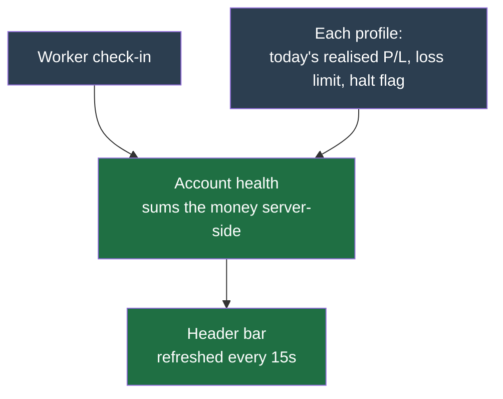

# Account health bar

The thin strip directly under the app header, on every screen and every device. It answers one question at a glance: **is my money OK right now?**

It is the one place that tells you the bot is alive, that nothing is halted, and what today has cost or made — without opening a profile or leaving the screen you are on.

## What each chip means

The bar shows only what needs your attention. On a healthy account it is a single green chip plus today's number.

| What you see | Colour | What it means | What to do |
| --- | --- | --- | --- |
| **Bot live** | green | The worker has checked in recently. Trading decisions are being made. | Nothing. |
| **Bot down — restart worker** | red | The worker has not checked in. **No coin is being traded**, and no strategy is watching your positions. | Restart the worker. See [Troubleshooting](../operations/troubleshooting.md). |
| **_N_ paused** | amber | _N_ profiles have hit their **daily loss limit** and stopped opening new positions for the rest of the UTC day. | Hover for which ones. Either accept it or review the limit on the profile's Risk tab. |
| **_N_ near limit** | amber | _N_ live profiles have lost **80% or more** of their daily loss limit but have not tripped yet. | Hover for the exact loss against the limit. This is your last warning before buying stops. |
| **Today +12.40 USDT** | — | Realised profit or loss booked since **00:00 UTC**, one figure per quote asset. | Nothing. This is the same number the daily loss limit is measured against. |

## The details that matter

**"Bot down" means trading has stopped, not that money is at risk of moving.** The worker is what places and cancels orders. If it is down nothing new happens — but orders already resting on Binance stay live and can still fill.

**"Paused" only ever means the daily loss limit.** It is the only breaker that stops buying. Two other automatic checks exist — config-proof and edge-decay — but they are advisory only: they raise a dashboard flag and a notifier message, and never appear here. A profile you stopped yourself with the [kill switch](../operations/kill-switch.md) does not appear here either; the dashboard shows that.

**"Today" is live money only.** If your account is on the Binance testnet, this figure stays hidden — practice profit is never shown as though it were real. It is realised P/L, so it moves when a position closes, not when the price moves.

**"Today" resets at 00:00 UTC**, not at your local midnight, because the daily loss limit uses the same window. If you are ahead of UTC, your morning reads against yesterday evening's trades.

**The bar refreshes every 15 seconds** and shows nothing at all until the first refresh lands, so it never flashes a verdict it has not confirmed.

## What it deliberately leaves out

Total account value and unrealised profit on positions you still hold are **not** here. They live in the dashboard's equity cards, which handle the full cash-plus-positions picture across multiple quote assets. This bar is the always-on glance; the dashboard is the full view.

Operational alerts that need to reach you when you are not looking at the screen — a failed job, the worker going dark — are sent by the [notifier](notifiers.md), not by this read-only strip.

If one profile's numbers cannot be read, that profile is left out of the bar rather than reported as healthy — a halt flag that failed to load is not evidence there is no halt.
