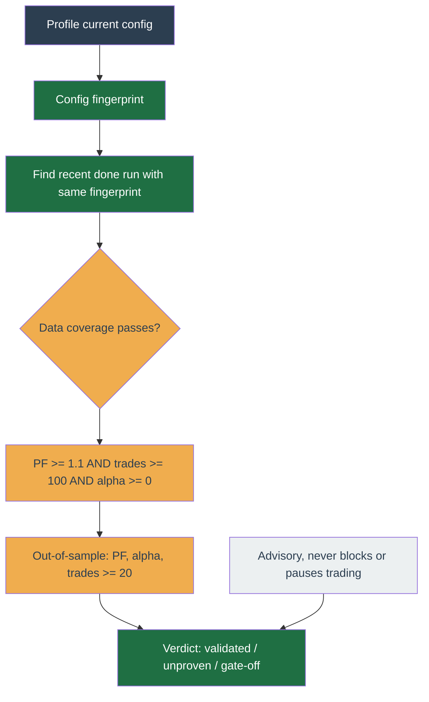

# Backtesting

Replays a profile's strategy over historical candles to estimate how it would have performed. This page explains **how the engine works** and the assumptions that make a backtest **optimistic relative to live trading**. Read the [disclaimers](#disclaimers-read-before-trusting-a-result) before acting on a result.

!!! tip "To run a backtest, use the profile's Backtest tab"

    Setting the window, costs, and strategy config, running, and reading the results
    are covered operator-first on the [Backtest tab page](../user-guide/profile/backtest.md).
    This page is the deeper reference behind that tab.

## Data flow

1. **Enqueue.** `POST /profiles/:id/backtests` validates the params, then computes the run's full backtest signature (strategy + effective config + market + fill model). If that signature matches the profile's most-recent `done` standalone run, the route returns that run with `deduped: true` and inserts nothing and enqueues nothing — an identical re-run resolves to the existing result instead of recomputing it. Otherwise it inserts a `backtest_runs` row (its `backtest_signature` left null; the worker stamps the executed signature at completion), enqueues a job keyed `backtest:<runId>` (BullMQ `jobId` coalescing dedupes a resubmit), and returns `deduped: false`. A create is never capped: every non-dedup run is accepted and queued. The worker runs one backtest at a time (single concurrency), so a burst resolves to one running run plus the rest waiting in the queue. The route returns `202` with the `runId` — the row is the durable source of truth.
2. **Backfill.** The worker ensures the `candles` store covers the requested range plus warm-up for every interval the run needs (the strategy interval, the finer `detailInterval`, and each technicals interval), then loads the window. The **strategy interval is the strategy's own `config.candleInterval`** — the same field the live worker derives its feed from (`feedIntervals` / tick-context) — so the backtest streams the interval the strategy actually reads (`market.candlesByInterval[candleInterval]`) and mirrors live. The request's `strategyInterval` param is advisory: the engine resolves the interval from the config, so a param that disagrees can never stream an interval the strategy does not read (which would feed it an empty window).
3. **Replay.** The engine streams the candles through `tick()` and the `BacktestExecutor`, threading per-symbol state forward.
4. **Persist + report.** Metrics are computed from the equity curve and trades; the run row is marked `done` with the `BacktestResult`. The web view polls the run (and consumes the `backtest-progress` / `backtest-complete` WS topics) and renders the equity/drawdown charts, trade list, and metrics.

### Run recovery: stuck-run sweep, abort, and retry

A run row is non-terminal (`queued`/`running`) until the worker writes `done`, `error`, or `cancelled`. A worker that dies hard (process kill / OOM) before its catch runs leaves the row `running` forever: it shows as running in the UI and, because the worker is single-concurrency, blocks every queued run behind it. Three mechanisms close that gap:

- **Periodic sweep** (`backtest-sweep` worker cron, every 15 min). Lists every non-terminal run older than a short age floor and reconciles each against its BullMQ job: a run whose job is gone or already terminal (`failed`/`completed`) has no live worker, so the row is marked `error`. A run whose job is still live (`active`/`waiting`/`delayed`/…) is left untouched, so a legitimately long backtest is never killed. This is the sole recovery path for abandoned runs.
- **Abort** (`POST /profiles/:id/backtests/:runId/abort`). Marks a queued/running run `cancelled`. The worker's mid-run status poll picks that up and stops a live job cleanly (`BacktestCancelledError`); a dead job has nothing to stop. This is the operator's instant override for a run the sweep would still treat as live (a job stays `active` while its lock is held, up to the 30 min lock duration). Frees the worker to pick up the next queued run immediately.
- **Retry** (`POST /profiles/:id/backtests/:runId/retry`). Re-runs a finished but not-`done` run's exact stored `params` as a fresh run (new id); the original stays as the historical `error`/`cancelled` record. Rejected with `409` for an in-flight run (abort it first) — that is the only guard; like a create it is otherwise uncapped and simply queues. The stored `params` are the original request, present even when the run never produced a result, so retrying a failed run needs no client state.
- **Delete** (`DELETE /profiles/:id/backtests/:runId`). Removes a finished run from the history (`204`). Refused with `409` when the run is still the profile's pinned baseline (un-pin it first — the FK is `ON DELETE SET NULL`, so deleting it would silently null the live-gate reference) or still in-flight (abort it first). The repo's `deleteById` is guarded to `done`/`error`/`cancelled` in the query itself, so an in-flight run is never deleted out from under its worker job; the UI hides the Delete control in exactly those three cases and confirms before deleting.

`markRunning` leaves a `done` **or** `cancelled` row untouched, so neither a BullMQ retry after completion nor a still-queued job picked up after an abort can resurrect a terminal run into a re-run.

The selected run is mirrored into the URL as `?run=<runId>`, so a finished run is shareable and reloadable by link: opening the deep link hydrates the Results view and seeds the Setup form from that run, exactly like clicking it in the history.

### Why the engine shares the live `Executor`

`BacktestExecutor` implements the same `Executor` contract the live worker uses, so a strategy's `Decision`s flow through **one** code path in both worlds. The strategy cannot tell it is being backtested, which is what keeps backtest and live from drifting. The engine likewise mirrors the live **fill-adopter**: after a fill it converges the plugin's position state via `strategy.position.applyFill` (weighted-average entry on a buy, reduce/empty on a sell), so a stateful strategy sees its own position on the next tick exactly as it would live. Without that, a strategy that reads `state.avgEntryPrice` would never learn it holds a position and would re-buy every candle.

## Candle store

Candles live in a TimescaleDB hypertable (`packages/db/migrations/0019_candles.sql`), keyed by `(symbol, interval, open_time)` and global (not account-scoped — public market data is shared across profiles). The backfill (`candle-backfill.ts`):

- Computes the **missing** sub-ranges via `repo.candles.findGaps` and fetches only those, paginated, from Binance's public klines endpoint — so a re-run over an already-covered range does no network I/O.
- Inserts with `insertNew` (insert-or-ignore on the primary key) — idempotent, never overwrites an existing candle.
- Shares the same Binance weight-governor as the rest of the worker, so backfill cannot starve live trading of rate budget.

Only **closed** candles are stored and replayed.

Backtest runs share one process-lifetime LRU of loaded candle windows, keyed by `symbol|interval|from|to`, so a window is backfilled and materialised once and reused across runs. A window is pinned only when its newest candle reaches the last closed bar: Binance returns the next available candle across genuine holes and an empty page only at true end-of-data, so a window that stops short means backfill bailed early (a transient empty page mid-gap). Pinning that sparse fetch would poison every later run; leaving it uncached lets a later run refetch the tail. Interior holes are kept — after a normal backfill they are genuine absence (delisting, halt) a refetch cannot fill, and the run's `dataWarnings` already flag them. The replay always uses the freshly-loaded window, so caching never changes a result.

## Fill model assumptions

The realistic model is `OhlcvFillModel` (Freqtrade-aligned). State these explicitly — they are where a backtest's optimism lives.

| Order | Fills when | At price | Fee |
| --- | --- | --- | --- |
| LIMIT | a detail bar trades THROUGH the limit (buy: bar low < limit; sell: bar high > limit) | the limit price (then half-spread haircut), even if the bar gapped past it | maker |
| MARKET | immediately on the next bar | bar open shifted by slippage, then half-spread haircut | taker |
| STOP_LOSS_LIMIT | arms once a bar reaches the stop (sell: low ≤ stop; buy: high ≥ stop), then fills the first time a bar trades THROUGH the limit; a bar that gaps clean past the limit rests UNFILLED | the limit price (then half-spread haircut); no slippage — a triggered limit fills at its rate, not the stop | taker |

- **No same-candle fill.** An order placed on candle _N_ rests and is first evaluated against candle _N+1_ — see [look-ahead safety](#look-ahead-safety-warm-up).
- **Spread haircut.** `spreadBps` (set from the form, default 5; omit to disable) charges half the bid/ask spread on **every** fill, LIMIT included. A candle-level backtest otherwise fills a resting limit at exactly its price with no adverse selection, overstating a maker strategy's edge.
- **Trade-through, not touch.** A resting LIMIT fills only when a bar trades strictly _through_ its price (buy: low < limit; sell: high > limit), not on a mere kiss of the level. A maker order at the back of the queue is not guaranteed a fill when price only touches its level, so requiring a trade-through models queue non-fill instead of handing every touch a free fill (audit F6). A STOP*LOSS_LIMIT \_arms* on a touch — a stop is about being reached — but once armed it is a resting limit and fills only on a trade-through of its limit, so a bar that gaps clean past the limit leaves it resting unfilled (the real tail risk that a protective stop can fail to protect, or a grid stop-limit fail to enter).
- **Volume-participation cap.** `volumeCapPct` (set from the form, default 5; blank to disable) limits a single fill to that percentage of the filling bar's base volume; the remainder rests and works across later bars. For a MARKET order that means the remainder fills at successive future candle opens (a VWAP-over-time approximation), not one price — acceptable because it only triggers when an order exceeds the cap on a thin bar. On a zero-volume bar the order does not fill (`rejected: liquidity`). Small orders on liquid bars are unaffected — the cap only bites a large order on a thin bar.
- **Defaults are form-only.** `spreadBps` and `volumeCapPct` carry no schema default; the backtest form seeds spreadBps=5 / volumeCapPct=5, so a run is scored under a realistic fill model rather than free, zero-spread fills. The contract leaves both `nullish`, so a caller that omits them — a run created before realism shipped, re-run or cloned, which serialises them as JSON null — gets no spread and no cap and reproduces byte-for-byte.
- **Filters enforced.** `stepSize` / `tickSize` quantisation, `minQty`, and `minNotional` are checked; a sub-notional order is **rejected**, not silently shrunk. A buy the quote cannot fund at the ORDER price, or a sell larger than the held base, is **rejected whole** — as Binance rejects an underfunded order (-2010) at placement — not partial-filled. Only the volume cap, or the spread haircut shaving the last sliver of an all-in buy funded at its limit, shrinks a funded order to a `partial`.
- **Resting orders lock funds.** When an order goes on the book its committed funds move `free → locked`, exactly as a live exchange holds them: a resting BUY locks the quote notional plus fee at the order price, a resting SELL locks the base quantity. The lock releases on fill (the actual cost leaves `free`, any over-lock returns) or on cancel. This stops a portfolio run from spending the same cash to back two resting orders on different symbols — the executor can only lock what the account actually holds, so an order the balance cannot fund at its order price is rejected when it next crosses rather than double-spending. Inert for a single-symbol run whose order fills on the next bar before another symbol's tick reads the account, so it leaves such results unchanged. (A LIMIT and a STOP_LOSS_LIMIT buy both fill at the order price, so the lock — sized at that price plus the half-spread the fill charges — matches the deduction exactly; any over-lock returns on fill.)
- **Timeframe-detail.** The fill model crosses orders against the finer `detailInterval` bars in time order, which narrows the intra-candle ordering bias. The worker backfills and loads the `detailInterval` series alongside the strategy interval (the config's `candleInterval`, per step 2) and groups each finer bar under the coarse candle whose span contains it (`buildTickSeries` → `mergeCandleTicks` attach them to each tick). `buildTickSeries` attaches the detail series only when it is strictly finer than the strategy interval — a coarser series would let a fill read price past the strategy candle's close (lookahead), so it is dropped and fills fall back to the coarse candle. `detailInterval` is schema-constrained to be finer than or equal to the strategy interval; when equal, the coarse candle is the only bar and fills are coarse-candle realistic — the run then surfaces a `dataWarning` that intra-candle fill ordering is assumed favorably, so a grid buy-low → sell-high round-trip inside one bar may be slightly optimistic. Even with detail bars the bias is narrowed, not eliminated — the true tick-by-tick path inside a detail bar is still unknown. A detail bar is assigned to the coarse candle whose span contains its open time. When the detail interval does not evenly divide the strategy interval (e.g. `3d` under `1w`), a detail bar can open inside one coarse span and close past its boundary; it is still attributed to the span it opened in, so prefer an evenly-dividing pair for the tightest fidelity.
- **Liquidity is infinite at the fill price beyond the volume cap** and **latency is not modelled** — both inherent to candle-level replay. With a `volumeCapPct` set, a fill is bounded by the bar's volume, but the price itself still assumes depth at the touch.

`IdealFillModel` (immediate fill at the order price, no slippage) exists for unit tests and smoke runs; production runs use `OhlcvFillModel`.

## Look-ahead safety & warm-up

- **Closed candles only, signal _N_ → fill _N+1_.** A tick sees only closed candles, and an order it places cannot fill on the candle that produced the signal. The strategy can never act on information it would not have had live.
- **Warm-up.** The runner prepends `WARMUP_CANDLES = 200` candles (enough for the longest indicator period, e.g. EMA200) before the requested window via `startupCandleCount`, so the first **traded** candle already has valid indicators. Warm-up candles advance state and indicators but do not trade.
- **Per-interval indicator snapshots (stateful, carried like live).** The engine populates `market.indicatorsByInterval` each tick via a stateful `createSnapshotComputer` (`snapshot-computer.ts`), reusing the same incremental indicators the live worker uses. This is required for parity: a profile that arms the operator `indicatorGate` (RSI ceiling / SMA / EMA bias) reads `market.indicatorsByInterval`, and without it the gate would fail closed with `indicator-unavailable` on every tick — a profile that can never trade (or pass the live-enablement gate) in a backtest. During warm-up the snapshot fields are `null` (window shorter than the indicator period), exactly as live on a cold start. The computer **carries each (symbol, interval) indicator state forward one candle at a time** (`update`, O(1) per tick), exactly as the live `indicator-computer` does, instead of re-seeding the whole rolling window every tick (which was the single dominant per-tick cost — a 5m × 1-year run roughly halves). The full-window re-seed (`computeIndicatorSnapshot`, `offline-market.ts`) remains as the reference the computer is verified byte-identical against while the window only grows. **Re-baseline note:** once the window slides past the point where the engine caps the indicator window, the carried value keeps all history (matching live), whereas the old per-tick re-seed dropped candles older than the cap. So a run **longer than 1000 candles** now produces slightly different `ema20`/`rsi14` — closer to live, occasionally a different trade. The golden fixture (< cap) is byte-identical; existing pinned baselines and gate-clearing runs longer than 1000 candles should be re-run. (The auxiliary daily-regime window has its own smaller cap, `REGIME_WINDOW_CAP = 250`, so its `'1d'` snapshot diverges at about 250 daily candles — but TT reads only the streamed trading interval's snapshot and the daily candles directly, never the daily snapshot's MA/RSI, so that divergence is value-only and flips no trade.)
- **Progress is phase-aware, not a bare percent.** The runner emits a phase with every progress update — `backfill` (loading each symbol's price history), `warmup` (feeding the 200-candle indicator window, no trades yet), `replay` (the strategy tick loop), `finalize` (computing metrics) — alongside the percent. The percent is computed against **tradeable ticks**, not raw candles (`tradeableTickCount`): the first 200 candles per symbol fire no tick, so a warm-up-dominated short range (e.g. a few months of `1d` candles) would pin a raw-candle percent near 0% and look wedged. Announcing the `warmup` phase up front fixes that — the UI shows "Warming up indicators" instead of a stuck 0% bar — and `replay` carries `processed`/`total` tick counts ("candle X of Y") plus a client-side ETA anchored on the first replay frame. If warm-up consumes _every_ candle (zero tradeable ticks), the run fails fast with a clear message rather than completing with a silent empty result.
- **Live overlay vs durable row.** The worker pushes each update as a `backtest-progress` WebSocket frame (low-latency overlay) and also writes `progress` + `progress_detail` to the run row (the durable source of truth), so a fresh page load shows the last phase before the first frame arrives; `backtest-complete` tells an open UI to refetch the finished result.

## Technicals freshness: a healthy signal pipeline is assumed

The live buy gate ages each Technicals signal against `useOnlyWithinMin` and vetoes a stale one (`technicals-stale`). That staleness only arises from an **operational** fault: the `technicals-compute` cron stalling so Redis signals are not refreshed. Under healthy operation the cron continuously recomputes and re-stamps each interval, so a signal is at most one technicals-interval old.

The backtest stamps each interval's signal at the most recent technicals candle closed by the tick, so its age stays within one technicals-interval too, matching the live signal's own bounded staleness. This is **intentional parity with healthy operation** — a backtest measures strategy behaviour, not cron uptime, so it deliberately does not model signal-pipeline outages. The freshness veto is an ops concern surfaced by monitoring, not a market condition to simulate.

## Metrics & results

Every metric a run reports, the results-page diagnostics (the why-it-traded funnel, the deterministic diagnosis spine, the LLM advisor, the live-gate scorecard), and the `regimeBreakdown` / `outOfSample` / `roundTrips` drill-down fields have their own reference: **[Backtest metrics reference](backtest-metrics.md)**. Read alpha vs hold and the out-of-sample hold-up first — see [What counts as success](#what-counts-as-success).

## Live vs backtest baseline

A backtest only matters if live trading reproduces it. A profile can **pin a finished run** as its baseline (`profiles.baseline_backtest_run_id`, set from the Backtest screen's "Pin as live baseline"; the API rejects a run that is not this profile's or not `done`; the FK `ON DELETE SET NULL` auto-unpins if the run is deleted). The dashboard's **Live vs backtest** card — inside the overview's collapsible live-health strip, expanded on demand — then shows the live win-rate, profit factor, expectancy, and max drawdown over all closed trades, and beside them the **win-rate and profit factor of the pinned backtest**.

Only **win-rate and profit factor** are compared, because they are **scale-invariant** — they hold across the backtest's `initialQuoteBalance` and the live account's real (different) capital. Absolute expectancy, P&L, and drawdown are shown for live only and are **never differenced against the backtest**: an average-profit-per-trade or drawdown in quote depends on position size, so comparing them across different capital is meaningless. Even the win-rate gap is a percentage-point delta (additive); the profit factors are shown side by side without a delta, since a _difference_ of ratios is not meaningful.

### Run lineage & comparison anchors

A re-run records where it came from. When the operator adjusts a run's config and re-runs, the new run stores `backtest_runs.parent_run_id` pointing at the run its Draft forked from. The FK is a self-reference on `backtest_runs(id)` with `ON DELETE SET NULL`: deleting a parent does **not** cascade-delete its children — it just nulls their pointer, so a child run survives with no lineage. A non-owned or unknown `parentRunId` on a create is dropped to null (the account boundary is enforced in the API, not by the FK), and a dedup hit reuses the existing run rather than stamping new lineage.

The Backtest results header offers up to two **comparison anchors** for the viewed run: **Parent** (the run it forked from, via `parent_run_id`) and **Baseline** (the profile's pinned `baseline_backtest_run_id`). It defaults to Parent and falls back to Baseline when there is no parent; a run is never offered as its own anchor. Selecting an anchor shows signed deltas (`viewed − anchor`) for total return, alpha vs hold, and max drawdown. Drawdown is signed (`≤ 0`), so a less-negative delta is an improvement and tints green, the same higher-is-better direction as return and alpha.

Deltas are only shown when the two runs are **comparable**, decided by the pure `sameMarket(a, b)` helper (`@app/contracts`). Two runs are comparable when they match on all 12 **market dims**: symbols (order-insensitive), `fromMs`, `toMs`, strategy interval, detail interval, maker/taker fees, slippage, spread, volume cap, discovery mode, and initial quote balance. `strategyConfigOverride` is deliberately excluded — changing the config is exactly the A/B the comparison measures. When the anchor differs on any market dim the header shows **"Not comparable — different market window."** and no deltas, because a return or drawdown gap across different windows or cost models reflects the world, not the config change.

## Live-enablement edge gate

Closing the loop: a profile's most recent backtest — run on its **current** config — is checked against net-of-fee thresholds and the verdict is surfaced on the dashboard **Live-gate** card. The check is **advisory**: enabling a profile in `live` mode is **never blocked on backtest quality**. The admission guard (`assertLiveEnablementAllowed`, `apps/api/src/enablement-gate.ts`) is synchronous and refuses exactly one thing — a **structurally unrunnable** profile whose strategy is unknown/unregistered (it would enable and then go dark at tick time), rejected up front with `VALIDATION_FAILED`. It never consults backtests. The threshold measurement below is the discipline the honest-measurement work exists to surface; it is **purely advisory** — it feeds no runtime lever and never pauses buys.

- **Config provenance.** Each completed run stores `backtest_runs.config_fingerprint`, a stable hash (`configFingerprint`, `@app/strategy-core`) of the EFFECTIVE merged config it executed (profile config + run override). The gate fingerprints the profile's current config and looks for a recent `done` standalone run with the same fingerprint, so a backtest counts as proof only for the config it tested. Change the config and the old proof stops matching — re-run the backtest. The Backtest screen seeds the config form from the live config; editing it drifts the fingerprint, and a **Reset to current live config** button (shown only once the form drifts) restores the saved values. Because the gate is advisory, a fingerprint-matching run is never required to enable — it is consulted only to render the card. Only standalone backtests run on the live config count as proof; a run made with a config override tests a different config, so its fingerprint will not match the live config.
- **Dedup key vs proof key.** A run also stores `backtest_runs.backtest_signature`, a broader hash (`backtestSignature`, `@app/strategy-core`) over the strategy, effective config, market (symbols and window), and fill model, stamped at completion from the config that actually ran (never at enqueue, so an edit in the enqueue to pickup window cannot leave the row naming a config it never ran). This is the **dedup** key the enqueue step matches to short-circuit an identical re-run. It is distinct from `config_fingerprint`, the **live-gate proof** key, which covers only the config and answers "is the live config one a backtest proved". A signature match means "this exact backtest already ran"; a fingerprint match means "a backtest proved this config". The signature is structural: its value depends on the exact shape hashed, so changing what the market projection emits rotates the whole signature space. Signatures stamped before such a change no longer match any newly computed one, so they go inert (a dedup miss, never a wrong hit) and self-heal as runs re-stamp. There is no backfill.
- **Thresholds** live in `profiles.enablement_policy` (a per-profile `EnablementPolicy`; null = contract defaults): net profit factor ≥ `minProfitFactor` (1.1), closed trades ≥ `minTrades` (100), alpha-vs-hold ≥ `minAlphaVsHoldPct` (0), and the matching run within `maxBacktestAgeDays` (14). `minTrades` is 100 because a profit factor over a tiny sample is noise — a config with no edge clears 1.1 over a handful of trades by luck; 100 is a practical floor, not a significance guarantee. Data coverage is enforced first as a hard pass/fail (its own bullet below).
- **Out-of-sample** (`requireOutOfSample`, default on): the edge must ALSO clear `minProfitFactor` and `minAlphaVsHoldPct` in the backtest's holdout (the most-recent 30%, computed by the engine), and the holdout must hold at least `minOutOfSampleTrades` (20) trades — surfaced as three separate holdout rows (trades, profit factor, alpha), each of which can fail the gate on its own. This is the real defence against curve-fitting a single window — the full-run trade count alone is not. A run with no holdout (too short, or persisted before the field shipped) fails with a single "missing" row; re-run the backtest. The same `gateThresholdChecks` emits these rows, so the admission gate and the backtest scorecard show them identically.
- **Data coverage** is the first criterion: a run whose result carried any coverage warning (a sparse symbol — halt, delisting, or thin liquidity) fails closed, because metrics computed on holed data are not trustworthy no matter how good the numbers read. Warnings come from `dataCoverageWarnings`, which flags both an aggregate shortfall (below 95% of expected candles) and a single large contiguous gap (≥ 12 bars) — so a mid-window halt that hides under the aggregate floor in a long window is still caught. The gate check is keyed on `dataWarnings` being empty; legacy/absent values pass so runs predating it are not retroactively blocked.
- `enabled: false` turns the threshold measurement off — a deliberate, visible opt-out edited in the profile's **Live gate** dialog, never a silent bypass; the card then reads gate-off. There is **no runtime lever**: a failing config is only ever surfaced on the Live-gate card, never paused. The gate never blocks enabling and never pauses buys.
- **Scope.** Only the structural admission guard runs at enable time, and it guards `live` only; `test`-mode profiles enable freely. It runs in the API at both enable entry points: `POST /profiles/:id/start` evaluates the persisted profile, and a `PATCH` evaluates the post-patch state whenever the result would be live + enabled and the request touches a risk-bearing field (newly enabling, the mode, or the config). A registered strategy always passes; an unknown/unregistered strategy is refused with `VALIDATION_FAILED`. Backtest quality is never evaluated here — a failing config enables and simply surfaces on the Live-gate card.

## Config-proof status is advisory-only

The gate above never pauses trading — it only surfaces a verdict on the card. The config-proof check (`GET /profiles/:id/gate-status`) re-runs the same `evaluateBacktestGate` (`@app/contracts`, shared with the admission guard so the card and the guard can never disagree) on the current config and renders one of: validated, unproven (a heads-up — trading continues), or gate-off. It answers the _admission_ question — "is this config proven at all" — for the dashboard only. There is **no worker cron and no Redis flag** behind it: an unproven live config is flagged, never paused. The edge-decay monitor (below) is the separate, also-advisory watch of realized PF vs a **pinned baseline** after going live. Nothing renders for testnet profiles; the card polls 30s.

## Live edge-decay monitor

The enablement gate checks the edge **at enable-time** (advisory, never blocking). A config whose edge decays after going live kept deploying real capital until an operator happened to read the scorecard. The `edge-decay-monitor` worker cron closes that hole with an **advisory heads-up**: every 15 minutes it recomputes each **live** profile's realized net profit factor over all closed trades (the same window the scorecard shows) and compares it to the profit factor of the profile's **pinned baseline backtest** (`baseline_backtest_run_id`).

- **Verdict.** `assessEdgeDecay` (`@app/contracts`, pure) classifies the live PF against `baseline × warnFactor` / `baseline × breachFactor`, with an absolute floor (live PF < 1 = net-losing) that breaches regardless of baseline, and a `minTrades` sample floor below which it stays `insufficient-data`. The **web scorecard calls the same function** to render its badge, so the displayed verdict and the alert can never disagree.
- **Policy** lives in `enablement_policy.monitor` (`EdgeMonitorPolicy`): `mode` (`off` | `warn`, default `warn`), `minTrades` (10), `warnFactor` (0.85), `breachFactor` (0.6), edited in the **Live gate** dialog. `warn` flags the verdict on the dashboard and sends a heads-up notification; the monitor never pauses buys.
- **Action.** On a `breached` verdict the cron sends the operator a one-time Slack heads-up (`edge-decay-warning` notify category) and sets the per-profile `edgeDecayNotified` Redis latch to de-dupe the alert to once per decay episode. The latch is cleared when the edge recovers, so a later re-decay re-alerts. The tick handler **never reads this latch** and the monitor **never suppresses buys** — it is advisory only. (The daily-loss breaker is the sole runtime pause.)

## Disclaimers (read before trusting a result)

A backtest **overestimates** live performance. The results view repeats this; it is stated here so the architecture and the UI agree.

- **Idealized fills** — limit orders fill at the order price (less the half-spread), market at the candle open; a live order faces a moving book. A `STOP_LOSS_LIMIT` (a grid stop-limit entry or a protective stop) is modelled as Binance runs it: the stop only ARMS a limit order at its limit price, so once armed it fills at the limit — and a bar that gaps clean PAST the limit leaves it resting **unfilled**, exactly as a real stop-limit does. That is the tail risk a naive stop-market model hides: a protective stop can gap through its limit and never protect, and a grid stop-limit can gap through and never enter. The `spreadBps` haircut and `volumeCapPct` participation limit make fills pessimistic, but only to the extent the operator configures them — a run that leaves either unset (a legacy run cloned before the knob existed) fills frictionless and raises a `dataWarnings` flag so the rosier number is not read as clean.
- **Survivorship bias** — a symbol delisted, halted, or thinly traded mid-window has missing candles, so a basket backtest silently leans on the symbols that traded the whole time. The runner flags any symbol whose strategy-interval coverage falls below 95% of the range (`dataWarnings`, surfaced as a banner on the result); it does **not** reconstruct the missing history.
- **Unknown intra-candle path** — only OHLC is known, so the sequence of prices within a bar is assumed.
- **Assumed liquidity** — infinite depth at the fill price; a real fill walks the book.
- **No latency or order-book depth** — neither is modelled.
- **Tick price is the closed-candle close** — the strategy's own `currentPrice` (the price its exit and trailing-stop gates read inside `tick()`) is the last closed candle's close. Live feeds those same gates a mini-ticker price that is about 1 s fresh, so an exit or stop can trip up to a full candle sooner live than in the backtest. Fill _prices_ are unaffected (they come from the OHLC bar); only the strategy's price-gated timing shifts. Inherent to candle replay.
- **Account modelled as dedicated to the profile under test** — the cross-profile exposure total (`deployedQuoteAcrossProfiles`, which feeds entry sizing and the account cap) sums only this run's positions. Live sums across every profile sharing the same account + quote asset, so on a multi-profile account the cap is _more permissive_ in backtest. Sibling profiles' positions over a historical window are unknowable, so the run treats the account as this profile's alone — the correct reading of "how does this strategy do with the whole account." The `binanceMode` is likewise fixed to `test`; no strategy branches on it, so it is inert.
- **Over-fitting risk** — parameters tuned to one history rarely generalise.
- **Discovery mode is additionally optimistic** — with `discoveryMode` set, every symbol is treated as discovery-managed for the whole window: entries are marked `discoveryEntry`, so exits go through the trail / hard-stop / time-stop only and the technicals force-sell is skipped, matching the live discovery-entry exit regime. Discovery ADD/REAP timing is **not** modelled (a symbol stays managed once entered), so the result is an upper bound on that regime. It also requires a configured `sell.stopLossPercentage`: without one, every entry is blocked (`discovery-no-stop`) and the run reports no trades.
- **Past ≠ future.** Historical performance does not guarantee future results.

## What counts as success

A green total-return number is not success. In a spot, long-only account the bot holds cash between entries, so it structurally under-participates in a rising market: beating buy-and-hold is the bar, not beating zero. Read a result in this order:

1. **Alpha vs hold (`alphaVsHoldPct`)** — return beyond simply holding the basket, net of fees. Negative alpha means holding would have done better; the strategy subtracted value even if the headline return is positive.
2. **Out-of-sample hold-up** — that alpha must survive on data the tuning never saw (the `outOfSample` holdout here). In-sample alpha alone is a curve-fit, not an edge.
3. **Then** the risk-adjusted ratios and drawdown, to prefer a steadier path among configs that already clear 1 and 2.

If no config clears 1 and 2 on held-out data, the honest reading is **no demonstrated edge**, not "tune harder". For an operator who cannot reach edge-bearing venues (for example futures funding-carry, which is unavailable in some jurisdictions), the bot's defensible value is **disciplined, risk-controlled accumulation**: removing emotional mistiming and enforcing exits, measured against the operator's own discretionary baseline rather than against alpha the spot-only mandate cannot produce. The live-enablement gate, the edge-decay monitor, and the capital-safety halts exist to hold that discipline, not to manufacture an edge.

## For contributors

Where the engine code lives and the one recorded deviation from the repo's charting default are in **[Backtesting internals](../contributing/backtesting-internals.md)**.
