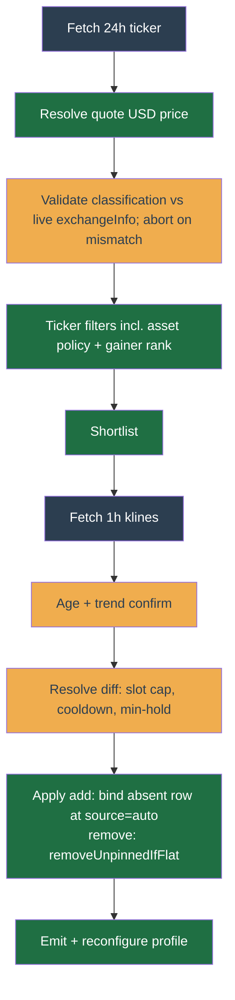

# Auto-discovery (dynamic symbol rotation)

Discovery lets a profile **auto-add coins entering a bullish move, trade them for a quick profit, then auto-drop them when the move fades** — without you hand-picking symbols. It is **off by default** and set **per profile**: a profile that has never enabled it is never touched.

Discovery only chooses **which coins the profile watches**. It never decides when to buy or sell — that stays with the profile's strategy. So a coin discovery adds can sit unbought if the strategy's own buy gates disagree.

## Configuration

Every field of the Discovery section, with what it does, what you can set, and what changes when you do. This is generated from the same schema the section renders, so it always matches what you see on screen.

--8<-- "docs/\_generated/config/discovery.md"

### A worked example

A cautious rotation on a USDT profile, roughly the settings to start from:

| Setting | Value | Why |
| --- | --- | --- |
| `maxAutoSymbols` | `3` | Small enough that each position still clears the exchange minimum. |
| `min24hAssetVolumeUsd` | `50000000` | Keeps discovery in genuinely liquid coins. |
| `min24hPairVolumeUsd` | `500000` | The market you would actually trade has to be liquid too. |
| `maxSpreadRatio` | `0.003` | About 0.3% round-trip cost from spread alone — already meaningful. |
| `rankTopPercent` | `30` | Only the better-performing third of the universe is considered. |
| `rankExcludeTopPercent` | `5` | Skip the day's hottest movers, which have usually already run. |
| `marketBreadthMinPercent` | `45` | Stop adding coins on days the whole market is falling. |
| `minHoldMinutes` | `120` | A coin cannot be added and dropped within two hours, cutting churn. |
| `correlation.maxPairwise` | `0.8` | Three coins that all move together are one bet, not three. |
| `enterOnAdd` | off | An added coin still has to pass the strategy's own buy gate. |

What happens with those settings: every 15 minutes the scan ranks the USDT universe by 24h gain, drops the top 5% and everything below the top 30%, then applies the liquidity, spread, age, and trend filters. If fewer than 45% of coins are up on the day, no new coin is added at all. Survivors that are not too correlated with what you already hold are added, up to three at a time. Each new coin then waits for the strategy's normal buy conditions before any money is spent, holds for at least two hours, and is dropped once it is flat and no longer qualifies.

> The **quote currency** is not a discovery-config field. It is the first-class per-profile `profiles.quote_asset` column (default `USDT`), operator-settable on the profile's Profile settings page and live-reloaded by the cron each tick (a change clears the per-profile refresh gate so the new quote takes effect within about 60s). Discovery filters eligible symbols by it; the balances panel denominates its estimated value in it. Existing positions in the old quote are kept (the reap held-skip), not force-sold, on a change.

The tuning fields fall into a few groups:

- **Liquidity & activity floors.** `min24hPairVolumeUsd` is the **executability floor** (USD): the traded pair's own 24h volume, converted from the quote asset, guarding slippage — set it low, since a BTC-quoted book is a fraction of the same coin's USDT book. `min24hAssetVolumeUsd` is the **activity floor** (USD): the coin's 24h volume on its USDT market whatever quote the profile trades, guarding dead microcaps — set it high; a coin with no USDT market fails closed. Why two floors and not one is under [Quote-asset invariance](#quote-asset-invariance).
- **Spread.** `maxSpreadRatio` caps the bid/ask spread as a fraction of mid.
- **The gain band.** `changeMinPercent` is a hurdle on the 24h move against the quote (`0` = "beat the asset you hold when flat"). `rankTopPercent` / `rankExcludeTopPercent` keep a cross-sectional gain band: the top slice of the quote universe by 24h change, skipping the hottest few percent as blow-offs. `marketBreadthMinPercent` is a risk-off breadth guard (`breadthOk`): unless at least this share of the quote universe is up over 24h, no new coins are added this cycle (held coins untouched).
- **Confirmation.** `trendConfirm` is the confirmed up-move gate on the 1h trend — an ADX strength floor, a price-above-EMA check, and a volume-participation check.
- **Holding & rotation.** `maxAutoSymbols` caps concurrently auto-held symbols; `minHoldMinutes` doubles as the min-hold-before-reap and the re-add cooldown; `refreshPeriodMs` sets how often a profile is scanned; `minAgeDays` sets the minimum kline-history age (capped at 40 — age reads from the oldest candle of the 1h trend window, which Binance bounds at about 1000 candles, roughly 41 days).
- **Entry mode & guards.** `enterOnAdd` is the opt-in entry mode (see [Entry mode](#entry-mode-enteronadd)); its guards apply only to an `enterOnAdd` entry: `entryGuard.maxDistanceFrom24hHighPercent` is the anti-chase guard, `entryGuard.knifeCandles` / `knifeDropPercent` the falling-knife guard, and `correlation.maxPairwise` / `lookbackCandles` the correlation cap that stops the auto-set from being one beta factor held many times.

> **Terms.** _ADX(14)_ — Average Directional Index over 14 candles, a 0–100 trend-strength gauge; above 25 means a genuine trend rather than chop. _EMA20 / SMA20_ — the 20-candle exponential / simple moving average, a smoothed price line the current price sits above or below. _blow-off_ — a near-vertical, over-extended spike that usually reverses, so the hottest few percent of gainers are skipped rather than chased. _beta factor_ — one underlying market move dressed up as several coins; the correlation cap stops the auto-set from being the same bet held many times.

## Cron flow

The cron self-reschedules on a small base period (60s); each profile's own `refreshPeriodMs` gates whether it actually runs that tick, via a Redis last-run key. Per enabled, due profile:

1. Fetch the all-symbols 24h ticker once (`GET /api/v3/ticker/24hr`, weight 80), resolve the quote asset's USD price from that same payload, map to the configured quote universe, and run the cheap ticker filters + gainer ranking to a shortlist. Pricing tries both listing directions: `<quote>USDT` for crypto quotes (`BTCUSDT`), then the reciprocal of `USDT<quote>` for the fiat quotes Binance lists inverted (`USDTTRY` — there is no `TRYUSDT`), and 1 when the quote is USDT itself. A quote asset with no USD reference market either way round fails the cycle loudly rather than scanning against an unknown scale. Base and quote come from the symbol's cached exchangeInfo row, never from slicing the quote off the symbol name — the suffix rule is wrong whenever one listed quote is a proper suffix of another (under quote `USD`, `BTCFDUSD` slices to a base of `BTCFD`, which exists nowhere). The quote-matched set is then cut to what this account can actually trade: the symbol's cached exchangeInfo `status` must be `TRADING`, and the account's Binance permission tags must satisfy the symbol's `permissionSets` (Binance grants tradability only when the account holds at least one tag from **every** published set). Tokenized-equity pairs publish sets an ordinary spot key pair does not hold, and Binance refuses every order on them with `-2010 This symbol is not permitted for this account.` permanently, so one auto-bound coin re-sends the same refused entry each tick until the account's request-weight budget is gone. An unreadable permission list still fails open, disabling only that cut — an unknown is not a refusal. An unprimed symbol cache does not: with no exchangeInfo map there is no status cut, no base/quote split, and no asset to classify, so the profile is skipped this wake rather than scored against the raw ticker feed. The quote-matched set then runs one more non-configurable stage, `assetPolicy`, before any ranking, which drops any coin whose base asset Binance currently classifies a stablecoin or a fiat currency. It has no setting and no blocklist entry, because a peg is a fact about the asset rather than an operator preference: discovery ranks 24h gainers, and a pegged coin's ordinary peg noise clears an inclusive `changeMinPercent >= 0` hurdle, so it enters on no signal at all. The classification is read from Binance's own product metadata (`GET https://www.binance.com/bapi/asset/v2/public/asset-service/product/get-products?includeEtf=true`) behind a five-minute per-process snapshot shared by every profile and by the diagnosis re-probe, so a wake with nothing due fetches nothing. Two disjoint routes feed it, and they read opposite sides of a row: the `stablecoin` tag classifies the row's BASE asset, while a `FIAT` parent-market marking classifies its QUOTE. The quote side is the fiat leg — `ADAEUR` is ordinary ADA priced in euros, so reading its base would veto hundreds of tradable coins. Neither route is redundant: `EURUSDT` carries no tags at all, so EUR is reachable only through the second, and a stablecoin listed solely against USDT is reachable only through the first. The tag match is case-folded, because the feed's tag vocabulary is undocumented and already mixes conventions inside one payload, so a capitalisation change upstream would otherwise silently drop the whole tag route. Before any of it is allowed to veto, two things are checked. Each route must have classified something ON ITS OWN — the load-bearing rule, because the fiat route alone always yields a dozen national currencies, so a merged "did we classify anything" floor stays satisfied while the stablecoin route is dead and every peg on the exchange becomes admissible under a policy that still reads healthy. Then the fetched symbol set is cross-checked against live exchangeInfo in both directions. That second check is bounded by SHARE, not by exact equality: the product snapshot and the exchangeInfo cache both live five minutes and refresh independently, so every listing, delisting and halt puts them out of step for up to that long, and one halted pair must not take discovery down for every profile — including its reaps — until both caches turn over. A disagreement past two percent of the live set is the gutted-or-renamed-feed shape and aborts the profile cycle with no add and no remove, because a classification that silently degrades to "nothing is a stablecoin" reads exactly like a working one. A disagreement below it is per-symbol churn: those symbols alone are refused, cut on the `assetPolicy` rung rather than dropped without explanation, because "we do not know yet whether this base is pegged" is not a reason to admit it. The completeness check skips symbols the bot cannot represent at all: Binance lists CJK-tickered pairs the exchangeInfo refresh already drops, and demanding they appear on both sides would abort every cycle forever over a pair discovery could never bind. Manually adding such a pair to a **live** account is refused at the API with a 422 naming the permissions the symbol needs and the ones the key pair has. Testnet accounts skip that check, because the symbol picker behind it is operator-global and live-pinned, so a testnet key pair's tags would be compared against a live symbol's sets. A symbol bound before the account held its current permissions is caught on the other side, at order placement: the worker re-reads both the symbol's sets and the account's tags from cache before signing, and refuses the order at **zero request weight** rather than spending a call on a rejection it can predict. That refusal alerts once per hour per symbol. The binding does not sit there forever, though: the next tick for that symbol retires it — a flat, auto-discovered binding is reaped outright, while a held or operator-pinned one is left in place, keeps ticking, and gets its own hourly warn naming the sell-down or unpin the operator must do. See [Unpermitted-symbol self-heal](../architecture/reliability.md#unpermitted-symbol-self-heal).
2. Fetch 1h klines for the selected targets — every held auto symbol still in the shortlist, plus the top-ranked non-held candidates capped at `3 × maxAutoSymbols` — and run the age + trend-confirm filters. Only these targets count toward the funnel's `probed`.
3. Resolve the desired auto-set against the current one (slot cap, re-add cooldown, min-hold-before-reap) into an add/remove diff.
4. Apply: add → upsert `source='auto'` (unpinned); remove → `removeUnpinnedIfFlat`. Emit an action-log event and a best-effort Slack push per change, then enqueue one `reconfigure-profile` resync so the worker ticks the new set. The cron also writes two WARN lines when state has drifted. `Discovery re-added <symbol>` means a binding row was silently lost and has now been healed by re-adding the coin. `Discovery membership lost <symbol>` means a coin left the auto set without a normal removal; the cron cleans the orphaned tracking entry so this warns exactly once, not every cycle.

**Fail-safe.** Every per-profile cycle is wrapped so any fetch/parse/apply error leaves that profile's symbol set untouched (no churn on bad data) and never aborts the other profiles. A malformed `discovery_config` parses to disabled.

**One class of failure is about the classification itself, and is counted separately.** The generic catch receives Binance timeouts and Redis blips raised elsewhere in the cycle, which say nothing about the policy. The handler reports an empty active-mode admission map directly before profile execution; other asset-policy aborts are thrown as `AssetPolicyAbortError` carrying a closed `cause` and handled by type rather than by message text. Both paths add a positive increment to `discovery_asset_policy_abort_total{profileId,cause}`, while generic failures add none; every due cycle still zero-seeds each cause so the first abort is observable. That separation makes the `DiscoveryAssetPolicyAborting` rule alertable on its own. The cause is labelled because the refusals need different responses: `no-product-rows`, `stablecoin-route-empty` and `fiat-route-empty` mean the product feed changed shape or renamed a key and the projection needs updating; `cross-check-gap` means the feed disagrees with live exchangeInfo in bulk, which a stale feed causes and often clears by itself; `empty-admission-map` means this worker has no exchangeInfo cached, which the exchange-info-refresh cron repairs; `product-feed-unreachable` means the fetch never got an answer (a transport failure, the 15-second timeout, or a non-2xx page) and can be a single bad minute; `product-feed-unreadable` means an answer arrived that is not this catalogue — not JSON, a `data` field that is not a list, or past the byte or row caps. The two feed causes are typed rather than left to the generic branch because an untyped fetch failure is indistinguishable from a Binance blip, which is how a coin list stopped by an unreachable endpoint came to raise no counter, park no record, and show the operator a page that blamed staleness.

**Every rotation attempt is counted by its outcome.** Rotation is how the symbol set stays current, and each cycle's refusals used to leave no trace: the repo already named four verdicts and the cron collapsed them to a boolean, while the cron's own exchange-wallet guard refused with a bare `continue`. A profile that had quietly stopped rotating looked exactly like one with nothing to rotate. Each attempt now increments `discovery_reap_outcome_total{profileId,outcome}` at the moment its verdict is decided, not once per cycle — the reap runs a Postgres transaction and the wallet read resolves a Binance client, so a cycle that dies partway would otherwise take the count of rows it had already deleted down with it. The six outcomes: `removed` is the only success, and it rides the same series deliberately, because the quantity worth watching is the refusal SHARE and without the success there is no denominator; `pinned` is the operator's own choice and needs nothing; `held` is a position or resting order the cycle has not closed; `not-found` means discovery and the bindings table disagree about what is bound; `wallet-held` is the exchange-wallet guard refusing to abandon a coin the wallet still holds, which is the guard working on evidence; and `hold-unproven` is that same guard refusing because it could establish nothing about the position at all — no credentials resolved, the account fetch failed, the symbol-info cache is unprimed, or the symbol's `minQty` would not parse. Those last four faults have different fixes and the label does not separate them, because the operator's next step is the same for all of them; the cron's `held-guard` warns name the specific one. Every due cycle zero-seeds all six before any reap is attempted, for the same reason the abort causes are seeded: a prom-client child does not exist until its first write and is born holding that value, so an unseeded counter's first refusal reads as a series that has always been 1 and `increase()` sees no rise. `symbol` is deliberately not a label — it would make the series count the tradable universe, unbounded as coins list and delist, and buys nothing an operator acts on, since the reason routes the fix and the profile's own page already names the symbols.

**A counter alerts the maintainer; a record tells the operator.** The metric proves an abort happened somewhere, but the person whose coin list stopped moving only ever looks at their own profile page, where an aborted cycle and a quiet market look identical — the funnel simply stops advancing. So both reporting paths also park the refusal at `discovery:asset-policy-abort:<profileId>` as `{cause, atMs, firstAtMs}` — `atMs` is rewritten by every aborting cycle, while `firstAtMs` is carried forward for as long as the cause holds and is the one the operator's rendered duration comes from, because `atMs` alone would restate a six-day refusal as one refresh period old and erase the difference between a chronic fault and an unlucky scan — and the profile [diagnosis](../architecture/observability-conditions.md) reads it on rung 5 ("Is auto-discovery scanning?") as a **blocking** finding whose detail states the cause in plain language rather than as its internal name. Its TTL is 90,000 s (25 h), deliberately longer than the 86,400,000 ms maximum a profile's `refreshPeriodMs` may be set to, so the record can never expire before the very cycle that would clear it. The record is cleared only on the success path, after a cycle completes: a cycle that failed for an unrelated reason has proven nothing about the classification, and clearing there would erase a live fault on the strength of a Binance timeout. A record whose `cause` is not one this worker knows is read as absent rather than rendered, so an older worker's vocabulary cannot put an unexplained fault on the page.

## Operator dashboard

The Discovery dashboard (the [Discovery section](../user-guide/profile/discovery.md) sends operators here) leads with what you can see and click; the wiring is under [Under the hood](#under-the-hood).

**Controls** (on the dashboard's universe rows, plus **Pin** on the coin grid):

- **Run/pause** — the master switch. Pausing freezes the symbol set (the cron never touches it); held coins are never force-sold by pausing.
- **Discovery settings** — a collapsible editor for every discovery threshold, the same form the strategy config uses. Saving re-validates server-side.
- **Pin** — protect a symbol so discovery stops reaping it. A pinned coin is held regardless of score and is excluded from the auto universe. It records the pin only; where the coin came from (`source`) is left alone, so a pinned discovery find still counts as discovery in the P/L-by-source band.
- **Return to discovery** — the inverse of Pin: clear the protection so discovery manages the coin again (keeps it while it qualifies, reaps it when it fades). Provenance is again untouched.
- **Block** — add a symbol to the blocklist; discovery never re-adds it.
- **Force-eject** — the deliberate "get me out now", distinct from the automatic defade-reap: it flattens the position via the same SELL path as a manual sell, stamps the re-add cooldown so discovery does not rotate it straight back in before the sell settles, and (with the confirm dialog's "also block" checkbox) blocks it. It never deletes the binding row; a later cron cycle reaps the now-flat row.

**What the dashboard shows:**

- **Live universe** — a per-candidate breakdown of the last scan: which filters each candidate passed, the first it failed, and a disposition (`added` / `kept` / `faded-held` — no longer qualifies but still inside its min-hold / `faded-removed` / `cooldown` / `slot-capped` / `correlation-high` / `sibling-owns-base` — another profile on this account already trades it / `sibling-quotes-base` — another profile settles in this coin, so buying it would move their shared wallet line / `rejected`). It is a frozen snapshot of the last cron scan, so an operator action (pin / eject / remove) shows up only on the next scan — but rows are reconciled against the live auto-set, so a symbol that has left auto immediately reads "no longer auto" and drops its Pin/Eject controls (Block stays).
- **Pinned symbols** — every binding the operator has protected, whatever found it, with **Unpin** (hand the coin back to discovery) and **Remove** (detach the binding and clear cost basis without selling any open position; Force-eject is the path for a held coin). A row whose pin the rollout inferred from the pre-split model carries no pin time and is badged _unverified_, so an inferred pin is never shown as a choice the operator made.
- **Position status** — per held auto symbol, whether it is actually HOLDING a position (with its deployed cost basis) or SUBSCRIBED-and-waiting. Discovery only adds a symbol to the trading set; the profile's own buy gate decides if it ever buys, so a running-but-flat auto set does not read as profit. Each waiting candidate also shows a plain-language "why is it not entering" line.
- **Activity** — recent add/remove events, plus two WARN lines when state drifted: `Discovery re-added <symbol>` (a lost binding row healed on re-add) and `Discovery membership lost <symbol>` (a coin left the auto set without a normal removal).
- **Zero-state reassurance** — when discovery is on but nothing is auto-held, the card states the scan cadence and that nothing met the bar in the last scan (or "first scan pending"), so a flat-market 0-count does not read as a broken feature.
- **Scoreboard + P/L by source** — a period-ranged (D/W/M/All) scoreboard of realised P/L, win rate, and trades attributed to discovery (`auto`), plus a compact "P/L by source" band (discovery, you-added, and bot-recovered, each with net P/L and a trades · win% · profit-factor line) so the operator sees which source is the edge and which is the drag. The band reads `source` — pure provenance — so it is unaffected by pinning: a coin discovery found stays discovery's even after the operator pins it, and a cycle archived after its binding vanished reads _Recovered by the bot_ rather than being filed under the operator. Point-in-time gauge cards (deployed cost, exposure cap, auto symbols, open positions) are tagged "now" and ignore the period toggle. The trade-archive (History) page goes deeper with all-symbol rollups by exit reason and by source.
- **Corrupt-config banner** — if the stored config fails validation, the dashboard shows a warning banner that the saved settings are not applied until re-saved (the route never 500s).

## Entry mode (`enterOnAdd`)

Discovery confirms a coin on the **1h** trend, but the profile's buy gate decides the actual entry. On a profile whose gate is the short-interval (1m/5m/15m) technicals signal, the two disagree often: a clean 1h uptrend can sit with a noisy 1m Sell and the buy is blocked, so the coin is subscribed-and-waiting and discovery earns nothing. `enterOnAdd` (default off) is the opt-in fix.

When on, a discovery-added **flat** symbol places its **first** entry unless the short-interval gate reads **Strong-Sell** (a freshness-respecting floor; a stale or missing signal does not block). Subsequent grid/averaging behaviour is unchanged, and the indicator gate and regime filter still apply. Off, behaviour is identical to before (golden-replay diff 0).

The hint is wired **without** a discovery→strategy import (invariant 1):

- The cron stamps a generic per-(profile, symbol) Redis hash `discovery:enter-on-add:{pid}` on add (when `enterOnAdd` is on), and clears it on reap or on a re-add while the toggle is off.
- The worker's generic tick bundle-builder reads that hash for any strategy that declares the `entry-hint` bundle provider and injects `bundle.entryHint`. Trailing Trade reads it; the decision to relax the gate is the strategy's. The read is deferred on a degraded technicals read (same posture as the operator override): if a signal slot errored, the hint is not armed that tick, so the strict gate runs rather than relaxing on signals we could not confirm.

Turning `enterOnAdd` off does not disarm a symbol already added with it on: the arm clears on the symbol's next reap or re-add (only `diff.add` re-evaluates the toggle). Because the relaxation applies only to a flat first entry, a still-held symbol's stale arm is inert until its position closes and it is re-added.

**Real-capital enable is gated on the net-edge backtest, not this mechanism.** Skipping short-interval confirmation buys earlier and accepts more entries, so it must be shown net-positive after round-trip costs on forward-collected universe data before `enterOnAdd` is turned on with real money.

## Validation gate: net-edge backtest

The "quick profit" must survive costs — fee + spread bleed is the dominant failure mode of momentum scalping. `@app/discovery`'s `backtestDiscovery(steps, config, cost)` replays the pure chain over a time-series of market snapshots and measures whether the rotation's realized price moves clear round-trip costs (`2 x fee + entry spread + exit spread`). It opens a position when the chain adds a symbol (at that step's `lastPrice`) and closes it when the chain removes it while still listed; `netReturn = grossReturn - totalCost` and `netPositive` is the gate. `grossReturn`/`netReturn` are the SUM of per-rotation fractional edges (not a compounded or position-weighted portfolio return); `meanEdge = netReturn / trades` is the average per-rotation edge, which guards against a single outlier flipping the summed gate positive. Pure + deterministic (no `Date`/`Math.random`); positions still open at the window's end, or removed after a symbol vanished (no exit price), are not counted, so the figure is a conservative realized-edge estimate — with one exception: a degenerate/crossed exit book contributes zero exit-spread, which understates cost on exactly the illiquid symbols where real exit slippage is worst.

**Survivorship / look-ahead control.** At each step the chain sees ONLY that step's snapshot — the tradable universe at step _t_ is exactly its `tickers`, never the symbols that survived to the end of the window. This is the control Freqtrade enforces by disabling its volume/percent pairlists in backtest.

**Why the real-capital proof is operator-run, not a stored fixture.** A faithful historical backtest of a _dynamic universe_ needs point-in-time data — "what were the top gainers at time _t_" — for every step. Binance serves no historical all-symbols `/ticker/24hr` time-series, and the repo has not logged one. So the harness is the validated _tool_ and the look-ahead/survivorship controls are built in, but proving positive net-of-cost edge on real history requires first collecting point-in-time universe snapshots forward (the discovery cron is the natural logger). Until then, run `backtestDiscovery` on a collected window before flipping `enabled: true` with real capital; do not trust a naive historical replay, which is survivorship-biased.

**Durable snapshot + funnel.** Each cycle the cron appends one row to `discovery_universe_snapshots` (profile-scoped, `captured_at` + a jsonb payload): the ranked universe, the shortlist, the resolved add/remove/desired diff, the threshold digest, and a `funnel`. The funnel is a single-row, TWO-SEGMENT survivor projection with two different denominators:

- **Ticker segment** (`universe`, quote, assetPolicy, blacklist, liquidity, activity, spread, changeBand): survivor counts over the FULL quote-matched ticker set — every symbol the cron scanned this cycle, not just the handful it fetched klines for. `universe` is the whole quote-matched set and each later stage is how many remain after that filter, so the segment is monotone non-increasing and `changeBand` equals the shortlist length. `assetPolicy` is reported like any other rung even though no setting can relax it, so an operator reading a collapsed funnel can see it is not a knob they failed to widen; the diagnosis deliberately offers no "Fix this" lever for it. Snapshots written before the stage existed carry no `assetPolicy` count, and the ladder omits that rung rather than drawing a zero — "not recorded" and "nothing survived" are opposite answers.
- **Candidate / kline segment** (`probed`, age, trend, eligible): counts over the kline candidates (the shortlist plus held auto symbols). `probed` is how many of those candidates a candle window was actually fetched for — the segment's own denominator, without which a collapse at the age filter cannot be scored against anything. It is not the size of the candidate set: a held symbol that dropped out of the shortlist, and anything past the `3 × maxAutoSymbols` cap on non-held entries, is a candidate no window was fetched for. Counting those would inflate the denominator, and the largest-drop attribution would then charge the whole gap to the age cut below it — pointing the operator at a filter that never ran instead of at missing price history. These are naturally far smaller than the ticker-segment counts — there is no monotonicity across the boundary, since `changeBand` counts the whole exchange while `probed` counts only the few candidates whose klines were fetched.

Plus the eligible/added/kept/removed tallies and the `breadthOk` gate verdict. It answers "why did this cycle add nothing" without re-reading every candidate row (e.g. most of the exchange died by `liquidity`/`activity`, the whole ticker set collapsed to a tiny `changeBand` survivor count, or every add was blocked because `breadthOk` was false). It is observability only and never feeds selection. The discovery-health cron also reads this series as a liveness heartbeat: the newest `captured_at` proves the scan is still producing, and a run of `breadthOk: false` funnels proves the breadth floor is blocking every add (see the `discovery-health` notify category in `docs/concepts/notifiers.md`).

## Invariants

- **Never force-exits a held position.** `removeUnpinnedIfFlat` only deletes a symbol that is UNPINNED and flat (zero held quantity, no open orders) — the guard rides inside the DELETE predicate, atomically. A faded coin that is still held stays subscribed until the strategy's own exit flattens it; the next cycle reaps it.
- **The reap can also fire at the tick boundary.** The cron is not the only caller. A tick reaps the flat unpinned binding through the same shared `reapUnpinnedBinding` (delete + Redis cleanup) for either of two permanent conditions — the symbol is delisted on Binance, or the account holds no permission to trade it — so every path leaves identical discovery state. See [Delisted-symbol self-heal](../architecture/reliability.md#delisted-symbol-self-heal) and [Unpermitted-symbol self-heal](../architecture/reliability.md#unpermitted-symbol-self-heal).
- **Unbinding a symbol tears its state down.** Dropping a `profile_symbols` row also deletes that symbol's `condition_states`, `symbol_states`, `avg_entry_prices` and pending `override_actions`, in one transaction, inside `profileSymbols.remove` / `removeUnpinnedIfFlat` themselves. It is structural rather than a step each caller performs, so the cron reap, the tick-boundary reap, the API untrack and a disposal handoff all inherit it. A refused reap (pinned, held, resting order) changes nothing. This matters most for `condition_states`: a row closes only when the owning tick writes a null code, and an unbound symbol never ticks again, so a survivor would be read back forever as a live blocker on a coin the profile no longer holds. The Redis wipe and the dashboard cache-bust are not part of it and stay with the API route.
- **Stablecoins and fiat are never auto-added, and the rule is not configurable.** A pegged asset has no gainer signal to rank, so it would be admitted on peg noise alone and then hold a slot doing nothing. The verdict is Binance's own classification, re-read every five minutes, never a list of asset names in this repo (stale the day a new stablecoin lists) and never a name or price heuristic (no rule separates a peg from a coin that happens to trade near a dollar). Missing, malformed, stale, or incomplete classification aborts the profile cycle rather than degrading to "nothing is a stablecoin". An already-bound coin is not force-sold by it: a flat unpinned binding reaps through the usual guarded path, a held one keeps ticking until the strategy exits it, and a pinned one is unaffected — this stage gates auto-discovery only.
- **Discovery writes a binding row only when there is no row.** The add path reads `profile_symbols` before mutating and skips both the `upsert` and the `source='auto'` stamp when a row is already there; only the added-at and flat-cooldown Redis hashes, which are discovery's own bookkeeping, are written unconditionally. The reachable case is an unpinned coin the operator added by hand that discovery then also selects. Without the guard it lost two things at once: `upsert`'s ON CONFLICT clause resets `override_config` to null, discarding the per-symbol override the operator set, and the `source` stamp moved that coin's realised P/L out of the you-added slice of the P/L-by-source band and into discovery's. This is the mirror of the provenance rule above — a coin discovery found stays discovery's after a pin, and a coin the operator added stays theirs after discovery selects it.
- **Anti-churn cooldown survives a reap.** A discovery reap DELETEs the `profile_symbols` row, which would destroy a DB `last_flatten_at`. So discovery's ephemeral per-(profile, symbol) state (added-at, last-flatten) lives in Redis hashes; the cooldown reads `max(redis_reap, db_manual_eject)`. The DB `last_flatten_at` column covers the row-preserving manual-eject path.

## Under the hood

Implementation detail — operators do not need it.

**Route + projection.** `GET /profiles/:id/discovery` returns the scoreboard, gauge, live universe, pinned roster, position status, and activity in one payload. The per-candidate breakdown is computed by `explainDiscovery` (`@app/discovery`), which derives the diff from `runDiscovery` — the single source of truth — so the explain can never disagree with what the cron applied. The universe is the ticker shortlist plus every held auto symbol; ticker-stage rejects (wrong quote, illiquid, out of band) are not surfaced. The payload also carries the live `autoSymbols` set (the current UNPINNED membership — everything discovery may rotate, whatever created it) the dashboard reconciles each row against. Pinned symbols are read from `GET /profiles/:id/symbols` filtered on `pinned`; the `holdings` cost-basis rows (auto symbols with `quantity > 0`) are computed server-side so money math stays off the web's `number`-only boundary. Each live auto candidate carries an `entryBlocker` (`{ reason, detail? } | null`), enriched from the symbol's persisted strategy state and glossed into a plain-language line (see `docs/concepts/technicals.md` "Entry-blocker visibility"); non-auto rows and the cron's Redis snapshot carry `null`.

**Explain snapshot (Redis).** The cron persists the per-candidate breakdown every cycle to `discovery:explain:{profileId}` (overwritten, no TTL; the dashboard shows the scan timestamp).

**Scoreboard queries.** The D/W/M/All toggle hits a dedicated `GET /profiles/:id/discovery-scoreboard?period=&tz=` that windows the trade archive over the same `periodWindow` boundaries as closed-trades. One `sumProfitInRangeBySource` pass (`GROUP BY source`, scoped to the profile's current `quote_asset`, so cycles closed under a previous quote are excluded rather than summed into a figure with no unit) backs the whole response: the top-level cards read the `auto` slice and a `bySource` array carries every source's slice (net P/L, win/loss counts, gross magnitudes). Win% and profit factor render on the web with the shared `rollup-stats` helpers. The trade-archive (History) page's deeper rollups are `rollupByExitIntent` / `rollupBySource` in `@app/contracts` over `listForProfileInRange`; profit factor renders ∞ for a bucket with winners but no losers and 0 for no winners.

**Controls wiring.** Run/pause toggles `discoveryConfig.enabled` via the config PATCH. Discovery settings is an `AutoForm` whose JSON Schema is derived client-side from `DiscoveryConfigSchema` (already in the SPA bundle); `enabled` is owned by the run/pause switch, so it is omitted from the form and re-attached at submit, and the server re-validates against the real zod schema. Pin (`POST /symbols/:symbol/pin`) and Return (`POST /symbols/:symbol/unpin`) move `pinned` (and its stamp) and never touch `source`; the cron threads the current pinned set into the pure chain (`DiscoveryInput.pinnedMembers`) and never proposes a pinned symbol for `add`, so a still-qualifying pinned coin is not re-adopted (`pinnedMembers` defaults to empty, so a profile with no pins replays identically — golden-replay diff 0). Remove is `DELETE /profiles/:id/symbols/:symbol`. Block appends to `discoveryConfig.blacklist` via the config PATCH. Force-eject (`POST /symbols/:symbol/force-eject`) reuses the trigger-sell SELL override and stamps the cooldown via `recordFlatten`.

**Corrupt-config tolerance.** If the stored `discovery_config` fails `DiscoveryConfigSchema` (e.g. an out-of-band `jsonb_set` edit left an out-of-range value), the route does not 500: it returns schema defaults with `enabled:false` plus `configInvalid:true` (logged at WARN), mirroring the cron's tolerant `parseDiscoveryConfig` (which treats a bad config as disabled).

### Quote-asset invariance

**No discovery-config value may carry a meaning that depends on the quote asset.** Changing a profile's quote must never silently empty the candidate set, so every threshold is one of:

- **denominated in USD** — `min24hPairVolumeUsd`, `min24hAssetVolumeUsd`. Slippage and "is this coin alive" are dollar questions whatever the profile settles in. The cron converts at the boundary; the pure chain only ever sees USD.
- **a unit-free ratio** — `maxSpreadRatio`, `trendConfirm`, `correlation`. A 0.3% spread costs 0.3% under any quote. Thin BTC books fail it more often, and that rejection is the filter working, not a threshold to loosen.
- **a cross-sectional rank** — `rankTopPercent`, `rankExcludeTopPercent`. A coin's return against quote B is `(1 + rA) / (1 + rB) - 1`, strictly monotone increasing in `rA` for fixed `rB > -1`, so re-denominating the universe preserves the ordering **exactly**. A rank band survives a quote change; an absolute `[5%, 25%]` band does not — `25%` is a blow-off against USDT and unreachable against BTC.
- **a sign test against the quote** — `changeMinPercent` at its `0` default: "the coin beat the asset you hold when you are flat." A non-zero value is a coherent hurdle under any quote, but how hard it is to clear varies by quote.

Why `min24hPairVolumeUsd` and `min24hAssetVolumeUsd` are two floors and not one: under USDT they coincide, because the USDT pair _is_ the coin's dominant venue. Under BTC they diverge — a coin can be hugely active as an asset while its BTC book is a ghost town. On the venue axis a real midcap's BTC book and a dead coin's BTC book are neighbours, so no single floor can sit above one and below the other; they are only separable on the asset axis, where they differ by orders of magnitude. Each rejection also names its own reason in the explain panel ("this market is too quiet to fill" vs "the coin itself is barely traded anywhere"), which are different things for an operator to act on.

`packages/discovery/__tests__/quote-invariance.test.ts` enforces this mechanically: it re-denominates a USDT universe into BTC and demands the identical diff back. A future knob that leaks the quote asset fails there the day it is added.
