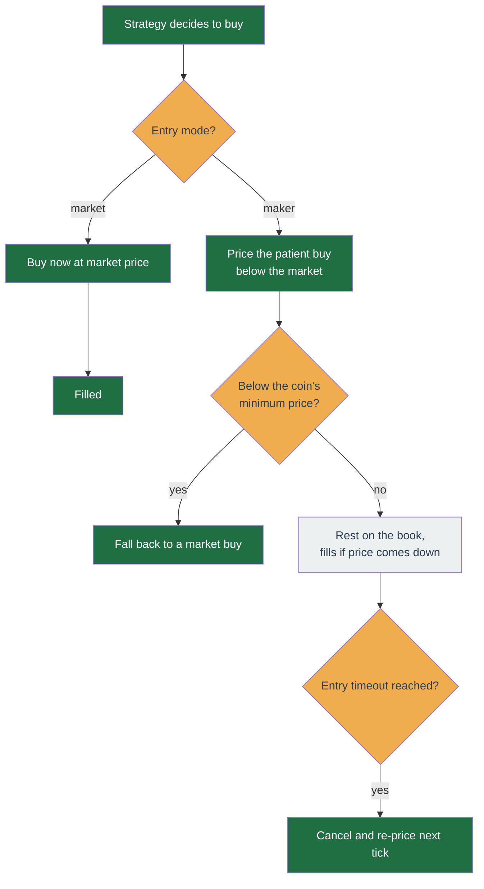

# Entry execution: market vs maker

When Trailing Trade decides to buy, it can do it two ways: **buy instantly at the going price**, or **rest a patient order below the price and wait**. This page explains the trade-off and how to set it.

It applies to **Trailing Trade buys only**. Sells always execute immediately — see [What stays immediate](#what-stays-immediate) below.

## The two modes

| Mode | What happens | You get | You risk |
| --- | --- | --- | --- |
| **Market** (default) | Buys immediately at whatever the market is asking. | A certain fill, right now. | You pay the spread, plus **slippage** if the order is big enough to eat several price levels. |
| **Maker** | Places a limit buy at or below the current price and leaves it on the order book. | You keep the spread and pay no slippage. | **The buy may never happen.** If the price runs up, you miss the entry entirely. |

!!! warning "Maker mode does not make your fees cheaper"

    A common misreading. On Binance spot at **VIP0** — where a self-hosted
    single-operator account almost certainly sits — the maker fee and the taker fee
    are **identical**. They only diverge at VIP1 and above, which needs roughly
    1,000,000 USDT of 30-day volume.

    So maker mode buys you exactly one thing: **not crossing the spread and not
    paying slippage**. It costs you fill certainty. Do not enable it expecting a
    lower fee.

    Binance changes its fee schedule; check the current spot fee page before relying
    on any number here.

## Some vocabulary, once

- **Spread** — the gap between the highest price a buyer will pay and the lowest a seller will accept. Buying instantly means paying the seller's price, so you start the trade slightly behind.
- **Slippage** — a large order eats the cheapest offers first and then works up to more expensive ones, so your average price is worse than the price you saw.
- **Taker** — you took liquidity that was already on the book (an instant buy).
- **Maker** — you added liquidity by resting an order and waiting (a patient buy).
- **Basis point (bps)** — one hundredth of a percent. 50 bps = 0.50%.

## The settings

On the profile's **Strategy** section, under **Execution** (an advanced section).

| Setting | What it does | Values | Default | When to change it |
| --- | --- | --- | --- | --- |
| **Entry mode** | Instant buy or patient buy. | `market` or `maker` | `market` | Switch to `maker` only after a backtest of the maker config shows it beats market for your coins. |
| **Maker offset (bps)** | How far **below** the current price to rest the buy. | 0 or more | `0` | Raise it to buy cheaper, at the cost of filling less often. See the zero-offset caveat below. |
| **Entry timeout (bars)** | Cancel a buy that has been resting unfilled for this many closed candles, so the next tick re-prices it. | 0 (off) or more | `0` | Set it if you do not want a buy stranded at a price the market has walked away from. Ignored in market mode. |

### Worked example

Say ETHUSDT is trading at **2,000 USDT**, your candle interval is **1h**, and you set:

- Entry mode `maker`
- Maker offset `25` bps
- Entry timeout `4` bars

When the strategy decides to buy, it rests a limit buy at `2000 × (1 − 25/10000)` = **1,995.00 USDT** instead of buying at 2,000.

- If the price dips through 1,995 within the next four hourly candles, you fill — 5 USDT per ETH cheaper than a market buy, and no slippage.
- If it does not, the order is cancelled after the fourth closed candle and the next tick places a fresh one at 0.25% below whatever the price is by then.
- With the timeout at `0` instead, that first order would simply sit at 1,995 indefinitely, even if ETH ran to 2,400.

## Two honest caveats

**A zero offset can still fill as a taker.** A limit buy priced exactly at the current price can match an offer sitting there and execute immediately, taking liquidity. If you want to genuinely rest on the book, use a small positive offset. Backtests treat every limit fill as a maker fill, so at a zero offset a backtest can be slightly optimistic about how "maker" your fills really were. It still charges you the spread either way.

**An unfilled resting buy is normal, not a fault.** A patient buy the price never reaches simply waits. That is the mechanism working. It is why entry timeout exists.

**Very deep offsets fall back to market.** If the computed price lands below the symbol's minimum price or its tick size, the order is placed as a market buy instead. A large offset on a very low-priced coin can therefore fill as a taker without you asking for it.

## What entry timeout does and does not touch

- **Only the first buy, while you hold nothing.** Once a position is open, adding to it is managed by the grid, not the timeout.
- **Only patient limit buys.** A breakout buy that is waiting for a trigger price is meant to wait, so it is never timed out.
- **Only in maker mode.** In market mode it does nothing, and the config check flags a non-zero value as pointless.
- While you hold nothing it cancels **any** resting buy limit on that coin, including one you placed by hand.

## What stays immediate

Maker mode changes strategy **buys** only. These always execute at market:

- **Every exit** — trailing stop, stop loss, technicals force-sell, regime exit. When an exit condition trips you want out. A patient sell priced above the market would not fill on a falling price, which defeats the point. (The protective stop stays a resting stop order, as before.)
- **The bull pyramid** — it deliberately buys into strength, where waiting for a pullback means missing the move.
- **Breakout grid levels** — a grid level configured with a stop price is a breakout-confirmation order and keeps its own order type.

## It has to be backtested first

Changing execution settings changes the profile's config fingerprint, and the [live-enablement gate](backtesting.md) only lets a profile go live on the strength of a backtest of **that exact config**. A market-mode backtest will not authorise a maker-mode profile — you must run a new one.

That is the point: the honest way to judge maker mode is to measure it, because the saving (spread and slippage) and the cost (entries you never got) both show up in the result. The backtest models this properly — it only fills a resting buy when a later candle trades **through** your price, not when it merely touches, and it charges slippage on market orders but not on resting limits.

## Fees follow the mode

The strategy refuses to take a discretionary profit that would net out to a loss after fees. That floor depends on the mode: a market round trip pays two taker fees, a maker round trip pays one maker fee plus one taker fee. Set your real Binance maker and taker fees in the profile's fee settings so both the floor and your backtests reflect what you actually pay.
