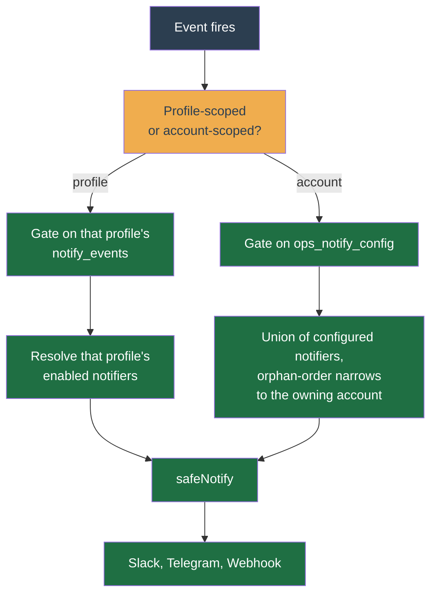

# Notifiers

A **notifier** sends you a message — on Slack, Telegram, or a webhook — when the bot does something worth knowing: a tripped safety breaker, a failed order, a finished backtest. Set one up so you are not glued to the dashboard.

Two independent choices control your alerts:

- **Where** they go — the notifiers you configure (Slack, Telegram, webhook).
- **Which** events fire — the per-profile event subscription.

Both live on the profile's **Notifications** page; the subscription is the "Which events alert you" card above the provider editors.

## Turn a notifier on

The **Enabled** switch on each provider is independent of the config Save. Toggling it persists immediately and never re-validates the config, so a notifier you configured earlier can be switched off without re-completing its form. A provider with no saved config shows the switch **off and disabled** ("Save a config to enable"); the first successful Save creates the row enabled, and the switch owns on/off from then on.

## Which events alert you

Each profile has its own set of alert categories. Every category defaults to **on** except `order-filled` (off — an active grid fills often), so a new profile keeps alerting on everything until you mute a category. Muting drops the notification but never the underlying action: the daily-loss breaker still halts, discovery still rotates. A change takes effect with no restart.

| Category | Severity | Fires when |
| --- | --- | --- |
| `daily-loss-halt` | warn | The daily-loss circuit breaker trips and pauses new buys for the UTC day. Edge-triggered: one alert per breach, not one every 30s while halted. |
| `edge-decay-warning` | warn | The edge-decay monitor sees live results fall below the pinned backtest baseline. Advisory only — the bot does NOT pause buys. One alert per decay episode. |
| `discovery` | info | Auto-discovery starts or stops trading a symbol. |
| `discovery-health` | warn | Auto-discovery looks wedged. Fires on staleness (the discovery cron produced no snapshot in over 2× the profile's refresh period, so scanning has stopped) or a persistent breadth block (the latest 8 cycles all had the market-breadth gate off, so every add was blocked and the floor may be unreachable for this quote). Throttled to one alert per trigger per hour. Separate from `discovery`: mute the info-level rotation chatter without losing the warn-level "discovery stopped working" alert. |
| `alive` | info | The recurring balance/holdings digest. |
| `backtest-complete` | info | A backtest you started finishes, with its headline result (trades, profit factor, alpha vs buy-and-hold). |
| `order-filled` | info | One of the profile's orders fills, with side, quantity, and average price. **Off by default** — an active grid fills several times a day, so this is opt-in. |
| `order-failed` | error | The bot tried to place or cancel an order and the exchange refused it, or it never sent the protective stop-loss because the price it needs sits outside the range Binance accepts right now. Either way the position may be unguarded. Ordinary repeated failures for the same symbol are collapsed into one alert per 15-minute window. If Binance refuses the exact same non-recoverable placement three times, a dedicated alert says the bot has slowed that request to one probe per minute; continuing probe refusals are collapsed into one alert per exact request and rejection per hour. For a stop that was never sent, alerts use a separate hourly window: nothing is sent while an earlier stop is still resting on the exchange, a stop no price could ever satisfy is reported straight away, and one that only needs the price to come back is held for 15 minutes first so a brief excursion never pages you. A stop held back for any other reason — the coins are locked by another order, or there are too few of them to meet the exchange minimum — does not alert; it shows on the profile's diagnosis instead. |
| `override-unresolved` | error | A manual action you triggered hit a network or exchange fault and the bot cannot tell whether it went through. Check the exchange before re-issuing it. |

The first two are capital-safety alerts — keep them on unless you have another monitor (`edge-decay-warning` is advisory: it never pauses buys, it just warns you).

## Account-level operational alerts

Some events belong to the whole account, not one profile, so they fan out to **every notifier you have configured anywhere** (deduped), gated by the account-global "Operational alerts" toggles on the Settings page; every category defaults on.

| Category | Severity | Fires when |
| --- | --- | --- |
| `job-failed` | error | A background job (a trade tick, a backup, an archive write) fails and is dead-lettered after its retries. |
| `dust-transfer` | info | Dust is converted to BNB, with the converted assets and BNB received. A money-path action, so it always surfaces (defaults on) even though it is `info`. |
| `orphan-order` | warn | An order is open on Binance that the bot is not managing. Confirmed over two consecutive detector ticks, alerted once per order. Adoption is **derived**, not chosen: the bot takes the order back only if a profile can prove it placed it, and otherwise asks you to cancel-or-leave it on the exchange. See [Orphan orders](../user-guide/account/orphan-orders.md). |

An `orphan-order` alert names the one account whose order book it concerns, so it reaches only that account's channels — a second account never hears about the first's orders, and because each account runs one environment, a testnet alert can never reach a live account's Slack. `job-failed` names no account (it is a worker-wide failure) and fans out to the full union.

The worker going dark is not covered here — a dead process cannot report its own death. The always-visible [account-health bar](account-health.md) shows "Bot down" live from the missing heartbeat instead.

## If a live profile has no notifier

Emergency notifications (a Binance error the bot cannot recover from, a weight-limit throttle, or a post-submit bookkeeping failure that left an order on the exchange) are sent best-effort through the global notifier registry, not a profile's own notifier — so a **live profile with no enabled notifier hears nothing** on a real-money emergency. Two safeguards surface that gap:

- **Live-profile banner.** The profile dashboard shows a "Real-money trading with no notifications" banner whenever a **live** (not testnet) profile has **zero** enabled notifiers, linking straight to the notifications page. The count is read fresh on each dashboard request, so saving a notifier clears the banner immediately.
- **Durable trace.** The worker also appends a `warn`-level action-log row naming the topic ("real-money &lt;topic&gt; fired but this profile has no enabled notifier — you were not alerted"), throttled to one per (profile, topic) per hour, so the gap is auditable even when nobody was paged.

## Under the hood

The rest is implementation detail — operators do not need it.

**Routing.** Every alert takes one of two paths, depending on whether it belongs to a profile or the whole account. Worker-emitted events fan out through one `notifyEvent` helper, which gates on the subscription, resolves the enabled notifiers, and sends through `safeNotify` (a provider failure is logged, never thrown into a cron loop).

The per-profile subscription is the `notify_events` map (`ProfileNotifyEvents` contract, `profiles.notify_events` column); the account-level toggles are the `ops_notify_config` singleton, mirroring `backup_config`. An account-scoped event (`orphan-order`) resolves through `profileNotifiers.listEnabledForAccount` — that account only — so two accounts on the same environment do not cross-alert either.

**Message shape.** The worker builds one structured message per alert (`NotifyMessage` in `@app/notify`): a `title`, an optional `profile` name and `symbol`, a human `body` sentence, and display-ready `fields` (label/value pairs). The worker formats every value — money, percentages, the profile name — so the providers stay pure and never touch `Decimal`. Each renders that one shape in its own syntax:

- **Slack** — mrkdwn, `&<>` escaped.
- **Telegram** — HTML (`parse_mode: HTML`), `&<>` escaped. HTML is used deliberately: under legacy Markdown an error string containing `_`, `*`, or a backtick makes Telegram reject the whole message with "can't parse entities", and `safeNotify` would swallow that — so the most important alerts would silently vanish. HTML escaping removes that failure mode.
- **Webhook** — the structured envelope as JSON (machine endpoint), not a re-serialised blob.

Two events carry a tap-through link when `PUBLIC_WEB_URL` is set on the worker: a finished backtest links to its results, and an orphan-order alert links to `/accounts/{accountId}/orphan-orders` for the account the order was found on. Unset omits the link and the notification still sends.

**Delivery guarantees.** The DLQ watcher fires the `job-failed` alert after it durably persists and publishes the dead-letter, through the same `safeNotify` path, so a notifier outage can never re-fail the job; it suppresses duplicate `(queue, error message)` alerts for 15 minutes so a job failing identically every retry does not flood the notifier (the durable persist and dashboard publish still happen on every failure). One account's orphans are gated and resolved once per tick, then dispatched one message at a time to respect notifier rate limits; a muted orphan is still marked alerted, so re-enabling the category does not replay the whole backlog. If an orphan's own account has no notifier at all, the durable `action_logs` warn row is written on that account's profiles instead. The no-notifier-gap throttle window lives in Redis rather than in-process, so the limit holds fleet-wide if the worker ever runs multiple replicas.
