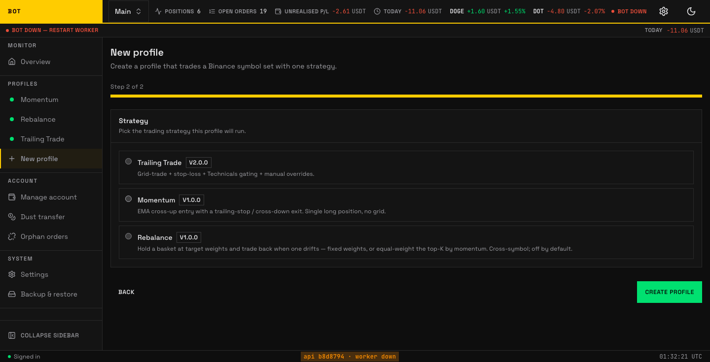
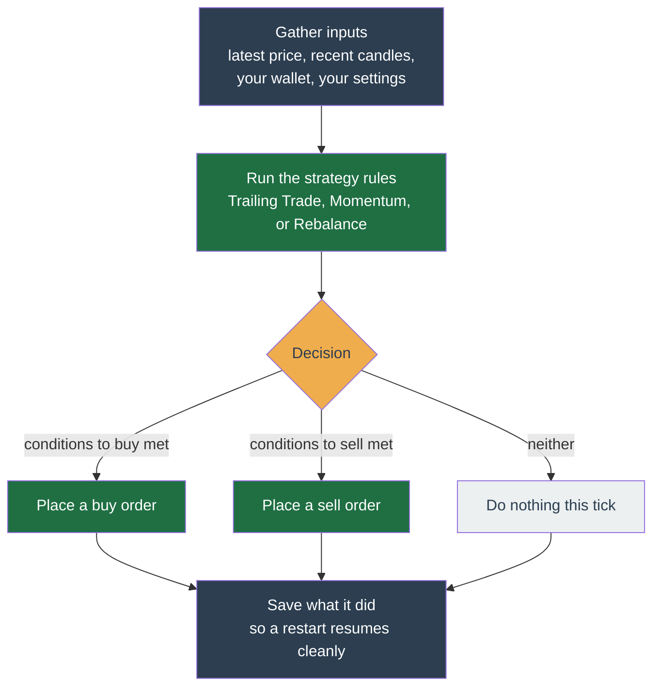

# Strategies

A **strategy** is the rulebook the bot follows: it looks at the price and your holdings and decides whether to buy, sell, or wait. You pick **one strategy per profile**. Three ship today, described below.

_You choose the strategy per profile in the new-profile wizard. Seeded demo data, not a real account._

## How every strategy decides, one price update at a time

Whenever a new price update for a coin arrives from Binance, the bot runs that coin through one decision cycle — a **tick**. A tick is the same shape no matter which strategy you chose:

The strategy only ever decides. A separate part of the bot (the _executor_) places the order and makes sure it is never placed twice, even across a crash.

## The three strategies at a glance

| Strategy | What it does | Fits when you expect |
| --- | --- | --- |
| **Trailing Trade** | Buys dips in steps, trails the sell up. | The price to swing up and down in a range. |
| **Momentum** | Buys a confirmed breakout, exits on a trailing stop. | A coin already moving up to keep rising. |
| **Rebalance** | Holds a basket at target proportions. | To hold a steady mix rather than time entries. |

## Trailing Trade

It does two things:

- **Trailing buy.** As the price falls, it follows the price down and buys near the bottom of the fall rather than catching a falling knife. It can buy in several steps (a _grid_): a little at the first dip, more if it falls further, so your average cost improves the deeper it goes.
- **Trailing sell.** Once you are holding, it follows the price up and sells when the price pulls back from a recent high — capturing more of a rise than a fixed target would.

It profits from repeated up-and-down movement in a ranging market. It does not profit from a sustained one-way trend.

**Full page:** [Trailing Trade](trailing-trade.md) — how each tick decides, every config knob, worked examples, and internals.

## Momentum

Momentum bets that **a coin already moving up will keep moving up**. It waits for a confirmed upward breakout, buys, and then rides the trend. It does **not** try to pick tops: it exits on a **trailing stop** (a line that follows the rise up) or when the trend flips (the fast average crosses back below the slow one), never at a fixed profit target.

Because it only enters on strength, it trades less often than Trailing Trade and can sit in cash for long stretches waiting for a breakout. To rank many coins rather than time one, see [Rebalance's momentum weight mode](rebalance.md#how-momentum-mode-ranks).

**Full page:** [Momentum](momentum.md) — the EMA-cross entry, the trailing/cross-down exits, every config knob, and worked examples.

## Rebalance

Rebalance ignores timing and instead **holds a basket at target proportions**. You set a target share per coin — for example 40% Bitcoin, 40% Ethereum. The shares need not add up to 100%; whatever is left over stays as cash. As prices drift, it sells what grew past its target and buys what fell below, mechanically selling high and buying low to restore the mix.

It has two modes:

- **Fixed weights** — you set each coin's share directly.
- **Momentum weights** — the coin list becomes a ranked universe; it holds the strongest few at equal weight and rotates as the ranking changes. This is _cross-sectional momentum_, and it reuses the rebalance engine.

Rebalance makes no market-timing calls. It only corrects drift across the basket periodically.

**Full page:** [Rebalance](rebalance.md) — fixed vs momentum weights, drift thresholds, every config knob, and worked examples.

## Matching a strategy to what you expect

Each strategy assumes a different market. Match the one whose assumption you hold for the coins you trade:

- **The price to swing up and down in a range** → Trailing Trade.
- **A coin that is breaking out to keep rising** → Momentum.
- **To hold a steady spread rather than time entries** → Rebalance.

No strategy is safest in the abstract; each carries the risk of the market it is built for. You can change strategy later, and run different strategies in different [profiles](../../get-started/configure.md) at the same time.

## For developers

Strategies are plug-ins behind a single contract. Adding one is a new package plus a registry entry — never a change to the API or worker. See [Strategy plugin contract](../../architecture/extensibility.md).
