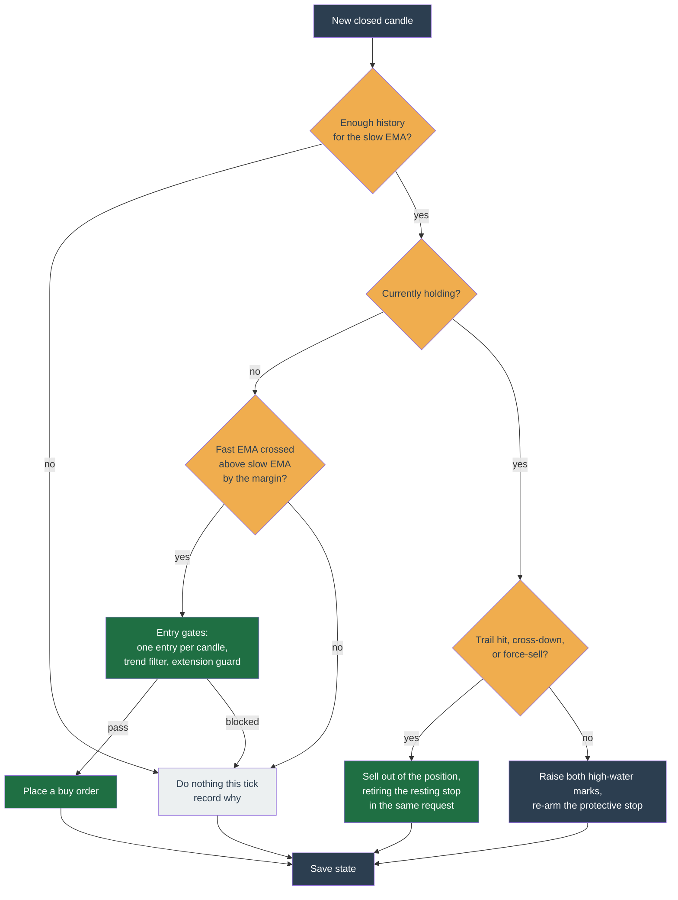

# Momentum


_The Momentum configuration form, as the profile's Strategy section renders it. Every field is documented in the table below. Seeded demo data, not a real account._

Momentum buys a coin that is already moving up and rides it until the move ends. It enters on a confirmed upward **EMA crossover** and exits only through a stop — there is no upside price target. It trades less often than Trailing Trade and can sit in cash for long stretches waiting for a clean move.

This page is the canonical reference for the strategy — what it does, how each tick decides, every configuration knob, worked examples, the state it keeps, and its internals. It serves both an operator configuring a profile and a contributor reading the code (`packages/strategy/momentum/`).

## In one sentence

When a fast moving average crosses above a slow one it buys; it then follows the price up with a trailing stop and sells when the price falls back through that stop or the fast average crosses back below the slow one.

## How a tick decides

The bot ticks a coin whenever a new price update arrives, but Momentum only acts on **closed candles** — a still-forming candle would make the crossover flip around. It compares the fast and slow EMAs on the latest closed candle against the one before.



Entry is deliberately slow and exit is deliberately quick: the entry cross must clear an optional margin (`entryMarginPct`), while the exit cross-down is a bare cross with no margin — quick to leave, slow to enter.

## Entry and exit, in detail

**Entry.** A buy fires when the fast EMA was at or below the slow EMA on the previous closed candle and is now above it by `entryMarginPct` (default: bare cross). At most one entry per candle, so a stop-out inside the same candle cannot immediately re-buy. Optional gates can veto the entry: the **trend filter** (only enter while price is above a long-term moving average) and the **extension guard** (skip when price is stretched too far above its baseline). Exits are never gated. An opening buy is also refused with `entry-below-stop-notional` when, after the 0.1% trading fee and Binance's lot-size rounding, the coins bought would be worth less at the initial protective stop's stop-limit price than the minimum order size, the smallest order value Binance accepts. In `native-trail` mode the check is made at the stop's trigger instead, because a trail carries no limit price to be measured against — the same distinction the arm makes, so a marginal entry is not refused for an offset the resting order does not apply. Raise the entry budget or tighten the stop (move it closer to the entry price, so the coins are worth more when it fires); add-on buys into an existing position are not held to this floor.

**Exit.** Every exit is a stop — there is **no take-profit target**. A held position is sold when any of these fires:

- **Trailing stop** — price falls to the trailing level (see below).
- **EMA cross-down** — the fast EMA crosses back below the slow EMA.
- **Operator force-sell** — you sell manually from the dashboard.

**The trailing level has two legs, and the higher one wins.**

- The **hard leg** is the original one and is always present: `high × (1 − trailingStopPct)`, where `high` starts at your entry price and then ratchets up on the closes of candles that closed **after** your entry (default 5% pullback). For a position the bot opened itself, a candle that had already closed when you entered cannot raise it, so on a `1d` profile your first stop rests the full `trailingStopPct` below your entry rather than below yesterday's close. That holds because the bot stamps its own entries with the last candle that had already closed when the cross fired. It applies from the entry of positions opened from now on: a position already open keeps whatever mark it has already accumulated, inflated or not, until it closes, because nothing can tell an inflated mark from one that ratcheted legitimately. A position the bot did not open — one reconciled from your wallet — carries no such stamp, and for it the mark still folds the newest closed candle exactly as it did before. With `atrTrailingStop` on, the distance is `multiple × ATR` below the peak instead. It ratchets on your **candle interval**, so on a `1d` profile it moves once a day.
- The **profit leg** is optional (`profitTrail`, off by default) and exists only above your entry price. It ratchets on closed **1-minute** candles folded into `ratchetMinutes` buckets, and switches on once the trade is `activationPct` in profit; from then it sits `trailPct` below the peak. An armed profit leg is always above your entry, so it cannot turn a winner into a loser. What guarantees that is the bound the config enforces. The pullback is always measured off the peak; the worst case is the peak the leg arms at, which is the lowest it can ever be. Holding above entry from that worst case needs `trailPct < activationPct / (1 + activationPct)` — with a 5% activation, a little under 4.8%. A larger value is rejected.

The level the bot acts on is the **higher of the two**, so the profit leg can only ever tighten protection. Below the activation threshold, and on any losing trade, the behaviour is exactly what it was without it.

The reason the profit leg exists is the long-interval case: on a `1d` profile the hard leg is up to 24 hours stale, so a run that starts and ends inside one day is protected by a level computed from yesterday's close.

An optional exchange-side **protective stop** (`STOP_LOSS_LIMIT` in `priced` mode; see `protectiveStop.mode` below for the native form) mirrors that same resolved level as a backstop in case the bot is down when it is hit. When an exit fires while that stop is resting, the retraction and the sale go to Binance as **one** request, which removes the window where both are live against the same coins: Binance sends the sale only after the retraction has succeeded, so it can never double-sell the position. If Binance refuses the retraction the sale is not sent either, so the position waits a tick with its stop still protecting it. The one refusal that does not mean that is the stop having already left the book: the bot recognises it and sends the sale straight away rather than waiting on an order that no longer exists. The one request is **not** a transaction, though, and Binance does not promise it is: the retraction can succeed while the sale is refused, leaving the position held with no stop on the book. The bot sends the sale once more on its own, and if that also fails it alerts you and schedules a repair pass rather than leaving the position silently unguarded. It declines to re-send when the retired stop had already sold part of the position, because the sale was sized for the whole of it; the repair pass corrects the size and the next tick sells the remainder. Rewriting that resting order uses one Binance `cancelReplace` request and spends **one** unit of your order allowance. It is still only rewritten once the level has moved by `protectiveStop.minRearmDriftPct`. `ratchetMinutes` bounds how often the **profit leg** can advance, and nothing else: the hard leg ratchets on your `candleInterval`, so on a `1m` profile the resting stop can still be rewritten every minute whenever the hard leg is the higher of the two. The in-app check itself runs every tick, and `minRearmDriftPct` applies only to the resting order.

### When Binance will not accept the protective stop

**The position has to be worth enough.** Binance sets a minimum order value on every pair, and it measures an order against the price written on that order — for a `STOP_LOSS_LIMIT` that is the **limit** price the stop sells down to, `trigger × protectiveStop.limitOffsetPercentage`, not the trigger. The bot refuses to arm when the position is worth less than the minimum at that limit price, which is stricter than judging it at the trigger by exactly the offset (2% at the default `0.98`). In primary `native-trail` mode the check is made at the current market price instead whenever the native trailing delta resolves, because that order carries no price at all — it sells at market when it fires, so the market price is the closest the bot can get to the value Binance would put on it. When no usable market price can be read on the tick, the check falls back to the trigger, which sits below the market and so asks for more coins than strictly needed rather than fewer. Selecting the mode is not enough on its own: if the symbol publishes no usable `TRAILING_DELTA` bounds no native order can be built, a `STOP_LOSS_LIMIT` rests instead, and the check goes back to that order's limit price. The symbol screen names which of the two prices the check used, so the required-coins figure can be checked against the right number.

A position that was armed before this check tightened keeps its resting stop — nothing is cancelled, and it still fires. What it loses is re-pricing: once the position is worth less than that minimum the arm sends nothing and leaves the resting order alone, so the stop stays at its old trigger until the position is topped up above the minimum, sold by hand, or `protectiveStop.limitOffsetPercentage` is raised so the limit price the minimum is measured at sits closer to the trigger.

Binance publishes a [`PERCENT_PRICE_BY_SIDE`](https://github.com/binance/binance-spot-api-docs/blob/master/filters.md#percent_price_by_side) filter on nearly every listed spot pair: a sell is refused (`-1013`) unless its prices sit inside `[reference × askMultiplierDown, reference × askMultiplierUp]`. The reference is Binance's own reference price for the symbol where one exists, otherwise the volume-weighted average price over the filter's `avgPriceMins` minutes, or the last trade price when `avgPriceMins` is `0`. A stop trailing far below a fast-rising market falls under that floor. On a pair with no published band the bot reads the band as _unknown_ rather than absent and places the stop exactly as it did before, so nothing below applies there.

**Both legs are banded.** A `STOP_LOSS_LIMIT` carries a trigger (`stopPrice`) and the limit `price` it sells down to, and either one outside the window is refused. Since the limit always sits below the trigger, only the limit can break the floor and only the trigger can break the ceiling, so each leg is tested against the bound it can actually breach. The ceiling case is rare — the stop has to sit **above** the band, which needs a reference that has fallen away from the trail — and it is the one case where tightening the stop makes things worse, so the app never offers that advice on it.

The bot checks the band before it acts, and when the order would be refused it **defers the whole re-arm** — it places nothing and cancels nothing, so a stop already resting keeps protecting the position. The reason is recorded on `protectiveStopBlocker` and shown on the symbol, and the arm retries every tick.

One approximation makes that check inexact. A tick is pure and cannot read Binance's averaging window, so the bot bands against the current price instead. When the current price sits above the average the bot overstates the floor and defers an order Binance would have taken, which costs a tick and self-corrects; when it sits below, the order goes out and is refused exactly as it is today. Neither direction cancels a stop that is already protecting the position.

Two floor cases behave differently:

- **Temporary.** The market moved faster than the trail. Nothing to change; the stop arms itself as soon as the reference moves back into range.
- **Permanent.** Arming needs `protectiveStop.limitOffsetPercentage` to be **greater than the symbol's `askMultiplierDown`** — the limit sits at `trigger × limitOffsetPercentage` and the floor at `reference × askMultiplierDown`, and the trigger normally sits at or below the reference because a price at or under the trigger exits the position first, so an offset at or under that multiplier cannot clear the floor. The blocker is marked terminal, and the alert says plainly that no price move will fix it. Raise the offset by a clear margin, not a hair: the limit is floored onto the symbol's tick grid before the band is judged, so the ratio Binance sees can fall short of the offset you set by up to one tick size divided by the trigger price.

The refusal carries two derived numbers: the stop distance the profile is asking for (`1 − stopPrice ÷ reference`), and the deepest stop the symbol accepts at this offset (`1 − askMultiplierDown ÷ limitOffsetPercentage`). The push alert and the symbol screen both quote those, from one shared sentence, so the two surfaces cannot recommend different fixes for one block.

`protectiveStop.mode` chooses who moves the protective stop. The default `priced` mode keeps a fixed trigger that the bot re-prices upward. `native-trail` lets Binance move one resting trailing `STOP_LOSS` trigger up after each trade. That order carries no trigger price of its own in either mode, so the preview row for a profile in primary native mode names the trail's distance rather than a level, exactly as the band-escape trail's row does, and no stop line is drawn on the chart. In primary native mode, a tighter distance or an under-size correction replaces that order only when the successor cannot lower the effective trigger; an over-size correction is unguarded. Whenever a priced stop rests, either in `priced` mode or as the priced fallback of `native-trail`, its trigger normally pins both the next priced candidate and the in-process exit line so neither moves lower. That pin is switched off under `onBandBlock: 'clamp'`, allowing the market-anchored clamp to keep following the market down. Switching a held position's mode from `priced` to `native-trail` replaces the resting priced stop with an unguarded trailing order that starts fresh from the current mark price (`trigger = mark price × (1 − trail distance)`), so it can sit below a priced stop that already ratcheted up; change mode while flat, or accept that the first replacement may lower the effective stop. If repeated order failures leave `protective-stop-unplaced`, the state is treated as ordinary for the first **15 minutes** and as a problem after that: past the window, diagnosis raises a finding naming the coins that crossed it, and the bot sends one `order-failed` alert per coin per hour saying how long the position has been unprotected and what to check. Nothing is sent inside the window, since that is what a fresh entry looks like. On a tick where both would fire, only the band alert is sent: it names the same unguarded coin and carries the more specific instruction. The suppression is per tick, not standing — the two alerts sit behind independent gates measured against different condition spans, so a coin whose band alert is not yet due can still be reported as unprotected.

Raising `limitOffsetPercentage` widens that maximum, but only up to `1 − askMultiplierDown` — the limit price cannot go above the trigger, so that is the hard ceiling on stop depth for the symbol no matter what the offset is. Once the stop is deeper than that, no offset value reaches it, and the alert says so instead of pointing at the knob.

Deferring means no order is sent, so there is no `-1013` rejection to report. The bot raises the alert itself instead, under **Order could not be placed**: straight away when no price could ever arm the trail, and once the refusal has held 15 minutes when it only needs the price to come back. Nothing is sent while an earlier stop of ours is still resting, since the position is covered. A stop the bot does send can still come back `-1013` when the current price sits under Binance's average, and that rejection alerts as it always has. The blocker is also a dashboard signal: the symbol shows red when nothing covers the position, amber when an earlier stop of ours still covers it at a stale level.

### Choosing what happens instead: `onBandBlock`

Deferring is the default, not the only option. `protectiveStop.onBandBlock` picks between three, and each one costs something — there is no setting that gets a deep stop past the band for free.

- **`notify`** (default) — the behaviour above. Nothing rests behind the position until the band lets the stop in, and you are told.
- **`clamp`** — the stop is raised to the deepest trigger the band accepts, `reference × askMultiplierDown ÷ limitOffsetPercentage`, plus a 1% margin that keeps it clear of the exchange's own averaged reference. On a symbol whose `askMultiplierDown` is `0.9`, at the default `0.98` offset, that is about **7.2%** below the market. Be precise about what that does and does not buy. The clamped level is anchored to the **current market price**, not to the high-water mark your trail measures from, so it follows the market in both directions: it rises as the trade runs ahead, and a gradual pullback moves it back **down** rather than triggering it — down to your `trailingStopPct` level, which it never sinks below. Clamp is therefore not a tighter trailing exit; what it buys is a resting order that exists at all, where `notify` leaves none, catching a fall fast enough to cross it between ticks. While the exchange floor is what holds the stop up, `protectiveStop.minRearmDriftPct` is widened to 1% so that following the market does not rewrite the order on every tick. The clamp is applied where the trailing level itself is resolved, so the in-app exit moves up with the resting order — the two agree on where the stop is up to the 1% clamped drift band, and under `clamp` the resting order can sit above the in-process line until the next re-arm, so the exchange fires first.
- **`native-trail`** — only when the priced stop is actually refused, the bot rests a Binance-native trailing `STOP_LOSS` instead: quantity plus a `trailingDelta` in basis points reproducing your configured distance, with no trigger and no limit price of its own. Having no price is exactly why the band does not apply. Two consequences: it sells at **market** when it triggers, so you accept whatever the book pays rather than a limit you set, and Binance measures the distance from the highest price **it** has seen since the order was placed, not from your entry or from the bot's high-water mark. There is therefore no fixed trigger price for the app to show, which is why the preview row for a native trail names the distance instead of a level. If the symbol publishes no usable `TRAILING_DELTA` bounds, the arm falls back to the ordinary refusal rather than sending a delta the exchange would reject. A position worth less than the minimum at its limit price still reaches this escape. The priced stop is refused as unsellable, but the trail is judged at the market price rather than the limit leg, so when it clears the minimum there the trail is what rests. The refusal is only reported when nothing sends the position down the escape in the first place, which means a genuine band floor breach is still required.

A band-escape trail re-arms through the ordinary drift path on any configured-distance change, tighter or wider, with no high-water guard. In primary `native-trail` mode, a tighter distance or an under-size correction re-arms only when the replacement cannot lower the effective trigger, while an over-size correction is unguarded. Every replacement restarts Binance's tracked high-water mark, which is why the primary-mode guard matters.

## Configuration

The in-app form and the table below are generated from the same schema, so the fields, labels, and help below match the profile's **Strategy** section exactly. Momentum takes its **traded coins from the profile's symbol list, not from config** — there is no `symbol` field. The new-profile wizard seeds `entrySizing` fixed `15`, `ema` `{fast: 9, slow: 21}`, `protectiveStop` on, and `entryExtension` on.

!!! info "About some of the levers"

    _ATR (Average True Range) measures recent volatility. Scaling the trailing stop
    to ATR widens the exit when the coin is choppy and tightens it when calm, instead
    of a fixed percentage._ The **extension guard** exists because Momentum's losers
    are overextended blow-offs — a coin that has already run 40%+ above its baseline is
    a poor entry even with a valid crossover.

    **Risk-based sizing** decides how much to buy from what the trade would lose rather than from a flat share of the account: the budget is capped at `riskPct × equity ÷ initial stop distance` — equity being your cash plus the value of the coins you hold — and it can only ever shrink what entry sizing already allowed. If that cap shrinks an opening order below the size that could still be sold at the initial stop, the bot refuses the entry with `entry-below-stop-notional` rather than placing a smaller order. It matters most with the ATR stop on, where the stop distance differs coin to coin — at 3 ATRs, a coin whose ATR is about 11% of price is stopped 33% below entry against 9% for one at about 3%, so it gets just over a quarter of the size, and both cost the same share of the account if that first stop fires. The size is set from the stop distance measured **at entry**: if the coin gets more volatile after you are in, the ATR stop widens with it and a stop-out can cost more than `riskPct`. It can also cost less: with `protectiveStop.onBandBlock` set to `clamp`, the stop that actually rests can be much tighter than the ATR distance the size was worked out from, so a stopped-out trade costs less than `riskPct`, not the same. The other two answers to a band refusal do not work that way — `native-trail` hands Binance a trail at your fixed `trailingStopPct` distance, which is not bounded to be tighter than the ATR distance the size came from, and the `notify` default rests nothing at all.

    The exchange-side protective stop shades the cost the other way. The wizard
    seeds it on, as noted above, so this applies unless you turned it off. What
    rests at Binance is a `STOP_LOSS_LIMIT`, and its limit price is set to
    `limitOffsetPercentage` OF the trigger — `0.98` puts it 2% under — so the
    sale is honoured somewhat below the level the size was worked
    out from and a stop-out costs more than the figure you set. At a fixed 5%
    stop and the default `0.98` offset, the worst honoured fill is 6.9% below
    entry rather than 5%. That gap is 2% **of the trigger price**, so it is a
    large addition to a tight stop and a small one to a wide one: a 33% ATR stop
    is honoured down to 34.3%.

    **Calibrating it.** With a fixed percent stop, and entry sizing in
    `percentOfAccount` mode, the cap lands exactly where entry sizing already
    did when `riskPct = entry percent × trailing stop percent ÷ 100` — all three
    written as the percentages you type into the form, not as the fractions the
    Default column of the table below prints (`0.01` there is the 1% you type).
    So an entry sizing of 10% with a 5% trailing stop breaks even at **0.5%**:
    0.5% of equity divided by a 5% stop is the same 10% of equity entry sizing
    was already buying. Set it above that and the cap simply never binds — at
    50% instead of 0.5% it works out to ten times equity, entry sizing stays the
    smaller of the two, and turning the switch on changes nothing at all.

--8<-- "docs/\_generated/config/momentum.md"

Per-symbol overrides may change any field except `candleInterval` (it drives the shared price feed) and `accountCap` (account-wide, not per-symbol).

## A starting configuration

A trend-following setup on a handful of coins. The coins come from the profile's symbol list, not from here.

```yaml
candleInterval: 1h
ema: { fast: 9, slow: 21 } # entry on the 9 crossing above the 21
entryMarginPct: '0.005' # require a 0.5% margin, not a bare touch
trailingStopPct: '0.05' # exit on a 5% pullback from the peak

entrySizing: { mode: fixed, amount: '15' }
accountCap: { mode: percentOfAccount, percent: '0.5' } # keep half in cash

protectiveStop: { enabled: true, limitOffsetPercentage: '0.98' }

trendFilter: # do not buy while the macro trend is down
  enabled: true
  maType: sma
  period: 200

entryExtension: # do not buy a blow-off
  enabled: true
  period: 50
  maxPercent: '0.4'
```

**How it plays out.** On a closed hourly candle where the 9-EMA crosses at least 0.5% above the 21-EMA, the bot checks two guards: price must be above the 200-candle trend line, and no more than 40% above its 50-candle baseline. If both pass it spends $15, unless holdings already reach half the account. From then on the trailing stop follows 5% under the highest price since entry, and a real stop order rests on Binance as backup. The trade ends on that trail, on the EMAs crossing back down, or on the stop.

## Worked scenarios

**A clean momentum trade.** `ema` `{9, 21}`, `trailingStopPct '0.05'`. On a closed candle the 9-period EMA crosses above the 21-period EMA. The bot buys $15 of the coin. Price runs up 20% over the next day; the high-water mark ratchets up each closed candle, and the trailing stop follows 5% below it. Price then drops 5% from its peak — the bot sells, keeping most of the run.

**Cut short by the cross-down.** The bot buys on a crossover, but the move fizzles and the fast EMA crosses back below the slow EMA before the trailing stop is hit. The bot sells on the cross-down, stepping aside quickly rather than waiting for a deeper pullback.

**A one-day run banked on the profit leg.** `candleInterval '1d'`, `trailingStopPct '0.15'`, `profitTrail { enabled: true, activationPct: '0.05', trailPct: '0.03', ratchetMinutes: 5 }`. The bot is holding at an entry of 11. The hard leg sits at yesterday's close of 13 minus 15%, or 11.05 — barely above cost. Price runs to 15 during the day: the profit leg switches on (15 is well past 11 × 1.05) and settles at 15 × 0.97 = 14.55, and the resting stop at Binance is rewritten to match. Price pushes to 16, the trail moves to 15.52, then pulls back to 15.40 and the bot sells. Without the profit leg the hard leg would still have been sitting at 11.05, and the whole run would have been given back before the next daily close.

**An entry skipped by the extension guard.** A crossover fires, but price is already 55% above its 50-candle baseline. With `entryExtension` on (`maxPercent '0.4'`) the bot records an `overextended` reason and does not buy — avoiding the top of a blow-off.

## State it keeps

Per (profile, symbol), between ticks (`MomentumStateSchema`, schema version `1.0.0`):

| Field | Tracks |
| --- | --- |
| `entryPrice` | Entry price of the open long; `null` means flat. |
| `highSinceEntry` | High-water mark that starts at the entry price and ratchets up on the closes of candles that closed after the entry candle; the hard leg measures retrace from this. |
| `profitHigh` | High-water mark of bucketed closed 1-minute closes since entry, floored at the entry price; the profit leg measures retrace from this. `null` while `profitTrail` is off. |
| `heldQuantity` | Authoritative held base for sell sizing (reconciled from fills). |
| `lastEntryCandleMs` | Close time of the candle that opened the last entry; enforces one entry per cross. |
| `profitTrailSinceMs` | Close instant of the newest 1-minute candle already closed when the position opened. The profit leg folds only candles that **open** at or after it, so the earliest close it can fold lands one minute later. Keeps a peak from before you were in the trade out of `profitHigh`. Stays `null` until a tick supplies a closed 1-minute window: a position reconciled from your wallet, or one whose entry was adopted from a fill, arrives without it and the next held tick stamps it. A caller with no 1-minute candles never stamps it and the profit leg stays inert. Stamping late can only ever fold FEWER closes, never a peak the position did not hold. |
| `entryBlocker` | Why the last tick refused an entry (e.g. `below-trend`, `overextended`, `cap-reached`, `entry-below-stop-notional`). |
| `protectiveStopBlocker` | Why the bot cannot arm or re-arm an exchange-side stop for a held position; when `detail.resting` is set, an older stop is still resting at its previous level and is deliberately left alone rather than cancelled, and `detail.guarded` says whether it still covers the whole position. On a minimum-order-value refusal `detail.checkedAt` is the price the minimum was measured against and `detail.checkedAtLeg` says which price that is — `limit` for the price a `STOP_LOSS_LIMIT` sells down to, `market` for a native trailing stop, which carries no price of its own and is judged at the market price, and `trigger` only on the fallback where no usable market price could be read — so it is not confused with `detail.stop`, the trigger the stop would have rested at. Cleared to `null` when the position closes, including a close the worker applies without a tick. A reset that clears the cost basis but leaves coins in your wallet keeps the warning. |
| `exitBlocker` | Why a held position is waiting on an exit: `native-trail-resting` means Binance is moving the native trailing stop; `profit-leg-armed` means the tighter profit trail is active; `native-trail-unavailable` means the symbol cannot accept the requested native distance and the priced stop resting in its place is what protects the position; `protective-stop-unplaced` means no stop is currently resting, which is expected for a moment after an entry and becomes a diagnosis finding and an alert once it has held for 15 minutes; `priced-stop-resting` means the fixed-trigger stop is resting. It is `null` while flat or when the stop is disabled. Precedence: `protective-stop-unplaced` > resting native (`profit-leg-armed` if the profit leg is armed, else `native-trail-resting`) > `native-trail-unavailable` > `priced-stop-resting`. What is on the exchange outranks the reason something else could not go there, at both steps, because the refusal is worked out from your settings and the symbol's filter alone and never looks at your open orders. "Nothing is resting" comes first: reporting the refusal there said a priced stop was covering the coin on every held tick, including the ticks where that fallback had not landed either and nothing was protecting the position. Among the stops that are resting, the order's own shape comes next: the refusal is judged on the distance your protective-stop mode asks for, while the band escape rests its trail at the separate distance your trailing-stop percent asks for, so a trail placed that way was being described as a priced stop. The refusal is not lost in either case, it is carried in the detail of whichever state is reported. |
| `nativeTrail` | The resting native trailing stop's Binance order id and the highest mark tracked since that order was first seen. It resets when the order changes and is `null` when no native stop rests. |

## Internals

- **Closed candles only.** `computeTick` (`src/tick.ts`) filters to closed candles before computing EMAs, so decisions are deterministic and never react to a live wick. Both high-water marks ratchet on closed-candle closes — the hard leg on your candle interval, the profit leg on 1-minute candles at `ratchetMinutes` boundaries — while the stop itself fires against the live price. Each mark is also bounded to candles that closed after the position opened: the hard leg by `lastEntryCandleMs`, the profit leg by `profitTrailSinceMs`. The two legs deliberately differ when their stamp is absent, which is what a position reconciled from your wallet looks like. The hard leg fails open and folds the newest closed candle as it did before the bound existed, because gating on a missing stamp would pin the mark at the entry price for the life of that position and stop the only always-on protection ratcheting at all. The profit leg has a way back that the hard leg does not: it re-derives its own start point from the 1-minute window the worker supplies for every symbol whatever your `candleInterval`, so on a reconciled position it folds nothing for exactly one tick and then ratchets normally. The hard leg has no equivalent, because the only start point it could derive is "from now" on your trading interval, which would leave a long-held reconciled position's stop pinned at its cost basis for a whole candle interval — a full day on a `1d` profile — and that is worse than admitting one pre-entry close. One known gap: an entry adopted from an external ADD fill keeps the original entry's stamp, so closes from between the two entries can still fold in. The mark restarts from the new cost basis, so only a close above it has any effect, and the effect can only tighten the stop, never widen it.
- **One level, three consumers.** `src/stop-level.ts` resolves the trailing level once per tick, and the in-app trail, the resting protective stop, and the operator's pre-trade preview all read that one value, and it never sees open orders, so it cannot apply the resting-stop pin that holds the live level up outside clamp mode. They used to compute it separately, which is how a second leg would have made them disagree. The preview differs in degree, not in kind: it holds no 1-minute window, so it feeds the resolver the profit mark the last tick saved rather than re-computing it, and on an armed position it can read one ratchet step behind the live level.
- **No events.** Momentum declares no domain events (`events: {}`). Its output is decisions (`place-order`, `cancel-order`, `replace-order`, `noop`), named metrics (`momentum.entry`, `momentum.exit`, `momentum.skip`), and logs. The `attribution.ts` map turns blocker reason codes into the plain-language text the dashboard shows.
- **Purity.** The tick is pure `Decimal` math with no I/O; the worker injects the clock. The executor guarantees an order is never placed twice, even across a crash.

## What it does not do

- No take-profit target — every exit is a stop or a cross-down. Confirmed in the code.
- No shorting or derivatives — spot long only.
- No averaging down — one position per (profile, symbol), sized once on entry.
- It can sit fully in cash for long stretches; that is expected, not a fault.

## See also

- [Compare the three strategies](index.md)
- [Rebalance — momentum weight mode](rebalance.md#how-momentum-mode-ranks) — ranking many coins rather than timing one
- [Strategy plugin contract](../../architecture/extensibility.md)
- Source: `packages/strategy/momentum/`
