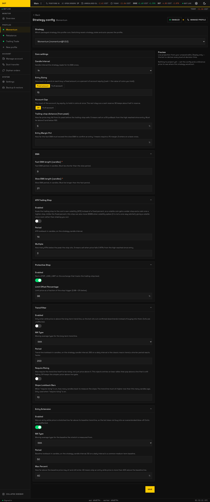
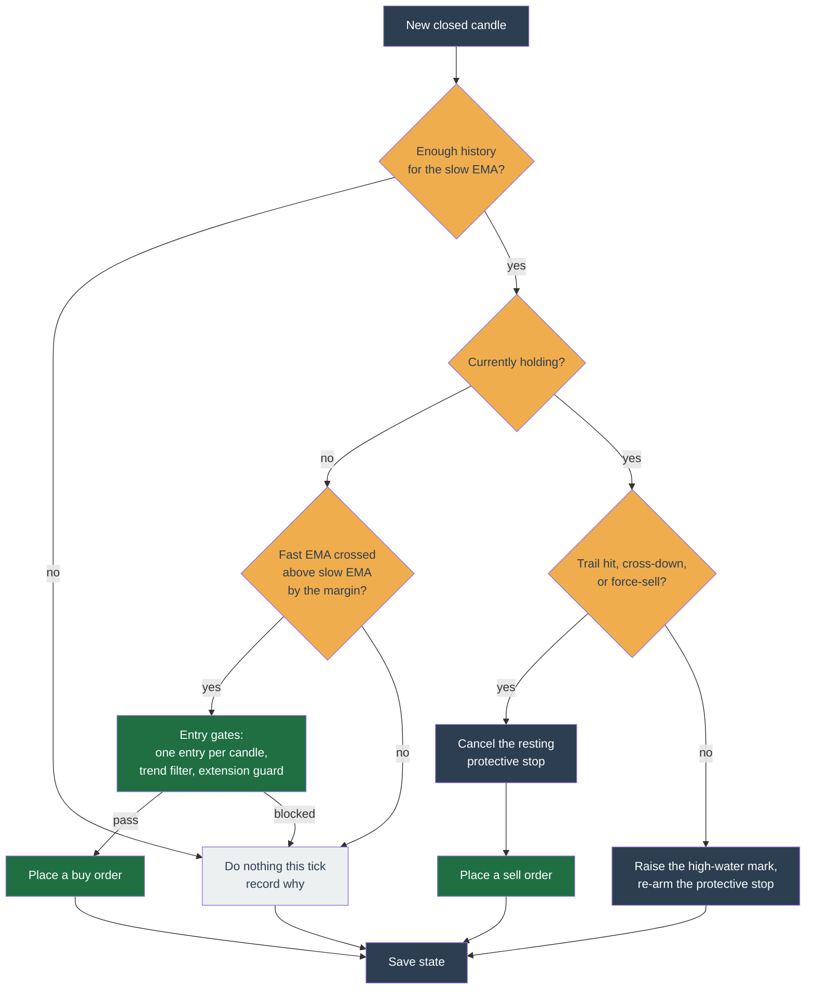

# Momentum



_The Momentum configuration form, as the profile's Strategy tab renders it. Every field is documented in the table below. Seeded demo data, not a real account._

Momentum buys a coin that is already moving up and rides it until the move ends. It enters on a confirmed upward **EMA crossover** and exits only through a stop — there is no upside price target. It trades less often than Trailing Trade and can sit in cash for long stretches waiting for a clean move.

This page is the canonical reference for the strategy — what it does, how each tick decides, every configuration knob, worked examples, the state it keeps, and its internals. It serves both an operator configuring a profile and a contributor reading the code (`packages/strategy/momentum/`).

## In one sentence

When a fast moving average crosses above a slow one it buys; it then follows the price up with a trailing stop and sells when the price falls back through that stop or the fast average crosses back below the slow one.

## How a tick decides

The bot ticks a coin whenever a new price update arrives, but Momentum only acts on **closed candles** — a still-forming candle would make the crossover flip around. It compares the fast and slow EMAs on the latest closed candle against the one before.



Entry is deliberately slow and exit is deliberately quick: the entry cross must clear an optional margin (`entryMarginPct`), while the exit cross-down is a bare cross with no margin — quick to leave, slow to enter.

## Entry and exit, in detail

**Entry.** A buy fires when the fast EMA was at or below the slow EMA on the previous closed candle and is now above it by `entryMarginPct` (default: bare cross). At most one entry per candle, so a stop-out inside the same candle cannot immediately re-buy. Optional gates can veto the entry: the **trend filter** (only enter while price is above a long-term moving average) and the **extension guard** (skip when price is stretched too far above its baseline). Exits are never gated.

**Exit.** Every exit is a stop — there is **no take-profit target**. A held position is sold when any of these fires:

- **Trailing stop** — price falls to `high × (1 − trailingStopPct)`, where `high` is the highest closed-candle close since entry (default 5% pullback). With `atrTrailingStop` on, the distance is `multiple × ATR` below the peak instead.
- **EMA cross-down** — the fast EMA crosses back below the slow EMA.
- **Operator force-sell** — you sell manually from the dashboard.

An optional exchange-side **protective stop** (`STOP_LOSS_LIMIT`) mirrors the trailing level as a backstop in case the bot is down when the level is hit.

## Configuration

The in-app form and the table below are generated from the same schema, so the fields, labels, and help below match the profile's **Strategy** tab exactly. Momentum takes its **traded coins from the profile's symbol list, not from config** — there is no `symbol` field. The new-profile wizard seeds `entrySizing` fixed `15`, `ema` `{fast: 9, slow: 21}`, `protectiveStop` on, and `entryExtension` on.

!!! info "About some of the levers"

    _ATR (Average True Range) measures recent volatility. Scaling the trailing stop
    to ATR widens the exit when the coin is choppy and tightens it when calm, instead
    of a fixed percentage._ The **extension guard** exists because Momentum's losers
    are overextended blow-offs — a coin that has already run 40%+ above its baseline is
    a poor entry even with a valid crossover.

--8<-- "docs/\_generated/config/momentum.md"

Per-symbol overrides may change any field except `candleInterval` (it drives the shared price feed) and `accountCap` (account-wide, not per-symbol).

## A starting configuration

A trend-following setup on a handful of coins. The coins come from the profile's symbol list, not from here.

```yaml
candleInterval: 1h
ema: { fast: 9, slow: 21 } # entry on the 9 crossing above the 21
entryMarginPct: '0.5' # require a 0.5% margin, not a bare touch
trailingStopPct: '0.05' # exit on a 5% pullback from the peak

entrySizing: { mode: fixed, amount: '15' }
accountCap: { mode: percentOfAccount, percent: '50' } # keep half in cash

protectiveStop: { enabled: true, limitOffsetPercentage: '0.98' }

trendFilter: # do not buy while the macro trend is down
  enabled: true
  maType: sma
  period: 200

entryExtension: # do not buy a blow-off
  enabled: true
  period: 50
  maxPercent: '0.4'
```

**How it plays out.** On a closed hourly candle where the 9-EMA crosses at least 0.5% above the 21-EMA, the bot checks two guards: price must be above the 200-candle trend line, and no more than 40% above its 50-candle baseline. If both pass it spends $15, unless holdings already reach half the account. From then on the trailing stop follows 5% under the highest price since entry, and a real stop order rests on Binance as backup. The trade ends on that trail, on the EMAs crossing back down, or on the stop.

## Worked scenarios

**A clean momentum trade.** `ema` `{9, 21}`, `trailingStopPct '0.05'`. On a closed candle the 9-period EMA crosses above the 21-period EMA. The bot buys $15 of the coin. Price runs up 20% over the next day; the high-water mark ratchets up each closed candle, and the trailing stop follows 5% below it. Price then drops 5% from its peak — the bot sells, keeping most of the run.

**Cut short by the cross-down.** The bot buys on a crossover, but the move fizzles and the fast EMA crosses back below the slow EMA before the trailing stop is hit. The bot sells on the cross-down, stepping aside quickly rather than waiting for a deeper pullback.

**An entry skipped by the extension guard.** A crossover fires, but price is already 55% above its 50-candle baseline. With `entryExtension` on (`maxPercent '0.4'`) the bot records an `overextended` reason and does not buy — avoiding the top of a blow-off.

## State it keeps

Per (profile, symbol), between ticks (`MomentumStateSchema`, schema version `1.0.0`):

| Field | Tracks |
| --- | --- |
| `entryPrice` | Entry price of the open long; `null` means flat. |
| `highSinceEntry` | High-water mark of closed-candle closes since entry; the trail measures retrace from this. |
| `heldQuantity` | Authoritative held base for sell sizing (reconciled from fills). |
| `lastEntryCandleMs` | Close time of the candle that opened the last entry; enforces one entry per cross. |
| `entryBlocker` | Why the last tick refused an entry (e.g. `below-trend`, `overextended`, `cap-reached`). |
| `protectiveStopBlocker` | Why a held position currently has no exchange-side stop. |

## Internals

- **Closed candles only.** `computeTick` (`src/tick.ts`) filters to closed candles before computing EMAs, so decisions are deterministic and never react to a live wick. The high-water mark ratchets on closed-candle close; the trailing stop fires against the live price.
- **No events.** Momentum declares no domain events (`events: {}`). Its output is decisions (`place-order`, `cancel-order`, `noop`), named metrics (`momentum.entry`, `momentum.exit`, `momentum.skip`), and logs. The `attribution.ts` map turns blocker reason codes into the plain-language text the dashboard shows.
- **Purity.** The tick is pure `Decimal` math with no I/O; the worker injects the clock. The executor guarantees an order is never placed twice, even across a crash.

## What it does not do

- No take-profit target — every exit is a stop or a cross-down. Confirmed in the code.
- No shorting or derivatives — spot long only.
- No averaging down — one position per (profile, symbol), sized once on entry.
- It can sit fully in cash for long stretches; that is expected, not a fault.

## See also

- [Compare the three strategies](index.md)
- [Rebalance — momentum weight mode](rebalance.md#how-momentum-mode-ranks) — ranking many coins rather than timing one
- [Strategy plugin contract](../../architecture/extensibility.md)
- Source: `packages/strategy/momentum/`
