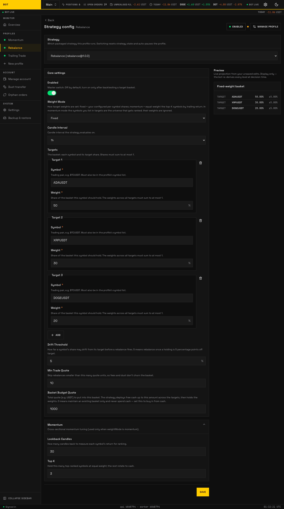
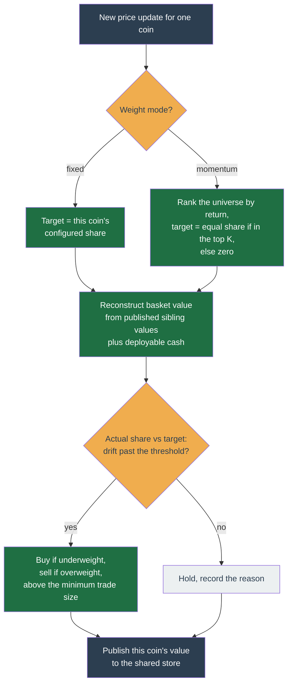

# Rebalance



_The Rebalance configuration form, as the profile's Strategy tab renders it. Every field is documented in the table below. Seeded demo data, not a real account._

!!! note "Configuration form"

    Rebalance is configured on the same profile **Strategy** tab shown for
    [Momentum](momentum.md) and [Trailing Trade](trailing-trade.md); the form
    renders the fields documented below. (No live Rebalance profile existed on
    the demo account when these screenshots were taken.)

Rebalance ignores timing and instead holds a basket of coins at target proportions. As prices drift, it sells what grew past its target and buys what fell below, mechanically selling high and buying low to restore the mix. It makes no market-timing calls; it only corrects drift.

This page is the canonical reference for the strategy — what it does, how each tick decides, every configuration knob, worked examples, the state it keeps, and its internals. It serves both an operator configuring a profile and a contributor reading the code (`packages/strategy/rebalance/`).

## In one sentence

You set target shares for a basket of coins; whenever a coin's actual share drifts far enough from its target, the bot buys or sells just enough to bring it back.

## Two modes

`weightMode` chooses how the target shares are set:

- **Fixed weights** (`'fixed'`, default) — you set each coin's share directly in `targets`. For example BTC `0.4`, ETH `0.4`. Weights across the basket must sum to **at most 1**; whatever is left over stays as cash. You do not configure a "cash" target — cash is simply the unallocated remainder.
- **Momentum weights** (`'momentum'`) — the per-coin weights in `targets` are ignored; the list becomes the ranked **universe**. Each tick ranks the coins by recent return and holds the top `topK` at equal weight, rotating the rest to cash as the ranking changes. This is _cross-sectional momentum_ riding the rebalance engine.

## How a tick decides

Rebalance is a **cross-symbol** strategy: each coin's tick needs to know the value of the whole basket. It gets that through a per-profile key-value store — every tick each coin publishes its own mark-to-market value, and reads back its siblings' values to reconstruct the basket total.



All orders are `MARKET` orders — Rebalance never rests an order on the book. Trades below `minTradeQuote` are skipped so fees and dust do not churn the basket.

## Configuration

The in-app form and the table below are generated from the same schema, so the fields, labels, and help below are exactly what you see in the profile's **Strategy** tab. The `momentum.*` fields apply only when `weightMode` is `momentum`. The default config is inert (`enabled: false`, empty basket) — turn it on only after backtesting a target basket.

--8<-- "docs/\_generated/config/rebalance.md"

!!! warning "Keep `lookbackCandles` at or below 199"

    The candle window floors at 200 (`rebalanceRequiredWindow`). A `lookbackCandles`
    above 199 asks `momentumScore` for a close further back than the window carries,
    so every coin scores `null`, no coin ever ranks, and the basket never deploys —
    silently, and identically in live and backtest.

Per-symbol overrides may change only `targets`; every other field is profile-wide.

## How momentum mode ranks

Momentum works far better _across_ coins than on one coin in isolation. Timing a single coin on a moving-average cross is the **weak form** — prone to _whipsaw_, being shaken out by rapid up-then-down swings that trip the signal in both directions. Ranking a whole universe by trailing return and holding only the strongest few ("cross-sectional" momentum, because the comparison runs across coins at one moment rather than one coin over time) sidesteps that. This is also why momentum mode is a weight mode of Rebalance rather than its own package: holding the top `topK` and rotating the rest to cash _is_ dynamic-weight rebalancing, so it reuses the same order engine, drift logic, and budget unchanged.

Each coin scores itself by trailing return over `lookbackCandles` (`lastClose / closeNAgo − 1`) and publishes that score to the shared store. It reads its siblings' scores, ranks the whole universe descending (ties broken by symbol for reproducibility), and:

- If it ranks in the top `min(topK, universeSize)`, its target is an equal `1 / held` share, and the drift path buys toward it.
- If it ranks below that, its target is `0` and it rotates fully to cash.

Two guards prevent bad early behaviour: a coin with too little history or a data gap scores `null` and **holds** (never sells on a gap), and no coin deploys until enough of the universe has published scores (the **convergence gate**), so the first coin to warm up cannot grab the whole budget.

## A starting configuration

A three-coin basket held at fixed weights.

```yaml
enabled: true
weightMode: fixed
candleInterval: 4h
basketBudgetQuote: '1000' # deploy $1,000 into the basket
driftThreshold: '0.05' # correct once a holding is 5 points off target
minTradeQuote: '10' # skip corrections smaller than $10

targets:
  - { symbol: BTCUSDT, weight: '0.5' }
  - { symbol: ETHUSDT, weight: '0.3' }
  - { symbol: SOLUSDT, weight: '0.2' }
```

**How it plays out.** The bot buys toward 50/30/20 until $1,000 is deployed, then simply holds those proportions. If BTC rallies to 58% of the basket, that is 8 points of drift, past the 5-point threshold, so it sells enough BTC to come back toward 50% and buys the underweight coins with the proceeds. Corrections worth less than $10 are skipped, so ordinary wobble does not churn fees. Note the weights sum to 1.0 — using 0.4/0.3/0.2 instead would deliberately hold the remaining 10% as cash.

To rotate rather than hold, set `weightMode: momentum` and `momentum.topK: 2`; the three targets then become the candidate pool and the two strongest are held at 50% each.

## Worked scenarios

**Fixed 60/40, drifting.** `targets` BTC `0.6`, ETH `0.4`, `driftThreshold '0.05'`. BTC rallies until it is 68% of the basket. On BTC's next tick the drift (8 points) exceeds the threshold — it sells enough BTC to bring it back toward 60%. On ETH's tick, ETH is now underweight, so it buys ETH with the freed cash. The mix is restored.

**Deploying fresh cash.** Same basket with `basketBudgetQuote '1000'` and $1,000 of free quote. The bot buys toward the targets until $1,000 is deployed across the basket, then only corrects drift. With `basketBudgetQuote '0'` it would never spend the cash — it would only rebalance coins you already hold.

**Momentum rotation.** `weightMode 'momentum'`, universe of 5 coins, `topK 3`. The bot holds the 3 strongest at about 33% each. A held coin weakens and drops to rank 4 — its target becomes 0 and the bot sells the whole position (`rotate-exit`); the coin that rose into the top 3 gets bought toward its equal share.

## State it keeps

Per (profile, symbol), rebalance keeps only the position (`RebalanceStateSchema`, schema version `1.0.0`):

| Field           | Tracks                                                      |
| --------------- | ----------------------------------------------------------- |
| `avgEntryPrice` | Average entry price of the held position; `null` when flat. |
| `heldQuantity`  | Base quantity held; `null` when flat.                       |

The persisted state holds **no** basket-wide target or sibling data. The whole-basket view is reconstructed each tick from the shared key-value store, not from state. The tick itself never mutates the position — fills are applied out-of-band by the position adapter.

## Internals

- **Cross-symbol KV seam.** Each tick publishes this coin's value under `rebalance:value:<symbol>` (and, in momentum mode, its score under `rebalance:momentum:<symbol>`) via `set-kv` decisions, and reads siblings back. This is the one place the per-(profile, symbol) purity rule opens a coordinated seam, and it is why rebalance declares `needsProfileKv: true`.
- **No events.** Rebalance declares no domain events (`events: {}`). Output is decisions (`set-kv`, `delete-kv`, `place-order`), the `rebalance.decision` metric tagged with a reason (`within-drift`, `rotate-exit`, `below-min-trade`, …), and logs.
- **Market only.** It never rests an order, so there is nothing to adopt or attribute. If it ever grows a resting order type, that change must add order attribution in the same commit — noted in the code as a hard rule.
- **Purity.** The tick is pure `Decimal` math with no I/O. The executor guarantees an order is never placed twice, even across a crash.

## What it does not do

- No market timing — it corrects drift on a schedule, it does not predict direction.
- No shorting or derivatives — spot long only.
- With `basketBudgetQuote '0'` it never spends fresh cash; it only rebalances holdings.
- On a data gap a coin holds rather than selling — momentum mode never rotates on missing data.

## See also

- [Compare the three strategies](index.md)
- [Strategy plugin contract](../../architecture/extensibility.md)
- Source: `packages/strategy/rebalance/`
