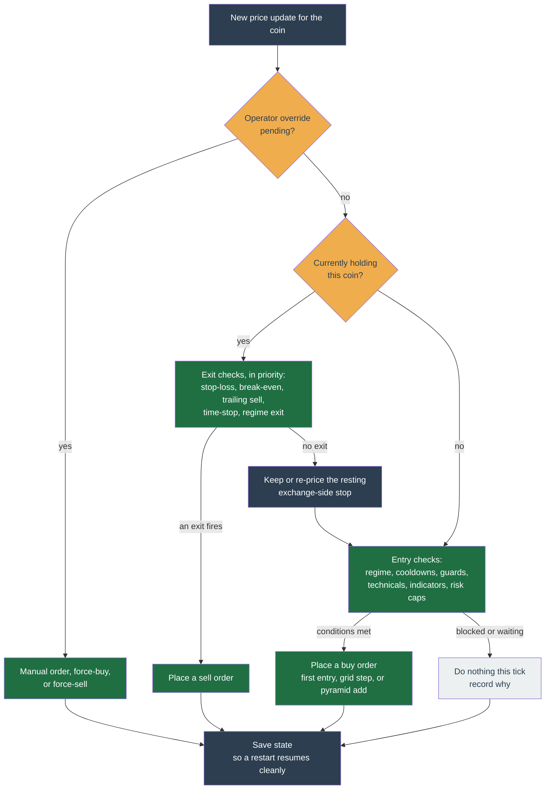

# Trailing Trade


_The Trailing Trade configuration form. Each section below documents these fields. Seeded demo data, not a real account._

Trailing Trade buys dips in steps and trails the sell up. It is the packaged mean-reversion strategy: it profits from a coin that swings up and down within a range, and it does not profit from a sustained one-way trend.

This page is the canonical reference for the strategy — what it does, how each tick decides, every configuration knob, worked examples, the state it keeps, and its internals. It serves both an operator configuring a profile and a contributor reading the code (`packages/strategy/trailing-trade/`).

## In one sentence

As the price falls it buys in one or more steps to lower your average cost; once you are holding and the price has risen enough, it follows the price up and sells when the price pulls back from its recent high.

## The multiplier convention

Every percentage knob is stored as a **multiplier on a reference price**, not as a "percent" number. This one convention explains most of the config:

| You want | You set | Reads as |
| --- | --- | --- |
| Sell 3% below your average cost (stop-loss) | `stopLossPercentage: '0.97'` | `avgCost × 0.97` |
| Arm the trailing sell once you are up 5% | `triggerPercentage: '1.05'` | `avgCost × 1.05` |
| Sell after a 2% pullback from the high | `trailingStopPercentage: '0.98'` | `high × 0.98` |

Below 1 means "this far below"; above 1 means "this far above". The in-app form shows these as human percentages; the stored value is the raw multiplier.

## How a tick decides

The bot ticks a coin whenever a new price update for it arrives from Binance. Each tick runs the same ordered chain of checks; the first one that decides ends the tick.



The exit checks always run before the entry checks, so a held position is protected first. Even when no exit fires, the strategy keeps a resting stop-loss order parked on Binance as a backstop if `sell.protectiveStop` is on.

### When Binance will not accept the protective stop

Binance publishes a [`PERCENT_PRICE_BY_SIDE`](https://github.com/binance/binance-spot-api-docs/blob/master/filters.md#percent_price_by_side) filter on nearly every listed spot pair: a sell is refused (`-1013`) unless its prices sit inside `[reference × askMultiplierDown, reference × askMultiplierUp]`. The reference is Binance's own reference price for the symbol where one exists, otherwise the volume-weighted average price over the filter's `avgPriceMins` minutes, or the last trade price when `avgPriceMins` is `0`. A stop resting far below a fast-rising market falls under that floor. On a pair with no published band the bot reads the band as _unknown_ rather than absent and places the stop exactly as it did before, so nothing below applies there.

**Both legs are banded.** A `STOP_LOSS_LIMIT` carries a trigger (`stopPrice`) and the limit `price` it sells down to, and either one outside the window is refused. Since the limit always sits below the trigger, only the limit can break the floor and only the trigger can break the ceiling, so each leg is tested against the bound it can actually breach. The ceiling case is rare — the stop has to sit **above** the band, which needs a reference that has fallen away from the stop level — and it is the one case where tightening the stop makes things worse, so the app never offers that advice on it.

The bot checks the band before it acts, and when the order would be refused it **defers the whole re-arm** — it places nothing and cancels nothing, so a stop already resting keeps protecting the position. The reason is recorded on `protectiveStopBlocker` and shown on the symbol, and the arm retries every tick.

One approximation makes that check inexact. A tick is pure and cannot read Binance's averaging window, so the bot bands against the current price instead. When the current price sits above the average the bot overstates the floor and defers an order Binance would have taken, which costs a tick and self-corrects; when it sits below, the order goes out and is refused exactly as it is today. Neither direction cancels a stop that is already protecting the position.

Two floor cases behave differently:

- **Temporary.** The market moved faster than the resting stop. Nothing to change; the stop arms itself as soon as the reference moves back into range.
- **Permanent.** Arming needs `sell.protectiveStop.limitOffsetPercentage` to be **greater than the symbol's `askMultiplierDown`** — the limit sits at `trigger × limitOffsetPercentage` and the floor at `reference × askMultiplierDown`, and the trigger normally sits at or below the reference because a price at or under the trigger exits the position first, so an offset at or under that multiplier cannot clear the floor. The blocker is marked terminal, and the alert says plainly that no price move will fix it. Raise the offset by a clear margin, not a hair: the limit is floored onto the symbol's tick grid before the band is judged, so the ratio Binance sees can fall short of the offset you set by up to one tick size divided by the trigger price.

The refusal carries two derived numbers: the stop distance the profile is asking for (`1 − stopPrice ÷ reference`), and the deepest stop the symbol accepts at this offset (`1 − askMultiplierDown ÷ limitOffsetPercentage`). The push alert and the symbol screen both quote those, from one shared sentence, so the two surfaces cannot recommend different fixes for one block.

Raising `limitOffsetPercentage` widens that maximum, but only up to `1 − askMultiplierDown` — the limit price cannot go above the trigger, so that is the hard ceiling on stop depth for the symbol no matter what the offset is. Once the stop is deeper than that, no offset value reaches it, and the alert says so instead of pointing at the knob.

Deferring means no order is sent, so there is no `-1013` rejection to report. The bot raises the alert itself instead, under **Order could not be placed**: straight away when no price could ever arm the stop, and once the refusal has held 15 minutes when it only needs the price to come back. Nothing is sent while an earlier stop of ours is still resting, since the position is covered. A stop the bot does send can still come back `-1013` when the current price sits under Binance's average, and that rejection alerts as it always has. The blocker is also a dashboard signal: the symbol shows red when nothing covers the position, amber when an earlier stop of ours still covers it at a stale level.

### Choosing what happens instead: `onBandBlock`

Deferring is the default, not the only option. `sell.protectiveStop.onBandBlock` picks between three, and each one costs something — there is no setting that gets a deep stop past the band for free.

- **`notify`** (default) — the behaviour above. Nothing rests behind the position until the band lets the stop in, and you are told.
- **`clamp`** — the stop is raised to the deepest trigger the band accepts, `reference × askMultiplierDown ÷ limitOffsetPercentage`, plus a 1% margin that keeps it clear of the exchange's own averaged reference. On a symbol whose `askMultiplierDown` is `0.9`, at the default `0.995` offset, that is about **8.6%** below the market. Be precise about what that does and does not buy. The clamped level is anchored to the **current market price**, not to your entry, so it follows the market in both directions: it rises as the trade runs ahead, and a gradual pullback moves it back **down** rather than triggering it — down to your `sell.stopLossPercentage` level, which it never sinks below. Clamp is therefore not a trailing exit, and your configured stop-loss remains the level that ends a losing trade. What clamp buys is a resting order that exists at all, where `notify` leaves none: it catches a fall fast enough to cross it between ticks. While the exchange floor is what holds the stop up, the re-arm band widens to 1% so that following the market does not rewrite the order on every tick. The clamp is applied where the stop level is resolved, so the in-process stop-loss check moves with the resting order and the two never disagree.
- **`native-trail`** — only when the priced stop is actually refused, the bot rests a Binance-native trailing `STOP_LOSS` instead: quantity plus a `trailingDelta` in basis points reproducing your configured distance, with no trigger and no limit price of its own. Having no price is exactly why the band does not apply. Two consequences: it sells at **market** when it triggers, so you accept whatever the book pays rather than a limit you set, and Binance measures the distance from the highest price **it** has seen since the order was placed, not from your entry. There is therefore no fixed trigger price for the app to show, which is why the preview row for a native trail names the distance instead of a level. If the symbol publishes no usable `TRAILING_DELTA` bounds, the arm falls back to the ordinary refusal rather than sending a delta the exchange would reject.

A resting native trail is re-armed only when the configured distance changes. Cancelling and replacing it would restart the trail from the current price and discard the high-water mark it has accumulated.

## The two core behaviours

### Trailing buy (averaging down)

As the price falls, Trailing Trade buys near the bottom of the fall rather than catching a falling knife. With a **grid** (`buy.gridLevels`) it buys in several steps: a little at the first dip, more if it falls further, so your average cost improves the deeper the fall goes. Each level names the price multiplier that triggers it and the quote budget to spend there.

Without a grid it makes a single first buy sized by `buy.entrySizing`.

### Trailing sell

Once you are holding and the price has risen to `sell.triggerPercentage × avgCost`, the strategy arms a trailing sell: it tracks the highest price seen and sells when the price retraces to `high × sell.trailingStopPercentage`. That captures more of a rise than a fixed target would. Below the trail sits a hard `sell.stopLossPercentage` floor that always wins if both would fire on the same tick.

## Configuration

The in-app form is generated from the strategy's own schema, so you only see fields that apply. The table below is generated from that same schema, so it always lists exactly the fields the tab shows. Defaults below are the schema defaults; the new-profile wizard seeds a minimal working config (`buy.enabled`, `entrySizing` fixed `15`, `sell.enabled`, `stopLossPercentage '0.97'`, `triggerPercentage '1.05'`).

--8<-- "docs/\_generated/config/trailing-trade.md"

> **Indicator terms** (used in the buy gates and exits in the table above):
>
> - **RSI(14)** — Relative Strength Index over 14 candles, a 0–100 momentum gauge; low means the coin has recently sold off.
> - **SMA(20) / EMA(20)** — the simple / exponential moving average of the last 20 candles' price; a smoothed trend line the current price sits above or below.
> - **z-score** — how many standard deviations the price sits from its recent average; negative means below average (cheaper than usual).
> - **ATR** — Average True Range, a measure of recent volatility, so a trailing distance in ATRs widens when the coin is choppy and tightens when it is calm.

A few cross-field rules the form enforces on save, worth calling out:

- **Pyramiding needs a cap.** `regime.onBull.pyramid` is rejected at save time unless a per-symbol or account exposure cap is set.
- **Technicals** (`technicals.*`) gate buys on the Technical Rating for one or more intervals and can force a sell on a bearish read; the base fields are owned by the shared contract, so they behave identically in every strategy that uses them. See [Technicals](../technicals.md).
- **Execution.** `execution.entryMode` chooses `market` or `maker` (resting-limit) buys — see [Execution modes](../execution-modes.md).

## Advanced tuning

These are risk-shaping capabilities, not alpha sources. Each changes the config fingerprint, so a non-default value needs its own passing backtest to clear the live gate.

### Trend-follow preset

Trailing Trade ships as a mean-reversion strategy (grid averaging-down + fixed-% trail), but a coherent config flips it into a trend-follower: **one** entry with no grid (`buy.gridLevels` empty or a single level), technicals force-sell off (`technicals.intervals[].whenSell`/`whenStrongSell`/`whenNeutral` all `false` so a bearish read cannot scalp a winner), the fixed trail off (`trailingStopPercentage '0'`) replaced by an ATR trail live from entry (`sell.atrTrailing` `{enabled: true, fromEntry: true, multiplier: '4'}`), a wide hard stop as a disaster floor (`stopLossPercentage '0.95'`), and no time-stop or regime force-exit. `fromEntry` is the linchpin — it arms the trail on the first held tick instead of waiting for `triggerPercentage`. Walk-forward backtest it before any live change.

### Break-even stop

`sell.breakEven` sits between the hard stop-loss and the profit trail. It arms once a **closed candle** confirms price at `armAtPercentage × entry` (default `'1.01'`, +1%), then market-sells on a live retrace to `floorPercentage × entry` (default `'1'`, break-even). It only acts before the profit trail arms — once `triggerPercentage` arms the trail, the trail supersedes it, and the hard stop-loss still wins if both would fire together. It is the fix for a move that popped a little, stalled, then would otherwise ride the hard stop all the way down.

### General time-stop

`sell.timeStopBars` market-sells a non-discovery position that has gone nowhere, counting closed candles since entry — but only while the profit trail has not armed. A position that reached the trigger is left to the trailing stop. The entry timestamp it needs is recorded only when `timeStopBars > 0`, so the default-off path is byte-identical and a position opened before the setting was enabled is never time-stopped.

### Regime exposure scaling

`regime.exposure` scales the no-grid first entry by the daily regime: full size in a confirmed uptrend, `neutralScalar` (default `0.5`) when mixed, nothing when confirmed bearish. A spot-long-only profile cannot profit in a downtrend, so how much capital to deploy is the one real risk lever. It is pure and fail-open: an uncomputable regime deploys full size. Only the first entry is scaled; grid averaging-down is unaffected.

## A starting configuration

A conservative single-coin range trade. Copy the values, then backtest before enabling.

```yaml
symbol: BTCUSDT
candleInterval: 1h

buy:
  enabled: true
  entrySizing: { mode: fixed, amount: '15' } # $15 per entry
  lossCooldownMinutes: 60 # no re-buy for an hour after a loss
  maxSymbolExposureQuote: '60' # hard ceiling on this one coin
  gridLevels: # average down in two steps
    - { triggerPercentage: '1', maxPurchaseAmount: '15' }
    - { triggerPercentage: '0.97', maxPurchaseAmount: '30' }

sell:
  enabled: true
  stopLossPercentage: '0.97' # cut at -3% from average cost
  triggerPercentage: '1.05' # start trailing at +5%
  trailingStopPercentage: '0.98' # sell on a 2% pullback from the high
  protectiveStop: { enabled: true } # survives the bot being offline
  forceSellMinProfitPercent: '0.3' # never book a gain smaller than fees

fees: { takerBps: '10', makerBps: '10' } # your real Binance fees
```

**How it plays out.** The bot spends $15 on the first entry. If price falls 3% below that, it spends $30 more, pulling the average cost down — at most $45 in this coin, well under the $60 ceiling. Once the position is 5% up, the trailing stop arms and follows the high; a 2% pullback from the peak sells. If price instead falls 3% below the average cost first, the stop-loss sells there, and the loss cooldown blocks any re-entry for an hour. The protective stop means that stop-loss still fires even if the bot is not running.

## Worked scenarios

**A simple range trade (no grid).** `entrySizing` fixed `15`, `triggerPercentage '1.05'`, `trailingStopPercentage '0.98'`, `stopLossPercentage '0.97'`. The bot buys $15 of the coin on the first tick that clears the entry gates. Price rises 6% — the trail arms at +5% and tracks the high. Price then pulls back 2% from that high — the bot sells, banking roughly the run minus the 2% giveback. Had the price instead fallen 3% below your cost first, the hard stop-loss would have sold at −3%.

**Averaging down with a grid.** Two levels: level 0 at `1` spending `10`, level 1 at `'0.97'` spending `20`. The bot buys $10 at entry. Price falls 3% — it buys $20 more, pulling your average cost down. The trailing sell now measures from that lower average, so a smaller bounce gets you to break-even and beyond.

**A losing exit and cooldown.** Price falls straight through the stop-loss. The bot sells at the stop, records a losing exit, and `lossCooldownMinutes` (default 60) suppresses any re-entry for an hour so it does not immediately rebuy into the same slide.

## State it keeps

Per (profile, symbol), between ticks (`TTStateSchema`, schema version `2.0.0`):

| Field | Tracks |
| --- | --- |
| `avgEntryPrice` | Weighted-average cost basis; `null` means flat. |
| `heldQuantity` | Authoritative held base for sell sizing (reconciled from fills). |
| `currentGridTradeIndex` | Which grid step is filled; `null` = no position. |
| `highSinceBuy` | High-water mark since the trail armed. |
| `breakEvenArmed` | Whether the break-even floor is armed for this position. |
| `forceSellCooldownUntilMs`, `lastLossExitAt` | Cooldown clocks; survive a position close. |
| `entryBlocker` | Structured "why no buy this tick" reason the dashboard renders. |
| `exitBlocker` | Structured "why no exit this tick" reason for a HELD position, with the rung's threshold; cleared to `null` when the position closes or an exit is emitted. Its `detail.hasDownsideExit` is `false` when nothing configured would exit this position _below_ the entry — a sell trigger and a trail alone will hold a position that drops forever, which is a legitimate choice but must not be an unnoticed one. |
| `protectiveStopBlocker` | Why a held position currently has no exchange-side stop. |

## Internals

- **Decision chain.** `computeTick` (`src/tick.ts`) runs a fixed-order branch chain (`src/branches/*.ts`): override → auto-trigger-buy → disabled gate → sell gate (`sell-gate.ts`, strict exit priority) → regime exit → protective-stop arm → buy path (grid or first entry) → snapshot. Each branch returns terminal, mutate, or pass.
- **Events.** The strategy emits one domain event, `tick-snapshot` (`{symbol, currentPrice, tsMs}`), which the worker bridges to a WebSocket topic. Two typed audit events — `technicals-gate-veto` and `technicals-force-sell` — ride the tick output for the audit log. Everything else is log lines and named metrics (`tt_*`) the dashboards scrape.
- **Purity.** The tick is pure: `Decimal` math, no I/O, no clock or RNG of its own (the worker injects `Clock` and `RNG`). The executor turns decisions into orders and guarantees an order is never placed twice, even across a crash.
- **Golden-fixture replay.** `packages/strategy/trailing-trade/__tests__/replay.test.ts` replays committed synthesised fixtures and asserts `diff = 0` against the current `tick`. Regenerate with `bun scripts/synthesise.ts`; a changed output means an intentional behaviour change (annotate the fixture) or a regression (revert).

## What it does not do

- It does not short or trade derivatives — spot long only.
- It does not profit from a sustained one-way trend; it needs the price to swing.
- The strategy only ever _decides_; it never talks to Binance directly.
- Averaging down increases your position as the price falls — set the caps (`maxSymbolExposureQuote`, `maxPositionLossQuote`, `accountCap`) deliberately.

## See also

- [Compare the three strategies](index.md)
- [Strategy plugin contract](../../architecture/extensibility.md) — how strategies plug in
- [Technicals](../technicals.md) — the rating the technicals gate reads
- Source: `packages/strategy/trailing-trade/`
