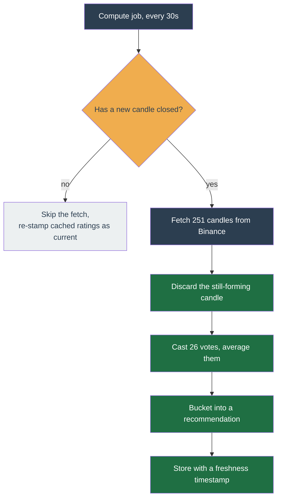

# Technicals

A **Technical Rating** is a single number between −1 and +1 summarising what 26 classic technical indicators say about one coin on one timeframe. The bot computes it itself, from public Binance candles, and uses it two ways: to **block a buy** when the reading is bearish, and optionally to **force a sell** when a held position turns.

The scoring method follows TradingView's published [Technical Ratings methodology][tv-ratings], so the number you see in the app should line up with TradingView's own gauge for the same coin and timeframe. That is deliberate — it gives you a free second opinion you can check by hand.

Nothing here is fetched from a third party at run time. The bot pulls raw candles from Binance and does the arithmetic locally, using an indicator library vendored into the repo (ported from [bennycode/trading-signals][attr] under MIT).

## How the rating is calculated

Four steps, on every configured timeframe.

### Step 1 — Get the candles

The worker fetches the last **251 candles** for the coin and timeframe, then **discards the candle still forming**. Every indicator therefore reads only closed candles, so a rating never flickers because the current minute is mid-move.

### Step 2 — Each indicator casts one vote

Every indicator returns exactly one of three votes: **Buy (+1)**, **Neutral (0)**, or **Sell (−1)**. There is no partial credit, and no indicator is weighted above another inside its group.

**The 15 moving-average votes.** Twelve are plain price-versus-average tests: the EMA and the SMA at periods 10, 20, 30, 50, 100, and 200. Two more use different average types at one period each. The fifteenth is the Ichimoku cloud.

| Indicator | Votes Buy (+1) when | Votes Sell (−1) when | Otherwise |
| --- | --- | --- | --- |
| EMA 10, 20, 30, 50, 100, 200 | price is above the average | price is below it | Neutral |
| SMA 10, 20, 30, 50, 100, 200 | price is above the average | price is below it | Neutral |
| VWMA 20 (volume-weighted) | price is above the average | price is below it | Neutral |
| Hull MA 9 | price is above the average | price is below it | Neutral |
| Ichimoku cloud | price is above the whole cloud **and** above the base line **and** conversion is above base | the exact mirror image | Neutral |

**The 11 oscillator votes.** These are momentum and strength gauges. Most need the previous candle's value too, because the rule is about direction, not level.

| Indicator | Votes Buy (+1) when | Votes Sell (−1) when | Otherwise |
| --- | --- | --- | --- |
| RSI (14) | below 30 **and rising** | above 70 **and falling** | Neutral |
| Stochastic | %K and %D both below 20, with %K above %D | %K and %D both above 80, with %K below %D | Neutral |
| CCI (20) | below −100 **and rising** | above +100 **and falling** | Neutral |
| ADX | ADX above 20, +DI above −DI, **and ADX rising** | ADX above 20, −DI above +DI, **and ADX falling** | Neutral |
| Awesome Oscillator | crosses above zero, or forms a saucer above zero (dips toward zero, then turns up) | crosses below zero, or forms a saucer below zero | Neutral |
| Momentum | higher than last candle | lower than last candle | Neutral |
| MACD | MACD line above its signal line | MACD line below its signal line | Neutral |
| Stochastic RSI | %K and %D both below 20, with %K above %D | %K and %D both above 80, with %K below %D | Neutral |
| Williams %R | below −80 **and rising** | above −20 **and falling** | Neutral |
| Bull/Bear Power | EMA(13) rising, bear power still negative but recovering | EMA(13) falling, bull power still positive but fading | Neutral |
| Ultimate Oscillator | above 70 | below 30 | Neutral |

!!! note "Ultimate Oscillator reads as momentum, not overbought"

    Above 70 is a **Buy** here, not a "too hot" warning. That is TradingView's rule
    for this gauge in the ratings context, and it is the opposite of how RSI's 70
    line is read. It is intentional, not a bug.

### Step 3 — Average the votes into three numbers

```text
recommendMa    = mean of the 15 moving-average votes
recommendOther = mean of the 11 oscillator votes
recommendAll   = (recommendMa + recommendOther) / 2
```

All three land in −1 … +1. The app shows all three: **Summary** is `recommendAll`, **Moving avg** is `recommendMa`, **Oscillators** is `recommendOther`.

!!! warning "The two groups are weighted equally, the individual votes are not"

    `recommendAll` averages the two **group** scores, not all 26 votes. So one
    oscillator vote is worth 1/11 of half the score, while one moving-average vote is
    worth only 1/15 of half. An oscillator flip moves the summary about 36% more than
    a moving-average flip does.

    This also means the moving averages tend to dominate the *direction*: in a steady
    uptrend all 15 price-versus-average tests vote Buy together, pinning `recommendMa`
    near +1, while the oscillators, which mostly need a specific setup, sit at 0.
    A quiet trending market therefore reads around +0.5, not +1.

**An indicator that cannot be computed votes Neutral, not nothing.** If there is not enough history for a 200-period average, that vote is 0 and still counts in the denominator. On a freshly listed coin this pulls the rating toward the middle, so a new coin reads weaker than it looks. This is why discovery has a minimum-age filter.

### Step 4 — Bucket the number into a recommendation

| Summary score          | Recommendation |
| ---------------------- | -------------- |
| `score >= 0.5`         | `STRONG_BUY`   |
| `0.1 <= score < 0.5`   | `BUY`          |
| `-0.1 < score < 0.1`   | `NEUTRAL`      |
| `-0.5 < score <= -0.1` | `SELL`         |
| `score <= -0.5`        | `STRONG_SELL`  |

These are TradingView's own boundaries, which is what makes the panel's "Compare on TradingView" link a meaningful cross-check.

### A worked example

A coin in a clean but unremarkable uptrend, on the `1h` timeframe:

- Price is above all 12 EMAs and SMAs, above the VWMA and the Hull MA, and above the Ichimoku cloud with bullish structure. **All 15 MA votes are +1**, so `recommendMa = 15/15 = 1.0`.
- Among the oscillators, only MACD (line above signal) and Momentum (higher than last candle) vote Buy. RSI sits at 58 — neither below 30 nor above 70 — so it is Neutral. Stochastic is mid-range, ADX is 18 so below its own threshold, and the rest have no setup. **2 votes of +1, 9 votes of 0**, so `recommendOther = 2/11 ≈ 0.18`.
- `recommendAll = (1.0 + 0.18) / 2 = 0.59` → **`STRONG_BUY`**.

Now the same coin stalls: price slips under the 10 and 20 period averages while the longer ones still hold, so 4 MA votes flip to −1 and `recommendMa = 11/15 ≈ 0.73`. MACD crosses down to −1 and Momentum goes to −1, so `recommendOther = −2/11 ≈ −0.18`. `recommendAll = (0.73 − 0.18) / 2 ≈ 0.27` → **`BUY`**. The rating degraded two steps from four averages and two oscillators turning, which is the sensitivity to expect.

## When the rating is recomputed

The compute job runs every **30 seconds**, but it does not fetch every time. It first asks whether a new candle has closed since the last computation. If none has, and every signal is still cached, it skips the fetch and simply re-stamps the cached signals as current.

That re-stamp matters: without it a perfectly valid `1h` rating would "age out" of the freshness window minutes after the candle closed, and buying would stop for the rest of the hour. With it, a `1h` timeframe fetches about once an hour rather than 120 times. If the re-stamp fails to commit, the signals are **not** marked fresh and the error is recorded — a failure never reports as healthy.



The compute job is the only writer of ratings. The API, the strategy, and the web app only ever read them. The backtest engine runs the **same** calculation per replayed candle, so a backtested gate decision matches the live one exactly.

[tv-ratings]: https://www.tradingview.com/support/solutions/43000614331-technical-ratings/

## Operator configuration

Per-profile config lives under the strategy's **Technicals** block. Full field reference, including bounds and defaults, is on the strategy page — for Trailing Trade see [Configuration](strategies/trailing-trade.md#configuration). The fieldset exposes:

- **`useOnlyWithinMin`** — buy-gate freshness window in minutes. A signal older than this is treated as expired. Default 5, comfortably above the compute cadence plus tick jitter.
- **`ifExpires`** — what the buy side does on an expired signal: `do-not-buy` (safer default) or `allow-anyway` (lets a stale signal still pass the gate). Buy-side only — the sell branch always ignores expired signals.
- **`intervals[]`** — up to three rows. Each names a candle interval (`1m`, `5m`, `15m`, `30m`, `1h`, `4h`, `1d`) and carries five toggles:
  - `whenStrongBuy` / `whenBuy` — interval's **buy-allow set**. A buy must pass every interval whose allow set is non-empty (AND across intervals). `NEUTRAL` always passes; `SELL`/`STRONG_SELL` always veto regardless of toggles. Default both on.
  - `whenSell` / `whenStrongSell` / `whenNeutral` — interval's **force-sell trigger set**. Fires a MARKET sell when any configured interval reports a matching recommendation while a position is held at profit and below its sell-trigger price. All three disabled by default.
  - `mode` — `block` (default) keeps the AND-veto semantics above. `advisory` records the row's verdict in the audit log but never vetoes the buy gate. Use to mark a noisy short timeframe as observability-only while still requiring longer TFs to consent.

The cap of three intervals keeps the cron's Binance klines weight budget in check (each call is weight 2 for our `limit=251` request); raise via a strategy plugin if you need more.

## Buy gate

Run on every tick before the strategy emits a buy:

1. **Freshness.** Any interval whose latest signal is older than `useOnlyWithinMin` minutes vetoes the buy with reason `technicals-stale` unless `ifExpires === 'allow-anyway'`.
2. **AND across block intervals.** Every configured `block` row's signal must be in that row's buy-allow set. On a `block` row, `NEUTRAL` passes and `SELL`/`STRONG_SELL` veto with reason `technicals-sell` (a bearish market read). A **bullish** recommendation that is not in the row's allow-buy set — e.g. a `STRONG_BUY` when the operator left "Strong Buy" unchecked on that interval — vetoes with the distinct reason `technicals-disallowed`, so the log never reads a bullish reading as a sell. The config-lint rule `technicals-strong-buy-unchecked` flags the most common form of this trap (a row that allows `BUY` but not `STRONG_BUY`). Rows configured with `mode: 'advisory'` are evaluated for the audit log but skipped during the veto reduction — their `(recommendation, verdict)` appears in `intervalsConsulted` with `advisory: true` so dashboards can render "would have vetoed".
3. **Per-interval breakdown.** The veto log carries every interval's `(recommendation, verdict, advisory)` so the audit page can show the operator exactly which interval blocked the buy and which rows were advisory-only.

`forceBuyOverride.checkTechnicals = false` bypasses the gate entirely — use only for a manually validated symbol.

## Force-sell

Steps ahead of the normal sell ladder when Technicals calls a downturn:

1. The profile has a held position (`avgEntryPrice` set).
2. Current price is below the configured sell-trigger price (the same trigger the normal grid-sell branch uses — force-sell only fires when the regular ladder has not already armed).
3. The position is in profit by at least the configured floor: `currentPrice > avgEntryPrice × (1 + sell.forceSellMinProfitPercent/100)`. The rule never sells at a loss, and `forceSellMinProfitPercent` (default `'0'` = any profit) lets the operator require a gain larger than the round-trip fee so a force-sell cannot book a sub-fee "win".
4. Any configured interval's signal recommendation is in that interval's force-sell trigger set.
5. The matched signal is fresh per `useOnlyWithinMin`. Stale signals never trigger a force-sell, even under `ifExpires: 'allow-anyway'` — the asymmetry is intentional: `ifExpires` is a buy-side stance only.

**Discovery single-entries are exempt.** A position opened by auto-discovery (`state.discoveryEntry === true`) never force-sells: a momentum/breakout pick is meant to run, and a force-sell clips it at a tiny profit the moment a short interval flips bearish (noise on a fresh breakout). It exits only via the ATR trailing stop (let the winner run), the hard stop, or the discovery time-stop. The suppression is at the `tick.ts` call site, so the evaluator stays a pure, discovery-agnostic function.

### Confirm window and re-entry cooldown

Two knobs on the Technicals block. Both are now **optional** rather than zero-defaulted: when a knob is left unset, the strategy derives a safe non-zero default whenever a **sub-1h** force-sell trigger is armed (`1m`/`5m`/`15m`/`30m` with any of `whenSell`/`whenStrongSell`/ `whenNeutral`). A sub-1h trigger reacts to a single intraday print, so an unguarded force-sell whipsaws the position: it sells on one flickering reading and can rebuy on the very next tick. An explicit value, including `0`, is always honoured as an informed opt-out. The same resolver runs at parse time (so a fully-parsed config carries concrete minutes) and at tick time (so a raw stored config written before these fields existed still gets the safe default).

- **`forceSellConfirmMinutes`.** The Sell/Strong-Sell signal must stay present continuously for this many minutes before the force-sell fires. The first present tick is stamped, and the stamp clears the moment the signal is absent, so a single flickering reading never sells you out of a position. Unset resolves to one candle of the shortest enabled sub-1h trigger interval (e.g. a `5m` trigger ⇒ 5; with both `5m` and `30m` armed it is still 5, sized to the fastest interval, so a slower interval's candle outlasts the window); `0` fires on the first matching reading. While the window is pending, the worker logs `tt-force-sell-confirm-pending`.
- **`forceSellReentryCooldownMinutes`.** After a force-sell, every fresh first entry on that symbol is blocked for this many minutes, so the strategy does not buy straight back into the downturn it just sold out of. Unset resolves to `60` when any sub-1h trigger is armed, else `0`; an explicit `0` applies no cooldown. A blocked entry logs `tt-force-sell-cooldown-blocked`, so the suppression is visible during triage.

### Recommended force-sell baseline

A force-sell is a blunt exit: it sells the whole position the moment a configured downturn signal prints. To keep it from churning a position on intraday noise:

- **Reserve force-sell for `≥1h` confirmation.** A `1h` (or slower) signal is a deliberate close-of-candle read; a `1m`–`30m` signal flips on ordinary chop.
- **Prefer `whenStrongSell: true` over `whenSell: true` on the short intervals.** On `15m`/`30m`, leave `whenSell` off and arm only `whenStrongSell` so a single soft SELL print does not trigger an exit.
- **Always pair a short-interval trigger with a confirm window and a rebuy cooldown.** The defaults above do this for you when you leave the knobs unset, but set them explicitly if you want a longer window than one candle. The web config form shows an inline warning when a force-sell trigger is armed while either effective guard is `0`.

## Observability

- **Operator UI.**
  - **Dashboard pill** + **symbol panel pill**: same component, four states (`technicals` / `technicals degraded` / `technicals outage` / `technicals silent`). Tooltip shows per-interval latency, error, `lastFreshAtMs`, and (when an outage is active) next-probe ETA.
  - **Symbol Technicals panel**: per-interval tab strip with verdict gauges (Summary / Oscillators / Moving avg) and a 32-row indicator table for the active interval.
- **Worker logs.** `technicals computeAndCache: committed` on every cron tick (one per interval) with `written`/`skippedErrored`/ `latencyMs` and a `technicals compute-recovered` event on a failed → success transition.
- **Audit page.** Force-sell rows render the full per-interval breakdown and signal age, so an operator can reconstruct any exit without scraping logs.

### Entry-blocker visibility

Every tick that looks at the buy path but places no order records WHY in the strategy state's `entryBlocker` field (`{ reason, detail? } | null`). It is pure data the strategy resolves from the collected buy-path vetoes in a fixed priority (force-sell cooldown > regime-exit bear > regime > risk caps > discovery guardrail > technicals > indicator > awaiting-trigger-price > min-order skip); `null` means a buy fired or nothing is blocking. The reason codes are stable kebab-case strings and `detail` carries only the sparse numbers that explain the block (e.g. `{ windowLow, triggerPercentage, currentPrice }` for `awaiting-trigger-price`).

Three surfaces consume it:

- **Symbol page status line.** A plain-language sentence ("Not buying: waiting for the price to dip to your buy trigger") rendered from a web gloss map, so a non-expert operator sees why a coin is idle without reading logs. The gloss map is shared across the app so every surface glosses a blocker identically.
- **Discovery dashboard.** Each live auto-discovered candidate row glosses its `entryBlocker` via the same shared gloss lib, so the operator sees why an added pick has not entered (a slot occupied but never buying) without opening the symbol page. The blocker is read server-side from persisted strategy state and is `null` for non-auto rows.
- **On-change action_log.** The worker (`tick/build-tick-input.ts`) wraps the state commit and writes ONE `action_log` only when `entryBlocker.reason` changes across ticks. This replaces the old per-tick gate-veto spam: a steady "waiting for a dip" state logs once, not about 86k rows/day. The write is best- effort (swallowed on failure so it never breaks the tick). Per-tick buy-gate vetoes are therefore no longer shipped to `action_logs` from the audit drain (`isActionableAudit` keeps order actions and technicals force-sells only); force-sell rows still ship because a force-sell co-emits a SELL order.

The `entryBlocker` field and its on-change `action_log` are a generic contract, not a Trailing Trade feature: the priority list above is Trailing Trade's own veto ordering, but any strategy that writes `entryBlocker` gets the same queryable rows through the unchanged worker path. Momentum does (its reasons are `already-entered-this-candle`, `insufficient-history`, `below-trend`, `falling-trend`, `extension-insufficient-history`, `sizing-unconfigured`, `cap-reached`, and the exchange-filter skips). A strategy names the config lever behind each of its reasons on its own descriptor via `reasonAttribution` (single source of truth per invariant 1), so the backtest decision-breakdown glosses any strategy's blocker off that declaration rather than the Trailing Trade web gloss map.

## IndicatorComputer state

The push-based IndicatorComputer keeps per-`(symbol, interval)` running state for SMA(20), EMA(20), and RSI(14) in memory and persists each indicator's serialised state to Redis at `indicatorState:<symbol>:<interval>:<indicatorId>` with a 24-hour TTL. On worker restart the first `recompute` per key rehydrates from Redis; a missing or corrupt blob falls through to a ZSET-window cold seed. The unsubscribe path calls `IndicatorComputer.clear(symbol, interval)` to drop both the in-memory entry and the three Redis blobs so dead keys do not accumulate.

**Semantic note (operator-facing).** The incremental EMA/RSI are _running_ indicators seeded once and folded forever after; the earlier full-window implementation re-seeded EMA/RSI from a sliding 20-candle base each tick. SMA is unchanged (window-local). Strategies tuned against the pre-rewire windowed values will see drift; the recursive form is the textbook one.

## Reliability

- **No external dependency at run time.** The worker fetches public Binance klines (unauthenticated, weight 2 per call at our 251-candle limit) and computes ratings locally. If Binance's klines endpoint is throttling, the per-symbol fetch fails are counted on the receipt; the pill goes amber/red within the 300s receipt TTL.
- **Bounded retry.** One retry (two attempts total) with Retry-After support. A single rate-limit blip self-heals on the next cron tick.
- **Crash-only.** Per-symbol writes go in one pipeline; the receipt is a follow-up SET after the pipeline commits (or fails), so the dashboard always sees a non-null `error` summary on partial failure rather than silently corrupting state.

[attr]: https://github.com/bennycode/trading-signals
