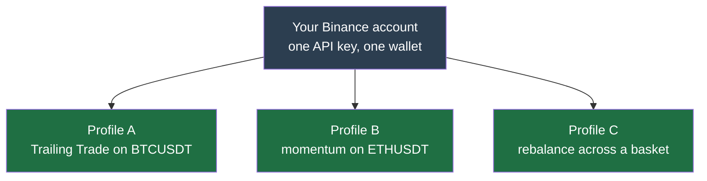
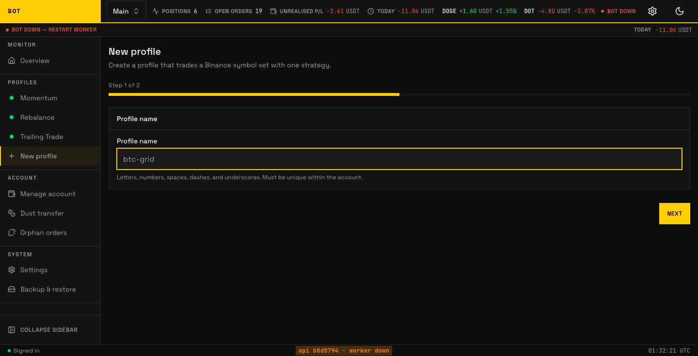

# Configure your first profile

Now you will create a **profile** — one independent trading setup — and tell it which coins to trade and how much to spend.

## Profiles, in plain terms

A **profile** bundles four things:

1. **A strategy** — the rulebook it trades by. See [Strategies](../concepts/strategies/index.md).
2. **A list of coins** — the pairs it is allowed to trade, e.g. `BTCUSDT`, `ETHUSDT`.
3. **A budget** — how much money it may put to work.
4. **Its own state** — each profile tracks its positions separately.

Each Binance account can run several profiles at once, each with its own strategy, coins, and budget. They share that account's wallet but decide independently, so a steady Bitcoin profile and a more active alt-coin profile never interfere.

## Create your first profile

In the dashboard, open your account and choose **New profile**. A two-step wizard walks you through it.

_Step 1: name the profile. Seeded demo data, not a real account._

- **Name** — anything memorable, e.g. "BTC cautious".

_Step 2: pick the strategy, then **Create profile**. Seeded demo data, not a real account._

- **Strategy** — the rulebook it trades by. [Compare the three](../concepts/strategies/index.md) and pick the one whose assumption matches how you expect the market to move.

The profile is created with the strategy's default settings, so you have a working profile in two steps. You then tune it on the profile's own pages:

- **Strategy settings** — the knobs specific to the strategy you picked. The form is rendered from the strategy's own schema, so you only ever see fields that apply to your choice.
- **Coins** — the pairs to trade. You can also let the bot **discover** coins automatically (see [Discovery](../concepts/discovery.md)) instead of listing them by hand.

## Where the exact settings are documented

This page stays high-level.

- **Profile fields** — you edit them in the app; the form is generated from the strategy's own schema, so it always matches the strategy you picked. Every field is documented on that strategy's [Concepts](../concepts/strategies/index.md) page.
- **[Environment variables](../operations/env-vars.md)** — server-wide settings in `.env` (ports, database, retention).
- **[Notifiers](../concepts/notifiers.md)** — connect Slack or Telegram so the bot can message you.

## Notifications (optional but recommended)

A **notifier** sends you a message when the bot buys, sells, or hits a problem. Slack and Telegram are supported. Set one up so you are not glued to the dashboard — see [Notifiers](../concepts/notifiers.md).

## Next

With a profile saved, you are ready to switch it on for real money. Follow the pre-flight and enable it in **[Go live](go-live.md)**.
