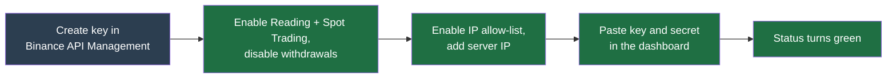

# Install & deploy

Goal: get the bot running on a server and connected to Binance. Budget about **30 minutes** on a clean machine.

This page is the complete first-run deploy — the commands are here, not on another page. Once you are running, [Production deploy & operations](../operations/deploy.md) covers the production overlay, TLS, and day-to-day commands, and [Environment variables](../operations/env-vars.md) documents every `.env` setting.

## What you need first

- **A small Linux server** (a cheap VM is fine): 2 vCPUs, 4 GB RAM, 20 GB disk.
- **Docker** 24+ with **Docker Compose** 2.20+. Docker is the tool that runs the app in isolated containers so you do not install anything by hand.
- **Outbound HTTPS** to `api.binance.com` and `wss://stream.binance.com`.
- **A Binance account.** You create the API key in step 6 below.

## Step 1 — Clone the repository

```bash
git clone https://github.com/chrisleekr/binance-trading-bot.git
cd binance-trading-bot
```

## Step 2 — Create `.env`

```bash
cp .env.example .env
```

!!! tip "What is `.env`?"

    A plain text file holding your settings and secrets. The app reads it at
    startup. Never commit it or share it — it contains passwords.

Edit `.env` and set `WEB_ORIGIN` to the address you will open the app at, for example `WEB_ORIGIN=https://bot.example.com`. Under Docker Compose leave `DATABASE_URL` and `REDIS_URL` at their defaults — the compose files supply in-network values. Every other variable has a working default; see [Environment variables](../operations/env-vars.md) when you want to change one.

## Step 3 — Generate the session secret

`AUTH_SECRET` signs your login cookie. Boot fails if it is shorter than 32 characters, so generate a real one:

```bash
sed -i.bak "s|^AUTH_SECRET=.*|AUTH_SECRET=$(openssl rand -hex 32)|" .env && rm .env.bak
```

## Step 4 — Start the stack

```bash
docker compose -f deploy/compose/docker-compose.yml --env-file .env up -d
```

A bare `docker compose up` from the repo root does **not** work — there is no compose file there. Postgres and Redis start first; the `app` service waits for them. Database migrations run automatically on boot, so there is nothing to run by hand.

Check it came up healthy:

```bash
docker compose ps                        # every service shows (healthy)
curl -fsS http://127.0.0.1:9100/healthz  # api liveness
curl -fsS http://127.0.0.1:9100/readyz   # api readiness (DB + Redis)
```

## Step 5 — Create your operator account

Open `WEB_ORIGIN` in a browser. The first-run screen prompts you to create the master account. There is no email verification and no second factor — it is a single-operator app. See [Auth & threat model](../architecture/auth.md).

## Step 6 — Create a Binance API key

An **API key** is a pair of long strings (a _key_ and a _secret_) that let the bot act on your Binance account without your password.

1. In Binance, open **API Management** and create a new key.
2. Enable **both** "Enable Reading" (lets the bot read wallet balances and account snapshots) and "Enable Spot & Margin Trading" (lets it place and cancel orders). Leave **"Enable Withdrawals" off** — the bot never needs it. The [API key page](../user-guide/account/api-key.md) is the canonical reference for these permissions.
3. Turn on **Restrict access to trusted IPs only** and add your server's egress IP (`curl -s ifconfig.me` from the VM). This is the single most important safety step: even if the key leaks, it only works from your server.

!!! danger "The bot stores API keys unencrypted"

    Keys are saved as plain text in the database. The IP allow-list above is what
    keeps a leaked key useless. This trade-off is explained in
    [Auth & threat model](../architecture/auth.md).

## Step 7 — Connect the key in the dashboard

Open your account's **API keys** page and paste the key and secret. The bot immediately checks them against Binance and shows a green status if they work.

The whole key setup, end to end:



## Next

Your bot is running and connected but not yet trading. Continue to **[Configure your first profile](configure.md)**.
