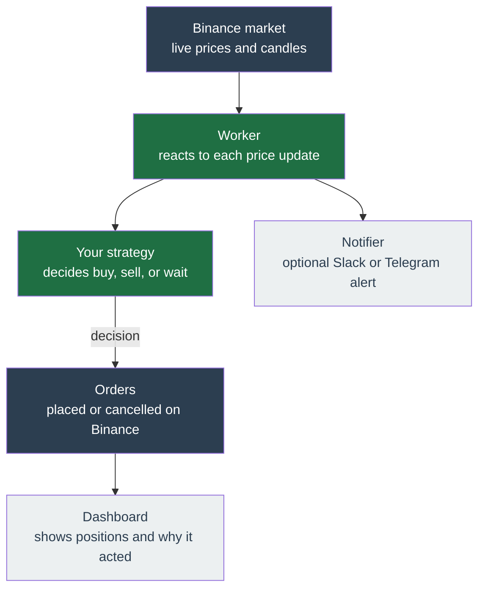

# Binance Trading Bot

!!! danger "Read this first — real money, real risk"

    **Not production-ready.** A ground-up rewrite under active development —
    **do not point it at real funds yet.**

    **I cannot guarantee whether you can make money.** Use it entirely at your
    own risk. I take no responsibility for any loss or hardship incurred directly
    or indirectly by using this code. Read the full [disclaimer](#disclaimer) at
    the bottom of this page before using it.

A self-hosted app that trades on **Binance** for you, following rules you set. You run it on your own server, connect it to your Binance account with an API key, and it watches the market and places buy and sell orders on your behalf.

!!! info "Every screenshot in this guide shows fabricated data"

    The screenshots are generated automatically against a throwaway database filled
    with **seeded demo data**. Every balance, price, position, profit and loss figure
    in them is invented — no real account, no real money, and not a track record.
    They are there to show you where things are on each screen, nothing more. Each
    image says so in its caption.

## Pick your path

<!--
  Material's card grid is a list whose body is a 4-SPACE continuation
  (reference/grids.md). Python-Markdown needs the full tab_length to read that
  body as part of the item; at 2 spaces the divider and the description fall out
  of the card and render as siblings, which is the broken layout this page had.
  Prettier normalises list continuation to 2 spaces, so it silently reintroduces
  exactly that bug — hence the fence below, which needs a blank line around each
  marker or prettier folds the marker into a neighbouring HTML block and stops
  seeing it. `scripts/ci/no-broken-grid-card.sh` fails the build if it regresses.
-->

<!-- prettier-ignore-start -->

-   :material-play-circle:{ .lg .middle } **[Get started](get-started/index.md)**

    ---

    The ordered first-run path: install on a server, connect Binance, configure a
    profile, and go live.

-   :material-book-open-variant:{ .lg .middle } **[User Guide](user-guide/index.md)**

    ---

    Every screen and field, mirroring the app sidebar: dashboard, profile sections,
    account, and system settings.

-   :material-lightbulb-on:{ .lg .middle } **[Concepts](concepts/index.md)**

    ---

    How it decides: strategies, discovery, technicals, execution modes, and
    backtesting.

-   :material-code-braces:{ .lg .middle } **[Contributing](contributing/index.md)**

    ---

    Build on it: the architecture, adding a strategy or notifier, and the
    contribution rules. Assumes you read code.

<!-- prettier-ignore-end -->

## How it works, in one picture

Once running, the bot repeats a short loop for every coin you told it to watch. The [Strategies](concepts/strategies/index.md) page explains each decision.

**Reading the loop:**

1. **Market** — Binance streams live prices and candles for the coins you chose.
2. **Worker** — the always-on background process reacts to each new price update from Binance, handling one coin at a time.
3. **Your strategy** — a plug-in set of rules looks at the price, your holdings, and your settings, then decides: buy, sell, or do nothing.
4. **Orders** — if it decides to trade, it places or cancels an order on Binance.
5. **Dashboard** — the web page shows your open positions, recent orders, and the reason behind each action.
6. **Notifier** — optionally, it pings you on Slack or Telegram when something happens.

## What makes it different

- **Strategy-pluggable.** A _strategy_ is the rulebook the bot follows. Three ship today — [Trailing Trade, Momentum, and Rebalance](concepts/strategies/index.md) — and you pick one per profile.
- **Multi-profile.** One Binance account can run several independent setups (_profiles_) at once, each with its own coins and strategy.
- **Reliability-first.** If the app crashes and restarts, it picks up exactly where it left off and never double-places an order.
- **Mobile-first.** The dashboard is fully usable on a phone.

## New here?

Start with **[Get started](get-started/index.md)**.

## Disclaimer

I give no warranty and accept no responsibility or liability for the accuracy or the completeness of the information and materials contained in this project. Under no circumstances will I be held responsible or liable in any way for any claims, damages, losses, expenses, costs or liabilities whatsoever (including, without limitation, any direct or indirect damages for loss of profits, business interruption or loss of information) resulting from or arising directly or indirectly from your use of or inability to use this code or any code linked to it, or from your reliance on the information and material on this code, even if I have been advised of the possibility of such damages in advance.

**Use it at your own risk.**
