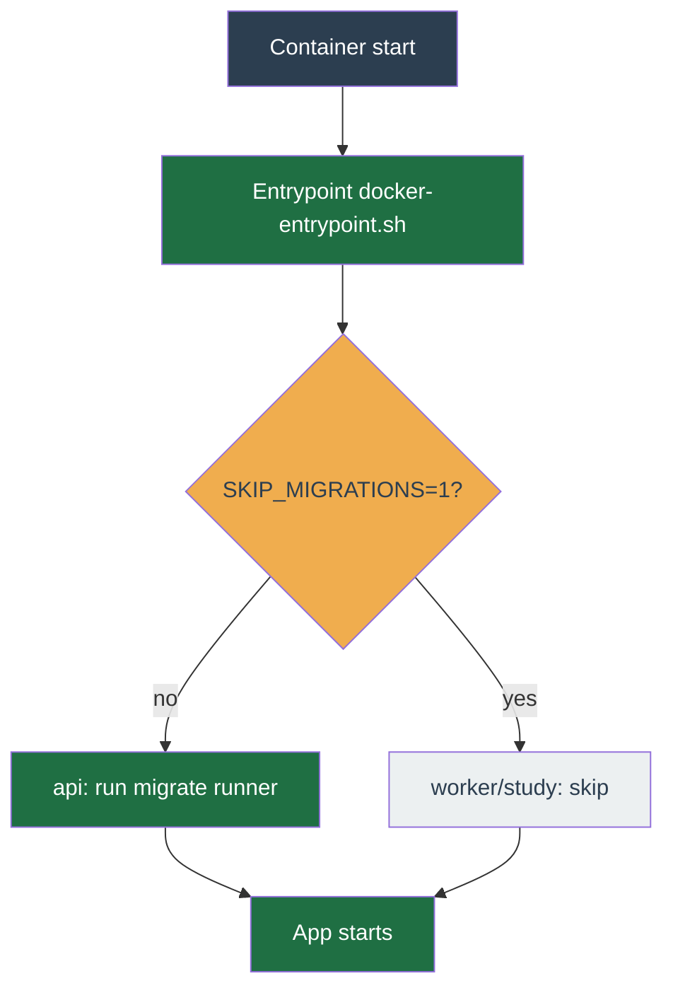

# Production deploy & operations

Day-two reference. The first-run deploy — clone, `.env`, start, create the operator, connect Binance — is [Install & deploy](../get-started/install.md); this page picks up where that one ends and covers the production overlay, TLS, migrations, and the commands you run afterwards.

The canonical, always-current runbook lives in the repo at [`deploy/README.md`](https://github.com/chrisleekr/binance-trading-bot/blob/main/deploy/README.md) (open it in your clone). It also carries the off-host backup recipe and deeper troubleshooting.

## Production overlay

Production adds three secret files and the production compose overlay on top of the base stack. The bundled Postgres and Redis read their passwords from `deploy/secrets/*` directly rather than from `.env`.

**1. Generate the secret files.**

```bash
mkdir -p deploy/secrets
openssl rand -hex 32 > deploy/secrets/session_secret
openssl rand -hex 32 > deploy/secrets/postgres_password
openssl rand -hex 32 > deploy/secrets/redis_password
chmod 600 deploy/secrets/*
```

**2. Patch `.env` for the api.** The api reads `AUTH_SECRET` and the auth-aware `REDIS_URL` from the environment, so those two have to be mirrored out of the secret files.

```bash
REDIS_PW=$(cat deploy/secrets/redis_password)
sed -i.bak \
  -e "s|^AUTH_SECRET=.*|AUTH_SECRET=$(cat deploy/secrets/session_secret)|" \
  -e "s|^REDIS_URL=.*|REDIS_URL=redis://:${REDIS_PW}@redis:6379|" \
  .env && rm .env.bak
chmod 600 .env
```

**3. Pull the images.** Public Docker Hub repo; `docker login` first only if you hit the anonymous rate limit.

```bash
docker compose -f deploy/compose/docker-compose.yml \
               -f deploy/compose/docker-compose.prod.yml \
               --env-file .env pull
```

**4. Start the production stack.**

```bash
docker compose -f deploy/compose/docker-compose.yml \
               -f deploy/compose/docker-compose.prod.yml \
               --env-file .env up -d
```

## TLS at the edge

The stack serves plain HTTP on `APP_HTTP_PORT` and does not bundle a reverse proxy. Front the `app` service with TLS — Cloudflare Tunnel, an nginx or Traefik host proxy, or a hosted edge. The three reference configurations are in [`deploy/README.md`](https://github.com/chrisleekr/binance-trading-bot/blob/main/deploy/README.md#tls-at-the-edge).

## Database migrations: boot vs. manual

Migrations run **automatically on boot** — the container entrypoint (`apps/server/docker-entrypoint.sh`) runs the idempotent migration runner before the app starts, so a first-time operator does nothing here. In the split topology only the `api` service migrates; `worker` and `study` set `SKIP_MIGRATIONS=1` so concurrent runners never race on `_app_migrations`. The manual offline path, run by hand only when the app is not booting, is:

```bash
docker compose exec app bun /app/dist/migrate.js
```



## Common operator commands

```bash
docker compose logs -f app                          # tail the app
docker compose run --rm backup                      # one-shot backup
docker compose run --rm app bun run reset-password  # reset the master password
docker compose down                                 # stop (volumes preserved)
```

## Changing configuration

Every process-level setting lives in `.env` and takes effect on restart. See [Environment variables](env-vars.md) for the full list. Per-profile trading settings are not environment variables — they live in the database and are edited in the app.
