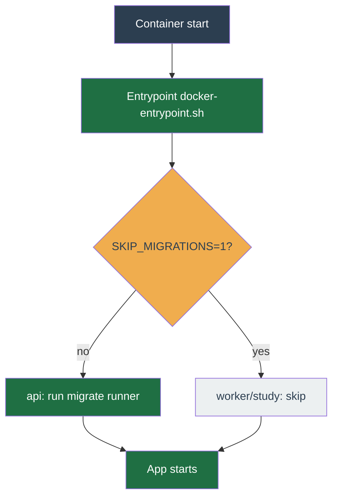

# Production deploy & operations

Day-two reference. The first-run deploy — clone, `.env`, start, create the operator, connect Binance — is [Install & deploy](../get-started/install.md); this page picks up where that one ends and covers the production overlay, TLS, migrations, and the commands you run afterwards.

The canonical, always-current runbook lives in the repo at [`deploy/README.md`](https://github.com/chrisleekr/binance-trading-bot/blob/main/deploy/README.md) (open it in your clone). It also carries the off-host backup recipe and deeper troubleshooting.

## Production overlay

Production adds three secret files and the production compose overlay on top of the base stack. The bundled Postgres and Redis read their passwords from `deploy/secrets/*` directly rather than from `.env`.

**1. Generate the secret files.**

```bash
mkdir -p deploy/secrets
openssl rand -hex 32 > deploy/secrets/session_secret
openssl rand -hex 32 > deploy/secrets/postgres_password
openssl rand -hex 32 > deploy/secrets/redis_password
chmod 600 deploy/secrets/*
```

**2. Patch `.env` for the api.** The api reads `AUTH_SECRET` and the auth-aware `REDIS_URL` from the environment, so those two have to be mirrored out of the secret files.

```bash
REDIS_PW=$(cat deploy/secrets/redis_password)
sed -i.bak \
  -e "s|^AUTH_SECRET=.*|AUTH_SECRET=$(cat deploy/secrets/session_secret)|" \
  -e "s|^REDIS_URL=.*|REDIS_URL=redis://:${REDIS_PW}@redis:6379|" \
  .env && rm .env.bak
chmod 600 .env
```

**3. Pull the images.** Public Docker Hub repo; `docker login` first only if you hit the anonymous rate limit.

```bash
docker compose -f deploy/compose/docker-compose.yml \
               -f deploy/compose/docker-compose.prod.yml \
               --env-file .env pull
```

**4. Start the production stack.**

```bash
docker compose -f deploy/compose/docker-compose.yml \
               -f deploy/compose/docker-compose.prod.yml \
               --env-file .env up -d
```

## TLS at the edge

The stack serves plain HTTP on `APP_HTTP_PORT` and does not bundle a reverse proxy. Front the `app` service with TLS — Cloudflare Tunnel, an nginx or Traefik host proxy, or a hosted edge. The three reference configurations are in [`deploy/README.md`](https://github.com/chrisleekr/binance-trading-bot/blob/main/deploy/README.md#tls-at-the-edge).

## Database migrations: boot vs. manual

Migrations run **automatically on boot** — the container entrypoint (`apps/server/docker-entrypoint.sh`) runs the idempotent migration runner before the app starts, so a first-time operator does nothing here. In the split topology only the `api` service migrates; `worker` and `study` set `SKIP_MIGRATIONS=1` so concurrent runners never race on `_app_migrations`. The manual offline path, run by hand only when the app is not booting, is:

```bash
docker compose exec app bun /app/dist/migrate.js
```



## Alert rules

`deploy/observability/alerts.yml` ships eleven Prometheus alerting rules, in two groups: `binance-trading-bot.workers` for the trading and audit paths, `binance-trading-bot.infra` for the process pressures underneath them. Load the file into your Prometheus stack; the Alertmanager, PagerDuty and Slack receiver wiring is yours to own.

Every series these rules read is listed on the [Metrics reference](metrics.md), generated from the worker's own metric catalogue.

### Scrape config the rules assume

No rule works against an arbitrary scrape setup. `WorkerDown` matches `up{job="worker"}`, and `job` is not a label the app emits — Prometheus stamps it from the `job_name` **you** choose, so the rule is inert if you name it anything else.

`/metrics` is also not on the public port. Each service exposes it on a separate admin listener, and **at defaults those listeners are unreachable from any other container**: `ADMIN_HOST` and `WORKER_ADMIN_HOST` both default to `127.0.0.1`, which inside a container means that container's own loopback. A Prometheus container on the `internal` network gets connection-refused, and publishing the port does not help either — Docker forwards a published port to the container's IP, not to its loopback.

Widen the bind, and scrape over the compose network:

```bash
# .env — required for Prometheus to reach either admin listener at all
ADMIN_HOST=0.0.0.0
WORKER_ADMIN_HOST=0.0.0.0
```

```yaml
scrape_configs:
  - job_name: 'worker' # WorkerDown matches this exact name
    static_configs:
      - targets: ['app:9101'] # WORKER_ADMIN_PORT
  - job_name: 'api'
    static_configs:
      - targets: ['app:9100'] # ADMIN_PORT
```

Run Prometheus on the `internal` network so those hostnames resolve. In the default single-container `ROLE=all` deployment both listeners live in the same `app` container, which is why both targets share a hostname; in the split topology (`docker-compose.scale.yml`) point each job at its own service.

!!! warning "Do not add 9100 or 9101 to `ports:`"

    `/healthz`, `/readyz` and `/metrics` are **unauthenticated**, and `/metrics` carries per-profile operational detail. Widening the bind to `0.0.0.0` exposes them to the compose network, which is the point; publishing them puts them on your LAN. Keep them off `ports:` and let Prometheus reach them container-to-container. If you must expose them beyond the host — on Kubernetes, say — restrict the port with a NetworkPolicy: a Service is not a firewall.

| Alert | Severity | Fires when |
| --- | --- | --- |
| `WorkerDown` | critical | No `/metrics` scrape from `job=worker` for 2 minutes. v1.0 is single-replica, so trading is halted until the worker recovers. |
| `BinanceWeightExhausted` | critical | `binance_api_weight` stays above 1000 for 2 minutes. Binance bans above 1200, so this leaves headroom to reduce profile cadence or pause symbols first. |
| `AuditDrainerBacklog` | warning | For 10 minutes an audit stream's read-but-unpersisted pile kept growing (`audit_consumer_pending` rose over the last 8 minutes) or more than 10000 entries sat undelivered (`audit_consumer_lag`), **or** at least one pass in the last 5 minutes could not measure the backlog for a reason other than trimming (`audit_consumer_lag_unknown{cause!="trimmed-past-group"}` increased, so `probe-failed` or `group-missing`). Postgres unreachable moves `audit_consumer_pending`, not `audit_consumer_lag`: the drainer keeps reading fine and only the persist fails, so entries pile up delivered-but-unacknowledged. Those entries are not lost — a later pass claims them back and persists them — so the alert is about the backlog still growing, not about the level. Audit loss is observational, so this is a warning, not a page. |
| `AuditEntriesTrimmedBeforeDelivery` | warning | An audit stream was trimmed at its approximate entry cap (`XADD MAXLEN ~`, sized by the operator-settable **Trace buffer** in Settings, default 100000) and dropped entries the drainer had never read (`audit_consumer_lag_unknown{cause="trimmed-past-group"}` increased), for 1 minute. Split out of `AuditDrainerBacklog` because it reports loss that has already happened and Redis stops reporting it within minutes of the drainer catching up, so a 10-minute `for` would never see it. A single occurrence pages: the 5-minute range outlasts the 1-minute hold, which is deliberate for loss that waiting cannot recover. |
| `AuditPoisonEntryDropped` | warning | The drainer discarded an audit entry that Postgres rejected on its own (`audit_poison_entries_dropped` increased), for 1 minute. A reclaimed entry that has been redelivered past the delivery ceiling and then fails a solo re-persist, which the drainer reaches by bisecting the failed batch, with a row-deterministic SQLSTATE _while a sibling entry in the same pass is written to Postgres_ is a bad row, not a bad backend, so it is acknowledged away instead of failing every batch it joins forever. The same counter also carries `cause="corrupt-json"` for an entry whose body will not parse, or parses without the fields `action_logs` needs. Under either of those the `action_logs` row will never exist and no other series shows it: the entry leaves the pending list exactly as if it had been written. `cause="no-body"` is the odd one — the reclaim kept claiming an entry back with no body field at all until it crossed the delivery ceiling, so most likely there was never a row to lose, but it is also the one cause whose reply shape the drainer cannot explain, so check whether something else is writing to `audit:*` before treating that as settled either way. Every drop logs a message containing `dropping`, so search the worker logs for that (`corrupt-json` logs at warn, the other two at error) — a `rejected` line carries the entry id and the database error, a `no-body` line the entry id and its delivery count. |
| `AuditEntryReadWithoutBody` | warning | A live read off an audit stream returned an entry with no usable body (`audit_read_no_body` increased), for 1 minute. The shipper always writes a `body` field, so any rise means something else is writing to `audit:*` — or Redis answered in a shape the drainer does not model. **Nothing has been lost at this point**: the entry stays in the pending list, and only if it keeps coming back body-less past the delivery ceiling is it acknowledged away as `AuditPoisonEntryDropped` with `cause="no-body"`. This rule exists because `AuditPoisonEntryDropped` cannot fire until the entry has been reclaimed past its delivery ceiling (5 deliveries), and each reclaim needs the entry to have sat idle for 60 seconds first, so the earliest that second alert can speak is roughly six minutes after the first sighting. Expect both alerts for one persistent entry, minutes apart: the first says the condition started, the second says the drainer gave up. Each sighting logs a warn containing `read an entry with no body` with the stream and entry id — run `redis-cli --no-raw XRANGE` for that id to see what was actually written. Pass `--no-raw` deliberately: redis-cli uses raw output whenever stdout is not a tty (piping to `less`, `grep`, or a file), which would render an unknown writer's bytes to your terminal unescaped. |
| `AuditEntriesStuck` | warning | For 10 minutes the reclaim kept claiming the same audit entries back and neither persisted nor discarded them (`audit_entries_stuck` increased over the last 5 minutes). Nothing is lost yet, but no pass is making progress on those rows and they go for good once the stream is trimmed at its entry cap. This is the one reclaim outcome no other series shows: the reclaim counter only moves on a persist, the drop counter only on a discard, and `audit_consumer_pending` merely holds a floor, which reads exactly like a batch legitimately in flight. The 5-minute range is deliberately shorter than the 10-minute hold, so a single failed pass — a Postgres blip, already covered by `AuditDrainerBacklog` — leaves the range before the hold completes and does not page. |
| `HighTickFailureRate` | critical | More than 5% of ticks threw over 10 minutes (`tick_failures_total` / `tick_total`). A ratio rather than a count, because tick volume scales with the active profile and symbol count; aggregated across profiles, because it asks whether trading as a whole is degraded. `tick_total` counts completed, throttled and thrown ticks alike, so the denominator does not shrink when the failures arrive. |
| `QueueBacklog` | critical | A BullMQ queue held more than 1000 waiting jobs for 5 minutes (`bullmq_queue_wait_jobs`, labelled by `queue`). v1.0 is single-replica, so a backlog cannot be absorbed by scaling out: this is the consumer falling behind, not a burst. The worker samples queue depth once a minute, so the 5-minute hold is five samples. |
| `DBPoolStarved` | critical | Something waited for a Postgres connection for 5 minutes straight (`pg_pool_waiting > 0`). Any waiter at all is the condition — nothing queues on a pool with a connection to give. Compare `pg_pool_idle` against `pg_pool_total` to tell "pool too small for the profile count" from "connections held by slow queries". Scope: sampled by the worker over the **worker** pool only; the api pool has never had a gauge, so api starvation is invisible here. Since checkouts gained a 5s deadline a waiter is ejected rather than queueing, so this can stay silent through a real episode — for the api, watch `http_requests_total{status="503"}` instead, which is a separate pool in a separate process and therefore normally a different incident. |
| `WSDisconnectsHigh` | warning | More than five Binance websocket closes in 15 minutes (`binance_ws_disconnects_total`, counted per account at close, and only for closes the worker did not ask for — disabling a profile or shutting the worker down is not counted, or a deploy would page by itself). One reconnect is routine — Binance cycles a connection every 24 hours, and so does any network blip — while five in a quarter of an hour is a stream that cannot stay up. Warning, not critical: the pool reconnects on its own, so account and order updates are stale for the gap rather than trading being halted. |

`BinanceWeightExhausted` is deliberately unaggregated. The weight header covers the whole API key, so every profile on an account samples the same account-wide number: summing would multiply it by the count of actively trading profiles. Each profile over the ceiling raises its own instance labelled with its `profileId` — group them in Alertmanager if the duplicates are noisy.

!!! note "`BinanceWeightExhausted` can be acted on as read"

    The underlying gauge is written per profile, and the worker now retires that profile's child when the profile is disabled or disposed. Those two cases no longer hold the alert open: the series stops being exported and goes stale on its own, instead of freezing at the last reading until the worker restarts.

    One stale-child route survives. The gauge is only written on a tick that actually reaches Binance, so a profile that stays enabled but stops ticking — every symbol paused, or the kill switch engaged — never reaches teardown and keeps exporting its last reading. That is exactly what this alert's own description tells you to do, so if you pause symbols in response to the page, expect it to stay open until the worker restarts. Cutting the profile's cadence instead lowers the reading on the next tick and lets the rule clear on its own.

    The rule still evaluates the bare gauge, with no tick-activity guard ANDed in. `tick_total` counts every tick — completed, throttled and thrown — so it would be an honest attempt counter, but gating on it would break the rule in the other direction: disabling a profile stops its ticks being enqueued at all, so the guard goes flat exactly when you respond to the page, and Prometheus would send a **resolved** notification for a Binance ban that is still running.

!!! note "What the audit drainer rules cannot see"

    `audit_consumer_pending` recovers late, not immediately. A batch the drainer read but failed to persist is left unacknowledged; the next pass reclaims it with `XPENDING ... IDLE` + `XCLAIM` and persists it, but only once the entry has sat idle for 60 seconds and only up to one claim of 500 entries per stream per pass. The whole claimed batch goes to Postgres in a single statement, and if that statement fails the drainer *bisects* the batch to find the rows it cannot write, so a batch holding one unwritable row still lands the other 499 in that same pass. So during an outage the reading climbs, and after recovery it drains over several passes rather than snapping to zero. The rule alerts on the value *growing* for that reason: a `> N` level threshold would keep firing through a recovery that is already working.

    A drop is possible, but only for a genuinely unwritable row. Exceeding the retry ceiling never discards anything — it admits the batch to the bisect, which splits it until each unwritable row is alone in a statement of its own, because during a long Postgres outage *every* entry exceeds the ceiling and discarding on that basis would destroy the whole backlog.

    The bisect does not always get that far. It is capped at 48 persist statements per stream per pass, and it stops after three if nothing anywhere in the pass was written — the shape of a backend that is simply down, sampled from both ends of the list so one row nobody can classify cannot stall a stream on its own. Whatever the search did not reach keeps its place in the pending list untouched, and is logged once per stream at warn as `audit reclaim search stopped early`, carrying the stream, the count of entries left unsearched (`unresolved`) and why (`reason="probe-budget"` when the cap bound, `reason="no-proven-write"` when the backend looked dead). A flat `audit_consumer_pending` floor with that line in the log is a pass that *declined* to search, not one that searched and found nothing to discard. An entry is discarded only when three things all hold: it has been redelivered past the ceiling itself, a sibling entry in the same pass was *written to Postgres*, and the rejection carries a SQLSTATE that names a fault of the row (class 22 data exception or class 23 integrity constraint violation). The ceiling test is on the entry the bisect isolated, not on the batch: the search reaches entries on their first redelivery, and one rejection is not evidence enough to destroy one of those. The write count is the proof, not the fact that the persist returned: most audit entries are noops that map to zero `action_logs` rows and never open a connection, so they return happily while Postgres is down. The SQLSTATE is the second proof, because a connection reset, a failover or a full connection pool (classes 08, 40, 53, 57) rejects one statement and accepts the next — producing exactly the "failed alone beside a success" shape without the row being at fault. A discard raises `AuditPoisonEntryDropped`. One pass will discard at most 8 rows per stream, however many the search condemned: that many unwritable rows at once is the signature of a systematic rejection — a column that turned `NOT NULL` under a running worker, or a byte sequence the column type refuses — rather than a scattering of individually bad rows, and the rest is worth your look before it is gone. When the cap binds, the remainder stays in the pending list and the pass logs `audit reclaim hit its per-pass drop cap` at error. One consequence to know before you go looking: an unwritable entry with no successfully written sibling — because the list holds only that entry, or only that entry and noops — is never discarded, so the gauge keeps a flat floor. That is the safe direction: flat, so the growth rule stays quiet.

    That alert also covers a second discard route. An entry whose body will not parse as JSON, or that parses but lacks the fields the `action_logs` mapping reads, can never be written by any backend, so it is acknowledged away on sight and counted with `cause="corrupt-json"`; a Postgres rejection counts as `cause="rejected"`. The shape check matters as much as the parse: an unmappable body makes the mapper throw a `TypeError`, which carries no SQLSTATE and so could never be classified by the poison gate, blocking its stream's batch on every pass forever.

    A drop is counted only once its `XACK` has come back clean, so the counter can trail the decision by a pass. If the acknowledgement fails, the entry is still in the pending list and therefore still not destroyed — reporting the drop anyway would claim a loss that has not happened, and would then claim it again on every pass that re-derived it. Nearly always the withheld count is not lost: the entry is still pending, so the next pass reclaims it, reaches the same verdict, and counts it exactly once. The exception is an `XACK` that reached Redis and ran, and then lost its reply to a dropped connection. That entry really did leave the pending list, so nothing re-derives the drop and this counter undercounts by one permanently, with only the `XACK failed` warn to show for it. The trade-off is deliberate and one-directional — this counter measures deliberate destruction of audit rows, so it may only ever undercount while an acknowledgement is in doubt, never inflate.

    Persistence is idempotent for audit entries. The tick producer stamps a stable UUID `tickId`; the drainer requires it, the mapper uses it as the `action_logs.id`, and the insert ignores conflicts only on the existing `(profile_id, time, id)` unique index. If persistence commits but `XACK` fails, reclaiming the same entry finds that conflict, writes no second row, and still acknowledges the Redis entry. The insert's `RETURNING` count includes only new rows, so replay-only success cannot act as proof that Postgres accepted a sibling row.

    `audit_consumer_lag` still carries a stale-child hazard, which `binance_api_weight` no longer does: it is written per stream and nothing retires it, so a stream that stops being probed keeps exporting its last sample until the worker restarts. The growth disjunct on `audit_consumer_pending` is immune by construction — a frozen series has a delta of zero — so a stale child can hold the level disjunct true, never the growth one.

    None of these rules can see a drain loop that stopped running. The unknown-cause counter only counts passes that *ran* and measured nothing; a loop that dies or hangs inside a live worker writes nothing at all, and no series here goes empty to reveal it. `WorkerDown` covers the whole process exiting, not one wedged loop inside it.

### What is not covered

Two failure modes still have no rule, both for want of a series rather than for want of a threshold. They reach you only through the UI or `docker compose logs -f app`:

- **Technicals staleness.** The scanner that exported `technicals_breaker_state` and its siblings was replaced by in-process compute, which writes a fetch-status receipt to a Redis key instead. A rule can read it once a metric exports it.
- **A wedged audit drain loop inside a live worker.** A loop that dies or hangs writes no series at all, and none of the audit rules goes stale-empty to reveal the absence. `WorkerDown` covers the whole process dying, not one stuck loop inside it.

Both are named with their missing series in the comments at the bottom of `alerts.yml`. A CI gate (`no-phantom-alert-metric.sh`) fails the build if a rule names a metric nothing emits, so a rule cannot start reading a series that was never written.

**Metric names and label keys are checked; label values are not.** The gate rejects a selector key the metric does not emit, but it cannot prove an external scrape value such as `job="worker"` is correct. Thresholds and `for:` windows are not checked either: a rule set to `> 100000` is as silent as one naming a phantom. Every top-level observability YAML file is classified, and every discovered rules file is passed to `promtool check rules`. After editing a rule, still confirm it against live data in the Prometheus expression browser and require a non-empty result.

## Common operator commands

```bash
docker compose logs -f app                          # tail the app
docker compose run --rm backup                      # one-shot backup
docker compose run --rm app bun run reset-password  # reset the master password
docker compose down                                 # stop (volumes preserved)
```

## Changing configuration

Every process-level setting lives in `.env` and takes effect on restart. See [Environment variables](env-vars.md) for the full list. Per-profile trading settings are not environment variables — they live in the database and are edited in the app.
