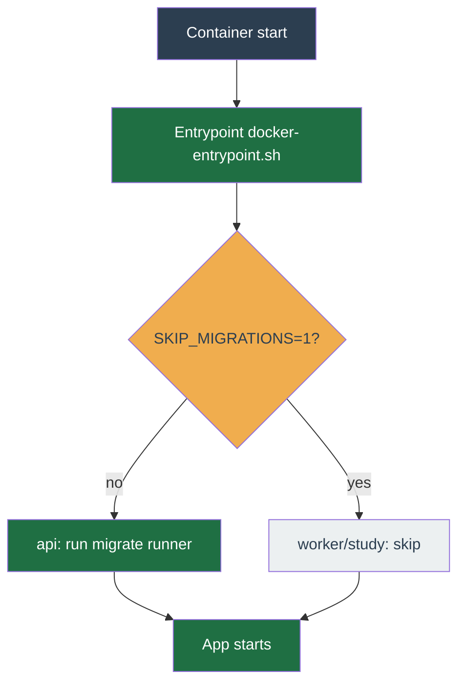

# Production deploy & operations

Day-two reference. The first-run deploy — clone, `.env`, start, create the operator, connect Binance — is [Install & deploy](../get-started/install.md); this page picks up where that one ends and covers the production overlay, TLS, migrations, and the commands you run afterwards.

The canonical, always-current runbook lives in the repo at [`deploy/README.md`](https://github.com/chrisleekr/binance-trading-bot/blob/main/deploy/README.md) (open it in your clone). It also carries the off-host backup recipe and deeper troubleshooting.

## Production overlay

Production adds three secret files and the production compose overlay on top of the base stack. The bundled Postgres and Redis read their passwords from `deploy/secrets/*` directly rather than from `.env`.

**1. Generate the secret files.**

```bash
mkdir -p deploy/secrets
openssl rand -hex 32 > deploy/secrets/session_secret
openssl rand -hex 32 > deploy/secrets/postgres_password
openssl rand -hex 32 > deploy/secrets/redis_password
chmod 600 deploy/secrets/*
```

**2. Patch `.env` for the api.** The api reads `AUTH_SECRET` and the auth-aware `REDIS_URL` from the environment, so those two have to be mirrored out of the secret files.

```bash
REDIS_PW=$(cat deploy/secrets/redis_password)
sed -i.bak \
  -e "s|^AUTH_SECRET=.*|AUTH_SECRET=$(cat deploy/secrets/session_secret)|" \
  -e "s|^REDIS_URL=.*|REDIS_URL=redis://:${REDIS_PW}@redis:6379|" \
  .env && rm .env.bak
chmod 600 .env
```

**3. Pull the images.** Public Docker Hub repo; `docker login` first only if you hit the anonymous rate limit.

```bash
docker compose -f deploy/compose/docker-compose.yml \
               -f deploy/compose/docker-compose.prod.yml \
               --env-file .env pull
```

**4. Start the production stack.**

```bash
docker compose -f deploy/compose/docker-compose.yml \
               -f deploy/compose/docker-compose.prod.yml \
               --env-file .env up -d
```

## TLS at the edge

The stack serves plain HTTP on `APP_HTTP_PORT` and does not bundle a reverse proxy. Front the `app` service with TLS — Cloudflare Tunnel, an nginx or Traefik host proxy, or a hosted edge. The three reference configurations are in [`deploy/README.md`](https://github.com/chrisleekr/binance-trading-bot/blob/main/deploy/README.md#tls-at-the-edge).

## Database migrations: boot vs. manual

Migrations run **automatically on boot** — the container entrypoint (`apps/server/docker-entrypoint.sh`) runs the idempotent migration runner before the app starts, so a first-time operator does nothing here. In the split topology only the `api` service migrates; `worker` and `study` set `SKIP_MIGRATIONS=1` so concurrent runners never race on `_app_migrations`. The manual offline path, run by hand only when the app is not booting, is:

```bash
docker compose exec app bun /app/dist/migrate.js
```



## Alert rules

`deploy/observability/alerts.yml` ships two Prometheus alerting rules. Load the file into your Prometheus stack; the Alertmanager, PagerDuty and Slack receiver wiring is yours to own.

### Scrape config the rules assume

Neither rule works against an arbitrary scrape setup. `WorkerDown` matches `up{job="worker"}`, and `job` is not a label the app emits — Prometheus stamps it from the `job_name` **you** choose, so the rule is inert if you name it anything else.

`/metrics` is also not on the public port. Each service exposes it on a separate admin listener, and **at defaults those listeners are unreachable from any other container**: `ADMIN_HOST` and `WORKER_ADMIN_HOST` both default to `127.0.0.1`, which inside a container means that container's own loopback. A Prometheus container on the `internal` network gets connection-refused, and publishing the port does not help either — Docker forwards a published port to the container's IP, not to its loopback.

Widen the bind, and scrape over the compose network:

```bash
# .env — required for Prometheus to reach either admin listener at all
ADMIN_HOST=0.0.0.0
WORKER_ADMIN_HOST=0.0.0.0
```

```yaml
scrape_configs:
  - job_name: 'worker' # WorkerDown matches this exact name
    static_configs:
      - targets: ['app:9101'] # WORKER_ADMIN_PORT
  - job_name: 'api'
    static_configs:
      - targets: ['app:9100'] # ADMIN_PORT
```

Run Prometheus on the `internal` network so those hostnames resolve. In the default single-container `ROLE=all` deployment both listeners live in the same `app` container, which is why both targets share a hostname; in the split topology (`docker-compose.scale.yml`) point each job at its own service.

!!! warning "Do not add 9100 or 9101 to `ports:`"

    `/healthz`, `/readyz` and `/metrics` are **unauthenticated**, and `/metrics` carries per-profile operational detail. Widening the bind to `0.0.0.0` exposes them to the compose network, which is the point; publishing them puts them on your LAN. Keep them off `ports:` and let Prometheus reach them container-to-container. If you must expose them beyond the host — on Kubernetes, say — restrict the port with a NetworkPolicy: a Service is not a firewall.

| Alert | Severity | Fires when |
| --- | --- | --- |
| `WorkerDown` | critical | No `/metrics` scrape from `job=worker` for 2 minutes. v1.0 is single-replica, so trading is halted until the worker recovers. |
| `BinanceWeightExhausted` | critical | `binance_api_weight` stays above 1000 for 2 minutes. Binance bans above 1200, so this leaves headroom to reduce profile cadence or pause symbols first. |

`BinanceWeightExhausted` is deliberately unaggregated. The weight header covers the whole API key, so every profile on an account samples the same account-wide number: summing would multiply it by the count of actively trading profiles. Each profile over the ceiling raises its own instance labelled with its `profileId` — group them in Alertmanager if the duplicates are noisy.

!!! warning "`BinanceWeightExhausted` can stay firing after the weight comes down"

    The underlying gauge is written per profile on the tick success path and is never removed, so a profile that stops ticking — disabled, disposed, or with every symbol paused — keeps exporting its last reading for the life of the worker process. If that reading was above the ceiling the alert stays open until the worker restarts. Treat a firing instance whose profile you have since disabled as stale and check the weight in the app before acting.

    It is not fixable in the rule. Every tick failure path returns before the metric is recorded, so gating on tick activity would measure tick *success*: a Binance ban fails every request, the activity signal goes flat, and Prometheus would send a **resolved** notification in the middle of the ban. A page that falsely reports recovery is worse than one that sticks open. The fix belongs on the emitter, which needs a way to drop a metric child when a profile goes away (tracked in #777).

### What is not covered

Four rules that previously shipped read metrics this repo emits nowhere. They parsed cleanly and then evaluated empty forever, so they could never fire — they have been removed rather than left in place looking healthy. **These failure modes have no alert coverage today** and reach you only through the UI or `docker compose logs -f app`:

- **Tick failure rate.** The worker counts throttled ticks but has no attempt or failure counter, so no error rate exists to alert on.
- **Queue backlog.** BullMQ wait-queue depth is not exported.
- **Postgres pool starvation.** The connection pool exports no idle/total gauges.
- **Binance WebSocket reconnect storms.** Reconnects are logged, never counted.

Each gap names its missing series and its tracking issue in the comments at the bottom of `alerts.yml`. A CI gate (`no-phantom-alert-metric.sh`) fails the build if a rule names a metric nothing emits, so a rule cannot go back to reading a series that was never written.

**Metric names are checked; nothing else is.** The gate strips label matchers before reading a name, so `up{job="wrker"} == 0` — a one-letter typo in a label the gate never inspects — still parses clean, still evaluates empty forever, and still passes. Thresholds and `for:` windows are not checked either: a rule set to `> 100000` is as silent as one naming a phantom. After editing a rule, confirm it against live data (`promtool check rules` for syntax, then the Prometheus expression browser for a non-empty result) rather than trusting a green build.

## Common operator commands

```bash
docker compose logs -f app                          # tail the app
docker compose run --rm backup                      # one-shot backup
docker compose run --rm app bun run reset-password  # reset the master password
docker compose down                                 # stop (volumes preserved)
```

## Changing configuration

Every process-level setting lives in `.env` and takes effect on restart. See [Environment variables](env-vars.md) for the full list. Per-profile trading settings are not environment variables — they live in the database and are edited in the app.
