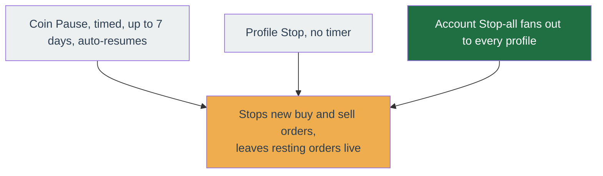

# Kill switch

The kill switch is the emergency stop. It tells the bot to **stop placing new orders** so you can investigate calmly. It works at three levels — one coin, one profile, or your whole account.

!!! danger "What it does — and does not — do"

    - It **stops new buy and sell orders** from being placed.
    - It does **not** sell what you already hold.
    - It does **not** cancel orders already resting on Binance. Those stay live
      until they fill or you cancel them. To also clear resting orders, cancel them
      from the symbol, or [delete the profile](../get-started/go-live.md#pausing-vs-deleting-a-profile)
      (deleting actively cancels a profile's live orders).

## The three levels

| Level | Where to find it | How long it lasts |
| --- | --- | --- |
| **One coin** | The coin's page — the **Pause** control | Until the timer you set runs out (up to 7 days), or you release it |
| **One profile** | The profile's **Settings** page — the **Stop** toggle | Until you turn it back off (no timer) |
| **Whole account** | The **Account** settings page — **one button stops every profile at once** | Until you turn each profile back on (no timer) |

## One coin

On a coin's page, use **Pause** when a single coin is misbehaving but the rest of the profile is fine. You set:

- **A duration** — how long to freeze it, capped at **7 days**. This cap is deliberate: a pause you forget about cannot silently outlast your memory of setting it. When the timer ends, the coin resumes on its own.
- **A reason** — a short note recorded in the audit log so you know later why you paused it.

While a coin is paused, a banner on its page shows the pause is active. Release it early at any time.

## One profile

On the profile's **Settings** page, the **Stop** toggle freezes that entire profile — every coin it trades. Unlike the per-coin pause, it has **no timer**: it stays on until you switch it off. Use it to hold one strategy setup while you check its configuration.

## The whole account

On the **Account** settings page, the account-wide kill switch stops **every profile on the account** in one action. Use it when something is badly wrong and every profile must stop at once. Each profile stays stopped until you turn it back on.

The account-wide stop is a client-side fan-out that calls the per-profile disable-all for each profile, not a single atomic action, so a partial failure could leave some profiles trading.

The automatic daily-loss circuit breaker, which halts new entries after the day's loss limit, is a separate mechanism from the kill switch.

## Where you will see it is active

- The dashboard card for a stopped profile shows a **kill-switch** badge.
- The profile switcher and side navigation flag stopped profiles.
- Every on and off is written to the profile's **audit log**.

## Releasing it

Turn the same control back off — the **Stop** toggle for a profile, the account button for the account, or the banner's release action for a paused coin. A paused coin also releases itself automatically when its timer ends.

!!! note "Kill switch vs disabling a profile"

    Disabling a profile (its enable/disable state) and the kill switch both stop
    new orders and both leave resting orders live. The kill switch is the fast
    emergency stop; disabling is the normal on/off for a setup you are done with for
    now. See [Go live → Pausing vs deleting a profile](../get-started/go-live.md#pausing-vs-deleting-a-profile).
