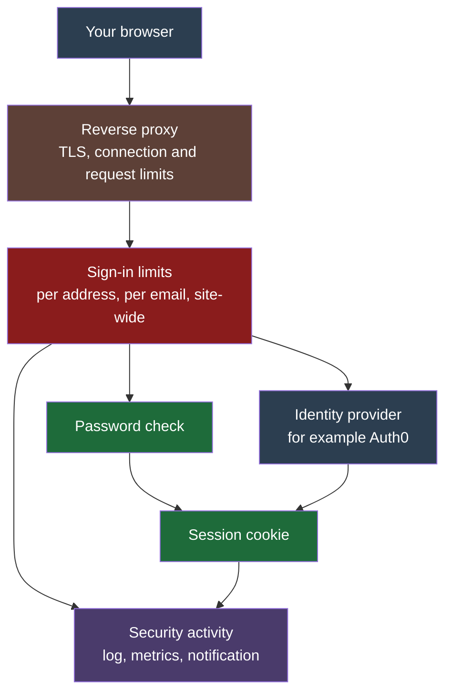

# Sign-in and security

How you sign in to the bot, what protects that sign-in, and how to get back in if something goes wrong.

## How signing in works

There is exactly one operator: you. The first person to finish onboarding becomes the operator, and the server refuses to create a second one at every layer, including the database.

You can sign in two ways, each switched on or off in the environment (see [Environment variables](env-vars.md)):

- **Password.** An email and a password of at least 12 characters. The password is stored only as a scrypt hash. `PASSWORD_SIGN_IN_ENABLED` controls it (on by default).
- **Single sign-on.** You sign in at an identity provider such as Auth0, Okta or Microsoft Entra, and it tells the bot who you are using OpenID Connect. `SINGLE_SIGN_ON_ENABLED` and the `SINGLE_SIGN_ON_*` variables control it.

A successful sign-in gives your browser a **session**: a cookie that proves you signed in. A session ends after 8 hours without use, or 24 hours after you signed in however active you are. Both limits can be changed on **Settings > Security**.



## Setting up single sign-on

Using Auth0 as the example; other OpenID Connect providers need the same four things.

1. Create a **Regular Web Application** in Auth0.
2. Add `<PUBLIC_BASE_URL>/api/auth/callback/oidc` to its allowed callback URLs. `PUBLIC_BASE_URL` is the address you type into your browser to reach the bot, for example `https://bot.example.com`.
3. Turn off public sign-ups on the connection, so nobody else can create an identity at your provider.
4. Turn on multi-factor authentication (a second check, such as a code from your phone) in the provider, with the policy set to **Always**. The bot does not check whether a login used it, so the provider's setting is the only thing that enforces it. Sign in once and confirm the provider asks for the second check.

Then set these variables and restart:

```bash
SINGLE_SIGN_ON_ENABLED=1
SINGLE_SIGN_ON_ISSUER_URL=https://your-tenant.auth0.com/
SINGLE_SIGN_ON_CLIENT_ID=...
SINGLE_SIGN_ON_CLIENT_SECRET=...
SINGLE_SIGN_ON_BUTTON_LABEL="Sign in with Auth0"
PUBLIC_BASE_URL=https://bot.example.com
```

The issuer URL must match the provider's `issuer` exactly, trailing slash included.

**If you already have a password,** a single sign-on login is not attached to you automatically, even when the email matches. Sign in with your password, open **Settings > Security**, and choose **Link single sign-on** under **Sign-in methods**. This stops anyone who controls an identity with your email address at some provider from taking over the operator.

**Your identity is the provider plus your user id there.** If you point the bot at a different provider or tenant, your old link no longer matches. Some providers, Microsoft Entra among them, also give each application a different user id for the same person. In both cases, unlink and link again.

**Settings > Security shows which provider account is linked,** as "Linked as" followed by the email the provider reported at the last single sign-on sign-in. It is there so you can check that the right account is linked; the bot never uses it to decide who signs in, because you can change it at the provider. An identity linked before this was recorded shows only "Linked" until its next single sign-on sign-in. Each single sign-on sign-in, link and account creation in **Security activity**, and in its notification, names the same account ("as you@example.com"); the server log leaves the address out.

**Once single sign-on works,** consider setting `PASSWORD_SIGN_IN_ENABLED=0` so the provider, with its second check, is the only way in. While it is off, a stored password counts for nothing: it cannot sign in, cannot be changed, and cannot confirm a change on **Settings > Security**. Those changes (signing out everywhere, linking or unlinking single sign-on, adding a password, changing the limits) ask you to press **Sign in again with single sign-on** and repeat the change within five minutes; the page points you there when a change needs it. Sessions that signed in with a password before you switched it off keep working until they expire.

**Settings > Security** asks for fresh proof before any change that could let someone else in ("Confirm it's you"): your current password, or a single sign-on login from the last five minutes. An ordinary single sign-on sign-in does not count, because the provider may have let you in on its own saved login without asking; **Sign in again with single sign-on** makes the provider ask you again.

**If the provider is down when the bot starts,** the bot still starts. The single sign-on button shows as unavailable, an alert is sent, and the bot checks again every 5 minutes. Once the provider answers, the api process stops itself so it can start again with the provider registered; under the default `ROLE=all` that restarts the worker too. The start again comes from the container's restart policy: `docker-compose.prod.yml` and `docker-compose.scale.yml` set `restart: unless-stopped`, but the base `docker-compose.yml` on its own sets none, so there the process stays stopped until you start it. If password sign-in is off and that leaves no working way for you to sign in, it is switched back on for that run and a separate alert says so. If you have no password, the reset command under Locked out gives you one.

## Limits and lockout

Password attempts are checked against these limits. All the numbers can be changed on **Settings > Security**, within a range the server enforces, so a stolen session can tighten protection but never switch it off.

| Check | Default | What it means |
| --- | --- | --- |
| Attempts per address | 3 per 5 minutes | One IP address can try 3 passwords in 5 minutes. Past that it is blocked for 15 minutes, and each repeat within a day doubles the block, up to 1 day. |
| Attempts per email | 5 per 5 minutes | Attempts against one email, from any address. |
| Account lockout | 5 failures in 1 hour locks for 1 hour | Too many wrong passwords for one email lock password sign-in for it. |
| Site-wide backoff | 20 failures per hour | If failures pile up across all addresses, every address is slowed to one attempt per period until they fall back. |
| Other sign-in requests | 20 per minute per address | The single sign-on callback, agent authorization and similar requests. An AI agent asking for tokens gets this allowance per agent, and all agents from one address share four times it. |

A **known device** is a browser that signed in successfully before, within the last 30 days; each successful sign-in restarts the 30 days. It skips the account lockout and the site-wide backoff, and it has its own attempts-per-email allowance, so a stranger who hammers your email cannot lock you out of your own browser. It does not skip the per-address limit.

Every limit behaves the same for an email that does not exist, so the limits cannot be used to find out which email is yours.

## What gets recorded and notified

Every sign-in, failure, lockout, limit trip, credential change, session change and agent authorization is recorded as a security event. You can see them under **Security activity** on **Settings > Security**. Events anyone can trigger, such as failed attempts at an email that is not yours, are grouped into one row per five minutes with a count. A failed attempt at your own email always gets its own row.

Important events are sent to your notifiers as security alerts. The `auth-alert` category cannot be muted. If an alert cannot be delivered, for example because every notifier was deleted, the worker counts it, and the `AuthAlertUndelivered` Prometheus alert fires ([Production deploy](deploy.md) lists every alert).

The full list of events, and which ones notify, is `SECURITY_EVENT_CATALOG` in `packages/contracts/src/security-events.ts`.

Security events are kept for 365 days (up to 5 years), longer than general audit history, so the evidence outlives someone who shortens general retention.

A session that runs out is recorded when that browser next makes a request. One that is never used again leaves no record.

## Locked out?

Try these in order.

1. **Use a browser you signed in from before.** It skips the lockout.
2. **Use single sign-on**, if it is set up.
3. **Lift the lockout on the server.** This lifts the lockout on your email, the site-wide slow-down, and the block on every address (the server cannot tell which one is yours, so it clears them all; anyone still guessing is blocked again by the same limits). It leaves the password unchanged:

   ```bash
   docker compose run --rm app bun /app/dist/reset-password.js --email <email> --clear-lockout
   ```

4. **Reset the password.** This prints a new password, lifts everything step 3 lifts, and signs out every browser and every AI agent:

   ```bash
   docker compose run --rm app bun /app/dist/reset-password.js --email <email>
   ```

   Add `--unlink-single-sign-on` if the provider identity itself is lost or compromised. The reset command never contacts the identity provider, so it works while the provider is down.

5. **Password sign-in switched off?** Set `PASSWORD_SIGN_IN_ENABLED=1` and restart, then reset the password as in step 4.

## If you think someone else got in

On **Settings > Security**, choose **Sign out everywhere**. It ends every session, including yours, forgets every known device, closes every open live connection, and revokes every AI agent. Then reset your password (step 4 above) and rotate your Binance API key.

If you believe the server itself was compromised, also change `AUTH_SECRET` and restart. That makes every session cookie, known device and signed sign-in link unreadable. With the MCP control plane on, it also leaves the agent signing key unreadable, because Better Auth encrypts that key with `AUTH_SECRET`, so every new agent sign-in fails with "Failed to decrypt private key". Delete the old key, and a new one is created on the next agent sign-in. Tokens signed with the old key stop working:

```bash
docker compose exec -T postgres sh -c 'psql -U "$POSTGRES_USER" -d "$POSTGRES_DB" -c "DELETE FROM jwks;"'
```

Restoring a backup also signs everyone out, because the restored database brings back whatever sessions it held when it was taken.

## AI agents (MCP)

When the [MCP control plane](../architecture/mcp.md) is on, an AI agent such as Claude Code asks for access through the normal sign-in page. You sign in (with a password or single sign-on), then approve the agent on a consent page. The agent never sees your password or your provider login.

To cut every agent off at once, choose **Revoke all agent access** on **Settings > Security**. It takes effect immediately, including for access tokens the agent already holds. Changing or resetting your password, and signing out everywhere, do the same.

## Protecting against floods

Protection is layered, cheapest refusal first. A large flood fills the network link or connection table before the bot's code runs, so the edge layer matters most.

1. **At the edge.** If the bot is reachable from the internet, put it behind a service that absorbs attacks, such as Cloudflare, and consider allowing `/api/auth/` only from your own addresses there (include the machine your AI agents run on, if you use them). The nginx example in `deploy/README.md` limits connections and requests per address, sets short timeouts for slow clients, and caps request size.
2. **Keep trading separate.** Run the API and the worker as separate processes (`docker-compose.scale.yml`) so a flood that exhausts the API cannot delay trading decisions.
3. **In the bot.** Requests from one address are limited before any database work: 60 a minute without a session, 600 a minute with one. AI agents are counted separately: together they may make 120 calls a minute, and a call whose access token is refused counts against the 60. Password checks are deliberately slow, so only 2 run at once, up to 10 more wait, and beyond that attempts are refused with a retry time. Each session may hold 5 live connections and each address 20.

The bot reads the client address from the rightmost `X-Forwarded-For` entry, which is correct only when exactly one proxy sits in front of it. See the client-IP trust boundary in [Auth](../architecture/auth.md#threat-model).
