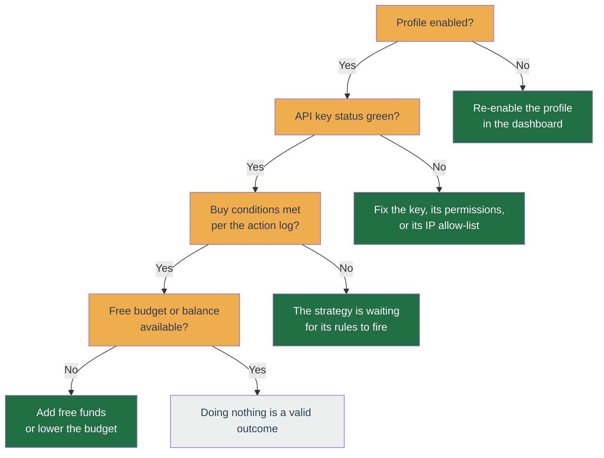

# Troubleshooting

Start here when something looks wrong. The first half is **symptom-based first aid** ("the bot isn't trading", "the dashboard won't load"); the second half is **step-by-step playbooks** for specific situations (a half-finished deploy, setting an entry price for a coin you already hold, resolving orphan orders).

## The bot is not trading

Work down this list:

1. **Is the profile enabled?** A disabled profile makes no new decisions. Re-enable it in the dashboard.
2. **Is the API key green?** On the account's API-keys page, the status must be healthy. If not, the key, its permissions, or its IP allow-list is the problem — revisit [Install → Create a Binance API key](../get-started/install.md#step-6-create-a-binance-api-key).
3. **Are the buy conditions actually met?** "Doing nothing" is a valid, common decision. Open the profile's [History → Logs](../user-guide/profile/history.md#logs) — it says what each tick decided and why, with the numbers it decided on. If the rows are too sparse to explain a specific tick, arm **Capture every tick** there and wait for it to happen again.
4. **Is there budget and balance?** With no free funds to spend, the strategy waits.



## The API key shows an error

Almost always one of:

- **Wrong permissions** — the key needs **both** "Enable Reading" and "Enable Spot & Margin Trading" enabled (see the [API key page](../user-guide/account/api-key.md)).
- **IP allow-list mismatch** — the server's outbound IP is not on the key's allow list. Add it in Binance API Management.
- **Key revoked or expired** — create a fresh key and re-paste it.

## An order was rejected by Binance

Binance rejects orders that break its rules — for example an amount below the minimum, or a price too far from the market. The profile's [History → Logs](../user-guide/profile/history.md#logs) shows Binance's exact reason; expand **Context** on the row for the full rejection payload. Adjust the profile's budget or step sizes in [Configure](../get-started/configure.md).

## A save worked but warned "order sizing was not verified"

**Your change was saved.** Saving a strategy config, adding a coin, or launching a backtest all succeeded; the warning is about a check the server could not finish, not about the thing you just did. Nothing is rolled back, and you do not need to redo it.

Before accepting one of those changes the server tries to confirm your settings could actually place an order. That needs two live facts from Binance: the exchange's **trading rules** for the coin (its minimum order value and the price/quantity steps it accepts) and its **current price**. Both are held in a short-lived cache. When either is missing the sizing check is skipped, and rather than let a skipped check look like a passed one, the app says so.

What each message means:

- **"Binance … trading rules have not loaded yet"** — the rule set for that coin was not in cache. A background refresh reloads it, usually within a few minutes of the app starting. Wait, then re-open the screen or save again to get the check.
- **"No … price is cached for this symbol yet"** — normal right after you add a coin. Prices are only kept for coins a running profile is watching, so a brand-new coin has none until its profile is enabled and starts tracking it.
- **"These settings could not be read by the strategy that would run them"** — the saved settings no longer match what the profile's strategy expects, usually after a strategy switch. Open [Strategy](../user-guide/profile/strategy.md) and re-save the config to bring it back in line.

None of these block trading on their own. If the check does find a real problem, such as a buy budget below the coin's minimum order value, the save is refused outright with an error instead of a warning.

## The dashboard will not load

- Confirm the containers are up: `docker compose -f deploy/compose/docker-compose.yml -f deploy/compose/docker-compose.prod.yml --env-file .env ps` on the server.
- Check the app logs: `docker compose -f deploy/compose/docker-compose.yml -f deploy/compose/docker-compose.prod.yml --env-file .env logs -f`.
- Confirm the web address matches the `WEB_ORIGIN` you set during [install](../get-started/install.md).

## I need to stop it right now

Use the **[kill switch](kill-switch.md)**. It halts new trading immediately so you can investigate.

## Build version / api-worker skew

`GET /status` is a public (unauthenticated) endpoint that returns the running build SHA and boot time for the api and worker, plus the latest applied DB migration timestamp. It leaks only SHAs and timestamps, no account data.

```json
{
  "api": { "sha": "abc1234", "bootedAt": "2026-06-12T10:00:00.000Z" },
  "worker": { "sha": "abc1234", "bootedAt": "2026-06-12T10:00:05.000Z" },
  "db": { "latestMigrationAppliedAt": "2026-06-12T09:59:00.000Z" }
}
```

The desktop status bar polls this and surfaces two warnings:

- **api and worker SHAs differ** — the two processes are running different code (a half-finished deploy). Restart the worker to sync.
- **worker booted before the latest migration** — the worker is running against a newer schema than it loaded. Restart the worker.

`worker: null` means the worker heartbeat key is absent — the worker is down or has not written its status since its last restart.

The SHA is injected at image-build time via the `GIT_SHA` Docker build-arg:

```bash
GIT_SHA=$(git rev-parse --short HEAD) docker compose build app
```

A build with no `GIT_SHA` falls back to the local git SHA, then to `unknown` on the production alpine image (which carries no git binary).

## Tell the bot the entry price for a coin you already hold

If you already hold a coin (bought on the Binance app, or deposited/transferred in) and want the bot to manage and sell it, give it your average buy price two ways:

- **When adding the symbol** — the add-symbol screen has an optional "Average entry price" field. Enter it and the symbol is added _and_ priced in one step.
- **Later** — Symbol screen → Logs tab → "Show advanced" → "Set average entry price".

Either path writes the cost-basis ledger and enqueues a worker job (`apply-avg-entry-price`) that force-sets the running strategy's entry price, so the bot starts managing the held position on the next tick — no restart needed. This is authoritative: it works both for a freshly-held coin and for _correcting_ the cost basis of a position the bot is already managing (a plain tick or a reconfigure would not overwrite an already-priced position). "Delete average entry price" clears it the same way.

Why the price (not the size) is the operator's input: the bot reads the held quantity from your wallet (reserve-adjusted) and pins it to wallet truth each tick. The ledger quantity is only a fallback used when the wallet cannot be read at apply time.

The held quantity is sized from the live wallet snapshot, falling back to an existing cost-basis ledger row when there is no snapshot. The **"Later"** correction works even on a disabled / just-adopted profile when a positive-quantity ledger row already exists — you are correcting the price, not the size. It returns a 502 only when neither source is usable: no live wallet snapshot AND no ledger row with a non-zero quantity (a zero-quantity row is a price marker, treated as no row).

The **combined add-symbol** path has no ledger row to fall back to (the symbol is brand new), so it needs the profile **enabled** so the bot can read your balance. Enable it, then add the coin with its price.

## Orphan orders

An **orphan** is an order open on Binance's book that no profile is tracking. Because a resting orphan locks its base asset and can leave a real position unprotected, resolving one is an operator task with its own page.

**Playbook:** open **[Orphan orders](../user-guide/account/orphan-orders.md)**, adopt any the bot recognises, and cancel-or-leave the rest as that page directs. That page also explains what an orphan is, why a resting order locks the base asset, which order ids each strategy can re-derive, and why deleting a profile is the one path that cancels orphans for you.

## Still stuck?

The [Contributing](../contributing/index.md) section covers the internals if you are comfortable reading logs and code.
