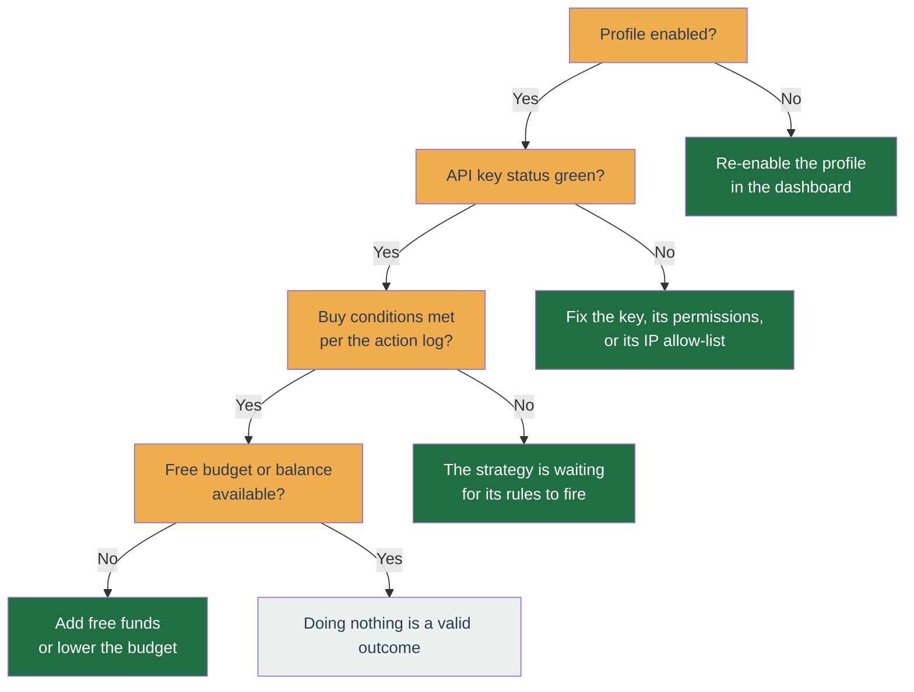

# Troubleshooting

Start here when something looks wrong. The first half is **symptom-based first aid** ("the bot isn't trading", "the dashboard won't load"); the second half is **step-by-step playbooks** for specific situations (a half-finished deploy, setting an entry price for a coin you already hold, resolving orphan orders).

## The bot is not trading

Work down this list:

1. **Is the profile enabled?** A disabled profile makes no new decisions. Re-enable it in the dashboard.
2. **Is the API key green?** On the account's API-keys page, the status must be healthy. If not, the key, its permissions, or its IP allow-list is the problem — revisit [Install → Create a Binance API key](../get-started/install.md#step-6-create-a-binance-api-key).
3. **Are the buy conditions actually met?** "Doing nothing" is a valid, common decision. Open the profile's [History → Logs](../user-guide/profile/history.md#logs) — it says what each tick decided and why, with the numbers it decided on. If the rows are too sparse to explain a specific tick, arm **Capture every tick** there and wait for it to happen again.
4. **Is there budget and balance?** With no free funds to spend, the strategy waits.



## The API key shows an error

Almost always one of:

- **Wrong permissions** — the key needs **both** "Enable Reading" and "Enable Spot & Margin Trading" enabled (see the [API key page](../user-guide/account/api-key.md)).
- **IP allow-list mismatch** — the server's outbound IP is not on the key's allow list. Add it in Binance API Management.
- **Key revoked or expired** — create a fresh key and re-paste it.

## An order was rejected by Binance

Binance rejects orders that break its rules — for example an amount below the minimum, or a price too far from the market. The profile's [History → Logs](../user-guide/profile/history.md#logs) shows Binance's exact reason; expand **Context** on the row for the full rejection payload. Adjust the profile's budget or step sizes in [Configure](../get-started/configure.md).

## A save worked but warned "order sizing was not verified"

**Your change was saved.** Saving a strategy config, adding a coin, or launching a backtest all succeeded; the warning is about a check the server could not finish, not about the thing you just did. Nothing is rolled back, and you do not need to redo it.

Before accepting one of those changes the server tries to confirm your settings could actually place an order. That needs two live facts from Binance: the exchange's **trading rules** for the coin (its minimum order value and the price/quantity steps it accepts) and its **current price**. Both are held in a short-lived cache. When either is missing the sizing check is skipped, and rather than let a skipped check look like a passed one, the app says so.

What each message means:

- **"Binance … trading rules have not loaded yet"** — the rule set for that coin was not in cache. A background refresh reloads it, usually within a few minutes of the app starting. Wait, then re-open the screen or save again to get the check.
- **"No … price is cached for this symbol yet"** — normal right after you add a coin. Prices are only kept for coins a running profile is watching, so a brand-new coin has none until its profile is enabled and starts tracking it.
- **"These settings could not be read by the strategy that would run them"** — the saved settings no longer match what the profile's strategy expects, usually after a strategy switch. Open [Strategy](../user-guide/profile/strategy.md) and re-save the config to bring it back in line.

None of these block trading on their own. If the check does find a real problem, such as a buy budget below the coin's minimum order value, the save is refused outright with an error instead of a warning.

## The dashboard will not load

- Confirm the containers are up: `docker compose -f deploy/compose/docker-compose.yml -f deploy/compose/docker-compose.prod.yml --env-file .env ps` on the server.
- Check the app logs: `docker compose -f deploy/compose/docker-compose.yml -f deploy/compose/docker-compose.prod.yml --env-file .env logs -f`.
- Confirm the web address matches the `WEB_ORIGIN` you set during [install](../get-started/install.md).

## I need to stop it right now

Use the **[kill switch](kill-switch.md)**. It halts new trading immediately so you can investigate.

## Build version / api-worker skew

`GET /status` is a public (unauthenticated) endpoint that returns the running build SHA and boot time for the api and worker, plus the latest applied DB migration timestamp. It leaks only SHAs and timestamps, no account data.

```json
{
  "api": { "sha": "abc1234", "bootedAt": "2026-06-12T10:00:00.000Z" },
  "worker": { "sha": "abc1234", "bootedAt": "2026-06-12T10:00:05.000Z" },
  "db": { "latestMigrationAppliedAt": "2026-06-12T09:59:00.000Z" }
}
```

The desktop status bar polls this and surfaces two warnings:

- **api and worker SHAs differ** — the two processes are running different code (a half-finished deploy). Restart the worker to sync.
- **worker booted before the latest migration** — the worker is running against a newer schema than it loaded. Restart the worker.

`worker: null` means the worker heartbeat key is absent — the worker is down or has not written its status since its last restart.

The SHA is injected at image-build time via the `GIT_SHA` Docker build-arg:

```bash
GIT_SHA=$(git rev-parse --short HEAD) docker compose build app
```

A build with no `GIT_SHA` falls back to the local git SHA, then to `unknown` on the production alpine image (which carries no git binary).

## Tell the bot the entry price for a coin you already hold

If you already hold a coin (bought on the Binance app, or deposited/transferred in) and want the bot to manage and sell it, give it your average buy price two ways:

- **When adding the symbol** — the add-symbol screen has an optional "Average entry price" field. Enter it and the symbol is added _and_ priced in one step.
- **Later** — Symbol screen → Logs tab → "Show advanced" → "Set average entry price".

Either path writes the cost-basis ledger and enqueues a worker job (`apply-avg-entry-price`) that force-sets the running strategy's entry price, so the bot starts managing the held position on the next tick — no restart needed. This is authoritative: it works both for a freshly-held coin and for _correcting_ the cost basis of a position the bot is already managing (a plain tick or a reconfigure would not overwrite an already-priced position). "Delete average entry price" clears it the same way.

Why the price (not the size) is the operator's input: the bot reads the held quantity from your wallet and pins it to wallet truth each tick. The quantity you recorded is a bound on that, not a substitute for it — the bot never writes more than your wallet holds, give or take one tradeable increment, so a stale or over-stated record cannot inflate the position the strategy will try to sell. It also declines to write a position at all when the wallet behind the coin is one the bot would treat as phantom: less than one tradable increment, or worth a rounding error of the exchange's minimum order. Your recorded price stays saved either way; there is simply nothing sellable for it to price yet. It falls back to your recorded quantity outright when it cannot judge the wallet at all: no API client, no cached symbol info for the coin, a malformed one, or a balance read that failed. The worker log names which under `pipeline_apply_avg_entry_price_gate_unavailable`.

The held quantity is sized from the live wallet snapshot, falling back to an existing cost-basis ledger row when there is no snapshot. The bot first asks whether the wallet could back a position at all: a balance below the coin's smallest tradeable step, or worth a rounding error of the exchange's minimum order — about a hundredth of one — cannot be sold by anything, so no position is handed to the strategy. The price is still accepted and stored, and your entry is left exactly as you saved it; the worker log says `pipeline_apply_avg_entry_price_no_sellable_position`. You do not have to read that log to find out: the symbol screen says **"Not held — nothing sellable backs this cost basis"** beside the figure you recorded, and shows no unrealised P/L for it, because a profit or loss on a position the bot refused to take is a number about nothing. The note clears itself once something sellable really is there. Nothing re-runs the apply job on its own, so topping the coin up above the exchange's minimum is taken up by the position-reconcile pass that sweeps every coin **every 15 minutes** — no restart needed — or immediately by a buy fill on it; re-saving the price also re-runs the check. That pass only clears the note when it can positively confirm the balance now backs the entry: with no cached price for the coin, or before the bot has ever ticked that symbol, it has not checked anything and waits for a sweep that can decide rather than clearing on a check it never made. It disappears with the row if you delete the entry price or the bot prunes the phantom holding. Only once that passes does the recorded quantity come in, as the smaller-of bound described above. The **"Later"** correction works even on a disabled / just-adopted profile when a positive-quantity ledger row already exists — you are correcting the price, not the size. It returns a 502 only when neither source is usable: no live wallet snapshot AND no ledger row with a non-zero quantity (a zero-quantity row is a price marker, treated as no row).

The **combined add-symbol** path has no ledger row to fall back to (the symbol is brand new), so it needs the profile **enabled** so the bot can read your balance. Enable it, then add the coin with its price.

## Orphan orders

An **orphan** is an order open on Binance's book that no profile is tracking. Because a resting orphan locks its base asset and can leave a real position unprotected, resolving one is an operator task with its own page.

**Playbook:** open **[Orphan orders](../user-guide/account/orphan-orders.md)**, adopt any the bot recognises, and cancel-or-leave the rest as that page directs. That page also explains what an orphan is, why a resting order locks the base asset, which order ids each strategy can re-derive, and why deleting a profile is the one path that cancels orphans for you.

## A stored config now exceeds a schema maximum

A strategy's config schema can gain a **tighter** maximum in a release: the trailing-trade first-buy `candleLimit` ceiling moved from 1000 to 999, and the momentum slow EMA period gained one of 998. A maximum binds when a config is **parsed**, so it never rewrites a config row already stored above it — neither the profile's own config nor a per-symbol override of it. Such a profile keeps trading, because the live tick path reads its stored config without parsing it, but every path that does parse degrades quietly: adopting an orphan order, proving ownership of a resting order while the profile is being deleted, the live gate's backtest match, and saving the profile at all. `buy.candleLimit` is the one to check first — 1000 was the previously advertised legal maximum and is the round number an operator picks, and its default is 60.

Open a database shell on the running stack:

```bash
docker compose exec -T postgres sh -c 'psql -U "$POSTGRES_USER" -d "$POSTGRES_DB"'
```

A strategy config is stored in **two** places, so this takes two read-only queries. The profile's own config is `profiles.config`:

```sql
-- Profiles whose stored strategy config now exceeds a schema maximum and can no longer be parsed.
SELECT id, name, strategy_name,
       config #>> '{buy,candleLimit}' AS candle_limit,
       config #>> '{ema,slow}'        AS ema_slow
FROM profiles
WHERE jsonb_path_exists(config, '$.buy.candleLimit ? (@ > 999)')
   OR jsonb_path_exists(config, '$.ema.slow ? (@ > 998)');
```

The other is the per-symbol patch in `profile_symbols.override_config`, which carries both of these knobs (trailing-trade rebuilds its whole `buy` block into the override schema, momentum exposes `ema` wholesale). The disposal path parses the **merged** config once per symbol, so an override holding an illegal value breaks the ownership proof for that symbol even when `profiles.config` is perfectly legal:

```sql
-- Per-symbol overrides that exceed the same maxima. The merged config is what gets parsed, so one of these breaks that symbol on its own.
SELECT ps.profile_id, p.name, p.strategy_name, ps.symbol,
       ps.override_config #>> '{buy,candleLimit}' AS candle_limit,
       ps.override_config #>> '{ema,slow}'        AS ema_slow
FROM profile_symbols ps
JOIN profiles p ON p.id = ps.profile_id
WHERE jsonb_path_exists(ps.override_config, '$.buy.candleLimit ? (@ > 999)')
   OR jsonb_path_exists(ps.override_config, '$.ema.slow ? (@ > 998)');
```

Both use `jsonb_path_exists` rather than a cast in the `WHERE` clause on purpose. PostgreSQL does not promise that a `> 999` test filters rows before an adjacent `::numeric` cast runs, so one row holding a non-numeric value at either path would abort the whole query with `invalid input syntax for type numeric` — on the one query you were told to run before deleting a profile. A path predicate matches nothing on a non-numeric operand in lax mode instead, and `config` / `override_config` are already `jsonb`, so no cast is needed.

There is nothing to do only when **both** queries come back empty. An empty first query on its own proves nothing: a legal `profiles.config` is exactly the case an illegal override hides behind. Every row either query returns needs its flagged value lowered inside the new bound **before** you next edit or delete that profile: set the knob to a legal value — 999 or less for the first-buy candle window, 998 or less for the slow EMA period — then save. The save is itself the repair, and it is also the operation the stale value blocks, so the form rejects the save until that field is legal. A row from the first query is repaired in the profile's config form; a row from the second is repaired in that symbol's per-symbol override editor, and editing the profile form will not touch it.

Do it before the next profile deletion in particular. Deleting a profile whose config will not parse loses the **fingerprint** half of its order-ownership proof. Orders the bot recorded locally are still claimed and cancelled, a protective stop placed by the bot included; an order it never recorded — the kind a bookkeeping failure leaves behind — has only the fingerprint left to claim it, so it is not cancelled and stays resting on Binance as an [orphan](../user-guide/account/orphan-orders.md). Usually it is announced in the log as well: that announcement covers the symbols the profile still has a live order row or an open position on, which is the ordinary case. It is **not** announced on a symbol the profile has since unbound and holds no position on — there the order is abandoned with no log line at all. So after deleting a profile whose config would not parse, confirm on the [Orphan orders](../user-guide/account/orphan-orders.md) page rather than trusting the log to have listed everything.

## Still stuck?

The [Contributing](../contributing/index.md) section covers the internals if you are comfortable reading logs and code.
