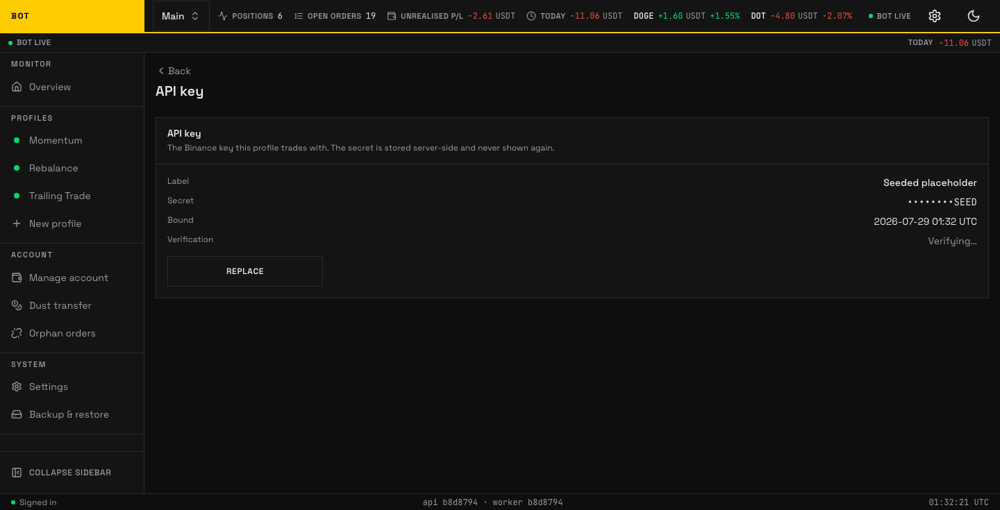

# API key

_The API key page. The account stores one Binance key pair; only the last four characters are ever shown back. Seeded demo data, not a real account._

The **API key** page holds the Binance key pair the account trades with. The secret is stored server-side and **never shown again** — the page only ever displays its last 4 characters.

!!! danger "Secure the key on Binance before you paste it"

    Keys are stored **unencrypted**, so the protections on the Binance side are what keep a
    stolen key from doing harm:

    - **Permissions** — enable only "Enable Reading" and "Enable Spot & Margin Trading".
      Leave **"Enable Withdrawals" OFF** — the bot never withdraws, so a leaked key without
      it cannot move funds off the exchange.
    - **IP allowlist** — restrict the key to this server's IP on the Binance console. That
      is what stops a stolen key from trading elsewhere.

## Adding or replacing a key

When no key is bound the page shows **No key bound to this profile yet** and an **Add API key** button. The form has:

- **Label (optional)** — a name for the key, e.g. `read-trade`.
- **API key**
- **API secret**

Press **Save**.

## An already-set key

The read view shows a definition list: **Label**, **Secret** (masked as `••••••••` plus the last 4 characters), **Bound** (when it was set), and **Verification** (`Verified ✓`, `Failed`, or `Verifying…`). **Replace** swaps in a new key in place; the old secret is never shown.
