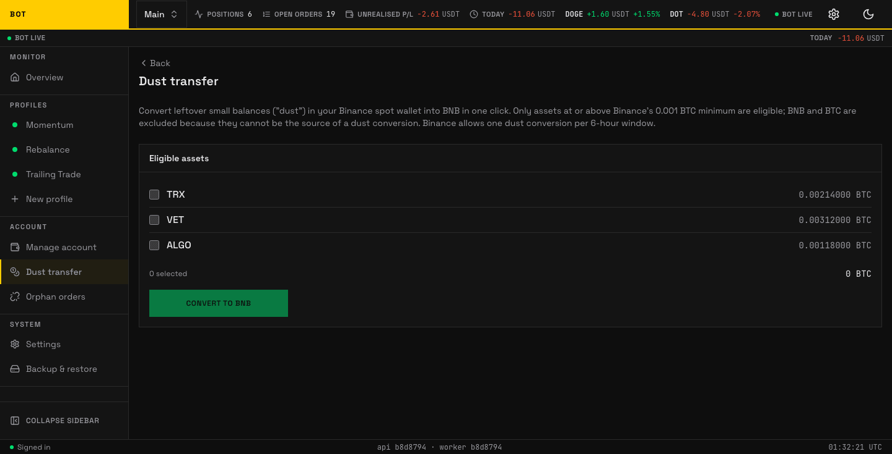

# Dust transfer

_The Dust transfer page. Convert leftover balances too small to trade into BNB. Seeded demo data, not a real account._

**Dust** is a leftover balance too small to trade — a few cents of a coin left after a sell. The **Dust transfer** page converts that dust in your Binance spot wallet into BNB in one click, using Binance's own dust-conversion.

Rules Binance imposes:

- Only assets **at or above the 0.001 BTC minimum** are eligible.
- **BNB and BTC are excluded** — they cannot be the source of a dust conversion.
- **One conversion per 6-hour window.**
- **Live accounts only** — testnet always shows empty here.

## Converting

The **Eligible assets** panel lists each convertible asset with its estimated BTC value and a checkbox. Tick the ones to convert; the footer shows how many you selected and the running BTC total. Press **Convert to BNB**. A **Recent conversions** panel below shows past runs and how much BNB each produced.
