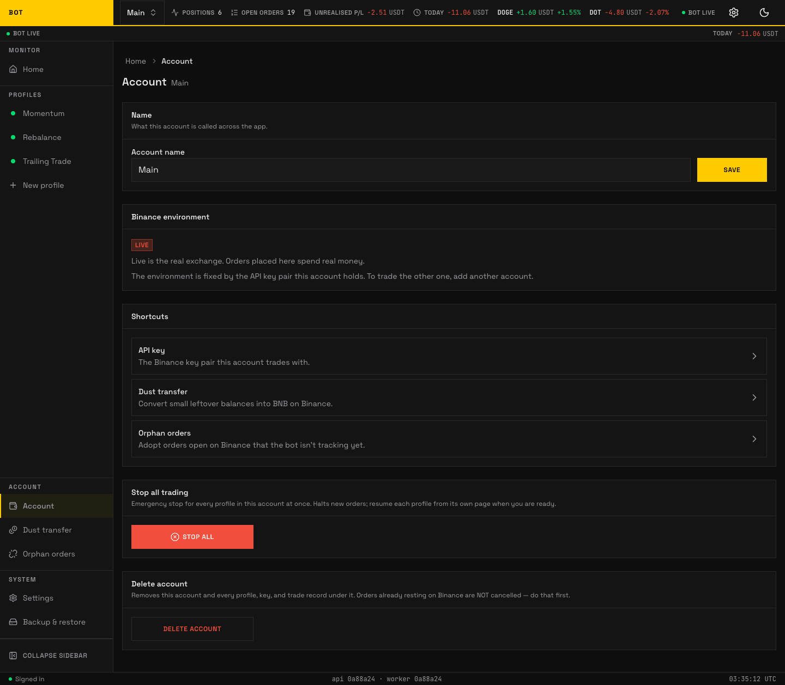

# Account

_The Account page. Name, Binance environment, shortcuts, and the per-account kill switch. Seeded demo data, not a real account._

An **account** is one Binance account the bot trades: one API key pair, one environment (testnet or live), and the profiles that run under it. The **Account** page is where you name it, see its environment, reach its wallet shortcuts, emergency-stop it, or delete it.

## Name

**Account name** — what this account is called across the app. Edit and press **Save**.

## Binance environment

Read-only, shown as a **Testnet** or **Live** badge:

- **Testnet** is Binance's practice exchange: real prices, practice money — nothing here can gain or lose you anything.
- **Live** is the real exchange: orders spend real money.

The environment is fixed by the API key pair this account holds. To trade the other one, add another account.

## Shortcuts

Three tiles to this account's wallet surfaces:

- **[API key](api-key.md)** — the Binance key pair this account trades with.
- **[Dust transfer](dust-transfer.md)** — convert small leftover balances into BNB.
- **[Orphan orders](orphan-orders.md)** — adopt orders open on Binance the bot is not tracking yet.

## Stop all trading

An **emergency stop** for every profile in this account at once. **Stop all** flips each profile's kill switch: the bot stops placing and managing orders immediately, while open positions and resting orders are left untouched. Resume each profile from its own page when you are ready. When nothing is left running the control shows **All stopped**.

## Delete account

**Delete account** removes this account and every profile, key, and trade record under it. Orders already resting on Binance are **not** cancelled — do that first. If the account still has live orders or held positions, the app blocks the delete ("This account still has money on the exchange") and tells you to delete each profile first so the bot can cancel their orders for you. This prevents leaving ghost orders on Binance with nothing pointing at them.
