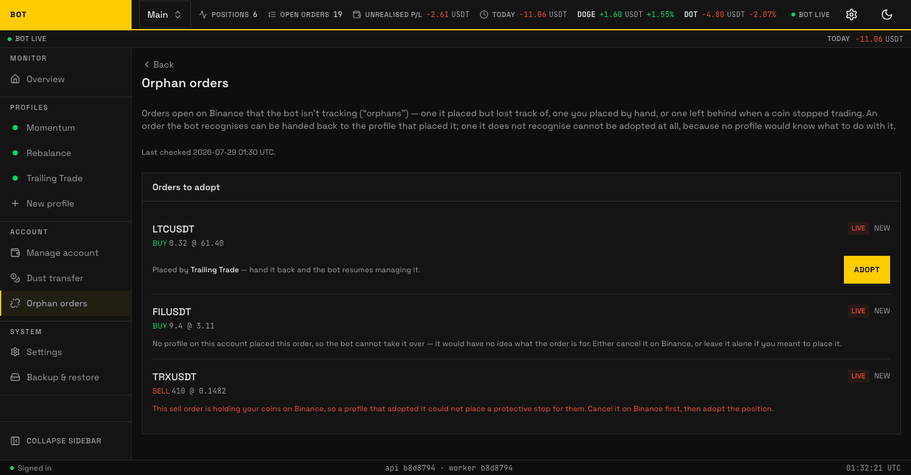
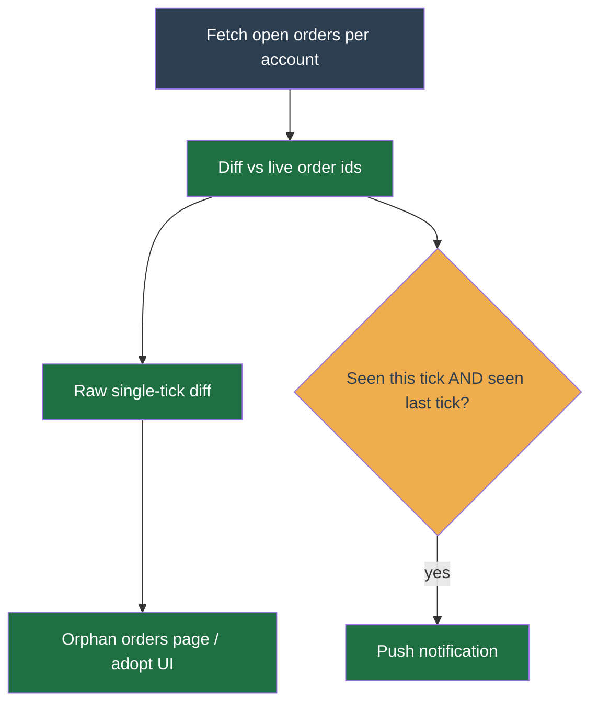

# Orphan orders

_The Orphan orders page. Open Binance orders the bot is not tracking, ready to adopt or cancel. Seeded demo data, not a real account._

An **orphan order** is an order open on Binance that the bot is not tracking — one it placed but lost track of, one you placed by hand, or one left behind when a coin stopped trading. A background scan finds them every few minutes.

The **Orphan orders** page lets you hand a **recognised** one back to the profile that placed it ("adopt"), so the bot resumes managing it — trailing its stop and counting its fills.

## What you see

The **Orders to adopt** panel lists each orphan with its symbol, side (**BUY**/**SELL**), quantity and price, a **Live**/**Testnet** badge, and status. A line at the top shows when the scan last ran. When everything is tracked you see _"No orphan orders — every order open on Binance is already tracked by the bot."_

## Adopting

- **Adoptable** — placed by a profile the bot recognises. Its row shows _"Placed by {profile} — hand it back and the bot resumes managing it"_ with an **Adopt** button. A confirmation ("Hand this order back?") summarises the order before you confirm.
- **Not adoptable** — either no profile on the account placed it (the bot cannot determine what it is for), or it is a resting sell holding your coins (a profile could not place a protective stop for them). In both cases the page tells you to cancel it on Binance first, or leave it alone if you meant to place it.

## How adoption works

An **orphan** is an order that is open on Binance's book but that no local `orders` row tracks. The bot did not place it, or placed it and lost the record — either way it is not managing it. The `orphan-orders-detect` cron finds them, running every 10 minutes.

The **Orphan orders** page and the adopt UI show the **raw single-tick diff**, so an orphan can appear on its first sighting. The two-tick confirmation gates **only the push notification**: the alert fires only for an orphan seen on two consecutive ticks (about 10 minutes apart), so a just-canceled order the bot is repricing right now does not alert. The seen-this-tick set carries a roughly 25 minute TTL (`SEEN_TTL_S = 1500`, about 2.5 cron periods), so if the cron skips a cycle the two-tick count restarts from scratch rather than trusting a stale prior set.

An orphan is not harmless. A resting order **locks its base asset**: the coin it would sell is reserved by Binance and shows as `locked`, not `free`. If the true owner of that coin is one of your profiles, that profile can only protect the part of the position the orphan leaves free: the strategy sizes its protective stop on `min(tracked position, free + what its own resting stop holds)` and arms that partial stop, because protecting most of a position beats protecting none of it. When the orphan leaves nothing usable free — nothing at all, or too little to clear Binance's minimum order size — no stop can be placed, and the symbol shows a **No stop** blocker naming the order to cancel. The bot places nothing in that state (a stop Binance can only refuse `-2010` would otherwise be re-sent every tick) and cancels nothing, so the position rides unprotected until you clear the orphan.

### The destination is derived, never chosen

There is deliberately **no picker**. The bot adopts an orphan only into the profile that can **prove it placed it** — by recomputing its own deterministic `clientOrderId` scheme and matching the id on the order. Exactly one claimant means the order goes home. Zero claimants, or more than one, and the adopt is refused (`409`).

This is not timidity. Handing a resting order to a profile that did not place it is strictly worse than leaving it: the foreign strategy does not recognise the id, so it can neither reprice nor cancel it, the base asset stays locked forever, and the profile that _does_ own the coin stays wedged. A wrong adopt is unrecoverable without manual exchange access; a refused adopt costs you one click on Binance.

Which orders are derivable, per shipped strategy:

| Strategy | Derivable ids | Not derivable |
| --- | --- | --- |
| `trailing-trade` | the first buy, every grid-ladder buy, bull-pyramid adds, and the protective stop | take-profit sells and manual orders, whose ids fold the entry price or the override id |
| `momentum` | the protective stop (keyed on profile + symbol) | entry / exit orders, whose ids fold the triggering candle's time |
| `rebalance` | — (places only `MARKET` orders, which never rest, so it cannot orphan one) | — |

A derivable id is one the strategy can recompute from settings alone. An id that folds in something only the running bot knew — the exact entry price, the id of the override that triggered a manual order — cannot be re-derived later, so the strategy correctly declines to claim it rather than guess.

### When the bot says it cannot adopt

Your options are **cancel it** or **leave it**, and the page says which orphan is which.

1. **Cancel it on Binance** — the normal answer. Do this whenever the order is not one you deliberately placed by hand: it was placed by another bot, by an older deployment, or its id folds runtime data no strategy can re-derive. Cancelling frees the base asset, and the owning profile arms its protective stop on the next tick with no further action from you.
2. **Leave it** — only if it is a manual order you actually want to rest. Understand the cost: for as long as it rests it holds that base asset `locked`, which is precisely what caps the true owner's protective stop at the free remainder. If the coin is one a profile is trading, leaving the orphan means leaving that position partly — or, when it locks nearly all of it, entirely — unprotected.

The bot never cancels an orphan for you. It did not place the order and cannot know you did not mean it.

**One exception: deleting a profile.** A delete has to leave the exchange clean, so it scans the whole account's open orders and cancels the ones it can **prove the deleted profile placed**. Two proofs count, either one enough: the strategy re-deriving the `clientOrderId` (the same proof the adopt page uses), or a DB row that profile recorded (matched on symbol + Binance order id, so an order the bot logged but whose id it cannot re-derive is still provably its own). That is deliberate: an order left resting by a profile that no longer exists is an order nothing in the system points at any more, and that is exactly how a deleted profile's stop went on holding a position's coins for days. An order **neither** proof claims — a manual order of yours, a sibling profile's, or one both unenumerable and never recorded — is still never cancelled: you are notified about it instead, and it does not block the delete. The `orphan-orders-detect` cron and the Orphan orders page never cancel anything.
