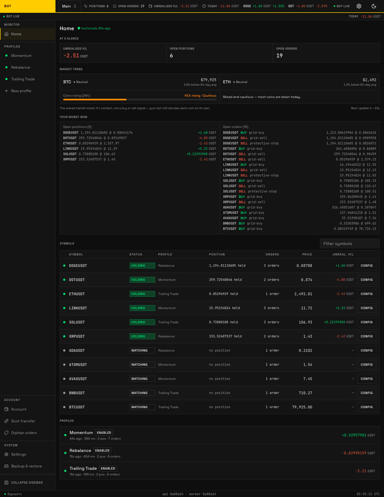

# Dashboard

The dashboard is the home screen and your live window into the bot. It has two forms that share the same layout:

- **Account overview** — every profile on the account, at a glance.
- **Profile dashboard** — one profile in focus, with its equity curve and symbols.

Switch between them with the profile selector in the top bar. Everything is designed to be read on a phone.

_The dashboard: account health, unrealised P/L, positions, market trend, and the profile roster. Seeded demo data, not a real account._

## Account overview

From top to bottom:

- **Top bar** — the account selector, the profile selector, and the theme toggle.
- **Account health bar** — worker liveness, any trading halt, and today's realised profit or loss (P/L). It stays visible on every screen; see [Account health](../concepts/account-health.md).
- **Overview → At a glance** — combined unrealised P/L (open-position profit not yet sold), open positions, and open orders across the whole account.
- **Market trend** — where BTC and ETH sit against their 50-day average, plus a breadth reading of how many coins are rising.
- **Profiles** — one row per profile with its status and P/L. Tap a row to focus it.

## Profile dashboard

Focusing a profile adds:

- **Status, "Investigate", and "Manage profile"** — enable/disable the profile, run the read-only ["why isn't it trading?" check](profile/index.md#investigate-why-isnt-it-trading), and open the tab sheet (see [Profile](profile/index.md)).
- **Health strip** — a one-line gate and edge summary; tap "Details" to expand the scorecards.
- **KPI strip** — deployed capital, exposure cap, auto-discovered symbols, holdings, and realised P/L over the last 7 days.
- **Equity curve** — the profile's value over time against a buy-and-hold benchmark. Changing the profile's quote asset restarts this curve; see [Changing a profile's quote asset](#changing-a-profiles-quote-asset).
- **Symbols** — every symbol the profile trades. Tap one to open its [Symbol workspace](symbol-workspace.md).

## Changing a profile's quote asset

A profile's **quote asset** is the currency it settles in — a `USDT` profile buys and sells coins priced in USDT, a `BTC` profile in BTC. You can change it on the profile's settings, and the bot re-points discovery at the new markets without force-selling anything you already hold.

What that change does to the numbers on this page:

- **Realised profit or loss counts only cycles closed in the profile's current quote asset.** Trades it completed under the old quote drop out of today's P/L, the closed-trades card, the KPI strip, and the discovery scoreboard. They are still in the trade archive — just not added in, because a profit in USDT and a profit in BTC cannot be summed into a number that means anything. Expect the figures to drop the moment you switch.
- **The daily loss limit is measured in the new quote too**, so a switch part-way through a UTC day effectively resets that day's loss budget.
- **Holdings in the old quote are kept, not sold** — but they stop counting toward the profile's open-position value for the same reason. Sell them yourself if you want them out.
- **The equity curve restarts** from the next 15-minute capture. Points recorded in the old currency are not plotted under the new one — there is no exchange rate that would make them comparable. They are kept, not deleted, so switching the quote back brings that history straight back. One exception, once: if you changed the quote asset before this version, the first stretch of the new curve was recorded with the old currency's profits mixed in and could not be corrected, so those points were removed. The curve is accurate from there on.

If you want the old history to keep counting, use a separate profile for the new quote asset instead of changing this one.

## "Why did it buy?" / "Why did it sell?"

Every action carries its reason. When the bot buys or sells, the log entry explains which rule fired — for example "price fell to the next grid step" or "trailing stop hit after a 3% pull-back". If a trade ever surprises you, this is the first place to look, then the symbol's [Logs tab](symbol-workspace.md#logs). If the reason does not match your expectation, re-check the profile's [Strategy](profile/strategy.md) settings.
