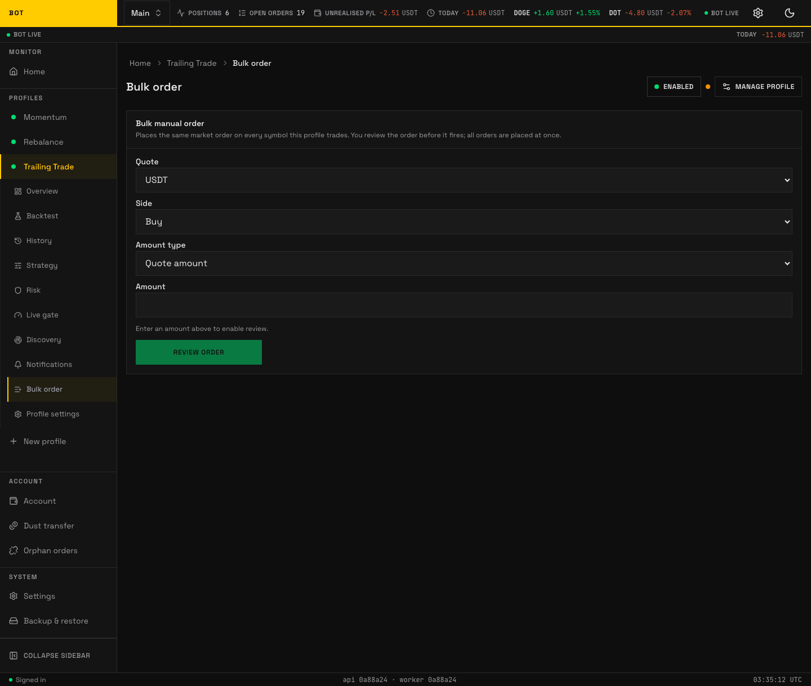

# Bulk order

_The Bulk order section. Place the same manual order across several symbols at once. Seeded demo data, not a real account._

The **Bulk order** section places the **same market order on every symbol this profile trades**, at once. It is a manual action, not part of the strategy — use it to enter or exit a whole basket by hand.

!!! warning "There is no undo"

    All orders are placed together as market orders. You review the order before it fires,
    but once placed they cannot be recalled.

## The form

| Field | Options | Meaning |
| --- | --- | --- |
| **Quote** | your profile's quote assets | The quote currency to trade against (e.g. USDT). |
| **Side** | Buy · Sell | Whether to buy or sell each symbol. |
| **Amount type** | Quote amount · Market quantity | Whether **Amount** is a quote sum (e.g. 50 USDT each) or a base quantity (e.g. 0.001 each). |
| **Amount** | — | How much, in the unit chosen above. |

Enter an amount to enable **Review order**.

## Review and confirm

**Review order** opens a confirmation ("Confirm bulk order") summarising exactly what will happen, e.g. _"Buy 50 USDT worth on every USDT symbol this profile trades."_ Press **Place orders** to fire them all, or **Back** to edit. On success you see how many orders were placed and when.
