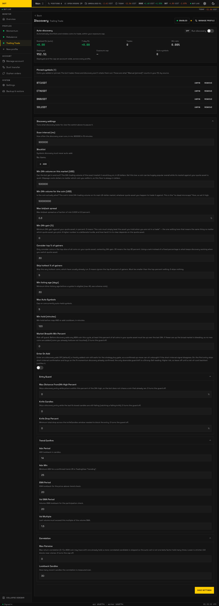

# Discovery

_The Discovery tab. Rotation settings, the live scoreboard, and the pinned roster. Seeded demo data — not a real account._

The **Discovery** tab turns on optional **auto-rotation**: the profile automatically adds coins that are entering a bullish move, trades them, and drops them when the move fades — without you hand-picking symbols. It is **off by default** and entirely per-profile.

The master **on/off** switch at the top of the tab owns the enabled state; the fields below are the tuning.

**[Discovery → Configuration](../../concepts/discovery.md#configuration)** carries the full field reference — every setting, what it does, what you can set, when to change it, and what to expect — generated from the same schema this tab renders, plus a worked example configuration.

## Where candidates drop out

The **Where candidates drop out** panel shows the last scan as two ladders of filters, each row a bar whose width is how many coins were still in the running at that point. The stage that lost the most, proportionally, is called out as the choke — that is the setting to look at first if nothing is being added.

There are **two** ladders because there are two different starting sets, and reading them as one would be misleading:

- The first counts every coin priced in your quote coin, narrowing through your blocklist, volume, movement, spread, and gainers band.
- The second starts from only the shortlist the bot fetched price history for, and narrows through listing age, trend confirmation, and final eligibility.

The second ladder's top row is therefore much smaller than the first ladder's bottom row. That is by design, not a collapse, so each ladder is drawn against its own starting count and captioned with what it counted.

Below them, a strip charts eligible and added coins over recent scans. One bad scan is luck; a flat line is a setting. If a scan recorded no counts at all, the panel says **unknown** rather than showing zero — "not recorded" and "nothing survived" are opposite answers.

## What the rest of the tab shows

Below the config editor the tab is a live dashboard, not settings: a scoreboard of candidate coins, the current universe, recent add/drop activity, and controls to **pin** a coin (keep it regardless of score) or **eject** one. Those are actions, not stored config, so they are not in the reference table.
