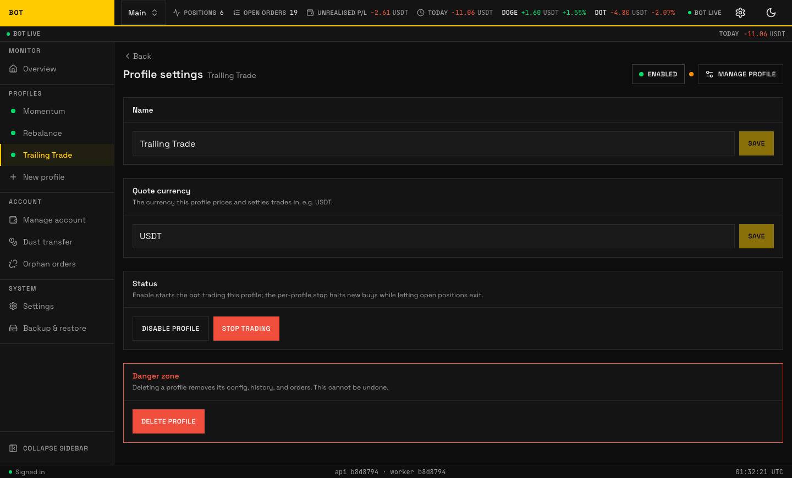

# General

_The General (Profile settings) tab. Name, quote asset, and profile-level toggles. Seeded demo data, not a real account._

The **General** tab (header "Profile settings") holds the profile's identity and its lifecycle controls — enabling, stopping, and deleting. There is no strategy config here.

## Name

Rename the profile. Save with **Save**.

## Quote currency

The currency this profile prices and settles trades in, e.g. USDT.

## Status

Two independent controls, because "stop" and "disable" mean different things:

| Control | Buttons | Effect |
| --- | --- | --- |
| **Enable / disable** | **Enable profile** / **Disable profile** | Enable starts the profile ticking and trading per its config (auto-buy, discovery, sells). Disable stops it ticking, but **resting exchange-side orders (e.g. a protective stop) stay in place until cancelled**. |
| **Stop / resume trading** (kill switch) | **Stop trading** / **Resume trading** | Stop freezes all decisions immediately; open orders are unaffected. Resume picks up on the next tick. |

Use **stop trading** for an instant freeze that leaves everything in place; use **disable** to take the profile out of service.

## Reconcile fees

**Reconcile fees** (in the **Operate** group of the Manage sheet) backfills the real Binance commission for this profile's completed trades into the archive, so net-of-fee P/L reads honestly rather than estimated. Use it if a trade's **Fees** column looks empty or the net numbers seem too good — for example on trades archived before fee tracking, or where the live fee lookup returned zero. It fetches from Binance in the background and updates the archive on the next read; nothing is placed or cancelled. The corrected figures show on the [History → Archive](history.md) view.

## Danger zone

**Delete profile** permanently removes the profile's config, history, and orders. It cannot be undone. Coins you already hold on the exchange are **not** sold — only the bot's record of them is removed.

If the profile still has live orders or open positions when you delete it, the app escalates to a disposal step ("This profile is still active") and offers two safe choices rather than abandoning the orders:

- **Cancel its resting orders, then delete** — the bot cancels the profile's orders on Binance, then deletes it; your coins stay in your wallet as plain holdings.
- **Hand the position to another profile** — transfer the open position to a profile you pick, then delete this one.

This disposal-on-delete behaviour is deliberate: an active profile is never silently abandoned with live orders (which would leave ghost orders on Binance).
