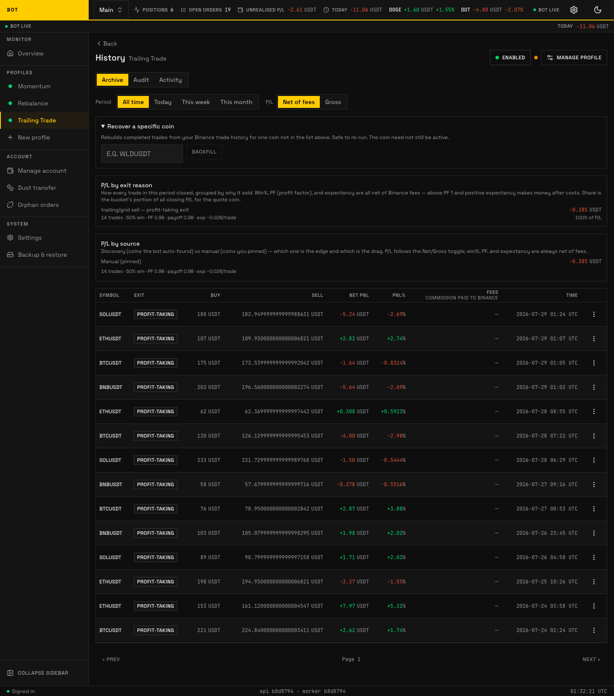
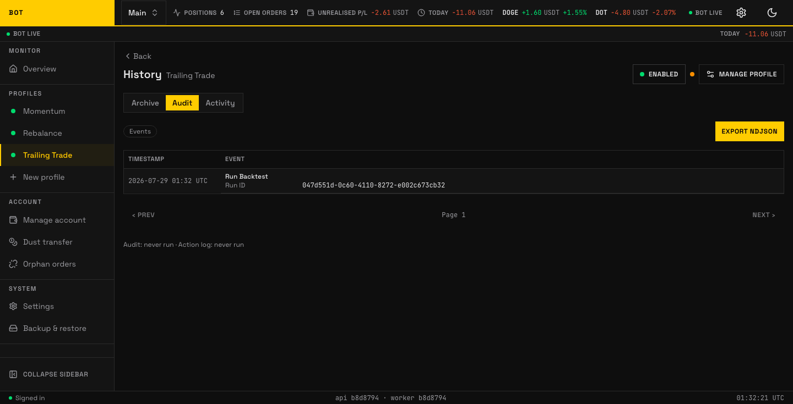
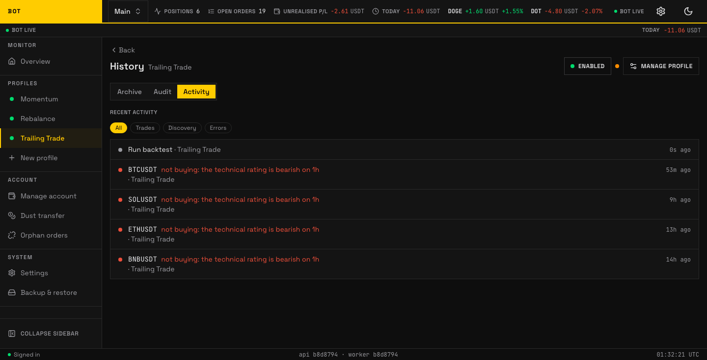

# History

The **History** tab is read-only: it shows what the profile has done. It has three views (the "History view" tabs): **Archive**, **Audit**, and **Activity**.

## Archive

_The Archive view: completed trades with net-of-fee P/L, filters, and summaries. Seeded demo data, not a real account._

Completed trades with their profit and loss. Controls:

- **Period** — `All time`, `Today`, `This week`, `This month`.
- **P/L** basis toggle — **Net of fees** (profit after Binance fees) or **Gross** (before fees). Net is the honest number; run **Reconcile fees** (below) if fees look missing.
- Summaries: **P/L by exit reason** and **P/L by source**.
- **Backfill** — reconstruct trades for a symbol (enter e.g. `WLDUSDT`, press **Backfill**); reconstructed trades appear shortly.

**Columns:** Symbol · Exit · Buy · Sell · Net PnL (or PnL in gross basis) · PnL% · Fees (commission paid to Binance) · Time · row actions.

## Audit

_The Audit view: every event the profile emitted, filterable and exportable. Seeded demo data, not a real account._

Every event the profile emitted, for tracing exactly what happened and why.

- **Events** filter across categories: Orders, Profile, Symbols, Position.
- **Export NDJSON** downloads the complete audit log regardless of the filter.
- **Columns:** Timestamp · Event.

## Activity

_The Activity view: a merged, dashboard-style feed of recent events. Seeded demo data, not a real account._

A merged, dashboard-style feed of recent events for the profile.

## Reconcile fees

The **Fees** column and **Net of fees** P/L here are only as accurate as the commission data on file. If they look empty or too good to be true, run **Reconcile fees** to backfill the real Binance commissions — see [General → Reconcile fees](general.md#reconcile-fees).
