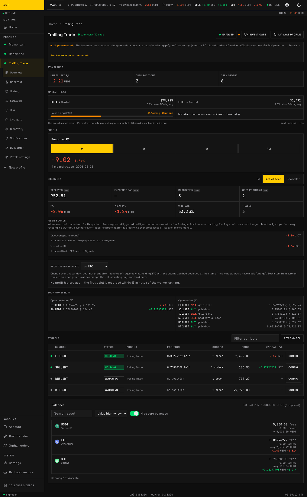
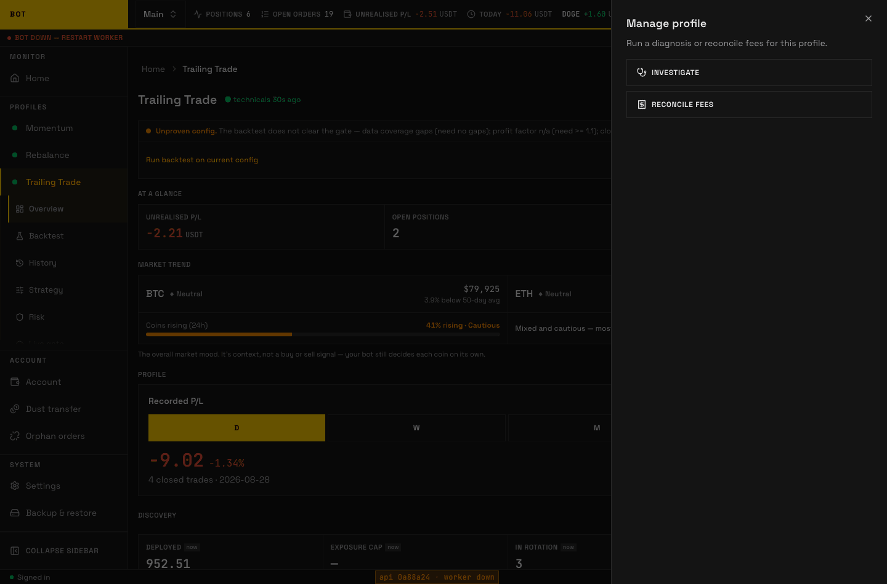

# Profile

A **profile** is one independent trading setup inside an account: its own strategy, its own coins, its own risk limits, and its own on/off switch. One Binance account can run several profiles at once — for example a cautious grid on BTC in one profile and a momentum breakout basket in another — each with its own settings but sharing the account's wallet and API key.

_A profile in focus on the dashboard: status, health, KPIs, equity curve, and its symbols. Click any screenshot to zoom. Seeded demo data, not a real account._

This section documents every section you see when you open a profile, in the order they appear in the sidebar. Each page lists the exact fields and labels the app shows, so you can configure with the doc open beside the screen.

## The profile sections

Selecting a profile in the sidebar expands it into its own sections, so every one of them is a single click from any page inside that profile, and the sidebar shows which one you are on. On a phone the same list is under **Profiles** in the bottom bar. A breadcrumb above each page's heading names the profile and the section, and every ancestor in it is a link.

The **Manage profile** sheet on the profile dashboard is for the two actions that have no page of their own: **Investigate** and **Reconcile fees**. It no longer lists the sections — the sidebar and the phone's **Profiles** sheet both show which section you are on, which a slide-over cannot.

_The "Manage profile" sheet, opened from the profile dashboard. Seeded demo data, not a real account._

| Section | What you set there |
| --- | --- |
| **[Strategy](strategy.md)** | Which strategy runs and all of its config knobs. |
| **[Risk](risk.md)** | Account-wide safety limits: daily loss cap, max positions, exposure. |
| **[Live gate](live-gate.md)** | The advisory readiness check shown before you go live. |
| **[Discovery](discovery.md)** | Optional auto-rotation of coins in and out of the profile. |
| **[Notifications](notifications.md)** | Where alerts are sent, and which events fire one. |
| **[Backtest](backtest.md)** | Replay the strategy over history before trading it. |
| **[History](history.md)** | The profile's past orders and actions, read-only. |
| **[Bulk order](bulk-order.md)** | Place one manual order across every coin in the profile. |
| **[Profile settings](general.md)** | Rename, enable, stop, and delete the profile. |

## Investigate — "why isn't it trading?"

The profile page carries an **Investigate** button in the top-right, next to the status chip and **Manage profile**. It answers the question you would otherwise answer by reading logs: what, right now, is stopping this profile from buying.

From one of the sections in the table above, open **Manage profile** in the page header and choose **Investigate**. The button itself is not repeated inline on every section, because the check always looks at the whole profile rather than the settings page you happen to have open.

Pressing it opens a panel that explains what the check does before it runs anything. It is **read-only** — nothing is paused, bought, sold, or changed. Confirm with **Investigate**, or with **Skip the live re-scan** if you would rather not spend request budget (see below).

The check then runs in the background as a checklist, in the order that matters, each step turning into its own line as the worker finishes it:

1. Is the trading engine running?
2. Is this profile switched on?
3. Are the settings valid?
4. Is Binance accepting this profile's orders?
5. Is auto-discovery scanning?
6. Is the market broad enough to buy into?
7. Where do candidate coins drop out?
8. Is there room for another coin?
9. What is holding back buys?
10. What are the held coins waiting on to sell?
11. Does every held coin have a way out?
12. Which setting is responsible?

The order is the ranking: the first step that finds something owns the headline, because a stopped engine makes every later answer meaningless. Every finding is still listed, and each one that traces back to a setting carries a link that opens the right section with that field expanded and highlighted.

**"Nothing is blocking it, your settings are just strict" is a valid answer.** When nothing is provable the report says so rather than inventing a cause.

**Step 5 can report that the scan gave up before it chose anything.** Auto-discovery refuses to run a scan when it cannot trust Binance's own view of which coins are stablecoins or national currencies — coins it never trades, because they barely move. When that happens the cycle stops before ranking a single candidate, so your coin list stays exactly as it is and your existing coins keep trading. The report calls this out as a blocking finding that names the cause in plain language, so you can tell "nothing qualified today" apart from "the bot refused to decide". There is nothing to change in your settings: it clears itself as soon as one scan completes normally, and until then loosening filters would have no effect, because the filters were never reached.

Step 7 is the slow one. It re-runs the coin scan against Binance for an independent second opinion, which takes a few seconds and uses a little of the account's request budget; it queues behind live trading, so it cannot starve the bot. **Skip the live re-scan** uses the last stored scan instead, and the report says which of the two it read. Closing the panel does not cancel a running check — on the profile page the button keeps spinning, and reopening the panel from either place returns to live progress.

Durations in the report ("blocked for 19 days") stay exact however short your [log retention](../system/settings.md#log-retention) is: what is currently true of a profile is stored separately from the log of changes. See [Conditions and the diagnosis](../../architecture/observability-conditions.md).

## Enabling a profile

A new profile starts **disabled** and holds no positions. You configure the strategy and risk, optionally check the [Live gate](live-gate.md), then enable it from the [Profile settings](general.md) section. While enabled, the worker ticks the profile's coins and places orders per the strategy. Disabling stops new decisions but, by design, leaves any resting Binance orders in place — see [Profile settings](general.md) for the difference between disabling, stopping, and deleting.
