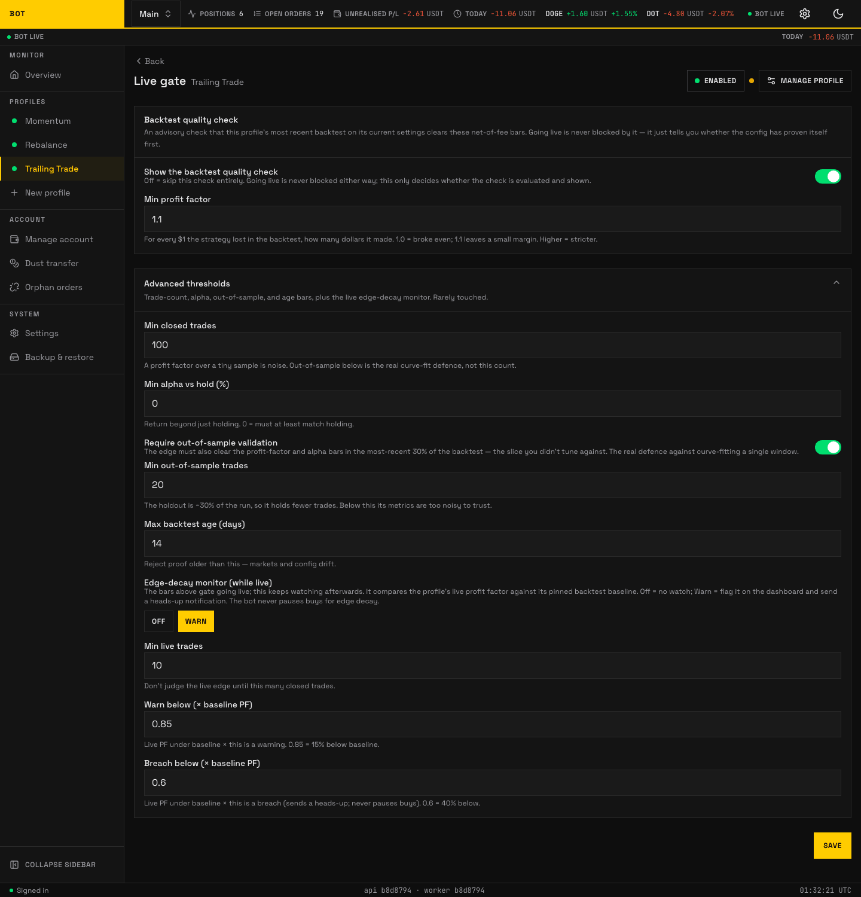

# Live gate

_The Live gate tab. An advisory quality check on the latest backtest before the profile trades live. Seeded demo data, not a real account._

The **Live gate** tab (header "Backtest quality check") is an **advisory** readiness check. It tells you whether the profile's most recent backtest on its current settings clears a set of net-of-fee quality bars.

!!! info "The gate never blocks going live"

    Enabling a profile is **never** blocked by this check. It is a quality signal shown on
    the dashboard, not a lock. You can go live with a failing or absent check — the gate
    just tells you whether the config has proven itself first.

Unlike the strategy and risk tabs, this panel is hand-built, so the fields below are listed by hand rather than generated. Labels and help are quoted from the panel.

## Backtest quality check

| Field | Default | What it does |
| --- | --- | --- |
| **Show the backtest quality check** | on | Off skips the check entirely. Going live is never blocked either way; this only decides whether the check is evaluated and shown. |
| **Min profit factor** | `1.1` | For every $1 the strategy lost in the backtest, how many dollars it made. 1.0 = broke even; 1.1 leaves a small margin. Higher is stricter. |

## Advanced thresholds

Rarely touched — trade-count, alpha, out-of-sample, age, and the live edge-decay monitor.

| Field | Default | What it does |
| --- | --- | --- |
| **Min closed trades** | `100` | A profit factor over a tiny sample is noise. Out-of-sample below is the real curve-fit defence, not this count. |
| **Min alpha vs hold (%)** | `0` | Return beyond just holding. 0 = must at least match holding. |
| **Require out-of-sample validation** | on | The edge (a strategy's expected profitable advantage) must also clear the profit-factor and alpha bars in the most-recent 30% of the backtest — the slice you did not tune against. The real defence against curve-fitting a single window. |
| **Min out-of-sample trades** | `20` | The holdout is about 30% of the run, so it holds fewer trades. Below this its metrics are too noisy to trust. |
| **Max backtest age (days)** | `14` | Reject proof older than this — markets and config drift. |

## Edge-decay monitor (while live)

The bars above gate the _quality signal_ before going live; this keeps watching **after** you are live. It compares the profile's live profit factor against its pinned backtest baseline. The bot **never pauses buys** for edge decay — at most it flags the dashboard and sends a heads-up.

| Field | Default | What it does |
| --- | --- | --- |
| **Mode** | `Off` | `Off` = no watch; `Warn` = flag it on the dashboard and send a heads-up notification. |
| **Min live trades** | — | Do not judge the live edge until this many closed trades. |
| **Warn below (× baseline profit factor)** | `0.85` | Live profit factor under baseline × this is a warning. 0.85 = 15% below baseline. |
| **Breach below (× baseline profit factor)** | `0.6` | Live profit factor under baseline × this is a breach (sends a heads-up; never pauses buys). 0.6 = 40% below. |
