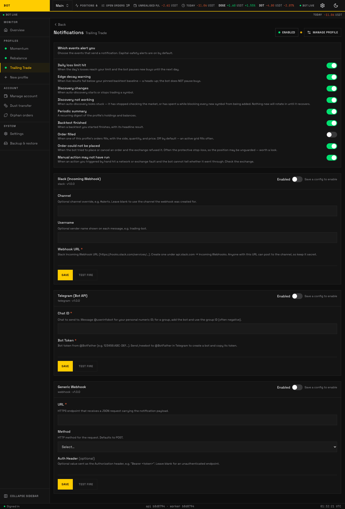

# Notifications

_The Notifications tab. Which events alert, and where they are delivered. Seeded demo data, not a real account._

The **Notifications** tab decides **where** a profile's alerts are sent and **which** events fire one. Notifications are optional; with no provider configured the profile still trades, it just stays quiet.

For the operator walkthrough of setting up a provider end to end, see [Notifiers under Concepts](../../concepts/notifiers.md). This page is the field reference for each provider's config.

## Providers

You add one card per destination. Each provider's config form is generated from its schema, so the labels match the tab exactly. Fields marked as a **write-once secret** (a webhook URL, bot token, or auth header) are entered once and never shown back — the app stores them and only ever displays whether one is set.

--8<-- "docs/\_generated/config/notifiers.md"

## Event subscriptions

Separate from the provider config, the tab has an **event subscription** section: a set of toggles for which events send a notification (for example order placed, order filled, stop-loss triggered, profile stopped). Toggling an event is not stored config on a provider — it is a per-profile subscription — so it is not in the tables above. Turn on only the events you want to be pinged about; everything still shows on the dashboard regardless.
