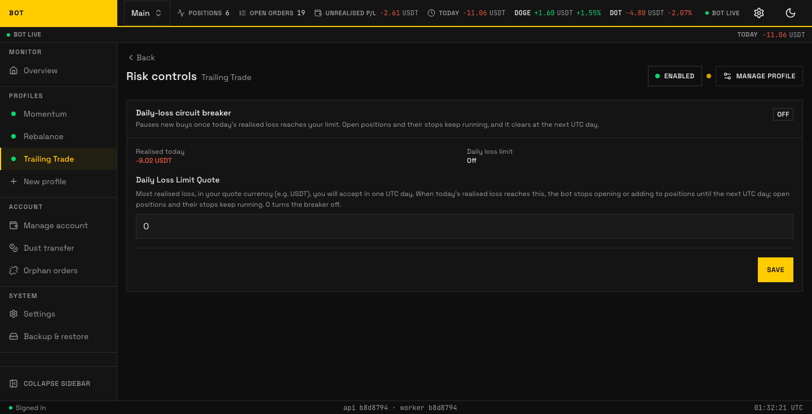

# Risk

_The Risk section. Caps that stop the strategy before a loss compounds. Seeded demo data, not a real account._

The **Risk** section sets safety limits that apply on top of whatever the strategy decides. They are circuit breakers: the strategy proposes trades, and these limits can veto or size them down. All limits are optional — a `0` or blank value turns that limit off.

The fields, labels, and help below are generated from the same schema the section renders, so they match what you see on screen exactly.

--8<-- "docs/\_generated/config/risk.md"

## How the limits interact

- A **daily loss limit** stops opening or adding to positions once the day's realised loss reaches it; open positions and their stops keep running so you are never left unhedged. It resets at the start of the next UTC day.
- A **loss-streak guard** stops new buys once that many exits inside its lookback window have closed at a loss. The window rolls, so unlike the daily limit it still sees a run of losses that started yesterday and finished today. Off by default.
- A **drawdown guard** stops new buys once realised profit and loss has fallen that far from a peak to a later low anywhere inside its lookback window — the worst fall in the window, not the fall as of right now, so recovering afterwards does not undo it until it ages out. That is the one that catches a slide built from many small losses, none of which would ever reach a daily limit. Off by default.
- All three only **pause new buys**. None of them sells anything, and none of them touches your protective stops — an open position always keeps its exit. The daily limit lifts at the next UTC day; each guard lifts after the pause you configured, measured from the moment it tripped.
- **Exposure and position caps** are checked before a buy is sized, so a strategy that wants to deploy more than a cap allows is trimmed to fit, not blocked outright.
- These limits are profile-scoped. Running several profiles on one account means their limits are independent; the account wallet is still shared, so size them with the whole account in mind.
