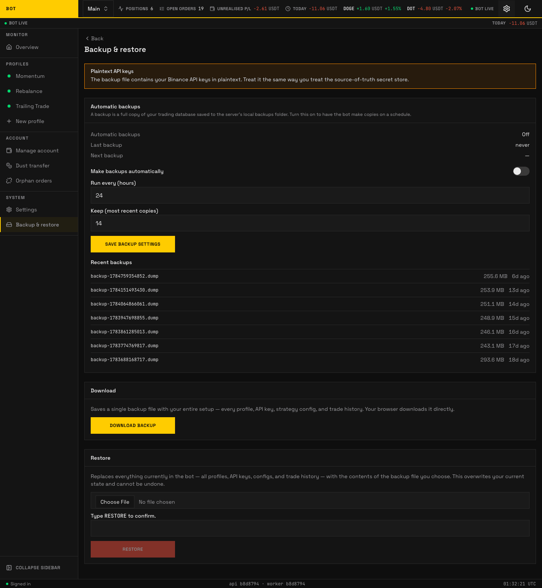
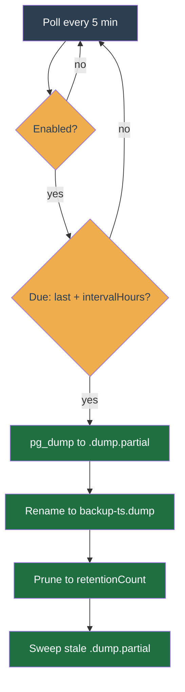

# Backup and restore

_The Backup & restore page. Schedule, download, and restore database dumps. Seeded demo data, not a real account._

The bot keeps two backup paths: a scheduled periodic dump configured in the app, and an on-demand download/restore through the API. Both write the same custom-format archive that `pg_restore` reads.

## Periodic backups (configured in-app)

The schedule is set under **Account → Backup** in the web UI, not by environment variables:

- **Enable** — turn periodic backups on or off. A toggle takes effect on the next cron poll; no worker restart needed.
- **Interval (hours)** — how often a fresh dump is taken.
- **Retention (count)** — how many dumps to keep. Older ones beyond this count are pruned after each successful dump.

The worker runs the `db-backup` cron. It self-reschedules every 5 minutes, checks the saved config, and when a dump is due runs `pg_dump` writing `backup-<epochms>.dump` into `BACKUP_DIR` (default `/backups`, bind-mounted to `./backups` by compose). The dump streams to a `.dump.partial` temp file and is renamed into place only on success, so a killed dump never leaves a half-written archive that retention would miscount. The 5-minute poll is not the backup cadence; it is only how often the cron checks whether a dump is due per `intervalHours`.

> The old `backup` compose sidecar (its own `postgres` container running a shell loop) has been removed. The worker cron replaces it, so only one mechanism writes `./backups`. The `BACKUP_INTERVAL_SECONDS` / `BACKUP_RETENTION_DAYS` env vars are gone; configure the schedule in the UI instead.

## On-demand download and restore (API)

Unchanged:

- `GET /backup` — streams a fresh full dump for download.
- `POST /restore` — upload a previously taken archive to restore the database.

The in-app schedule under **Account → Backup** reads and writes its settings through:

- `GET /backup/config` — the saved schedule (enable, interval, retention) plus the list of recent on-disk dumps.
- `PUT /backup/config` — update the schedule; takes effect on the next cron poll.

All require an authenticated operator session.

`POST /restore` is upload-only: it restores from an archive you send in the request. To restore from a dump already on disk (a periodic `backup-<ts>.dump`), use the `pg_restore` CLI procedure in `deploy/README.md` under **Restore**.

## Security note

The worker process now holds a path that reads the entire database into the local backups folder. The dump is a restorable plaintext copy, and per the threat model the Binance API keys and notifier secrets it contains are stored plaintext too, so a leaked dump leaks live credentials. The compensating controls are the operator's Binance IP-allowlist, which limits what a leaked key can do, and tight filesystem permissions on the backups directory so the dumps are never web-served or world-readable. Keep `BACKUP_DIR` outside any served path and restrict it to the worker user.
