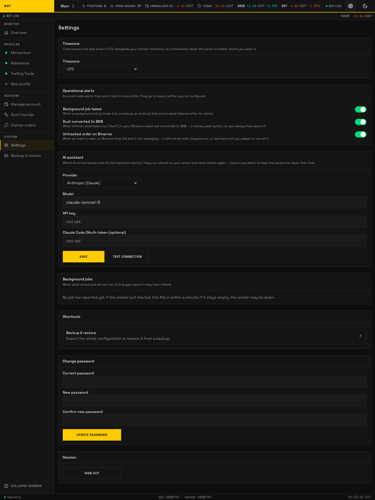

# Settings

_The operator Settings page. Timezone, ops notifier, AI assistant, health, and password. Seeded demo data, not a real account._

The **Settings** page holds operator-login settings that apply no matter which account is in view.

## Timezone

Times across the app show in UTC alongside your chosen timezone, so a timestamp reads the same wherever you open it. Pick a zone from the **Timezone** list (UTC is pinned first).

## Shortcuts

- **[Backup & restore](backup-restore.md)** — export the whole configuration or restore it from a backup.

## Change password

Fields **Current password**, **New password** (at least 12 characters), and **Confirm new password**; press **Update password**.

## Session

**Sign out** ends your login session.

!!! note "Operations panels also live here"

    The Settings page also carries the operator notifications card, AI-provider card, and an
    ops health panel. Those are covered under [Notifications](../../concepts/notifiers.md) and the
    [Operations](../../operations/index.md) runbooks.
